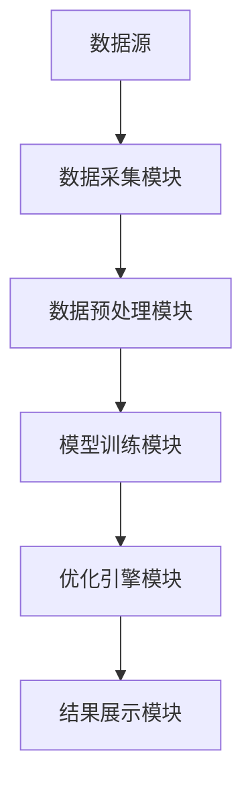

                 


# 智能债券投资组合免疫策略动态优化

> **关键词**: 智能债券投资，免疫策略，动态优化，机器学习，强化学习，风险管理

> **摘要**: 本文深入探讨了智能债券投资组合免疫策略的动态优化方法。通过结合金融学与人工智能技术，提出了一种基于机器学习和强化学习的优化算法，以实现债券投资组合在不同市场环境下的免疫策略动态调整。文章从基础概念、算法原理、系统架构到实战案例，全面解析了智能免疫策略的应用及其优化过程，为投资者提供了理论支持和实践指导。

---

## 第一部分：智能债券投资组合免疫策略概述

### 第1章：债券投资组合与免疫策略基础

#### 1.1 债券投资组合的基本概念

**债券**是债务工具，发行人承诺在特定时间内按约定利率支付利息，并在到期时偿还本金。债券投资组合则是将多种债券按一定比例组合，以分散风险、提高收益。

**投资组合的构建**需要考虑以下因素：
- **收益目标**：期望的投资回报率。
- **风险承受能力**：投资者对本金波动的容忍度。
- **流动性需求**：对资金流动性的要求。

**免疫策略**是一种通过调整债券组合的期限和凸性，使得组合的市场价值在特定时间段内免疫利率波动的方法。其核心在于通过数学模型精确匹配负债和资产的期限结构。

#### 1.2 智能免疫策略的核心思想

**传统免疫策略**基于固定利率环境，通过精确匹配负债和资产的久期来实现免疫。然而，实际市场环境复杂多变，利率波动、市场流动性变化等都会影响免疫效果。

**智能免疫策略**引入人工智能技术，通过动态调整组合构成，实时跟踪市场变化，提高免疫效果的稳定性和适应性。其优势在于：
- **实时性**：能够快速响应市场变化。
- **准确性**：通过机器学习模型提高预测精度。
- **灵活性**：适应不同的市场环境和投资者需求。

#### 1.3 动态优化的必要性与挑战

**市场波动**是债券投资的主要风险来源，利率波动、经济周期变化等都会影响债券价格。传统的免疫策略静态特性难以应对动态变化的市场环境，动态优化成为必然选择。

**实现动态优化的挑战**：
- **数据质量**：需要高质量的历史数据和实时市场数据。
- **计算效率**：复杂的优化计算需要高效的算法和硬件支持。
- **模型稳定性**：动态优化模型需要在不同市场条件下保持稳定性和准确性。

---

## 第二部分：智能优化方法与算法原理

### 第2章：智能优化算法概述

#### 2.1 机器学习在债券投资中的应用

**机器学习**通过从历史数据中学习模式，预测未来市场走势。在债券投资中，常用算法包括线性回归、支持向量机（SVM）和随机森林等。

**机器学习的应用场景**：
- **信用评级**：通过历史数据预测债券发行人的信用风险。
- **价格预测**：利用历史价格和市场指标预测债券价格走势。
- **风险评估**：识别潜在风险因素并量化其影响。

#### 2.2 强化学习与动态优化

**强化学习**是一种通过试错机制优化决策的算法。在动态优化中，智能体通过与环境交互，不断调整策略以实现目标。

**强化学习的优势**：
- **实时反馈**：能够根据市场反馈实时调整策略。
- **复杂决策**：适用于多变量、非线性问题。
- **自适应性**：能够适应动态变化的市场环境。

#### 2.3 遗传算法与粒子群优化

**遗传算法**模拟生物进化过程，通过选择、交叉和变异生成新的解。适用于复杂的优化问题。

**粒子群优化（PSO）**通过模拟鸟群觅食行为，找到问题的最优解。适用于连续变量优化问题。

**对比分析**：
| 特性          | 遗传算法      | 粒子群优化    |
|---------------|---------------|---------------|
| 解空间        | 离散/连续     | 连续           |
| 算子          | 选择、交叉、变异 | 粒子移动规则   |
| 应用场景      | 组合优化       | 连续优化       |

---

### 第3章：动态优化的数学模型与算法实现

#### 3.1 数学模型构建

**收益-风险模型**：
$$ \text{收益} = \sum_{i=1}^{n} w_i r_i $$
$$ \text{风险} = \sum_{i=1}^{n} \sum_{j=1}^{n} w_i w_j \sigma_{ij} $$
其中，\( w_i \) 是债券 \( i \) 的权重，\( r_i \) 是其预期收益率，\( \sigma_{ij} \) 是债券 \( i \) 和 \( j \) 之间的协方差。

**免疫策略优化模型**：
$$ \min_{w} \sum_{i=1}^{n} w_i^2 $$
约束条件：
$$ \sum_{i=1}^{n} w_i = 1 $$
$$ \sum_{i=1}^{n} w_i \cdot D_i = D_{\text{target}} $$
其中，\( D_i \) 是债券 \( i \) 的久期，\( D_{\text{target}} \) 是目标久期。

#### 3.2 算法实现流程

**步骤1：数据预处理**
- 清洗数据，处理缺失值和异常值。
- 标准化处理，确保特征具有可比性。

**步骤2：模型训练**
- 选择适当的机器学习算法（如随机森林）进行训练。
- 调整模型参数，优化预测精度。

**步骤3：优化计算**
- 使用强化学习或遗传算法进行动态优化。
- 生成候选解，评估其收益-风险比。

**步骤4：结果反馈**
- 记录最优解，更新投资组合。
- 输出优化结果，供投资者决策。

---

## 第三部分：系统架构与实现方案

### 第4章：智能免疫策略优化系统架构

#### 4.1 系统功能模块设计

**模块1：数据采集模块**
- 从数据库或API获取实时市场数据。
- 处理数据，生成可分析的特征。

**模块2：模型训练模块**
- 使用机器学习算法训练预测模型。
- 验证模型准确性，调整参数。

**模块3：优化引擎模块**
- 应用强化学习或遗传算法进行优化。
- 输出最优投资组合配置。

**模块4：结果展示模块**
- 可视化优化结果，生成报告。
- 提供交互界面，方便用户查询和调整。

#### 4.2 系统架构设计

**系统架构图**（使用Mermaid）：



---

## 第四部分：实战与案例分析

### 第5章：智能免疫策略实战案例

#### 5.1 环境配置

**工具安装**：
- 安装Python和必要的库（如NumPy、Pandas、Scikit-learn、TensorFlow）。
- 安装Jupyter Notebook用于实验和分析。

**数据获取**：
- 使用Yahoo Finance API获取历史债券数据。
- 下载并处理数据，生成特征集。

#### 5.2 核心代码实现

**代码示例**：

```python
import numpy as np
import pandas as pd
from sklearn.ensemble import RandomForestRegressor
from sklearn.metrics import mean_squared_error

# 数据加载
data = pd.read_csv('bond_data.csv')

# 特征与目标分离
X = data.drop('target', axis=1)
y = data['target']

# 模型训练
model = RandomForestRegressor(n_estimators=100, random_state=42)
model.fit(X, y)

# 预测与评估
y_pred = model.predict(X)
print(f'均方误差：{mean_squared_error(y, y_pred)}')
```

---

## 第五部分：优化与挑战

### 第6章：优化与挑战

#### 6.1 优化策略

**数据质量优化**：
- 引入更全面的数据特征，如宏观经济指标和市场情绪指标。
- 使用数据增强技术，提高模型泛化能力。

**计算效率优化**：
- 采用分布式计算，提高处理效率。
- 优化算法复杂度，减少计算时间。

**模型优化**：
- 使用集成学习提高预测精度。
- 引入解释性模型（如SHAP）分析特征重要性，优化特征选择。

#### 6.2 挑战与解决方案

**挑战1：数据获取难度**
- 解决方案：多源数据融合，利用API和数据库获取实时数据。

**挑战2：模型过拟合**
- 解决方案：采用交叉验证和正则化方法，控制模型复杂度。

**挑战3：计算资源不足**
- 解决方案：利用云计算和并行计算技术，提升计算效率。

---

## 第六部分：总结与展望

### 第7章：总结与展望

#### 7.1 总结

本文系统地探讨了智能债券投资组合免疫策略的动态优化方法。通过结合机器学习和强化学习技术，提出了一种动态调整的投资策略，能够有效应对市场波动和风险变化。文章从理论分析、算法实现到系统设计，全面解析了智能免疫策略的应用过程，为投资者提供了实用的指导。

#### 7.2 展望

未来的研究方向包括：
- **更复杂模型**：引入深度学习模型，提高预测精度。
- **实时交易系统**：开发实时交易系统，实现自动化投资决策。
- **多资产配置**：扩展到多资产类别，构建更加多元化的投资组合。

---

**作者：AI天才研究院/AI Genius Institute & 禅与计算机程序设计艺术 /Zen And The Art of Computer Programming**

