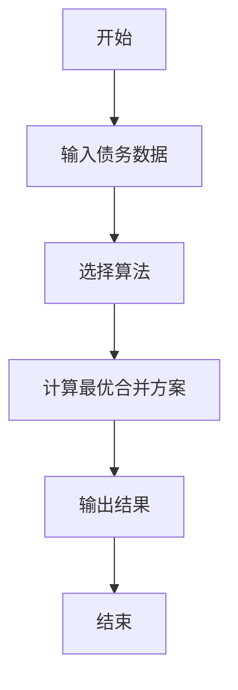
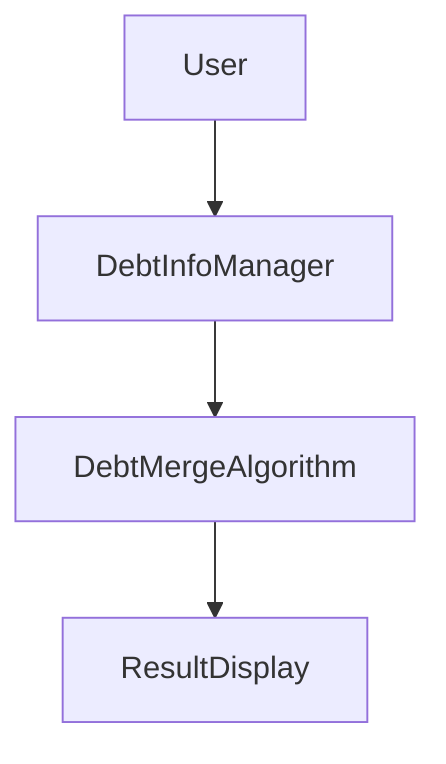

                 


# 智能债务合并建议生成器

> 关键词：智能债务合并，债务管理，人工智能，算法优化，系统架构设计

> 摘要：本文系统地探讨了智能债务合并建议生成器的设计与实现，从背景分析到算法原理，再到系统架构设计和项目实战，结合实际案例，深入剖析了智能债务管理的核心概念与技术实现。本文适合对债务管理、人工智能和系统设计感兴趣的读者阅读。

---

## 第一部分: 智能债务合并的背景与概念

### 第1章: 问题背景与描述

#### 1.1 债务管理的现状与挑战
- 1.1.1 个人与企业债务管理的现状
  - 当前债务管理的主要方式及其局限性
  - 债务问题对个人和企业的影响
  - 传统债务管理工具的不足

- 1.1.2 债务管理中的常见问题
  - 高利率债务的累积效应
  - 债务重组的复杂性
  - 用户还款能力与债务规模的不匹配

- 1.1.3 智能债务管理的必要性
  - 技术进步对债务管理的影响
  - 智能债务管理的优势与应用场景

#### 1.2 智能债务合并的核心概念
- 1.2.1 债务合并的定义与目标
  - 债务合并的基本概念
  - 智能债务合并的目标与关键特征

- 1.2.2 智能债务合并的优势
  - 提高债务管理效率
  - 优化还款策略
  - 减少债务风险

- 1.2.3 债务合并的边界与外延
  - 合并的适用场景与限制
  - 智能债务合并与其他债务管理工具的区别

### 第2章: 智能债务合并的核心要素与结构

#### 2.1 核心要素分析
- 2.1.1 债务来源与类型
  - 债务来源的多样性
  - 债务类型的分类与特征

- 2.1.2 债务金额与期限
  - 不同债务金额对合并策略的影响
  - 债务期限与还款计划的关系

- 2.1.3 利率与还款方式
  - 利率差异对合并效果的影响
  - 还款方式对合并策略的选择

#### 2.2 智能债务合并的系统结构
- 2.2.1 数据输入与处理
  - 数据来源与采集方式
  - 数据清洗与预处理

- 2.2.2 合并算法与优化模型
  - 合并算法的选择与实现
  - 优化模型的设计与应用

- 2.2.3 输出结果与用户反馈
  - 合并方案的输出格式
  - 用户反馈与结果优化

### 第3章: 智能债务合并的核心概念与联系

#### 3.1 实体关系分析
- 3.1.1 用户与债务的关系
  - 用户的基本信息与债务记录
  - 用户需求与合并策略的关系

- 3.1.2 债务与合并方案的关系
  - 债务信息对合并方案的影响
  - 合并方案对债务管理的作用

- 3.1.3 合并方案与优化目标的关系
  - 优化目标对方案生成的影响
  - 方案生成对优化目标的反馈

#### 3.2 核心概念属性对比
- 3.2.1 债务来源的属性对比
  - 不同债务来源的特征分析
  - 债务来源对合并策略的影响

- 3.2.2 合并方案的特征分析
  - 方案的可行性和优化性
  - 方案的多样性和适应性

- 3.2.3 优化目标的优先级排序
  - 目标的重要性和实现难度
  - 目标之间的冲突与协调

#### 3.3 ER实体关系图
```mermaid
er
    entity 用户 {
        用户ID
        用户名称
        用户信用评分
    }
    entity 债务 {
        债务ID
        债务类型
        债务金额
        利率
        还款期限
    }
    entity 合并方案 {
        方案ID
        合并金额
        合并期限
        优化目标
    }
    用户 --> 债务 : 拥有
    债务 --> 合并方案 : 提供基础
    合并方案 --> 用户 : 提供建议
```

---

## 第二部分: 智能债务合并算法原理

### 第4章: 合并算法与优化模型

#### 4.1 合并算法的选择与实现
- 4.1.1 基于贪心算法的合并策略
  - 贪心算法的基本原理
  - 在债务合并中的具体应用
  - 优缺点分析

- 4.1.2 基于动态规划的优化方法
  - 动态规划在债务合并中的应用
  - 算法实现与复杂度分析
  - 实际案例中的效果对比

#### 4.2 优化模型的设计与实现
- 4.2.1 基于线性规划的优化模型
  - 线性规划的基本概念与原理
  - 在债务合并中的应用
  - 模型的建立与求解

- 4.2.2 基于遗传算法的优化方法
  - 遗传算法的基本原理
  - 在债务合并中的应用
  - 算法实现与优化效果

#### 4.3 算法流程图


---

## 第三部分: 系统分析与架构设计

### 第5章: 系统功能设计与架构

#### 5.1 系统功能设计
- 5.1.1 用户信息管理模块
  - 用户注册与登录
  - 用户信息维护

- 5.1.2 债务信息管理模块
  - 债务录入与编辑
  - 债务查询与统计

- 5.1.3 合并方案生成模块
  - 方案生成与展示
  - 方案调整与优化

#### 5.2 系统架构设计
- 5.2.1 项目结构
  - 项目模块划分
  - 模块之间的依赖关系

- 5.2.2 系统架构图


#### 5.3 系统接口设计
- 5.3.1 API接口定义
  - 输入接口
  - 输出接口

- 5.3.2 接口交互流程
  - 数据输入
  - 算法调用
  - 结果输出

---

## 第四部分: 项目实战与案例分析

### 第6章: 项目实战

#### 6.1 环境安装与配置
- 6.1.1 开发环境的选择
  - 语言与框架选择
  - 开发工具安装

- 6.1.2 依赖库的安装
  - 第三方库的使用
  - 版本管理

#### 6.2 核心代码实现
- 6.2.1 数据处理模块
  - 数据清洗与预处理代码
  - 数据格式转换

- 6.2.2 合并算法实现
  - 贪心算法实现
  - 动态规划实现

#### 6.3 案例分析与解读
- 6.3.1 实际案例分析
  - 案例背景
  - 合并方案生成与优化

- 6.3.2 案例结果解读
  - 方案的优缺点
  - 实际应用中的效果

---

## 第五部分: 总结与展望

### 第7章: 总结与展望

#### 7.1 项目小结
- 项目实现的主要成果
- 关键技术的总结与反思

#### 7.2 注意事项
- 使用中的注意事项
- 模型的局限性与改进方向

#### 7.3 拓展阅读
- 相关领域的最新研究
- 技术发展的未来方向

---

## 作者：AI天才研究院 & 禅与计算机程序设计艺术

---

以上是《智能债务合并建议生成器》的文章结构，接下来将根据以上目录进行详细的内容撰写。

