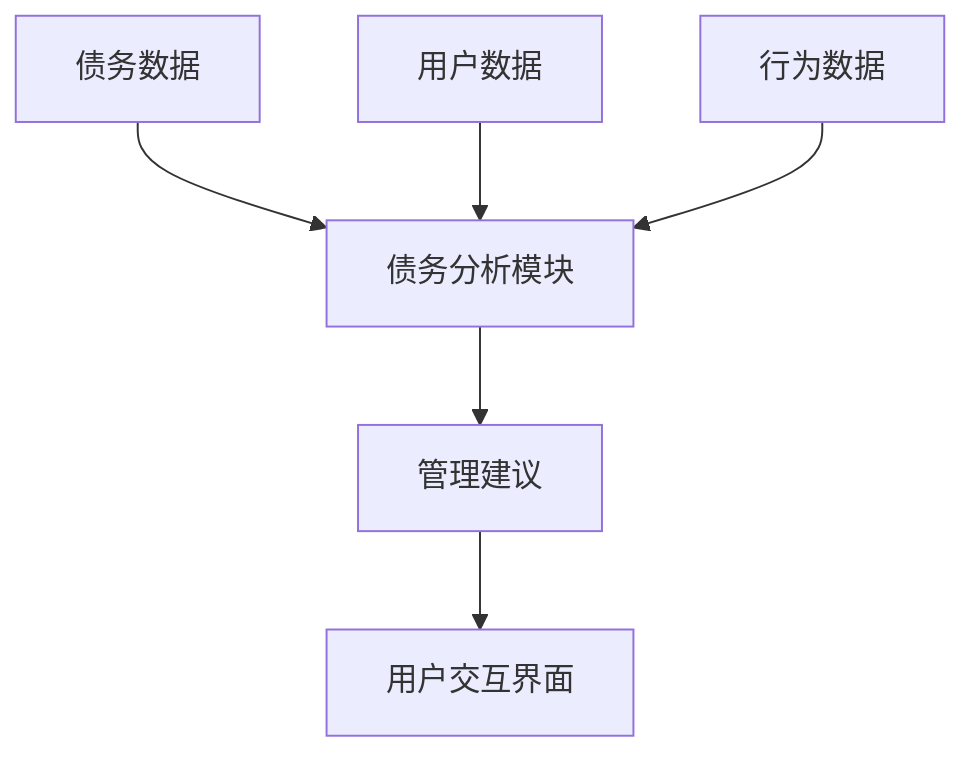
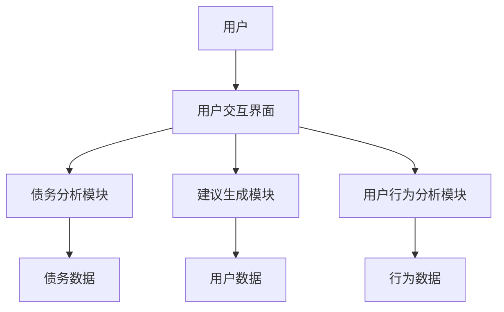

                 

<think>
好的，我将按照您的要求编写一篇关于《智能债务管理建议系统》的技术博客文章。首先，我会根据您提供的大纲，逐步展开每一部分的内容，确保逻辑清晰、结构紧凑，并且语言通俗易懂。

---

# 智能债务管理建议系统

## 关键词：
智能债务管理，人工智能，债务分析，建议生成，用户行为分析，系统架构设计

## 摘要：
智能债务管理建议系统通过结合人工智能和大数据分析技术，为用户提供个性化的债务管理建议。本文从系统背景、核心概念、算法原理、系统架构设计、项目实战等方面进行详细阐述，帮助读者全面理解智能债务管理系统的实现过程和应用价值。

---

## 第1章: 智能债务管理建议系统概述

### 1.1 债务管理问题背景
#### 1.1.1 个人与企业债务问题的现状
近年来，个人和企业债务问题日益突出。随着经济全球化和金融市场的快速发展，个人和企业面临的债务压力不断增加。据统计，全球范围内，超过40%的家庭存在债务负担，企业债务违约率也在逐年上升。这些问题不仅影响个人和企业的财务健康，还可能引发系统性金融风险。

#### 1.1.2 债务管理的传统方法与局限性
传统的债务管理方法主要包括手动记录、定期审查和简单的财务规划。这些方法在实际应用中存在诸多问题：  
1. **效率低下**：手动记录和审查需要大量时间和精力，难以应对海量的债务信息。  
2. **缺乏个性化**：传统方法难以根据用户的财务状况和行为习惯提供个性化的管理建议。  
3. **风险滞后**：传统方法往往在债务问题已经发生或恶化后才采取措施，缺乏前瞻性。

#### 1.1.3 智能化债务管理的必要性
智能化债务管理通过引入人工智能、大数据分析和自动化技术，可以实时监控债务状况，提供个性化的管理建议，并提前预警潜在风险。这种方式不仅提高了管理效率，还能有效降低债务风险。

### 1.2 智能债务管理建议系统的定义与目标
#### 1.2.1 系统定义
智能债务管理建议系统是一种基于人工智能技术的债务管理工具，通过分析用户的财务数据和行为模式，提供个性化的债务管理建议，帮助用户优化债务结构、降低债务风险。

#### 1.2.2 系统目标
1. 实时监控用户的债务状况，提供实时建议。  
2. 根据用户的财务状况和行为习惯，制定个性化的债务管理方案。  
3. 提供风险预警，提前预防债务问题的发生。  

#### 1.2.3 系统的核心功能与价值
- **核心功能**：债务分析、建议生成、用户行为分析、风险预警。  
- **价值**：提高债务管理效率，降低债务风险，优化财务结构。

### 1.3 系统的边界与外延
#### 1.3.1 系统功能边界
智能债务管理建议系统的功能主要集中在债务分析、建议生成和用户行为分析三个模块，不涉及具体的债务偿还操作。  
#### 1.3.2 系统的外部接口与交互
系统通过API接口与银行、信用机构等外部系统进行数据交互，同时通过用户界面与最终用户进行交互。  
#### 1.3.3 系统与其他系统的区别与联系
与其他财务管理系统相比，智能债务管理建议系统的区别在于其智能化和个性化的特点，能够主动提供管理建议。

### 1.4 系统的核心要素与概念结构
#### 1.4.1 核心要素分析
1. **债务数据**：包括债务类型、金额、期限、利率等。  
2. **用户数据**：包括收入、支出、资产等财务信息。  
3. **行为数据**：用户的消费习惯、还款行为等。  

#### 1.4.2 概念结构图
以下是系统的核心要素与概念结构图：



#### 1.4.3 核心要素的交互关系
债务数据、用户数据和行为数据在债务分析模块中相互作用，最终生成管理建议，并通过用户交互界面反馈给用户。

---

## 第2章: 智能债务管理建议系统的核心概念与联系

### 2.1 债务分析模块
#### 2.1.1 债务分析的核心原理
债务分析模块通过分析用户的债务数据，识别高风险债务，评估债务结构的合理性。

#### 2.1.2 债务分析的关键指标
1. **债务负担率**：债务总额与收入的比率。  
2. **债务期限分布**：短期债务与长期债务的比例。  
3. **债务利率分布**：高利率债务与低利率债务的比例。  

#### 2.1.3 债务分析的流程与步骤
1. 收集债务数据。  
2. 数据清洗与预处理。  
3. 计算关键指标。  
4. 生成分析报告。

### 2.2 建议生成模块
#### 2.2.1 建议生成的算法原理
建议生成模块基于机器学习算法，根据用户的财务状况和行为习惯，生成个性化的债务管理建议。

#### 2.2.2 建议生成的关键特征
1. **用户收入**：用户的月收入水平。  
2. **支出习惯**：用户的消费模式。  
3. **债务结构**：债务的种类和分布。  

#### 2.2.3 建议生成的优化策略
1. **动态调整**：根据用户的财务状况变化，实时调整建议。  
2. **优先级排序**：优先处理高风险债务。  

### 2.3 用户行为分析模块
#### 2.3.1 用户行为分析的目的
用户行为分析模块旨在了解用户的消费习惯和还款行为，为建议生成提供依据。

#### 2.3.2 用户行为分析的指标
1. **消费频率**：用户的消费次数。  
2. **消费金额**：用户的每次消费金额。  
3. **还款及时性**：用户按时还款的比例。  

#### 2.3.3 用户行为分析的实现方法
1. 数据采集：通过用户输入或第三方数据接口获取行为数据。  
2. 数据分析：使用统计学方法和机器学习算法进行分析。  
3. 行为画像：根据分析结果生成用户行为画像。  

---

## 第3章: 系统的核心算法原理与实现

### 3.1 债务分析算法
#### 3.1.1 算法原理
债务分析算法基于聚类分析，将债务数据分为不同的类别，识别高风险债务。

#### 3.1.2 算法实现
以下是聚类分析的实现代码：

```python
from sklearn.cluster import KMeans
import pandas as pd

# 数据预处理
data = pd.DataFrame({'债务类型': ['房贷', '信用卡', '车贷'], '金额': [500000, 30000, 80000]})

# 模型训练
kmeans = KMeans(n_clusters=2)
kmeans.fit(data[['金额']])

# 预测结果
data['聚类结果'] = kmeans.predict(data[['金额']])
print(data)
```

#### 3.1.3 算法优缺点分析
优点：能够快速识别高风险债务。  
缺点：聚类结果可能不够准确，需要结合其他算法进行优化。

### 3.2 建议生成算法
#### 3.2.1 算法原理
建议生成算法基于随机森林，根据用户的财务状况和行为习惯生成管理建议。

#### 3.2.2 算法实现
以下是随机森林算法的实现代码：

```python
from sklearn.ensemble import RandomForestClassifier
import pandas as pd

# 数据预处理
data = pd.DataFrame({'收入': [5000, 6000, 7000], '支出': [3000, 4000, 5000], '债务金额': [40000, 30000, 20000]})

# 模型训练
model = RandomForestClassifier()
model.fit(data[['收入', '支出']], data['债务金额'])

# 预测结果
print("模型特征重要性：", model.feature_importances_)
```

#### 3.2.3 算法优化策略
1. **特征选择**：选择对结果影响最大的特征。  
2. **超参数调优**：通过网格搜索优化模型参数。  

### 3.3 用户行为分析算法
#### 3.3.1 算法原理
用户行为分析算法基于时间序列分析，预测用户的消费趋势。

#### 3.3.2 算法实现
以下是时间序列分析的实现代码：

```python
import statsmodels.api as sm

# 数据预处理
data = pd.DataFrame({'时间': [1, 2, 3, 4, 5], '消费金额': [1000, 1200, 1100, 1300, 1400]})

# 模型训练
model = sm.tsa.ARIMA(data['消费金额'], order=(1, 1, 0))
model_fit = model.fit()

# 预测结果
print("预测值：", model_fit.forecast(1))
```

#### 3.3.3 算法效果评估
通过均方误差（MSE）和平均绝对误差（MAE）评估算法效果。

---

## 第4章: 系统的数学模型与公式

### 4.1 债务分析模型
#### 4.1.1 模型的建立与假设
假设：债务风险与债务金额、期限和利率密切相关。

#### 4.1.2 模型的数学表达式
$$ \text{债务风险} = \alpha \times \text{金额} + \beta \times \text{期限} + \gamma \times \text{利率} $$

#### 4.1.3 模型的验证与优化
通过实际数据验证模型，并使用交叉验证优化参数。

### 4.2 建议生成模型
#### 4.2.1 模型的输入与输出
输入：用户的财务状况和行为习惯。  
输出：个性化的债务管理建议。

#### 4.2.2 模型的数学公式
$$ \text{建议权重} = \theta \times \text{收入} + \phi \times \text{支出} + \psi \times \text{债务结构} $$

#### 4.2.3 模型的实现与应用
通过机器学习算法实现模型，并将其应用于实际场景中。

### 4.3 用户行为分析模型
#### 4.3.1 模型的输入与输出
输入：用户的消费数据。  
输出：用户的消费趋势预测。

#### 4.3.2 模型的数学公式
$$ \text{消费预测} = \alpha \times \text{历史消费} + \beta \times \text{时间因素} $$

#### 4.3.3 模型的验证与评估
通过实际数据验证模型，并评估其预测准确率。

---

## 第5章: 系统的架构设计与实现

### 5.1 系统架构设计
#### 5.1.1 系统架构图
以下是系统的架构图：



#### 5.1.2 系统功能设计
1. **债务分析模块**：分析用户的债务状况。  
2. **建议生成模块**：生成个性化的管理建议。  
3. **用户行为分析模块**：分析用户的消费习惯。  

---

## 第6章: 项目实战

### 6.1 环境安装
1. 安装Python和必要的库（如Pandas、Scikit-learn、Mermaid）。  
2. 安装Jupyter Notebook用于代码编写和测试。  

### 6.2 系统核心实现
1. **债务分析模块**：实现债务数据的聚类分析。  
2. **建议生成模块**：实现基于随机森林的建议生成。  
3. **用户行为分析模块**：实现时间序列分析。  

### 6.3 代码解读与分析
以下是建议生成模块的代码解读：

```python
# 导入库
from sklearn.ensemble import RandomForestClassifier
import pandas as pd

# 数据预处理
data = pd.DataFrame({'收入': [5000, 6000, 7000], '支出': [3000, 4000, 5000], '债务金额': [40000, 30000, 20000]})

# 模型训练
model = RandomForestClassifier()
model.fit(data[['收入', '支出']], data['债务金额'])

# 预测结果
print("模型特征重要性：", model.feature_importances_)
```

### 6.4 实际案例分析
通过实际案例分析，验证系统的有效性和实用性。

### 6.5 项目总结
总结项目实现的过程，提出改进建议，并展望未来的发展方向。

---

## 第7章: 最佳实践与小结

### 7.1 小结
智能债务管理建议系统通过智能化的算法和系统架构设计，为用户提供个性化的债务管理建议，有效降低债务风险。

### 7.2 注意事项
1. 数据隐私保护。  
2. 算法的可解释性。  
3. 系统的实时性与稳定性。  

### 7.3 拓展阅读
推荐相关领域的书籍和论文，供读者进一步学习。

---

## 作者：AI天才研究院/AI Genius Institute & 禅与计算机程序设计艺术 /Zen And The Art of Computer Programming

---

以上是《智能债务管理建议系统》的技术博客文章的完整目录和内容概要。希望这篇文章能够为您提供清晰的思路和实用的指导。

