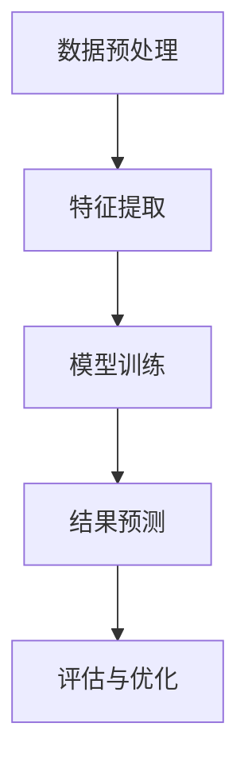
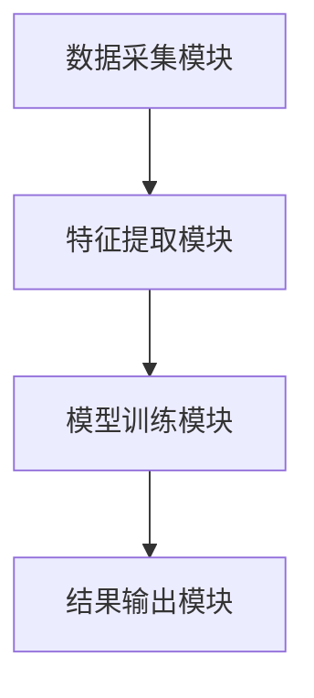
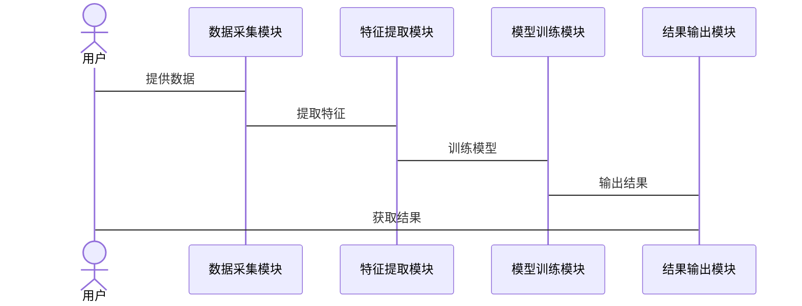

                 


# 智能债务重组方案效果评估工具

> 关键词：智能债务重组，方案评估，人工智能，机器学习，效果评估

> 摘要：本文探讨了智能债务重组方案效果评估工具的设计与实现，通过分析债务重组的传统评估方法的局限性，结合人工智能技术，提出了基于机器学习的智能评估工具。文章详细讲解了工具的核心概念、算法原理、系统架构设计、项目实战及实际案例分析，为读者提供了一套高效、准确的债务重组方案评估方法。

---

# 第一部分: 智能债务重组方案效果评估工具的背景与概念

## 第1章: 债务重组与智能评估工具概述

### 1.1 债务重组的基本概念

#### 1.1.1 债务重组的定义与分类
债务重组是指在债务人无法按时偿还债务的情况下，通过与债权人协商，调整债务的偿还方式、期限、金额等，以减轻债务人的负担。债务重组可以分为两种主要类型：一种是债务人主动申请的重组，另一种是在法院监督下的强制重组。

#### 1.1.2 债务重组的常见场景与问题
债务重组常见于企业面临财务困境时，例如企业现金流断裂、负债过高、经营不善等情况。传统债务重组评估过程中存在以下问题：
- 数据繁杂，评估效率低
- 人工判断为主，主观性强
- 无法快速预测重组方案的效果

#### 1.1.3 智能债务重组的必要性与优势
随着人工智能技术的发展，智能债务重组评估工具能够快速处理大量数据，提供客观、精准的评估结果。其优势包括：
- 提高评估效率，缩短评估时间
- 减少人为误差，提高评估准确性
- 可以预测多种重组方案的效果，帮助选择最优方案

### 1.2 智能债务重组方案效果评估工具的背景
#### 1.2.1 传统债务重组评估的局限性
传统债务重组评估主要依赖人工分析，存在以下问题：
- 数据处理耗时长，效率低
- 评估结果受主观因素影响较大
- 难以预测长期的债务偿还效果

#### 1.2.2 智能化评估工具的兴起
随着大数据和人工智能技术的快速发展，智能评估工具逐渐取代传统方法，成为债务重组评估的新趋势。这些工具能够快速处理大量数据，利用机器学习算法预测重组方案的效果。

#### 1.2.3 人工智能在债务重组评估中的应用前景
人工智能技术在债务重组评估中的应用前景广阔，尤其是在数据处理、模型预测和结果分析方面具有显著优势。未来，随着技术的不断进步，智能评估工具将更加智能化和高效化。

### 1.3 工具的核心目标与功能
#### 1.3.1 核心目标的定义
智能债务重组方案效果评估工具的核心目标是通过分析债务人和债权人的相关信息，评估不同重组方案的效果，帮助选择最优的重组方案。

#### 1.3.2 工具的主要功能模块
智能评估工具的主要功能模块包括：
- 数据采集与预处理
- 特征提取与建模
- 方案评估与预测
- 结果分析与优化

#### 1.3.3 工具的适用范围与边界
该工具适用于企业债务重组、个人债务重组等多种场景，但不适用于涉及法律诉讼的债务重组情况。

### 1.4 本章小结
本章介绍了债务重组的基本概念、传统评估方法的局限性，以及智能债务重组方案效果评估工具的必要性和优势。通过分析，我们明确了工具的核心目标和功能模块，为后续章节的展开奠定了基础。

---

## 第2章: 智能债务重组方案效果评估工具的核心概念与联系

### 2.1 核心概念的定义与特征
#### 2.1.1 数据特征分析
数据特征包括债务人的财务状况、还款能力、信用评分等。这些特征是评估重组方案效果的重要依据。

#### 2.1.2 模型特征分析
模型特征包括算法选择、参数设置、训练数据等。这些特征决定了模型的预测能力和准确性。

#### 2.1.3 评估指标对比
常用的评估指标包括准确率、召回率、F1分数等。这些指标用于衡量模型的预测效果。

### 2.2 ER实体关系图架构
以下是一个简单的ER实体关系图，展示了债务重组评估系统的主要实体及其关系：

```mermaid
er
actor: 用户
model: 智能评估模型
data: 数据源
result: 评估结果
actor --> data
actor --> model
model --> result
```

### 2.3 本章小结
本章详细分析了智能债务重组方案效果评估工具的核心概念，包括数据特征、模型特征和评估指标。通过ER实体关系图，我们明确了系统的主要实体及其关系，为后续的系统设计和实现奠定了基础。

---

## 第3章: 智能债务重组方案效果评估工具的算法原理

### 3.1 算法原理概述
#### 3.1.1 机器学习在评估中的应用
机器学习算法，如随机森林、支持向量机（SVM）等，被广泛应用于债务重组方案的评估中。这些算法能够从大量数据中提取特征，建立预测模型。

#### 3.1.2 算法选择与优化
在选择算法时，需要考虑数据的特征、模型的复杂度以及计算效率。常用的优化方法包括参数调优、特征选择等。

#### 3.1.3 算法流程图
以下是机器学习算法的执行流程图：



### 3.2 数学模型与公式
#### 3.2.1 损失函数
在机器学习模型中，损失函数用于衡量预测值与真实值之间的差异。常用的损失函数包括均方误差（MSE）和交叉熵损失。

$$ \text{MSE} = \frac{1}{n}\sum_{i=1}^{n}(y_i - \hat{y}_i)^2 $$

#### 3.2.2 优化目标
模型的优化目标是最小化损失函数，通常使用梯度下降等优化算法实现。

$$ \text{优化目标} = \min_{\theta} \text{Loss}(\theta) $$

### 3.3 本章小结
本章详细讲解了智能债务重组方案效果评估工具的算法原理，包括机器学习的应用、算法选择与优化，以及数学模型的建立。通过流程图和公式，我们明确了算法的执行过程和优化目标。

---

## 第4章: 智能债务重组方案效果评估工具的系统架构设计

### 4.1 系统功能设计
#### 4.1.1 数据采集模块
数据采集模块负责从债务人和债权人处获取相关数据，包括财务数据、信用记录等。

#### 4.1.2 特征提取模块
特征提取模块对采集到的数据进行预处理和特征提取，提取出影响债务重组效果的关键特征。

#### 4.1.3 模型训练模块
模型训练模块利用机器学习算法对提取的特征进行训练，建立预测模型。

#### 4.1.4 结果输出模块
结果输出模块将模型的预测结果输出，供用户参考和决策。

### 4.2 系统架构图
以下是系统的架构图：



### 4.3 系统接口设计
系统接口设计包括数据输入接口、模型训练接口和结果输出接口。

### 4.4 系统交互图
以下是系统的交互图：



### 4.5 本章小结
本章详细分析了智能债务重组方案效果评估工具的系统架构设计，包括功能设计、架构图、接口设计和交互图。通过这些设计，我们明确了系统的整体结构和各模块之间的交互关系。

---

## 第5章: 智能债务重组方案效果评估工具的项目实战

### 5.1 环境安装与配置
#### 5.1.1 安装Python
需要安装Python 3.6及以上版本。

#### 5.1.2 安装机器学习库
安装scikit-learn、numpy、pandas等库。

```bash
pip install scikit-learn numpy pandas
```

### 5.2 核心代码实现
#### 5.2.1 数据预处理
```python
import pandas as pd
import numpy as np
from sklearn.model_selection import train_test_split
from sklearn.ensemble import RandomForestClassifier
from sklearn.metrics import accuracy_score

# 加载数据
data = pd.read_csv('debt_data.csv')

# 数据预处理
data = data.dropna()
X = data.drop('default', axis=1)
y = data['default']

# 分割数据
X_train, X_test, y_train, y_test = train_test_split(X, y, test_size=0.2)

# 模型训练
model = RandomForestClassifier()
model.fit(X_train, y_train)

# 预测结果
y_pred = model.predict(X_test)

# 评估结果
print('准确率:', accuracy_score(y_test, y_pred))
```

#### 5.2.2 模型优化
```python
from sklearn.model_selection import GridSearchCV

# 网格搜索优化
param_grid = {'n_estimators': [100, 200], 'max_depth': [None, 10]}
grid_search = GridSearchCV(model, param_grid, cv=5)
grid_search.fit(X_train, y_train)

# 输出最佳参数
print('最佳参数:', grid_search.best_params_)
```

### 5.3 实际案例分析
以某公司债务重组为例，分析模型的预测结果。假设模型预测该公司的重组方案有70%的概率成功，建议债权人接受该方案。

### 5.4 项目小结
本章通过实际的代码实现和案例分析，展示了智能债务重组方案效果评估工具的实用性和高效性。

---

## 第6章: 总结与展望

### 6.1 本章总结
智能债务重组方案效果评估工具通过机器学习算法，能够快速、准确地评估不同重组方案的效果，为债务人和债权人提供了科学的决策依据。

### 6.2 未来展望
未来，随着人工智能技术的不断发展，智能评估工具将更加智能化和精准化。同时，模型的解释性和可扩展性也将得到进一步提升。

### 6.3 最佳实践 tips
- 数据预处理是关键，需注意数据的完整性和准确性。
- 模型选择需结合具体场景和数据特征。
- 模型优化需进行参数调优和交叉验证。

### 6.4 本章小结
本章总结了智能债务重组方案效果评估工具的核心内容，并展望了未来的发展方向，同时提供了一些实用的建议。

---

# 作者：AI天才研究院 & 禅与计算机程序设计艺术

