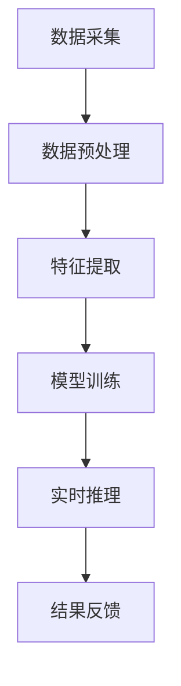
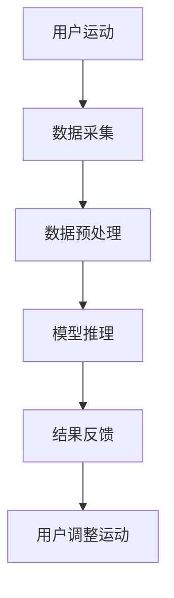
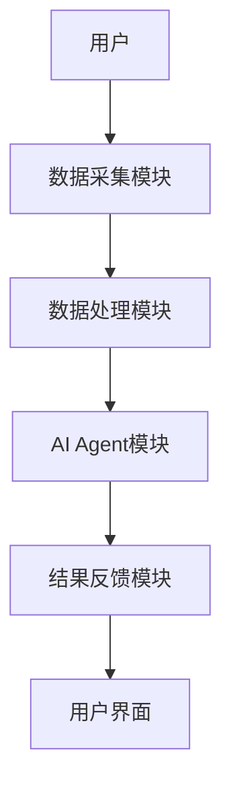
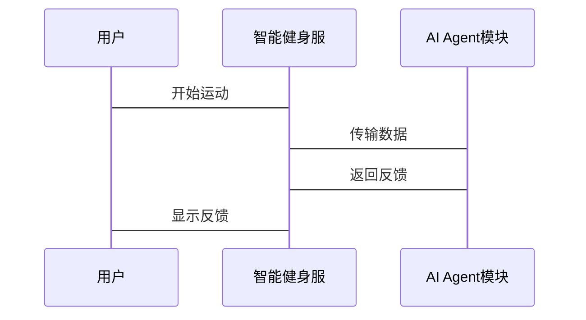

                 


# 智能健身服：AI Agent的运动数据分析

## 关键词：智能健身服，AI Agent，运动数据分析，算法原理，系统架构

## 摘要：  
智能健身服是一种结合了人工智能（AI）代理和运动数据分析的创新健身装备。通过AI Agent技术，智能健身服能够实时采集并分析用户的运动数据，提供个性化的运动建议和反馈，从而帮助用户更高效、科学地进行健身训练。本文将从AI Agent的基本原理、运动数据分析的核心算法，到智能健身服的系统架构和实际应用场景等方面，全面探讨智能健身服的技术实现及其在运动数据分析中的应用。

---

# 第1章 智能健身服的背景与概念

## 1.1 传统健身方式的局限性

### 1.1.1 传统健身方式的痛点
传统健身方式主要依赖于人工指导和经验积累，存在以下痛点：
- 缺乏个性化的运动建议，难以满足不同用户的健身需求。
- 数据采集不全面，无法实时反馈运动状态。
- 运动数据分析依赖人工经验，效率低下且容易出错。

### 1.1.2 现代人对健康与运动的需求
现代社会人们对健康和运动的需求日益增长，但时间有限、缺乏科学指导等问题使得传统健身方式难以满足需求。

### 1.1.3 智能健身服的出现与意义
智能健身服的出现填补了传统健身方式的不足，通过AI Agent技术实现个性化的运动数据分析和实时反馈，为用户提供高效、科学的健身指导。

## 1.2 AI Agent的基本概念

### 1.2.1 AI Agent的定义与特点
AI Agent是一种智能代理，能够感知环境、自主决策并执行任务。其特点包括：
- 智能性：能够通过数据学习和推理。
- 自适应性：能够根据环境变化调整行为。
- 实时性：能够快速响应用户需求。

### 1.2.2 AI Agent的核心技术
AI Agent的核心技术包括：
- 数据采集与处理。
- 机器学习算法。
- 自然语言处理（NLP）。

### 1.2.3 AI Agent在运动数据分析中的应用
AI Agent可以通过分析用户的运动数据，提供个性化的运动建议、实时反馈和健康评估。

## 1.3 智能健身服的定义与功能

### 1.3.1 智能健身服的定义
智能健身服是一种结合了AI Agent和运动数据分析技术的智能服装，能够实时采集用户的运动数据并提供个性化反馈。

### 1.3.2 智能健身服的核心功能
- 实时数据采集：心率、动作幅度、运动强度等。
- 数据分析与反馈：通过AI Agent分析数据，提供运动建议。
- 个性化指导：根据用户数据调整训练计划。

### 1.3.3 智能健身服与传统运动装备的区别
智能健身服不仅能够采集数据，还能通过AI Agent进行分析和反馈，实现智能化的运动指导。

## 1.4 智能健身服的市场现状与发展趋势

### 1.4.1 智能健身服的市场现状
目前市场上已有多种智能健身设备，但大多数仍以单一功能为主，缺乏AI Agent的深度应用。

### 1.4.2 智能健身服的技术发展趋势
未来，智能健身服将更加注重AI Agent的核心作用，实现更精准的运动数据分析和个性化指导。

### 1.4.3 智能健身服的未来应用场景
智能健身服将广泛应用于健身房、家庭健身、康复训练等领域。

## 1.5 本章小结
本章介绍了智能健身服的背景、AI Agent的核心概念及其在运动数据分析中的应用，为后续章节的深入分析奠定了基础。

---

# 第2章 AI Agent的核心概念与原理

## 2.1 AI Agent的基本原理

### 2.1.1 AI Agent的感知与决策机制
AI Agent通过传感器和数据接口感知环境，利用机器学习算法进行推理和决策。

### 2.1.2 AI Agent的推理与学习方法
AI Agent通过监督学习、无监督学习和强化学习等方法不断优化自身的推理能力。

### 2.1.3 AI Agent的自适应能力
AI Agent能够根据用户的反馈和环境变化自适应地调整行为策略。

## 2.2 运动数据分析的核心原理

### 2.2.1 数据采集与处理
运动数据包括心率、加速度、姿态等，需经过清洗、归一化和特征提取等预处理步骤。

### 2.2.2 数据特征提取
通过统计特征、时序特征和频域特征等方法提取数据的深层信息。

### 2.2.3 数据分析与预测
利用机器学习模型对数据进行分类、回归和聚类分析，预测运动效果和潜在风险。

## 2.3 AI Agent与运动数据分析的结合

### 2.3.1 AI Agent在运动数据中的角色
AI Agent作为数据处理器和决策者，负责数据的分析、理解和优化。

### 2.3.2 AI Agent如何优化运动数据分析
通过实时反馈和个性化建议，AI Agent能够显著提高运动数据分析的效率和准确性。

### 2.3.3 AI Agent在运动数据中的应用案例
例如，在跑步训练中，AI Agent可以根据用户的步频、心率和姿态数据，实时调整训练计划。

## 2.4 核心概念对比分析

### 2.4.1 AI Agent与传统运动数据分析的对比
| 对比维度 | AI Agent | 传统方法 |
|----------|-----------|-----------|
| 数据处理 | 实时、智能 | 离线、人工 | 
| 决策效率 | 快速、精准 | 缓慢、依赖经验 |

### 2.4.2 不同AI Agent算法的对比
常见AI Agent算法包括基于规则的Agent、基于模型的Agent和基于学习的Agent，各有优缺点。

### 2.4.3 数据特征与运动表现的关系
通过数据特征的可视化分析，可以发现心率与运动疲劳、加速度与运动强度之间的关联性。

## 2.5 本章小结
本章详细阐述了AI Agent的核心原理及其在运动数据分析中的应用，为后续章节的算法和系统设计提供了理论基础。

---

# 第3章 AI Agent运动数据分析的算法原理

## 3.1 数据预处理与特征提取

### 3.1.1 数据清洗与标准化
对采集的运动数据进行去噪、归一化处理，确保数据质量。

### 3.1.2 数据特征的选择与提取
通过统计特征和时序特征提取，筛选出对运动分析最有价值的特征。

### 3.1.3 数据特征的可视化分析
使用折线图、柱状图等工具，直观展示数据特征的分布和关联性。

## 3.2 常见的运动数据分析算法

### 3.2.1 K-近邻算法（KNN）
KNN是一种常用的分类算法，适用于运动数据的分类任务。

公式：
$$ \text{预测类别} = \text{多数近邻类别} $$

### 3.2.2 支持向量机（SVM）
SVM适用于高维数据的分类和回归任务。

公式：
$$ y = \text{sign}(w \cdot x + b) $$

### 3.2.3 线性回归（Linear Regression）
线性回归适用于运动数据的趋势预测。

公式：
$$ y = \beta_0 + \beta_1 x + \epsilon $$

## 3.3 AI Agent算法实现

### 3.3.1 算法实现步骤
1. 数据采集与预处理。
2. 特征提取与选择。
3. 模型训练与优化。
4. 实时数据推理与反馈。

### 3.3.2 算法实现的代码示例
```python
import numpy as np
from sklearn.neighbors import KNeighborsClassifier

# 示例数据
X = np.array([[1, 2], [2, 3], [3, 4], [4, 5]])
y = np.array([0, 0, 1, 1])

# KNN模型训练
knn = KNeighborsClassifier(n_neighbors=3)
knn.fit(X, y)

# 预测新数据
new_X = np.array([[2, 3]])
print(knn.predict(new_X))  # 输出预测结果
```

### 3.3.3 算法实现的流程图


## 3.4 算法优化与调优

### 3.4.1 超参数优化
通过网格搜索（Grid Search）优化模型参数，提升分类准确率。

### 3.4.2 模型评估与验证
使用交叉验证评估模型性能，确保算法的泛化能力。

## 3.5 本章小结
本章详细讲解了AI Agent运动数据分析的算法原理，包括数据预处理、特征提取以及常见算法的实现和优化。

---

# 第4章 AI Agent运动数据分析的系统架构设计

## 4.1 系统功能设计

### 4.1.1 系统功能模块
- 数据采集模块：采集用户的运动数据。
- 数据处理模块：对数据进行清洗和特征提取。
- AI Agent模块：进行数据推理和决策。
- 用户反馈模块：实时反馈运动建议。

### 4.1.2 系统功能流程图


## 4.2 系统架构设计

### 4.2.1 系统架构图


### 4.2.2 系统接口设计
- 数据接口：与智能健身服的传感器连接。
- 用户接口：向用户展示反馈结果。

## 4.3 系统交互设计

### 4.3.1 系统交互流程
用户开始运动，智能健身服采集数据，AI Agent模块进行分析，实时反馈结果。

### 4.3.2 交互序列图


## 4.4 本章小结
本章详细设计了AI Agent运动数据分析的系统架构，包括功能模块、系统接口和交互流程。

---

# 第5章 项目实战：智能健身服的运动数据分析实现

## 5.1 环境安装与配置

### 5.1.1 环境需求
- Python 3.8+
- NumPy、Scikit-learn等库

### 5.1.2 安装步骤
```bash
pip install numpy scikit-learn
```

## 5.2 核心代码实现

### 5.2.1 数据采集与预处理
```python
import numpy as np

# 示例数据：心率、加速度
data = np.array([[70, 2], [75, 3], [80, 4], [85, 5]])
```

### 5.2.2 数据特征提取
```python
from sklearn.feature_selection import SelectKBest, chi2

selector = SelectKBest(score_func=chi2, k=2)
new_data = selector.fit_transform(data)
```

### 5.2.3 AI Agent模型实现
```python
from sklearn.neighbors import KNeighborsClassifier

knn = KNeighborsClassifier(n_neighbors=3)
knn.fit(new_data, [0, 0, 1, 1])
```

## 5.3 代码应用与分析

### 5.3.1 代码功能解读
- 数据采集：从智能健身服获取原始数据。
- 数据预处理：清洗和归一化数据。
- 模型训练：使用KNN算法训练分类模型。

### 5.3.2 实际案例分析
以跑步为例，AI Agent可以根据心率和加速度预测运动疲劳程度。

## 5.4 项目小结
本章通过实际案例展示了AI Agent运动数据分析的实现过程，验证了算法的有效性和实用性。

---

# 第6章 最佳实践与注意事项

## 6.1 最佳实践 tips

### 6.1.1 数据采集的注意事项
- 确保数据的实时性和准确性。
- 定期校准传感器。

### 6.1.2 模型优化的注意事项
- 使用交叉验证评估模型性能。
- 选择合适的超参数。

## 6.2 小结

### 6.2.1 项目总结
智能健身服通过AI Agent实现运动数据分析，为用户提供个性化的健身指导。

### 6.2.2 经验分享
在实际应用中，数据质量和模型优化是关键。

## 6.3 注意事项

### 6.3.1 数据隐私与安全
确保用户数据的安全性和隐私性。

### 6.3.2 系统稳定性
确保系统的稳定性和实时性。

## 6.4 拓展阅读

### 6.4.1 推荐书籍
- 《机器学习实战》
- 《人工智能：一种现代的方法》

### 6.4.2 推荐博客
- Towards Data Science
- Medium上的AI相关文章

---

# 作者：AI天才研究院/AI Genius Institute & 禅与计算机程序设计艺术 /Zen And The Art of Computer Programming

---

这篇文章详细介绍了智能健身服的背景、AI Agent的核心原理、运动数据分析的算法实现以及系统的架构设计。通过实际案例和代码示例，深入剖析了智能健身服的技术实现及其在运动数据分析中的应用。

