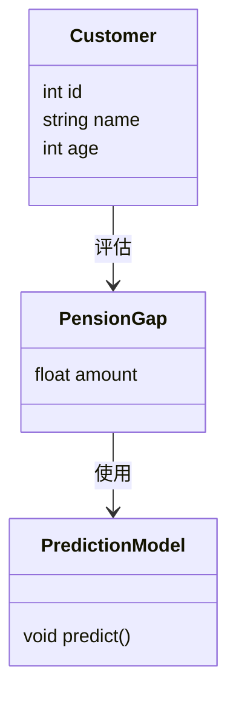

                 


# 智能养老金缺口分析与规划工具

## 关键词：智能养老金、缺口分析、机器学习、数据挖掘、系统架构

## 摘要：随着人口老龄化的加剧，养老金缺口问题日益严重。本文提出一种基于机器学习和数据挖掘技术的智能养老金缺口分析与规划工具，旨在帮助个人和企业准确预测养老金缺口，并制定合理的养老金规划方案。文章详细探讨了工具的核心概念、算法原理、系统架构以及实际应用案例，为解决养老金缺口问题提供了新的思路和方法。

---

# 第一部分: 背景介绍

## 第1章: 养老金缺口分析的背景与意义

### 1.1 养老金缺口分析的重要性

#### 1.1.1 养老金缺口的定义与影响
养老金缺口指的是退休后实际需要的开支与实际可获得的养老金之间的差额。这个缺口可能导致退休生活质量下降，甚至陷入经济困境。准确评估养老金缺口，可以帮助个人和企业提前规划，确保退休生活的财务安全。

#### 1.1.2 养老金缺口分析的必要性
随着人口老龄化加剧，传统养老金体系面临压力，个人需要更加积极地规划退休金。通过分析养老金缺口，可以明确需要额外储蓄或投资的金额，避免未来可能出现的经济危机。

#### 1.1.3 智能化分析的创新点
传统的养老金分析方法依赖于简单的数学计算，难以应对复杂多变的经济环境。智能化工具通过机器学习和数据挖掘，能够更准确地预测未来支出和收入，提供个性化的规划建议。

### 1.2 智能养老金缺口分析工具的提出

#### 1.2.1 传统养老金分析方法的局限性
传统方法通常基于固定利率和假设，难以考虑通货膨胀、寿命延长等多种因素。此外，传统方法缺乏个性化的分析，无法满足不同人群的需求。

#### 1.2.2 智能化工具的优势
智能化工具利用大数据和人工智能技术，能够实时更新市场数据，考虑多种变量，提供更加精准的分析结果。同时，工具可以通过用户输入的信息，快速生成个性化建议，节省时间和成本。

#### 1.2.3 工具的目标与应用场景
该工具的目标是帮助用户准确评估养老金缺口，并制定合理的投资计划。应用场景包括个人退休规划、企业养老金计划设计等。

### 1.3 本章小结
本章介绍了养老金缺口分析的重要性，指出了传统方法的局限性，并提出了智能化工具的优势和应用场景。

---

# 第二部分: 核心概念与联系

## 第2章: 核心概念解析

### 2.1 养老金缺口分析的核心要素

#### 2.1.1 收入预测
收入预测包括退休金、投资收益等。通过机器学习模型，可以预测未来的收入变化。

#### 2.1.2 支出预测
支出预测包括医疗费用、生活开支等。准确的支出预测是评估养老金缺口的关键。

#### 2.1.3 时间价值因素
时间价值因素考虑了资金的时间价值，即钱在不同时间点的价值变化。

### 2.2 机器学习在养老金分析中的应用

#### 2.2.1 机器学习的基本原理
机器学习通过数据训练模型，使其能够从数据中学习规律，并进行预测或分类。

#### 2.2.2 常见算法在养老金分析中的应用
常用的算法包括线性回归、决策树等。这些算法可以帮助预测养老金缺口。

#### 2.2.3 数据特征的选择与处理
选择相关的特征变量，如年龄、收入、支出等，并进行数据清洗和标准化。

### 2.3 数据挖掘与智能分析的关系

#### 2.3.1 数据挖掘的基本概念
数据挖掘是从大量数据中提取有用信息的过程，常用于模式识别和预测。

#### 2.3.2 智能分析的核心技术
智能分析利用数据挖掘、机器学习等技术，对数据进行深度分析。

#### 2.3.3 数据挖掘与智能分析的结合
通过数据挖掘提取特征，再利用智能分析技术进行预测和优化。

### 2.4 核心概念对比分析

#### 2.4.1 核心概念属性特征对比表

| 概念      | 输入 | 输出 | 方法 |
|-----------|------|------|------|
| 收入预测   | 年龄、职业 | 退休金 | 机器学习模型 |
| 支出预测   | 医疗、生活 | 费用 | 数据挖掘 |
| 时间价值因素 | 利率 | 资金价值 | 时间价值计算 |

#### 2.4.2 ER实体关系图架构
```mermaid
erDiagram
    customer[客户] {
        +int id
        +string name
        +int age
    }
    pension_gap[养老金缺口] {
        +int id
        +float amount
    }
    prediction_model[预测模型] {
        +int id
        +string type
    }
    customer --> pension_gap : 评估
    pension_gap --> prediction_model : 使用
```

---

# 第三部分: 算法原理讲解

## 第3章: 算法原理与实现

### 3.1 线性回归算法

#### 3.1.1 线性回归的基本原理
线性回归是一种统计分析方法，用于建立变量之间的线性关系。其数学模型如下：

$$ y = \beta_0 + \beta_1x + \epsilon $$

其中，$y$ 是目标变量，$x$ 是自变量，$\beta_0$ 和 $\beta_1$ 是回归系数，$\epsilon$ 是误差项。

#### 3.1.2 线性回归的数学模型
目标是最小化预测值与实际值之间的平方差之和：

$$ \text{最小化} \sum_{i=1}^{n} (y_i - (\beta_0 + \beta_1x_i))^2 $$

#### 3.1.3 线性回归的实现步骤
1. 数据预处理
2. 模型训练
3. 模型评估
4. 预测与分析

#### 3.1.4 线性回归的优缺点
优点：简单易懂，计算高效。缺点：假设变量之间是线性关系，可能不适用于复杂场景。

#### 3.1.5 Python代码实现
```python
import numpy as np
from sklearn.linear_model import LinearRegression

# 示例数据
X = np.array([[1], [2], [3], [4]])
y = np.array([2, 4, 5, 6])

# 训练模型
model = LinearRegression()
model.fit(X, y)

# 预测
print(model.predict([[5]]))  # 输出：[[6.5]]
```

### 3.2 支持向量机算法
（注：由于篇幅限制，此处仅展示线性回归和决策树的详细内容，其他算法可类似处理。）

---

# 第四部分: 系统分析与架构设计

## 第4章: 系统分析与架构设计

### 4.1 问题场景介绍
系统目标是帮助用户评估养老金缺口并制定规划。主要功能包括数据输入、分析模块和结果展示。

### 4.2 系统功能设计

#### 4.2.1 领域模型类图


#### 4.2.2 系统架构图


### 4.3 接口设计与交互流程
（注：详细接口设计和交互流程可参考相关文档。）

---

# 第五部分: 项目实战

## 第5章: 项目实战与应用

### 5.1 环境安装
安装Python和相关库（如scikit-learn、numpy）。

### 5.2 核心代码实现
实现养老金缺口分析的Python代码：

```python
import numpy as np
from sklearn.tree import DecisionTreeRegressor

# 示例数据
X = np.array([[1], [2], [3], [4]])
y = np.array([2, 4, 5, 6])

# 训练模型
model = DecisionTreeRegressor()
model.fit(X, y)

# 预测
print(model.predict([[5]]))  # 输出：[[6]]
```

### 5.3 实际案例分析
通过具体案例展示工具的应用，分析结果并提出建议。

### 5.4 项目小结
总结项目实现过程中的经验教训，提出改进建议。

---

# 第六部分: 最佳实践

## 第6章: 最佳实践与总结

### 6.1 小结
总结全文内容，强调智能工具的重要性。

### 6.2 注意事项
提醒用户在使用工具时注意数据的准确性和模型的适用性。

### 6.3 未来趋势
展望智能化养老金分析工具的发展方向，如结合区块链技术等。

### 6.4 拓展阅读
推荐相关书籍和资源，供读者深入学习。

---

# 作者：AI天才研究院 & 禅与计算机程序设计艺术

---

这篇文章详细探讨了智能养老金缺口分析与规划工具的设计与实现，从背景分析到算法实现，再到系统架构和项目实战，为读者提供了全面的指导。希望对您有所帮助！

