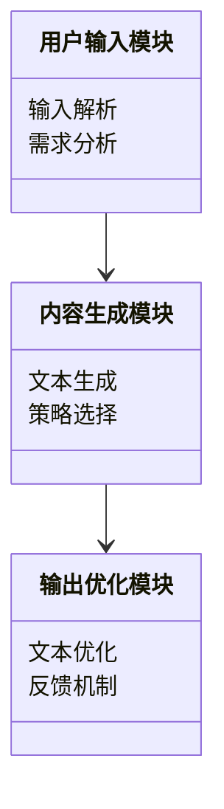
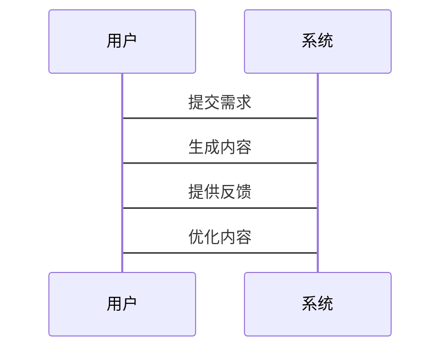

                 


# 智能写作AI Agent：LLM辅助的创意内容生成

> 关键词：智能写作，AI Agent，LLM，创意内容生成，大语言模型，文本生成，自然语言处理

> 摘要：本文探讨了智能写作AI Agent在LLM辅助下的创意内容生成技术，分析了其背景、核心概念、算法原理、系统架构，并通过项目实战和最佳实践提供深入的见解。

---

# 第一部分: 智能写作AI Agent背景与概念

## 第1章: 智能写作AI Agent概述

### 1.1 LLM与智能写作的背景

#### 1.1.1 从传统写作到智能写作的演进
传统写作依赖人工创作，耗时且效率低下。智能写作AI Agent通过自然语言处理技术，实现了自动化和智能化的创作辅助。

#### 1.1.2 大语言模型（LLM）的崛起
LLM（Large Language Model）基于深度学习，能够理解和生成人类语言，是智能写作的核心技术。

#### 1.1.3 智能写作AI Agent的定义与目标
智能写作AI Agent是一个辅助工具，利用LLM生成创意内容，帮助用户高效完成写作任务。

### 1.2 创意内容生成的挑战与机遇

#### 1.2.1 创意写作的核心问题
创意写作需要独特的思想和表达，但传统方法效率低，难以快速生成高质量内容。

#### 1.2.2 传统写作的局限性
人工创作耗时长、效率低，且难以应对多样化的创作需求。

#### 1.2.3 AI在创意写作中的潜力
AI可以通过分析海量数据，生成灵感和创意，辅助人类完成高质量写作。

---

## 第2章: 大语言模型（LLM）技术基础

### 2.1 LLM的核心概念

#### 2.1.1 什么是大语言模型
LLM是基于大量数据训练的深度学习模型，能够理解和生成人类语言。

#### 2.1.2 LLM的主要特点
- 大规模参数：通常拥有 billions级别的参数。
- 预训练：基于大量未标注数据进行无监督学习。
- 微调：通过特定任务数据进行有监督优化。

#### 2.1.3 LLM与传统NLP模型的区别
LLM采用 transformer 架构，支持长文本处理和上下文理解，性能远超传统模型。

### 2.2 LLM的训练与优化

#### 2.2.1 预训练目标
预训练目标包括语言模型任务（如预测下一个词）和多种无监督任务。

#### 2.2.2 微调策略
微调是对预训练模型进行任务特定的优化，以适应特定的写作场景。

#### 2.2.3 模型评估与优化
通过BLEU、ROUGE等指标评估生成质量，优化模型参数和生成策略。

---

## 第3章: 智能写作AI Agent的核心原理

### 3.1 LLM在创意写作中的应用

#### 3.1.1 文本生成的基本原理
LLM通过解码器生成文本，基于上下文逐步预测每个词。

#### 3.1.2 创意写作的特殊需求
需要考虑创意性、连贯性和多样性，避免重复和陈词滥调。

#### 3.1.3 LLM如何满足创意写作需求
通过多轮对话、条件生成和风格适配，满足不同的创意需求。

### 3.2 智能写作AI Agent的工作流程

#### 3.2.1 用户输入处理
解析用户需求，提取关键词、主题和风格等信息。

#### 3.2.2 内容生成策略
基于用户需求，生成多个候选文本，选择最优解。

#### 3.2.3 输出优化与反馈机制
优化生成文本的流畅性和创意性，提供用户反馈以改进模型。

---

# 第二部分: LLM辅助创意内容生成的算法原理

## 第4章: 大语言模型的数学基础

### 4.1 变量与参数

#### 4.1.1 输入变量
输入文本序列，如$x_1, x_2, ..., x_n$。

#### 4.1.2 模型参数
模型权重矩阵$W$，包括嵌入层、注意力层和前馈层的参数。

#### 4.1.3 损失函数
交叉熵损失函数：$-\sum_{i=1}^n y_i \log p(y_i)$，其中$p(y_i)$是生成概率。

### 4.2 模型训练的数学公式

#### 4.2.1 损失函数
交叉熵损失用于衡量预测与真实值的差异。

#### 4.2.2 参数更新公式
使用Adam优化器更新参数：$\theta = \theta - \eta \nabla L$。

#### 4.2.3 优化算法
Adam优化器结合动量和自适应学习率，加速收敛。

## 第5章: 创意写作生成算法

### 5.1 基于LLM的文本生成算法

#### 5.1.1 基本生成算法
贪心算法和随机采样，分别用于确定性和多样性的生成。

#### 5.1.2 贝叶斯网络
通过条件概率建模，生成符合用户需求的文本。

#### 5.1.3 熵模型
利用熵计算文本多样性，平衡生成内容的创意和连贯性。

### 5.2 创意写作的特殊算法

#### 5.2.1 创意约束条件
设定主题、风格和长度等约束，生成符合要求的内容。

#### 5.2.2 创意生成策略
多轮生成和编辑，确保内容的创新性和独特性。

#### 5.2.3 创意优化算法
基于反馈机制，优化生成内容的质量和创意性。

---

# 第三部分: 智能写作AI Agent系统架构与实现

## 第6章: 系统分析与架构设计

### 6.1 问题场景介绍

#### 6.1.1 用户需求
用户希望生成高质量、创意性强的文本内容。

#### 6.1.2 系统目标
构建一个高效的智能写作AI Agent，辅助用户完成创意写作任务。

### 6.2 系统功能设计

#### 6.2.1 功能模块划分
- 用户输入模块
- 内容生成模块
- 输出优化模块
- 反馈交互模块

#### 6.2.2 领域模型Mermaid类图


### 6.3 系统架构设计

#### 6.3.1 系统架构Mermaid架构图


### 6.4 系统接口设计

#### 6.4.1 接口定义
- 输入接口：接收用户需求和参数。
- 输出接口：返回生成内容和优化建议。

#### 6.4.2 接口交互流程
用户输入 -> 解析 -> 生成内容 -> 优化 -> 输出。

### 6.5 系统交互Mermaid序列图



---

## 第7章: 项目实战

### 7.1 环境安装

#### 7.1.1 安装Python和相关库
```bash
pip install python
pip install torch
pip install transformers
```

#### 7.1.2 下载LLM模型
```bash
wget https://huggingface.co/gpt2
```

### 7.2 核心代码实现

#### 7.2.1 模型加载
```python
from transformers import GPT2LMHeadModel, GPT2Tokenizer

model = GPT2LMHeadModel.from_pretrained('gpt2')
tokenizer = GPT2Tokenizer.from_pretrained('gpt2')
```

#### 7.2.2 文本生成
```python
def generate_text(prompt, max_length=500):
    inputs = tokenizer.encode(prompt, return_tensors='pt')
    outputs = model.generate(inputs, max_length=max_length, do_sample=True)
    return tokenizer.decode(outputs[0], skip_special_tokens=True)
```

### 7.3 案例分析与详细解读

#### 7.3.1 案例场景
用户输入一个创意写作的主题，如“科幻小说”。

#### 7.3.2 代码实现
调用生成函数，输出生成的文本内容。

#### 7.3.3 生成结果分析
分析生成文本的质量、创意性和连贯性。

### 7.4 项目小结

#### 7.4.1 成功经验
模型参数优化和生成策略调整是关键。

#### 7.4.2 实验数据
生成文本的评估指标，如BLEU、ROUGE等。

---

## 第8章: 最佳实践

### 8.1 写作效率提升技巧

#### 8.1.1 合理设置生成参数
如温度、重复率等，平衡创意和连贯性。

#### 8.1.2 分段生成与优化
分段生成，逐步优化，提升整体质量。

### 8.2 内容质量优化策略

#### 8.2.1 多样化风格训练
训练模型在不同风格下生成内容。

#### 8.2.2 反馈优化机制
根据用户反馈，不断优化生成策略。

### 8.3 用户体验优化建议

#### 8.3.1 界面友好设计
提供直观的操作界面，方便用户使用。

#### 8.3.2 反馈及时响应
生成内容后，及时提供优化建议。

### 8.4 注意事项

#### 8.4.1 模型泛化能力
避免模型过于依赖训练数据，保持生成内容的多样性。

#### 8.4.2 内容原创性
注意生成内容的原创性，避免侵犯版权。

### 8.5 未来展望

#### 8.5.1 多模态写作辅助
结合图像、视频等多模态信息，提升创作体验。

#### 8.5.2 智能助手集成
将智能写作AI Agent集成到各种写作工具中，提供更广泛的服务。

---

# 第四部分: 总结与展望

## 第9章: 总结

### 9.1 本章回顾
本文详细探讨了智能写作AI Agent的背景、技术原理、系统架构和实现。

### 9.2 核心观点总结
LLM在创意写作中的应用潜力巨大，通过合理的系统设计和算法优化，可以显著提升写作效率和质量。

## 第10章: 未来展望

### 10.1 智能写作的发展趋势
随着LLM技术的不断进步，智能写作将更加智能化和个性化。

### 10.2 技术创新方向
探索多模态生成、增强学习和实时协作等新技术，推动智能写作的发展。

---

# 作者：AI天才研究院/AI Genius Institute & 禅与计算机程序设计艺术 /Zen And The Art of Computer Programming

