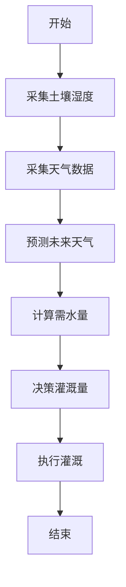
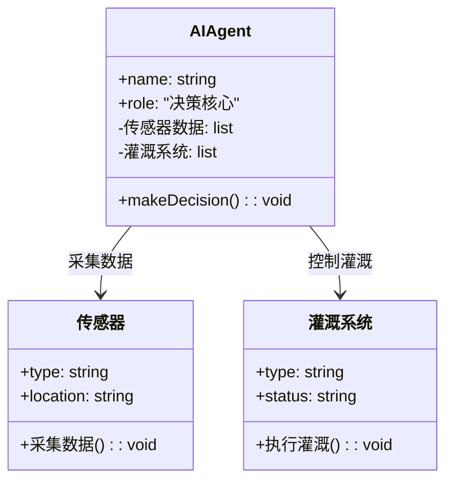
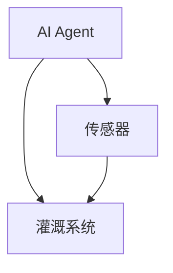
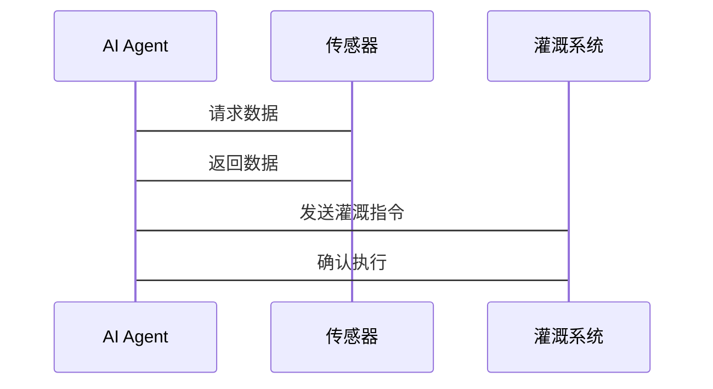

                 


# 智能农业：AI Agent控制的精准灌溉系统

> 关键词：智能农业, AI Agent, 精准灌溉, 人工智能, 灌溉系统

> 摘要：本文详细介绍了AI Agent在智能农业中的应用，特别是其在精准灌溉系统中的控制机制。通过分析AI Agent的核心原理、算法设计、系统架构以及实际案例，展示了如何利用AI技术实现农业水资源的高效管理，提高农作物产量和质量，同时减少浪费。

---

# 第1章: 背景介绍

## 1.1 问题背景

### 1.1.1 农业水资源浪费问题
传统农业中，灌溉系统常采用漫灌方式，导致水资源浪费。这种方式不仅效率低下，还可能引发土壤盐碱化和作物病害。

### 1.1.2 精准农业的需求
精准农业要求根据土壤湿度、天气预报和作物需求，精确控制灌溉量和时间，以提高水资源利用效率和农作物产量。

### 1.1.3 AI技术在农业中的应用潜力
AI技术可以通过数据分析和智能决策，优化农业管理流程，特别是在灌溉系统中实现精准控制。

## 1.2 问题描述

### 1.2.1 灌溉系统的主要问题
- 水资源浪费
- 灌溉时机不当
- 灌溉量不均匀

### 1.2.2 精准灌溉的目标
- 提高水资源利用效率
- 优化作物生长环境
- 减少环境污染

### 1.2.3 AI Agent在灌溉系统中的角色
AI Agent作为智能决策核心，实时采集数据并优化灌溉策略。

## 1.3 问题解决思路

### 1.3.1 AI Agent的核心作用
通过数据采集、分析和决策，实现精准灌溉。

### 1.3.2 数据驱动的灌溉决策
基于传感器数据和AI算法，制定最优灌溉方案。

### 1.3.3 系统设计的总体思路
构建AI Agent控制的闭环系统，从数据采集到决策执行。

## 1.4 边界与外延

### 1.4.1 系统的边界
- 数据采集范围
- 决策执行范围
- 系统交互范围

### 1.4.2 系统的外延
- 智能农业的其他应用
- 更大规模的农业管理
- 全球范围的水资源优化

### 1.4.3 相关概念的对比
- AI Agent与传统自动化的区别
- 精准灌溉与其他灌溉方式的对比
- AI技术在农业中的其他应用

## 1.5 核心概念与联系

### 1.5.1 核心概念原理
- AI Agent：智能决策核心
- 精准灌溉：数据驱动的灌溉系统

### 1.5.2 概念属性特征对比表格
| 概念 | 定义 | 特性 |
|------|------|------|
| AI Agent | 智能决策系统 | 数据采集、分析、决策 |
| 精准灌溉 | 精准控制灌溉 | 高效、环保、智能 |

### 1.5.3 ER实体关系图架构
```mermaid
er
    %% ER图展示系统核心实体关系
    actor(AI Agent, {
        name: string,
        role: "智能决策核心"
    })
    actor(传感器, {
        type: string,
        location: string
    })
    actor(灌溉系统, {
        type: string,
        status: string
    })
    relation(管理, AI Agent, 传感器, {
        type: "数据采集"
    })
    relation(控制, AI Agent, 灌溉系统, {
        type: "决策执行"
    })
```

---

# 第2章: AI Agent与精准灌溉系统的核心原理

## 2.1 AI Agent的基本原理

### 2.1.1 AI Agent的定义
AI Agent是一个智能实体，能够感知环境、处理信息并做出决策。

### 2.1.2 AI Agent的核心特征
- **自主性**：无需外部干预
- **反应性**：实时响应环境变化
- **学习能力**：通过数据优化决策

### 2.1.3 AI Agent的分类
- **简单反射型**：基于规则的决策
- **基于模型的反应型**：使用环境模型进行决策
- **目标驱动型**：基于目标进行复杂决策

## 2.2 精准灌溉系统的算法原理

### 2.2.1 算法原理概述
基于AI Agent的数据分析和预测，优化灌溉策略。

### 2.2.2 算法流程图


### 2.2.3 算法实现细节
使用机器学习模型，如随机森林或神经网络，预测土壤湿度和天气变化，优化灌溉计划。

## 2.3 系统架构设计

### 2.3.1 系统功能模块
- 数据采集模块：采集土壤湿度、天气数据
- AI决策模块：分析数据，制定灌溉计划
- 灌溉执行模块：根据决策执行灌溉

### 2.3.2 系统架构图


### 2.3.3 系统接口设计
- 数据接口：传感器数据输入接口
- 控制接口：AI Agent控制灌溉系统接口

---

# 第3章: 系统分析与架构设计

## 3.1 系统分析

### 3.1.1 问题场景介绍
AI Agent控制的精准灌溉系统在不同环境下的应用案例。

### 3.1.2 项目介绍
系统架构、功能模块和实现方案。

### 3.1.3 系统功能设计
- 数据采集：土壤湿度、天气数据
- 数据分析：预测天气、计算需水量
- 决策执行：优化灌溉计划

## 3.2 系统架构设计

### 3.2.1 领域模型设计


### 3.2.2 系统架构图


### 3.2.3 系统接口设计
- 数据接口：传感器数据输入
- 控制接口：AI Agent控制灌溉系统

## 3.3 系统交互设计

### 3.3.1 系统交互流程图


---

# 第4章: 项目实战

## 4.1 环境安装与配置

### 4.1.1 开发环境选择
- Python 3.8+
- 传感器数据接口
- 灌溉系统控制接口

### 4.1.2 依赖库安装
```bash
pip install numpy scikit-learn
```

### 4.1.3 环境配置步骤
1. 安装Python和依赖库
2. 配置传感器和灌溉系统的API接口
3. 配置数据库和数据存储

## 4.2 系统核心实现

### 4.2.1 AI Agent实现
```python
class AI-Agent:
    def __init__(self):
        self.sensors = []
        self.irrigation_systems = []
    
    def collect_data(self):
        for sensor in self.sensors:
            sensor.collect_data()
    
    def make_decision(self):
        # 数据分析和决策逻辑
        pass
```

### 4.2.2 精准灌溉算法实现
```python
import numpy as np
from sklearn.ensemble import RandomForestRegressor

class IrrigationController:
    def __init__(self):
        self.model = RandomForestRegressor()
    
    def train_model(self, X, y):
        self.model.fit(X, y)
    
    def predict_water_need(self, X):
        return self.model.predict(X)
```

### 4.2.3 系统接口实现
```python
class IrrigationSystem:
    def __init__(self):
        self.status = "停止"
    
    def irrigate(self, amount):
        print(f"执行灌溉，量为{amount}升")
```

## 4.3 代码应用解读

### 4.3.1 代码结构分析
系统分为数据采集、AI决策和灌溉执行三个模块。

### 4.3.2 核心代码解读
AI Agent收集传感器数据，分析后决策是否灌溉。

### 4.3.3 代码优化建议
- 数据预处理
- 模型优化
- 并行处理

---

# 总结与展望

通过本文的介绍，我们详细探讨了AI Agent在智能农业中的应用，特别是在精准灌溉系统中的控制机制。从背景介绍到系统设计，再到项目实战，我们展示了如何利用AI技术优化农业管理，提高水资源利用效率，减少浪费。

---

作者：AI天才研究院

