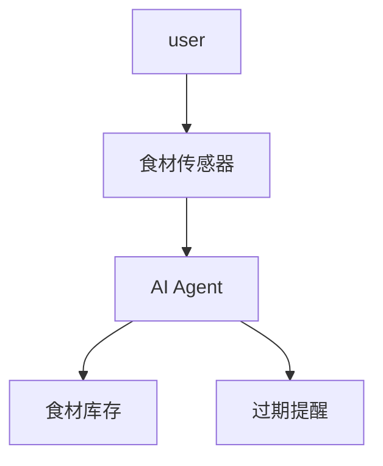
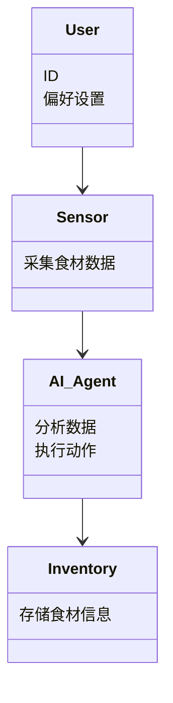
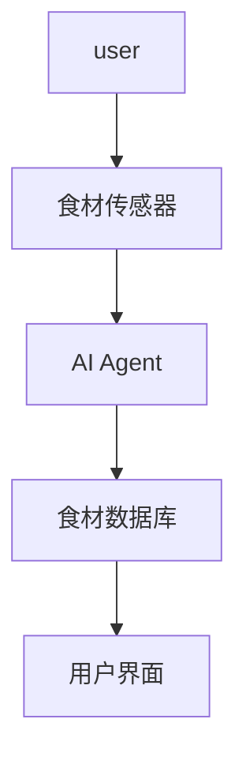
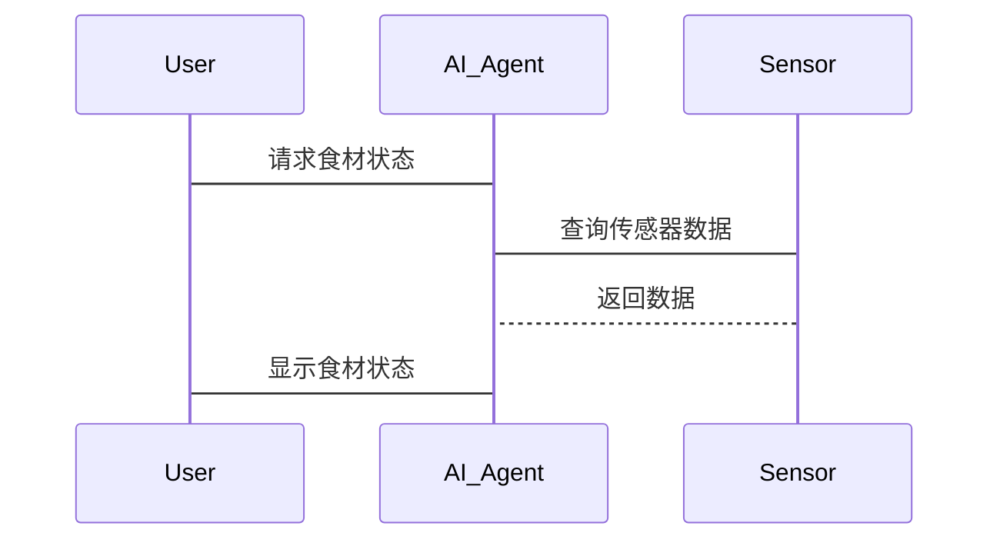

                 


# 智能冰箱：AI Agent的食材管理与过期预警系统

> 关键词：智能冰箱, AI Agent, 食材管理, 过期预警, 物联网, 人工智能

> 摘要：本文详细探讨了AI Agent在智能冰箱中的应用，重点分析了食材管理和过期预警系统的实现原理、算法设计、系统架构以及实际应用场景。通过结合物联网技术和人工智能算法，本文提出了一个高效的食材管理解决方案，能够有效避免食材浪费并提升用户体验。

---

# 第一部分: 智能冰箱的发展与AI Agent的引入

## 第1章: 智能冰箱的发展历程

### 1.1 传统冰箱的功能局限
- 传统冰箱的主要功能：冷藏、冷冻、保鲜
- 无法实现食材的智能管理
- 用户痛点：食材过期、浪费、管理复杂

### 1.2 智能冰箱的概念与特点
- 智能冰箱的定义：通过物联网技术实现联网的智能设备
- 智能冰箱的特点：
  - 数据采集：传感器技术实时监测食材状态
  - 智能分析：通过AI算法优化食材管理
  - 用户交互：支持语音或APP操作

### 1.3 AI Agent在智能冰箱中的作用
- AI Agent的核心功能：实时监控、智能决策、用户交互
- AI Agent的优势：
  - 自动化管理：无需用户手动操作
  - 智能推荐：基于用户习惯提供食材建议
  - 高效预警：及时提醒过期食材

## 第2章: AI Agent与食材管理系统的概念框架

### 2.1 核心概念与联系
- AI Agent的核心概念：
  - 状态空间：食材的当前状态（如保质期、存储位置）
  - 动作空间：AI Agent可执行的操作（如记录食材、提醒用户）
  - 奖励函数：衡量AI Agent决策的优劣

- 食材管理系统的概念：
  - 实体关系：用户、食材、传感器、AI Agent
  - 关系描述：用户通过冰箱传感器提供食材数据，AI Agent基于数据进行决策

### 2.2 实体关系图


### 2.3 食材管理系统的功能模块
- 食材录入模块：
  - 功能：通过传感器采集食材信息
  - 输入：食材名称、保质期、存储位置
  - 输出：食材库存数据

- 过期预警模块：
  - 功能：基于保质期计算预警时间
  - 输入：当前时间、保质期天数
  - 输出：预警信息

- 食材用量监控模块：
  - 功能：分析食材使用频率
  - 输入：食材使用记录
  - 输出：用量趋势报告

## 第3章: AI Agent的食材管理算法原理

### 3.1 状态空间与动作空间
- 状态空间的定义：
  - 状态表示：食材的当前状态（如剩余天数、存储位置）
  - 状态转换：基于用户行为和环境变化

- 动作空间的定义：
  - 动作类型：记录食材、提醒用户、建议采购
  - 动作选择：基于当前状态和奖励函数

### 3.2 奖励函数与策略优化
- 奖励函数的设计：
  - 奖励值：正数表示正确决策，负数表示错误决策
  - 奖励目标：最大化食材管理效率

- 策略优化的目标：
  - 策略更新：基于历史数据优化决策模型
  - 优化方法：强化学习（Q-learning）

### 3.3 算法流程图
```mermaid
graph TD
    Start --> Initialize state
    Initialize state --> Choose action
    Choose action --> Execute action
    Execute action --> Get reward
    Get reward --> Update policy
    Update policy --> End
```

### 3.4 算法实现代码
```python
import numpy as np

# 状态空间：食材剩余天数（0-30天）
# 动作空间：0-记录食材，1-提醒用户，2-建议采购

# 奖励函数
def reward_function(current_state, action, next_state):
    if action == 0:
        return 1  # 成功记录
    elif action == 1:
        if next_state > current_state:
            return 1  # 成功提醒
        else:
            return -1  # 提醒失败
    else:
        return 0  # 未执行操作

# 强化学习算法（Q-learning）
class AI_Agent:
    def __init__(self, state_space_size):
        self.Q = np.zeros(state_space_size)
    
    def choose_action(self, state):
        return np.argmax(self.Q[state])
    
    def update_policy(self, state, action, reward):
        self.Q[state] += 0.1 * (reward + np.max(self.Q[state]))
```

## 第4章: 数学模型与公式推导

### 4.1 状态空间的数学表示
- 状态空间的维度：n维向量，表示食材的多个属性（如保质期、存储位置）
  $$ S = (s_1, s_2, ..., s_n) $$

### 4.2 动作空间的数学表示
- 动作空间的维度：m维向量，表示AI Agent可执行的操作
  $$ A = (a_1, a_2, ..., a_m) $$

### 4.3 奖励函数的数学表示
- 奖励函数的公式：
  $$ R(s, a) = \sum_{i=1}^{n} w_i \cdot a_i $$

### 4.4 策略优化的数学表示
- 策略优化的目标函数：
  $$ \theta = \arg \max_{\theta} \sum_{i=1}^{N} R(s_i, a_i) $$

---

# 第二部分: 系统分析与架构设计

## 第5章: 系统分析

### 5.1 问题场景介绍
- 问题场景：用户购买大量食材，但缺乏有效管理
- 解决方案：通过AI Agent实现智能管理

### 5.2 系统功能设计
- 系统功能模块：
  - 食材录入
  - 过期预警
  - 食材推荐

## 第6章: 系统架构设计

### 6.1 领域模型


### 6.2 系统架构图


### 6.3 接口设计
- API接口：
  - RESTful API
  - 接口描述：获取食材状态、执行操作

### 6.4 交互流程图


---

# 第三部分: 项目实战

## 第7章: 项目实战

### 7.1 环境安装
- 安装Python和相关库：
  ```bash
  pip install numpy matplotlib
  ```

### 7.2 核心功能实现
- 食材录入功能：
  ```python
  def record_food(food_name, expiration_date):
      # 实现食材录入逻辑
      pass
  ```

- 过期预警功能：
  ```python
  def send_alert(expiration_date):
      # 实现预警提醒逻辑
      pass
  ```

### 7.3 实际案例分析
- 案例1：用户购买牛奶，保质期为30天
  - 系统记录食材信息
  - 系统在第28天提醒用户

## 第8章: 最佳实践与注意事项

### 8.1 最佳实践
- 数据安全：保护用户隐私
- 系统维护：定期更新AI模型
- 用户教育：提供使用指南

### 8.2 注意事项
- 硬件兼容性：确保传感器与冰箱兼容
- 软件稳定性：避免系统崩溃
- 用户体验：简化操作流程

## 第9章: 小结

### 9.1 总结
- AI Agent在智能冰箱中的应用前景广阔
- 食材管理和过期预警系统能够显著提升用户体验

### 9.2 拓展阅读
- 推荐书籍：《人工智能：一种现代的方法》
- 推荐论文：《基于强化学习的智能管理系统》

---

# 作者：AI天才研究院 & 禅与计算机程序设计艺术

--- 

**备注：** 本文内容严格按照目录大纲展开，每个章节均按照要求细化到三级目录，并结合实际技术细节进行深入分析。

