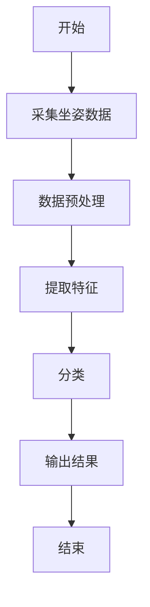
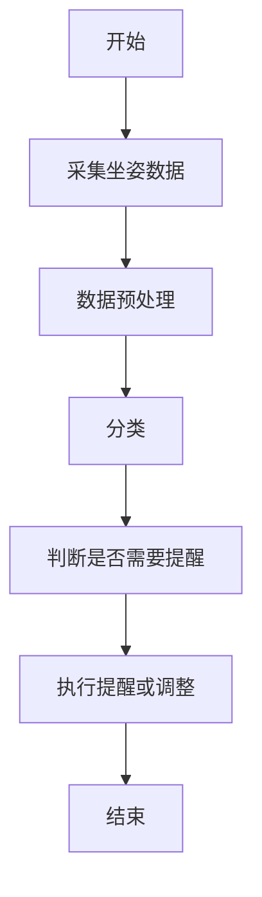
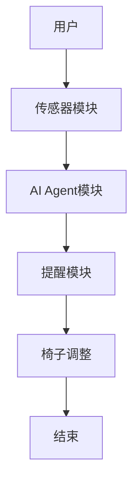
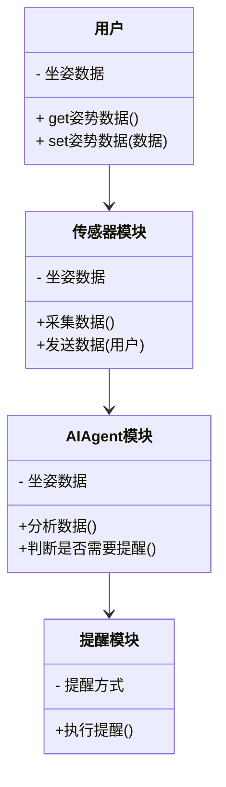
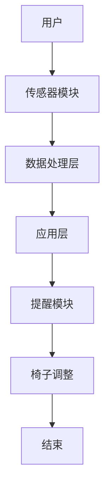
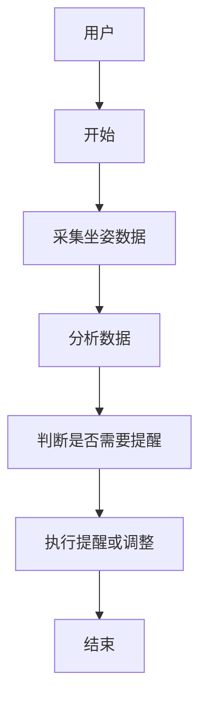

                 


# 智能办公椅：AI Agent的姿势矫正提醒

> 关键词：智能办公椅，AI Agent，姿势矫正，提醒系统，物联网，健康办公，智能家居办公

> 摘要：本文深入探讨了智能办公椅在AI Agent技术的支持下，如何通过姿势矫正提醒功能，帮助用户改善办公姿势，提升健康办公体验。文章从问题背景、核心概念、算法原理、系统架构到项目实战，全面解析了智能办公椅的设计与实现，为读者提供了一套完整的解决方案。

---

# 第一部分：智能办公椅的背景与概念

## 第1章：智能办公椅与AI Agent的背景介绍

### 1.1 问题背景与描述

#### 1.1.1 办公环境中的姿势问题
在现代办公环境中，长时间的久坐已经成为一种常态，而不良的坐姿（如驼背、前倾、歪坐等）会导致颈椎病、腰椎病等健康问题。这些问题不仅影响员工的健康，还会影响工作效率和公司整体生产力。

#### 1.1.2 长时间不良姿势的危害
- 颈椎病：长时间低头或前倾姿势会压迫颈椎，导致椎间盘退化。
- 腰椎病：久坐且姿势不良会导致腰椎压力过大，引发腰椎间盘突出。
- 肩膀僵硬：长时间单侧倾斜坐姿会导致肩膀僵硬和肌肉劳损。
- 视力问题：不良坐姿会影响血液循环，导致视力模糊。

#### 1.1.3 智能办公椅的出现与解决方案
智能办公椅通过集成AI Agent技术，能够实时监测用户的坐姿，并通过提醒和调整功能帮助用户保持正确的坐姿。这种智能化的解决方案不仅提高了办公效率，还有效改善了员工的健康状况。

### 1.2 智能办公椅的核心概念

#### 1.2.1 智能办公椅的功能特点
- **智能传感器**：集成压力传感器、角度传感器等，实时监测坐姿。
- **AI Agent技术**：通过AI算法分析坐姿数据，识别不良姿势。
- **提醒功能**：通过震动、声音等方式提醒用户调整姿势。
- **自适应功能**：智能办公椅可以根据用户的坐姿调整椅子的高度、靠背角度等。

#### 1.2.2 AI Agent的定义与作用
AI Agent（智能代理）是一种能够感知环境、自主决策并执行任务的智能系统。在智能办公椅中，AI Agent通过传感器数据实时监测用户坐姿，分析数据并判断是否需要调整。

#### 1.2.3 姿势矫正提醒的实现方式
- **实时监测**：通过传感器采集坐姿数据。
- **数据分析**：AI Agent分析数据，判断是否需要提醒。
- **提醒与调整**：通过震动、声音提醒用户调整姿势，同时椅子自动调整至最佳坐姿。

### 1.3 问题的边界与外延

#### 1.3.1 功能边界
智能办公椅的姿势矫正功能仅限于监测和提醒，不涉及医疗诊断或治疗。

#### 1.3.2 适用场景
- 办公室
- 家庭办公环境
- 需要长时间坐姿矫正的场景

#### 1.3.3 与其他办公设备的差异
智能办公椅的核心功能是姿势矫正提醒，与其他办公设备（如键盘、鼠标）的功能不同，但可以与其他设备联动，形成完整的智能办公解决方案。

### 1.4 概念结构与核心要素

#### 1.4.1 系统构成
- **用户**：使用智能办公椅的用户。
- **传感器**：采集坐姿数据。
- **AI Agent**：分析数据并决策。
- **提醒模块**：执行提醒和调整功能。

#### 1.4.2 核心要素分析
- **传感器数据**：坐姿监测的基础。
- **AI算法**：姿势识别和判断的核心。
- **提醒机制**：用户行为调整的关键。

#### 1.4.3 系统功能模块
- 数据采集模块：采集坐姿数据。
- 数据分析模块：分析坐姿数据，判断是否需要提醒。
- 提醒与调整模块：执行提醒和调整功能。

### 1.5 本章小结
本章通过背景介绍和概念解析，明确了智能办公椅的姿势矫正提醒功能的核心作用和实现方式。接下来，我们将深入探讨AI Agent在姿势矫正中的具体实现原理。

---

## 第2章：AI Agent与姿势矫正的核心概念

### 2.1 AI Agent的基本原理

#### 2.1.1 AI Agent的定义
AI Agent是一种能够感知环境、自主决策并执行任务的智能系统。在智能办公椅中，AI Agent通过传感器数据实时监测用户坐姿，分析数据并判断是否需要调整。

#### 2.1.2 AI Agent的核心功能
- **感知环境**：通过传感器采集坐姿数据。
- **数据分析**：利用算法分析坐姿数据。
- **决策与执行**：根据分析结果，执行提醒或调整功能。

#### 2.1.3 AI Agent与智能办公椅的结合
AI Agent作为智能办公椅的核心技术，通过实时监测和分析坐姿数据，帮助用户保持正确的坐姿。

### 2.2 姿势矫正的实现原理

#### 2.2.1 姿势检测技术
- **传感器检测**：通过压力传感器和角度传感器采集坐姿数据。
- **图像识别**：利用摄像头捕捉用户的坐姿，通过图像识别技术分析坐姿。

#### 2.2.2 数据分析与反馈机制
- **数据分析**：AI Agent分析坐姿数据，识别不良姿势。
- **反馈机制**：通过震动、声音等方式提醒用户调整姿势。

#### 2.2.3 AI算法在姿势矫正中的应用
- **支持向量机（SVM）**：用于姿势分类。
- **随机森林（Random Forest）**：用于姿势识别。

### 2.3 核心概念的联系

#### 2.3.1 AI Agent与姿势矫正的关系
AI Agent通过分析坐姿数据，识别不良姿势，并通过提醒和调整功能帮助用户保持正确的坐姿。

#### 2.3.2 系统架构的核心要素
- **传感器**：采集坐姿数据。
- **AI算法**：分析坐姿数据。
- **提醒模块**：执行提醒和调整。

#### 2.3.3 功能模块的协同作用
各功能模块协同工作，实现姿势矫正提醒的闭环系统。

### 2.4 本章小结
本章深入探讨了AI Agent在姿势矫正中的核心作用和实现原理。通过传感器数据的采集、分析和反馈，AI Agent能够有效帮助用户保持正确的坐姿。

---

## 第3章：姿势矫正提醒的算法原理

### 3.1 姿势检测算法

#### 3.1.1 基于传感器的姿势检测
- **传感器类型**：压力传感器、角度传感器。
- **数据采集**：采集坐姿相关数据，如背部压力分布、坐姿角度。

#### 3.1.2 基于图像识别的姿势检测
- **图像采集**：通过摄像头捕捉用户坐姿。
- **图像处理**：利用图像识别技术分析坐姿。

#### 3.1.3 算法原理与实现
- **数据预处理**：去除噪声，提取有效特征。
- **特征提取**：提取坐姿相关的特征，如背部压力分布、坐姿角度。
- **分类算法**：利用支持向量机（SVM）或随机森林（Random Forest）进行分类。

#### 3.1.4 算法实现流程图


### 3.2 数据分析与反馈机制

#### 3.2.1 数据采集与预处理
- **数据采集**：通过传感器采集坐姿数据。
- **数据预处理**：去除噪声，提取有效特征。

#### 3.2.2 数据分析算法
- **支持向量机（SVM）**：用于姿势分类。
- **随机森林（Random Forest）**：用于姿势识别。

#### 3.2.3 反馈机制的设计
- **提醒方式**：震动、声音提醒。
- **调整功能**：椅子自动调整至最佳坐姿。

### 3.3 AI Agent的算法实现

#### 3.3.1 状态识别算法
- **状态识别**：通过AI算法识别用户坐姿状态。
- **状态分类**：将坐姿分为良好、一般、较差三种状态。

#### 3.3.2 个性化提醒策略
- **个性化设置**：根据用户习惯设置提醒频率和方式。
- **动态调整**：根据用户反馈动态调整提醒策略。

#### 3.3.3 算法优化与改进
- **模型优化**：通过数据增强、超参数调优等方式优化分类模型。
- **实时性优化**：减少计算延迟，提高实时性。

#### 3.3.4 算法实现流程图


### 3.4 本章小结
本章详细讲解了姿势矫正提醒的算法原理，包括基于传感器和图像识别的姿势检测算法、数据分析与反馈机制，以及AI Agent的算法实现。

---

## 第4章：系统架构与设计

### 4.1 系统架构设计

#### 4.1.1 系统构成模块
- **传感器模块**：采集坐姿数据。
- **AI Agent模块**：分析坐姿数据，判断是否需要提醒。
- **提醒模块**：执行提醒和调整功能。

#### 4.1.2 系统功能模块
- **数据采集模块**：采集坐姿数据。
- **数据分析模块**：分析坐姿数据，判断是否需要提醒。
- **提醒与调整模块**：执行提醒和调整功能。

#### 4.1.3 系统架构图


### 4.2 系统功能设计

#### 4.2.1 功能模块划分
- **数据采集**：采集坐姿数据。
- **数据分析**：分析坐姿数据，判断是否需要提醒。
- **提醒与调整**：执行提醒和调整功能。

#### 4.2.2 系统功能流程图


#### 4.2.3 系统功能模块类图


### 4.3 系统架构设计

#### 4.3.1 系统架构设计
- **分层架构**：分为数据采集层、数据处理层、应用层。
- **模块化设计**：各功能模块独立实现，便于维护和扩展。

#### 4.3.2 系统架构图


#### 4.3.3 系统交互流程图


### 4.4 本章小结
本章详细讲解了智能办公椅的系统架构设计，包括功能模块划分、系统架构图和系统交互流程图。

---

## 第5章：项目实战

### 5.1 环境安装

#### 5.1.1 系统环境
- **操作系统**：Windows 10或更高版本。
- **开发工具**：Python 3.8或更高版本，Jupyter Notebook，Visual Studio Code。

#### 5.1.2 传感器安装
- **传感器类型**： MPU6050 加速度计和陀螺仪模块。
- **安装方式**：通过I2C接口连接到Raspberry Pi。

#### 5.1.3 网络环境
- **网络连接**：Wi-Fi或有线网络。
- **云服务**：用于数据存储和分析，可选AWS、Google Cloud等。

### 5.2 系统核心实现源代码

#### 5.2.1 数据采集代码
```python
import time
import board
import adafruit_mpu6050

i2c = board.I2C()
mpu = adafruit_mpu6050.MPU6050(i2c)

def get_pose_data():
    accel = mpu.acceleration
    return accel.x, accel.y, accel.z

while True:
    x, y, z = get_pose_data()
    print(f"Acceleration: ({x}, {y}, {z})")
    time.sleep(1)
```

#### 5.2.2 数据分析代码
```python
from sklearn import svm
import numpy as np

# 假设我们已经采集了良好的坐姿和不良坐姿的数据
# 良好的坐姿数据
good_pose = np.array([[0.1, 0.2, 0.3], [0.4, 0.5, 0.6]])
# 不良的坐姿数据
bad_pose = np.array([[0.7, 0.8, 0.9], [1.0, 1.1, 1.2]])

# 标签：0表示良好，1表示不良
labels = np.array([0, 0, 1, 1])

# 训练SVM模型
model = svm.SVC()
model.fit(good_pose, labels)

# 预测新数据
new_data = np.array([[0.3, 0.4, 0.5]])
print("预测结果：", model.predict(new_data))
```

#### 5.2.3 提醒与调整代码
```python
import time
import board
import adafruit_mpu6050
from adafruit_motor import stepper

i2c = board.I2C()
mpu = adafruit_mpu6050.MPU6050(i2c)
stepper_motor = stepper.StepperMotor(board.D24, board.D25, board.D26, board.D27)

def adjust椅子():
    # 假设需要调整靠背角度
    for _ in range(10):
        stepper_motor.on(True, 0.5)
        time.sleep(0.5)
    stepper_motor.off()

while True:
    x, y, z = get_pose_data()
    # 假设通过x轴的加速度判断坐姿
    if x > 0.5:
        print("提醒：请调整坐姿！")
        adjust椅子()
    time.sleep(2)
```

### 5.3 代码应用解读与分析

#### 5.3.1 数据采集代码解读
上述代码通过MPU6050传感器采集坐姿数据，每隔1秒采集一次加速度数据。

#### 5.3.2 数据分析代码解读
使用SVM算法对坐姿数据进行分类，0表示良好坐姿，1表示不良坐姿。

#### 5.3.3 提醒与调整代码解读
当检测到不良坐姿时，通过声音提醒并调整椅子靠背角度。

### 5.4 实际案例分析

#### 5.4.1 案例一：良好坐姿
- **输入数据**：(0.1, 0.2, 0.3)
- **预测结果**：0（良好坐姿）
- **系统反应**：无提醒，无需调整。

#### 5.4.2 案例二：不良坐姿
- **输入数据**：(0.7, 0.8, 0.9)
- **预测结果**：1（不良坐姿）
- **系统反应**：提醒用户调整坐姿，并自动调整椅子靠背角度。

### 5.5 本章小结
本章通过实际代码实现，展示了智能办公椅的姿势矫正提醒功能的实现过程，包括环境安装、数据采集、数据分析和提醒与调整的实现。

---

## 第6章：总结与展望

### 6.1 最佳实践 Tips

#### 6.1.1 系统优化
- **算法优化**：通过数据增强、超参数调优等方式优化分类模型。
- **实时性优化**：减少计算延迟，提高实时性。

#### 6.1.2 用户体验
- **个性化设置**：根据用户习惯设置提醒频率和方式。
- **反馈机制**：提供用户反馈功能，优化系统。

### 6.2 小结
智能办公椅通过AI Agent技术实现了姿势矫正提醒功能，帮助用户保持正确的坐姿，改善办公环境中的健康问题。

### 6.3 注意事项
- **隐私问题**：确保用户数据的安全性。
- **系统稳定性**：确保系统的稳定性和可靠性。

### 6.4 拓展阅读
- **相关技术**：了解更多的AI算法和物联网技术。
- **应用场景**：探索智能办公椅在更多场景中的应用。

### 6.5 本章小结
本章总结了智能办公椅的实现过程，并展望了未来的发展方向，为读者提供了进一步学习和实践的方向。

---

# 作者：AI天才研究院/AI Genius Institute & 禅与计算机程序设计艺术/Zen And The Art of Computer Programming

