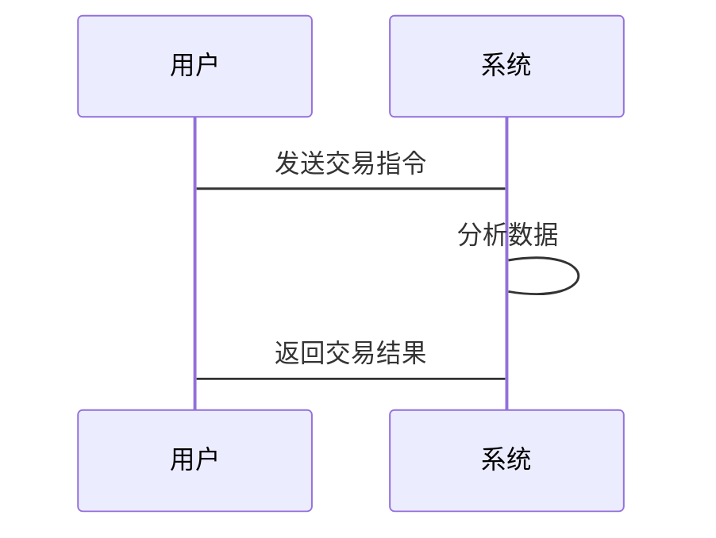

                 


# 智能加密货币交易策略

> **关键词**: 智能加密货币，交易策略，机器学习，区块链，智能合约，时间序列分析

> **摘要**: 本文深入探讨了智能加密货币交易策略的核心概念、技术基础、算法原理、系统架构及项目实战。通过结合机器学习和区块链技术，分析了加密货币市场的波动性与交易机会，提出了基于时间序列分析的交易信号生成方法，并设计了一个完整的智能交易系统架构。文章还通过具体案例展示了如何利用Python实现智能交易策略，并提供了实际操作中的注意事项与最佳实践。

---

# 第一部分: 智能加密货币交易策略概述

## 第1章: 加密货币与智能交易的背景

### 1.1 加密货币的起源与发展

#### 1.1.1 加密货币的定义与特点
- **定义**: 加密货币是一种基于密码学的虚拟货币，通过区块链技术实现去中心化的价值转移。
- **特点**: 去中心化、匿名性、不可篡改、全球流通。

#### 1.1.2 加密货币市场的现状与趋势
- 当前市场规模: 根据最新数据，加密货币市场总市值已超过3万亿美元。
- 市场波动性: 高波动性带来高风险与高收益并存。
- 发展趋势: DeFi、NFT等新兴应用推动加密货币的普及。

#### 1.1.3 加密货币交易的核心问题
- **价格预测**: 如何准确预测加密货币价格波动。
- **风险管理**: 如何控制交易风险。
- **交易机会识别**: 如何快速识别市场中的交易机会。

### 1.2 智能交易的基本概念

#### 1.2.1 智能交易的定义
- 智能交易是指利用算法、机器学习和自动化系统进行的交易活动。
- 核心特征: 自动化、智能化、高效性。

#### 1.2.2 智能交易的核心要素
- 数据源: 包括价格数据、市场情绪、链上数据等。
- 算法模型: 如时间序列分析、机器学习模型。
- 执行系统: 自动化交易执行平台。

#### 1.2.3 智能交易与传统交易的区别
- **效率**: 智能交易更快，传统交易依赖人工决策。
- **准确性**: 智能交易基于数据驱动，传统交易依赖经验。
- **成本**: 智能交易降低人工成本，传统交易成本较高。

### 1.3 智能加密货币交易的必要性

#### 1.3.1 加密货币市场的波动性
- 市场波动剧烈，传统交易难以捕捉机会。
- 短期内价格波动可能超过传统金融市场。

#### 1.3.2 智能交易的优势
- **快速决策**: 通过算法快速分析市场数据。
- **24/7运行**: 系统可以全天候监控市场。
- **数据驱动**: 利用大数据分析捕捉市场信号。

#### 1.3.3 市场需求与技术驱动
- 市场需求: 交易者希望提高效率与收益。
- 技术驱动: 人工智能与区块链技术的快速发展。

### 1.4 本章小结
本章介绍了加密货币的起源与发展，阐述了智能交易的基本概念与必要性，为后续内容奠定了基础。

---

# 第二部分: 智能加密货币交易的技术基础

## 第2章: 机器学习与加密货币分析

### 2.1 机器学习在加密货币分析中的应用

#### 2.1.1 机器学习的基本概念
- 机器学习是一种通过数据训练模型的技术，用于预测和分类。
- 监督学习、无监督学习、强化学习是主要的机器学习方法。

#### 2.1.2 机器学习在加密货币预测中的作用
- 通过历史数据训练模型，预测未来价格走势。
- 检测市场异常与风险。

#### 2.1.3 常见的加密货币分析模型
- 线性回归、支持向量机（SVM）、随机森林、神经网络。

### 2.2 时间序列分析与加密货币价格预测

#### 2.2.1 时间序列分析的基本原理
- 时间序列是指按时间顺序排列的数据。
- 常见的时间序列模型: ARIMA、GARCH、LSTM。

#### 2.2.2 常见的时间序列预测模型

| 模型名称 | 描述 | 优点 | 缺点 |
|----------|------|------|------|
| ARIMA    | 自回归积分滑动平均模型 | 简单易用 | 适用于线性趋势 |
| GARCH    | 广义自回归条件异方差模型 | 模型化波动率 | 参数复杂 |
| LSTM     | 长短期记忆网络 | 适用于非线性数据 | 计算复杂 |

#### 2.2.3 机器学习在时间序列预测中的应用
- LSTM网络用于捕捉长期依赖关系。
- 示例: 使用LSTM预测比特币价格。

### 2.3 加密货币数据的特征工程

#### 2.3.1 数据预处理的基本步骤
- 数据清洗: 处理缺失值、异常值。
- 数据标准化: 标准化数据分布。

#### 2.3.2 特征选择与特征提取
- 特征选择: 选择对预测有重要影响的特征。
- 特征提取: 通过技术指标提取特征，如MACD、RSI。

#### 2.3.3 常见的加密货币特征分析
- 技术指标: MACD、RSI、布林带。
- 市场情绪指标: 涨跌情况、交易量。

### 2.4 本章小结
本章介绍了机器学习在加密货币分析中的应用，详细讲解了时间序列分析与特征工程的方法。

---

## 第3章: 区块链与智能合约

### 3.1 区块链技术的基本原理

#### 3.1.1 区块链的定义与特点
- 区块链是一种分布式账本技术。
- 去中心化、不可篡改、可追溯。

#### 3.1.2 区块链的核心技术
- 分布式共识机制: PoW、PoS、Dpos。
- 智能合约: 自动执行的代码。

#### 3.1.3 区块链的分类与应用场景
- 公链、私链、联盟链。
- 应用场景: DeFi、NFT、供应链。

### 3.2 智能合约的概念与实现

#### 3.2.1 智能合约的定义
- 智能合约是区块链上的自动执行程序。
- 核心作用: 自动化交易、支付、结算。

#### 3.2.2 智能合约的运行机制
- 合约部署: 将合约部署到区块链。
- 合约调用: 发送交易触发合约执行。

#### 3.2.3 智能合约的编程语言与平台
- 编程语言: Solidity、Vyper。
- 平台: Ethereum、BSC、Solana。

### 3.3 区块链在加密货币交易中的应用

#### 3.3.1 区块链在加密货币交易中的作用
- 提供透明的交易记录。
- 实现自动化的交易流程。

#### 3.3.2 智能合约在交易自动化中的应用
- 自动执行交易指令。
- 实现点对点交易。

#### 3.3.3 区块链的安全性与挑战
- 安全性: 高度安全，但仍需防范代码漏洞。
- 挑战: 网络攻击、交易速度慢。

### 3.4 本章小结
本章详细讲解了区块链技术的基本原理与智能合约的应用，为后续的智能交易策略设计奠定了基础。

---

# 第三部分: 智能加密货币交易策略的开发

## 第4章: 数据驱动的加密货币交易策略

### 4.1 数据采集与处理

#### 4.1.1 数据源的选择与获取
- 数据源: 比特币、以太坊等主流加密货币的交易数据。
- 数据获取方式: API接口、数据库。

#### 4.1.2 数据清洗与预处理
- 处理缺失值、异常值。
- 数据标准化。

#### 4.1.3 数据存储与管理
- 数据库选择: MySQL、MongoDB。
- 数据存储结构设计。

### 4.2 基于机器学习的交易策略开发

#### 4.2.1 数据特征的提取与选择
- 技术指标: MACD、RSI。
- 市场情绪指标: 涨跌情况、交易量。

#### 4.2.2 算法选择与模型训练
- 算法选择: LSTM网络。
- 模型训练: 使用历史数据训练模型。

#### 4.2.3 模型评估与优化
- 评估指标: 准确率、召回率。
- 超参数优化: 调整学习率、批量大小。

### 4.3 交易信号的生成与策略执行

#### 4.3.1 交易信号的定义与生成
- 信号生成: 基于模型预测生成买入、卖出信号。
- 信号处理: 过滤虚假信号。

#### 4.3.2 策略执行的逻辑设计
- 执行条件: 信号触发。
- 执行方式: 自动化交易系统。

#### 4.3.3 策略优化与回测
- 回测方法: 回测历史数据。
- 策略优化: 调整交易频率、仓位大小。

---

## 第5章: 智能加密货币交易系统架构设计

### 5.1 系统功能设计

#### 5.1.1 领域模型设计


### 5.2 系统架构设计

```mermaid
client
    http
        server
            database
                blockchain
```

### 5.3 系统接口设计
- 数据接口: 提供API访问交易数据。
- 交易接口: 提供API执行交易指令。

### 5.4 系统交互设计



### 5.5 系统优化与扩展
- 系统优化: 提高处理效率。
- 系统扩展: 支持更多加密货币。

### 5.6 本章小结
本章设计了一个完整的智能加密货币交易系统架构，展示了系统的功能、架构与交互流程。

---

## 第6章: 项目实战——基于LSTM的BTC价格预测

### 6.1 环境安装与配置

#### 6.1.1 安装Python环境
- 安装Python 3.8及以上版本。
- 安装Jupyter Notebook。

#### 6.1.2 安装依赖库
```bash
pip install numpy pandas scikit-learn keras tensorflow
```

### 6.2 系统核心实现源代码

#### 6.2.1 数据预处理代码
```python
import pandas as pd
import numpy as np

# 读取数据
data = pd.read_csv('btc.csv')
# 数据清洗
data.dropna(inplace=True)
# 数据标准化
from sklearn.preprocessing import MinMaxScaler
scaler = MinMaxScaler()
data_scaled = scaler.fit_transform(data)
```

#### 6.2.2 LSTM模型实现
```python
from keras.models import Sequential
from keras.layers import LSTM, Dense

model = Sequential()
model.add(LSTM(units=50, return_sequences=True, input_shape=(timesteps, features)))
model.add(Dense(1))
model.compile(loss='mean_squared_error', optimizer='adam')
```

#### 6.2.3 模型训练与预测
```python
# 训练模型
model.fit(X_train, y_train, epochs=100, batch_size=32)
# 预测价格
y_pred = model.predict(X_test)
```

### 6.3 代码应用解读与分析
- 数据预处理: 对数据进行标准化处理。
- 模型训练: 使用LSTM网络训练模型。
- 模型预测: 预测未来价格走势。

### 6.4 实际案例分析
- 数据来源: 比特币历史价格数据。
- 案例分析: 使用LSTM模型预测比特币价格。

### 6.5 项目小结
本章通过具体案例展示了如何利用Python实现智能交易策略，详细讲解了代码实现与结果分析。

---

## 第7章: 最佳实践与注意事项

### 7.1 最佳实践 tips
- 数据质量: 确保数据准确可靠。
- 模型选择: 根据数据特点选择合适的模型。
- 风险控制: 设置止损与止盈机制。

### 7.2 交易策略开发中的注意事项
- 避免过度拟合: 防止模型过拟合训练数据。
- 系统监控: 实时监控交易系统运行状态。
- 合规性: 遵守相关法律法规。

### 7.3 未来趋势与展望
- AI技术进步: 提高交易策略的智能化水平。
- 市场变化: 密切关注市场动态与政策变化。

### 7.4 本章小结
本章总结了智能加密货币交易策略开发中的最佳实践与注意事项，为读者提供了宝贵的实战经验。

---

# 作者：AI天才研究院/AI Genius Institute & 禅与计算机程序设计艺术 /Zen And The Art of Computer Programming

---

**摘要**: 本文系统地介绍了智能加密货币交易策略的核心概念、技术基础、算法原理、系统架构及项目实战。通过结合机器学习和区块链技术，深入分析了加密货币市场的波动性与交易机会，提出了基于时间序列分析的交易信号生成方法，并设计了一个完整的智能交易系统架构。文章还通过具体案例展示了如何利用Python实现智能交易策略，并提供了实际操作中的注意事项与最佳实践。

