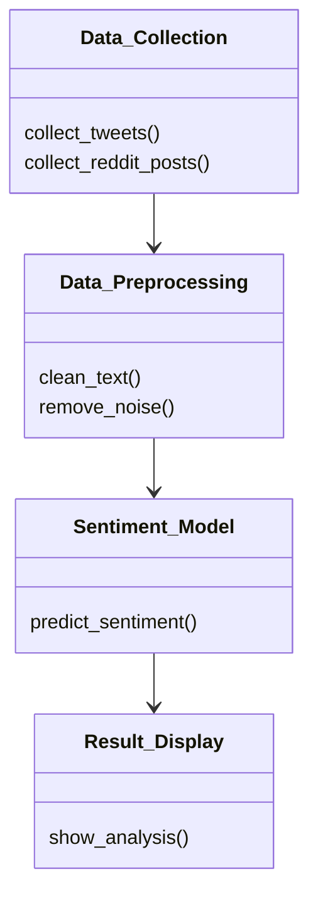
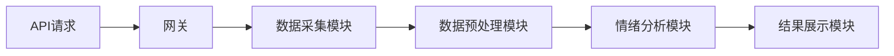

                 


# 智能加密货币市场情绪分析系统

> **关键词**：加密货币，情绪分析，自然语言处理，机器学习，深度学习  
> **摘要**：本文探讨了智能加密货币市场情绪分析系统的构建，结合NLP和机器学习技术，分析社交媒体数据，帮助投资者做出理性决策。文章详细讲解了系统的核心概念、算法原理、架构设计和项目实现，提供了从理论到实践的全面指导。

---

## 第一部分：背景介绍

### 第1章：加密货币市场与情绪分析概述

#### 1.1 加密货币市场的现状

加密货币市场近年来迅速崛起，比特币、以太坊等数字货币的交易量激增，市场波动性极大。投资者面临信息过载和情绪波动的双重挑战，传统分析方法难以捕捉市场情绪的细微变化。

#### 1.2 情绪分析的重要性

情绪分析通过识别文本中的情感倾向，帮助投资者理解市场情绪，预测价格走势。例如，社交媒体上的大量讨论可能反映出市场的乐观或悲观情绪，从而影响价格波动。

#### 1.3 智能情绪分析系统的提出

本系统旨在实时监控社交媒体，分析市场情绪，为投资者提供决策支持。目标是通过技术手段捕捉市场情绪，帮助投资者在复杂的市场环境中做出理性决策。

---

## 第二部分：核心概念与联系

### 第2章：情绪分析的核心原理

#### 2.1 自然语言处理与机器学习基础

自然语言处理（NLP）技术用于文本的理解和生成，而机器学习则通过数据训练模型，识别情绪特征。深度学习模型（如LSTM）在捕捉上下文信息方面表现优异。

#### 2.2 加密货币市场情绪分析的实体关系图


#### 2.3 情绪分析方法对比

| 方法类型   | 优缺点分析 |
|------------|------------|
| 基于规则   | 简单易实现，但灵活性差 |
| 统计学习    | 考虑全局特征，但依赖特征工程 |
| 深度学习    | 高准确性，需大量数据训练 |

---

## 第三部分：算法原理讲解

### 第3章：常用情绪分析算法

#### 3.1 基于规则的情绪分析

规则法依赖预定义的关键词和情感词典，例如将“上涨”标记为正面情绪。代码示例如下：

```python
def rule_based_sentiment(text):
    positive_words = {"上涨", "利好"}
    negative_words = {"下跌", "利空"}
    words = text.split()
    positive_count = sum(1 for word in words if word in positive_words)
    negative_count = sum(1 for word in words if word in negative_words)
    if positive_count > negative_count:
        return "正面"
    elif negative_count > positive_count:
        return "负面"
    else:
        return "中性"
```

#### 3.2 统计学习方法

基于朴素贝叶斯的分类器通过计算条件概率，将文本分类为正面或负面。例如，使用TF-IDF提取特征，训练分类器：

```python
from sklearn.feature_extraction.text import TfidfVectorizer
from sklearn.naive_bayes import MultinomialNB

vectorizer = TfidfVectorizer()
model = MultinomialNB()
model.fit(vectorizer.fit_transform(X_train), y_train)
```

#### 3.3 深度学习模型

使用LSTM捕捉文本的上下文信息：

```python
from keras.models import Sequential
from keras.layers import LSTM, Dense

model = Sequential()
model.add(LSTM(64, input_shape=(max_length, 1)))
model.add(Dense(1, activation='sigmoid'))
model.compile(loss='binary_crossentropy', optimizer='adam', metrics=['accuracy'])
```

---

## 第四部分：系统分析与架构设计方案

### 第4章：系统架构设计

#### 4.1 问题场景介绍

系统需实时监控社交媒体，提取相关数据，分析情绪并生成报告。数据源包括Twitter、Reddit等平台。

#### 4.2 系统功能设计



#### 4.3 系统架构设计



---

## 第五部分：项目实战

### 第5章：项目实现与案例分析

#### 5.1 环境安装

安装必要的库：

```bash
pip install numpy pandas scikit-learn tensorflow mermaid
```

#### 5.2 核心代码实现

数据预处理代码：

```python
import pandas as pd
import numpy as np

def preprocess(text):
    # 去除停用词和标点符号
    stop_words = set(stopwords.words('english'))
    words = word_tokenize(text.lower())
    filtered_words = [word for word in words if word not in stop_words]
    return ' '.join(filtered_words)
```

模型训练代码：

```python
from sklearn.model_selection import train_test_split
from sklearn.metrics import accuracy_score

X_train, X_test, y_train, y_test = train_test_split(X, y, test_size=0.2)
model.fit(X_train, y_train)
print("Accuracy:", accuracy_score(model.predict(X_test), y_test))
```

---

## 第六部分：最佳实践与总结

### 第6章：总结与展望

通过构建智能加密货币市场情绪分析系统，投资者能够利用技术手段捕捉市场情绪，辅助决策。未来，系统可进一步优化算法，集成更多数据源，提升分析精度。

---

**作者：AI天才研究院/AI Genius Institute & 禅与计算机程序设计艺术 /Zen And The Art of Computer Programming**

