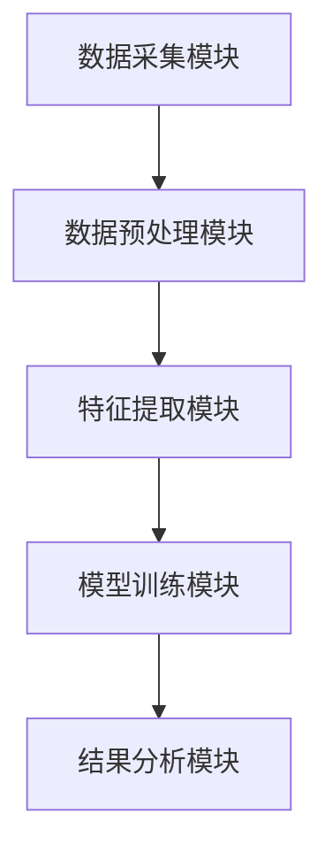
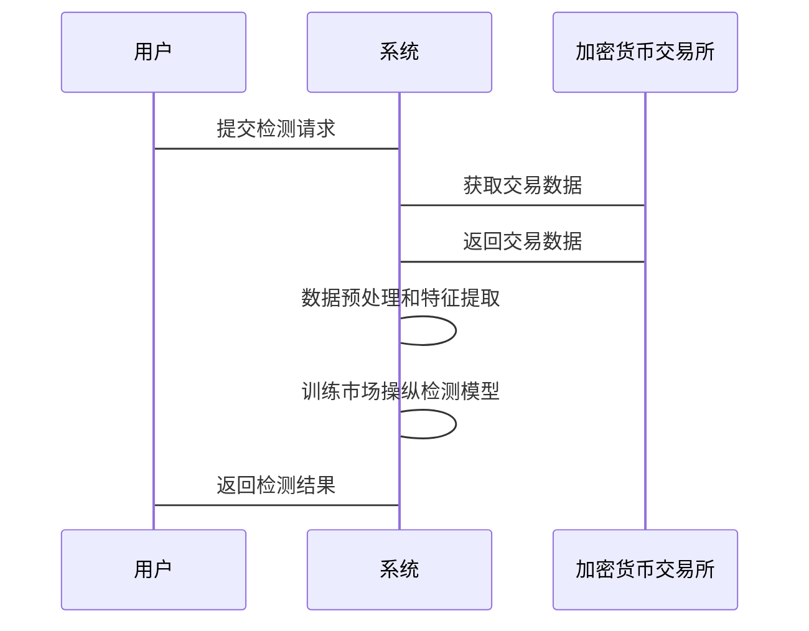

                 


# 智能加密货币市场操纵检测

## 关键词
加密货币，市场操纵，智能检测，机器学习，区块链技术

## 摘要
加密货币市场的快速发展带来了巨大的投资机会，但也伴随着市场操纵等非法行为的增加。本文将探讨如何利用智能技术检测加密货币市场的操纵行为。首先，我们将介绍加密货币市场的基本概念和市场操纵的定义。接着，我们将分析市场操纵检测的核心概念与技术，包括数据特征分析、模式识别和异常检测。然后，我们将详细讲解几种常用的算法原理，如时间序列分析、机器学习算法和图论算法，并通过实际案例展示这些算法的应用。最后，我们将探讨系统设计与架构方案，结合项目实战，提供环境安装、数据预处理、特征提取、模型训练和结果分析的详细步骤。通过本文的分析，读者将能够深入了解智能加密货币市场操纵检测的技术细节和实际应用。

---

# 第一部分: 加密货币市场与操纵检测背景

## 第1章: 加密货币市场的基本概念

### 1.1 加密货币的定义与特点

#### 1.1.1 加密货币的定义
加密货币是一种基于密码学的虚拟货币，通过区块链技术实现去中心化的价值交换。它不同于传统货币，不依赖于中央银行或政府机构，而是通过分布式账本和共识机制来确保交易的安全性和可追溯性。

#### 1.1.2 加密货币的核心特点
- **去中心化**：交易通过区块链技术记录，不依赖于任何中央机构。
- **匿名性**：交易参与者身份通常匿名，但交易记录公开。
- **不可篡改性**：区块链上的交易记录难以被篡改，确保数据的可靠性。
- **全球性**：加密货币可以在全球范围内自由交易和流通。

#### 1.1.3 加密货币与传统货币的区别
- **发行机制**：传统货币由中央银行发行，加密货币通过挖矿或智能合约发行。
- **交易方式**：传统货币通过银行或支付系统进行交易，加密货币通过区块链网络直接交易。
- **监管**：传统货币受到严格监管，加密货币的监管尚不完善，存在一定的法律不确定性。

### 1.2 加密货币市场的运作机制

#### 1.2.1 加密货币交易的基本流程
1. 用户通过加密货币交易所进行买卖操作。
2. 交易信息通过区块链网络进行广播和确认。
3. 交易确认后，交易信息被记录在区块链上，形成可追溯的交易历史。

#### 1.2.2 市场参与者与角色
- **交易者**：包括个人投资者和机构投资者，他们通过买卖加密货币进行投资。
- **交易所**：提供加密货币交易的平台，如Binance、 Coinbase等。
- **矿工**：通过挖矿确保区块链的安全性和交易的确认。
- **开发者**：开发和维护加密货币的技术基础设施。

#### 1.2.3 市场波动性与交易策略
加密货币市场波动性极大，价格受市场情绪、技术进步和政策变化等多种因素影响。交易者通常采用多种策略，如短线交易、长线投资和套利交易。

### 1.3 市场操纵的定义与类型

#### 1.3.1 市场操纵的定义
市场操纵是指通过虚假交易、散布谣言、操纵价格等方式，人为影响市场供需关系，从而谋取不正当利益的行为。在加密货币市场中，市场操纵通常表现为价格的异常波动和交易量的突然变化。

#### 1.3.2 常见的市场操纵类型
- **拉盘与砸盘**：通过大量买入或卖出某种加密货币，人为抬高或压低价格。
- **洗盘**：通过频繁的买卖操作，制造交易量的假象，误导市场参与者。
- **虚假信息发布**：通过散布虚假信息，影响市场参与者的情绪和决策。

#### 1.3.3 市场操纵的法律与道德问题
市场操纵行为违反了市场公平原则，破坏了市场的正常运行秩序。在法律层面，许多国家和地区都对市场操纵行为制定了严格的法律法规，对操纵者进行罚款和刑事处罚。在道德层面，市场操纵行为损害了其他投资者的利益，破坏了市场的信任基础。

## 第2章: 智能加密货币市场操纵检测的背景与意义

### 2.1 加密货币市场的风险与挑战

#### 2.1.1 市场操纵对投资者的影响
市场操纵会导致加密货币价格的异常波动，投资者在市场操纵的影响下可能蒙受重大损失。例如，操纵者通过拉盘和砸盘，使得投资者在高位买入后低价卖出，造成巨大亏损。

#### 2.1.2 市场操纵对市场公平性的影响
市场操纵破坏了市场的公平竞争，使得真正的市场供需关系无法真实反映在价格上。这不仅影响了市场的资源配置效率，还可能导致市场的不稳定性和不信任感。

#### 2.1.3 市场操纵的技术挑战
加密货币市场的数据量庞大，交易行为复杂，传统的市场操纵检测方法难以应对加密货币市场的高波动性和去中心化特点。因此，需要借助智能技术，如机器学习和大数据分析，来提高市场操纵检测的准确性和效率。

### 2.2 智能检测技术的发展现状

#### 2.2.1 传统市场操纵检测方法的局限性
传统的市场操纵检测方法通常基于简单的统计分析和规则匹配。然而，这些方法在面对复杂和隐蔽的市场操纵行为时，往往难以有效检测。例如，传统的检测方法难以应对高频交易和跨市场的操纵行为。

#### 2.2.2 智能检测技术的优势
智能检测技术，如机器学习和深度学习，具有强大的数据分析能力和模式识别能力。通过分析加密货币市场的交易数据，智能检测技术可以发现异常交易模式，从而有效识别市场操纵行为。

#### 2.2.3 当前技术在加密货币市场的应用
目前，智能检测技术已经在加密货币市场中得到了广泛应用。例如，一些加密货币交易所利用机器学习算法检测异常交易行为，及时发现和防止市场操纵。

### 2.3 智能加密货币市场操纵检测的意义

#### 2.3.1 维护市场公平性
通过智能检测技术，可以有效识别和阻止市场操纵行为，维护加密货币市场的公平性和公正性。

#### 2.3.2 保护投资者利益
市场操纵行为往往对小投资者造成重大损失，智能检测技术可以帮助投资者识别市场操纵风险，保护投资者的合法权益。

#### 2.3.3 促进加密货币市场的健康发展
智能检测技术的应用可以提高加密货币市场的透明度和可信度，促进市场的健康发展，吸引更多合法投资者和机构进入市场。

---

# 第二部分: 市场操纵检测的核心概念与联系

## 第3章: 市场操纵检测的核心概念

### 3.1 数据特征分析

#### 3.1.1 交易量分析
交易量是市场操纵的重要指标之一。通过分析交易量的变化，可以发现异常交易行为。例如，突然的交易量激增可能是拉盘或洗盘的迹象。

#### 3.1.2 价格波动分析
价格波动是市场操纵的表现之一。通过分析价格的异常波动，可以识别市场操纵行为。例如，短时间内价格的急剧上涨和下跌可能是市场操纵的信号。

#### 3.1.3 时间序列分析
时间序列分析是一种常用的数据分析方法，通过分析数据的时间序列特征，发现数据中的异常模式。例如，使用ARIMA模型预测价格走势，发现预测值与实际值的显著差异可能是市场操纵的迹象。

### 3.2 模式识别与异常检测

#### 3.2.1 基于机器学习的模式识别
机器学习是一种强大的模式识别工具。通过训练机器学习模型，可以识别出正常交易模式和异常交易模式。例如，使用随机森林算法识别交易量和价格之间的异常关系。

#### 3.2.2 基于统计学的异常检测
统计学方法可以通过分析数据的分布特征，发现异常值。例如，使用Z-score方法检测交易量的异常值。

#### 3.2.3 基于图论的网络分析
图论分析可以将市场参与者之间的关系可视化，发现潜在的操纵网络。例如，通过分析交易者的交易行为，发现某些交易者之间的协同操纵行为。

### 3.3 检测方法对比

#### 3.3.1 检测方法的优缺点对比
| 检测方法 | 优点 | 缺点 |
|---------|------|------|
| 时间序列分析 | 可以发现价格的异常波动 | 对异常模式的识别能力有限 |
| 机器学习 | 具有强大的模式识别能力 | 需要大量数据训练，计算成本高 |
| 图论分析 | 可以发现操纵网络 | 数据可视化复杂，难以解释 |

#### 3.3.2 数据特征与检测方法的对应关系
通过分析不同的数据特征，选择合适的检测方法。例如，交易量异常适合使用统计学方法检测，价格波动适合使用时间序列分析，交易网络适合使用图论分析。

---

## 第4章: 加密货币市场操纵检测的算法原理

### 4.1 时间序列分析算法

#### 4.1.1 ARIMA模型
ARIMA（自回归积分滑动平均）模型是一种常用的时间序列预测模型。通过分析历史价格数据，ARIMA模型可以预测未来的价格走势。如果实际价格与预测价格存在显著差异，可能是市场操纵的迹象。

#### 4.1.2 LSTM网络
LSTM（长短期记忆网络）是一种深度学习模型，适合处理时间序列数据。通过训练LSTM网络，可以预测加密货币价格的未来走势，发现价格的异常波动。

### 4.2 机器学习算法

#### 4.2.1 随机森林
随机森林是一种基于树的集成学习算法，适合用于分类和回归问题。通过将交易数据输入随机森林模型，可以识别出异常的交易行为。

#### 4.2.2 神经网络
神经网络是一种强大的非线性模型，适合处理复杂的交易数据。通过训练神经网络，可以识别出交易数据中的异常模式。

### 4.3 图论算法

#### 4.3.1 社区检测算法
社区检测算法用于发现交易网络中的社区结构。通过分析交易者的交易行为，可以发现某些交易者之间的协同操纵行为。

#### 4.3.2 最大生成树算法
最大生成树算法用于发现交易网络中的重要节点。通过分析交易网络的结构，可以识别出某些关键的市场操纵者。

---

## 第5章: 加密货币市场操纵检测的系统设计

### 5.1 系统功能设计

#### 5.1.1 数据采集模块
数据采集模块负责从加密货币交易所获取实时交易数据，包括交易价格、交易量和交易时间等。

#### 5.1.2 数据预处理模块
数据预处理模块负责对采集到的交易数据进行清洗和转换，确保数据的完整性和一致性。

#### 5.1.3 特征提取模块
特征提取模块负责从交易数据中提取出有用的特征，如交易量、价格波动和时间序列特征等。

#### 5.1.4 模型训练模块
模型训练模块负责使用机器学习算法训练市场操纵检测模型，通过历史数据训练模型的参数。

#### 5.1.5 结果分析模块
结果分析模块负责对模型的输出结果进行分析，识别出异常交易行为，并生成检测报告。

### 5.2 系统架构设计

#### 5.2.1 系统架构图


#### 5.2.2 接口设计
系统需要提供以下接口：
- 数据接口：用于与加密货币交易所进行数据交互。
- 模型接口：用于与其他系统共享检测模型的预测结果。

### 5.3 系统交互流程图



---

## 第6章: 加密货币市场操纵检测的项目实战

### 6.1 环境安装

#### 6.1.1 安装Python环境
```bash
# 安装Python
# 安装必要的库
pip install numpy pandas scikit-learn tensorflow
```

#### 6.1.2 安装加密货币交易所API
```bash
# 安装Binance API
pip install python-binance
```

### 6.2 数据预处理

#### 6.2.1 数据获取
```python
from binance import Client
import pandas as pd

client = Client(api_key='your_api_key', api_secret='your_api_secret')
klines = client.get_historical_klines('BTCUSDT', '1h', '1 Jan 2023', '1 Jan 2024')
df = pd.DataFrame(columns=['timestamp', 'open', 'high', 'low', 'close', 'volume'])
for i in range(len(klines)):
    df.loc[i] = [klines[i][0], klines[i][1], klines[i][2], klines[i][3], klines[i][4], klines[i][5]]
```

#### 6.2.2 数据清洗
```python
# 去除缺失值
df.dropna(inplace=True)

# 转换时间戳为日期时间
df['timestamp'] = pd.to_datetime(df['timestamp'])
```

### 6.3 特征提取

#### 6.3.1 提取交易量特征
```python
# 计算每小时的交易量
df['volume'] = df['volume'].astype(float)
```

#### 6.3.2 提取价格波动特征
```python
# 计算每小时的价格波动率
df['price_change'] = df['close'].pct_change()
```

### 6.4 模型训练

#### 6.4.1 训练随机森林模型
```python
from sklearn.ensemble import RandomForestClassifier
from sklearn.model_selection import train_test_split

# 划分训练集和测试集
X_train, X_test, y_train, y_test = train_test_split(df[['volume', 'price_change']], df['is_manipulation'], test_size=0.2)

# 训练随机森林模型
model = RandomForestClassifier()
model.fit(X_train, y_train)

# 验证模型性能
print("Accuracy:", model.score(X_test, y_test))
```

### 6.5 结果分析

#### 6.5.1 可视化分析
```python
import matplotlib.pyplot as plt

# 绘制价格波动图
plt.plot(df['timestamp'], df['close'])
plt.xlabel('Time')
plt.ylabel('Price')
plt.title('Bitcoin Price Trend')
plt.show()
```

#### 6.5.2 检测结果解读
```python
# 预测市场操纵行为
predictions = model.predict(X_test)
print("Predictions:", predictions)
print("Actual values:", y_test.values)
```

---

## 第7章: 加密货币市场操纵检测的最佳实践

### 7.1 小结
通过本文的分析，我们可以看到，智能加密货币市场操纵检测是一项复杂但重要的任务。通过对交易数据的分析和机器学习算法的应用，我们可以有效识别和阻止市场操纵行为，维护市场的公平性和投资者的合法权益。

### 7.2 注意事项
- 数据质量：确保数据的完整性和准确性。
- 模型选择：根据实际需求选择合适的检测算法。
- 模型更新：定期更新模型，适应市场变化。

### 7.3 拓展阅读
- 《加密货币与区块链技术》
- 《机器学习在金融领域的应用》
- 《时间序列分析与预测》

---

## 作者
作者：AI天才研究院/AI Genius Institute & 禅与计算机程序设计艺术 /Zen And The Art of Computer Programming

