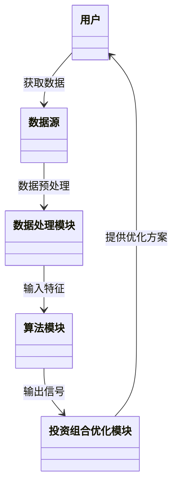
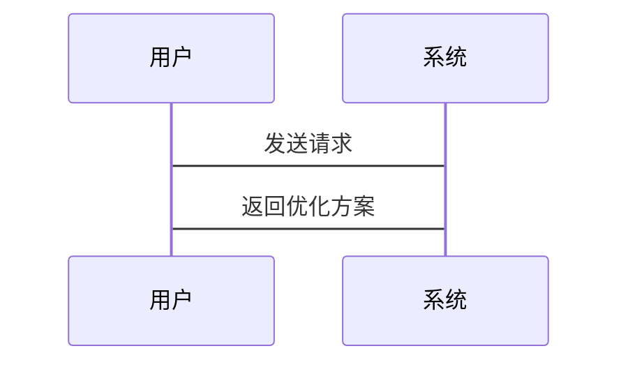

                 


# 智能加密货币投资组合管理

> 关键词：加密货币，投资组合管理，人工智能，风险管理，量化交易

> 摘要：智能加密货币投资组合管理结合了人工智能和传统金融策略，通过分析市场数据和风险因素，优化投资组合以实现最大收益。本文从背景介绍到系统设计，详细探讨智能加密货币投资组合管理的核心概念、算法原理和实战应用。

---

# 第1章：加密货币与投资组合管理概述

## 1.1 加密货币的基本概念
### 1.1.1 加密货币的定义与特点
加密货币是一种基于密码学的数字货币，具有去中心化、匿名性和不可篡改的特点。它通过区块链技术实现价值转移和存储，与传统货币不同，加密货币不受任何中央机构的控制。

### 1.1.2 加密货币的分类与市场现状
加密货币市场主要分为比特币（Bitcoin）、以太坊（Ethereum）等主流币种和各种代币（Token）。市场具有高波动性，投资者需要面对价格波动带来的风险。

### 1.1.3 加密货币投资的基本原理
加密货币投资需要考虑技术分析、基本面分析和市场情绪等多方面因素。投资者通过分析价格走势和市场数据做出投资决策。

## 1.2 投资组合管理的核心概念
### 1.2.1 投资组合管理的定义
投资组合管理是通过优化资产配置，分散风险，实现投资收益最大化的过程。它通过将资金分配到不同的资产类别中，降低整体投资的风险。

### 1.2.2 投资组合管理的目标与原则
投资组合管理的目标是实现收益与风险的最佳平衡。其原则包括分散投资、风险控制和长期优化。

### 1.2.3 投资组合管理的常见策略
常见的投资组合管理策略包括均值-方差优化、风险平价策略和因子投资策略等。每种策略都有其适用的场景和优势。

## 1.3 智能加密货币投资组合管理的背景与意义
### 1.3.1 加密货币市场的波动性与挑战
加密货币市场的高波动性和不确定性对投资者提出了更高的要求。传统的投资策略在面对加密货币市场时显得力不从心。

### 1.3.2 智能投资组合管理的优势
人工智能技术的应用使投资组合管理更加智能化。通过算法交易和实时数据分析，投资者能够更精准地捕捉市场机会，降低投资风险。

### 1.3.3 智能加密货币投资组合管理的应用前景
随着技术的进步，智能加密货币投资组合管理将越来越广泛地应用于个人和机构投资者。它能够帮助投资者更好地应对市场的不确定性，实现长期稳健的投资收益。

---

# 第2章：智能加密货币投资组合管理的核心概念与联系

## 2.1 数据源与特征分析
### 2.1.1 加密货币市场的数据来源
加密货币市场的数据来源包括交易所的实时交易数据、社交媒体数据和市场情绪数据等。这些数据为投资决策提供了丰富的信息。

### 2.1.2 数据特征与分析方法
通过对数据特征的分析，投资者可以发现市场趋势和潜在风险。常用的方法包括时间序列分析和机器学习模型的应用。

## 2.2 智能投资组合管理的算法原理
### 2.2.1 时间序列分析
时间序列分析是一种常用的预测方法。通过分析历史价格数据，可以预测未来的价格走势。常用的模型包括ARIMA和LSTM等。

### 2.2.2 机器学习模型的应用
机器学习模型如随机森林和XGBoost可以用于分类和回归问题。通过训练模型，投资者可以预测市场的波动性和风险。

## 2.3 核心概念的联系
### 2.3.1 数据源与算法的联系
数据源为算法提供输入，算法通过对数据的分析生成投资信号。两者相互依存，共同构成智能投资组合管理的核心。

### 2.3.2 风险管理与投资策略的联系
风险管理是投资组合管理的重要组成部分。通过合理的风险管理策略，投资者可以在市场波动中保持稳健的投资收益。

---

# 第3章：智能加密货币投资组合管理的算法原理

## 3.1 时间序列分析
### 3.1.1 ARIMA模型的原理
ARIMA模型是一种常用的时间序列预测模型。它通过自回归和移动平均的方式，捕捉数据的长期趋势和短期波动。

### 3.1.2 LSTM网络的应用
LSTM（长短期记忆网络）是一种深度学习模型，特别适用于处理时间序列数据。它能够捕捉数据的长期依赖关系，预测能力更强。

## 3.2 机器学习模型的应用
### 3.2.1 随机森林模型
随机森林是一种基于决策树的集成学习方法。它通过构建多个决策树并取其平均，提高模型的准确性和稳定性。

### 3.2.2 XGBoost模型
XGBoost是一种高效的梯度提升算法，适用于分类和回归问题。它通过正则化和剪枝技术，避免过拟合，提高模型的泛化能力。

---

# 第4章：智能加密货币投资组合管理的系统分析与架构设计

## 4.1 问题场景介绍
### 4.1.1 系统目标
系统的目的是通过智能算法优化加密货币投资组合，实现收益最大化和风险最小化。

### 4.1.2 项目介绍
本项目旨在开发一个智能加密货币投资组合管理系统，利用机器学习和大数据分析技术，为投资者提供科学的投资决策支持。

## 4.2 系统功能设计
### 4.2.1 领域模型设计
使用Mermaid类图展示系统中的各个实体及其关系。



### 4.2.2 系统架构设计
使用Mermaid架构图展示系统的分层结构。


## 4.3 系统接口设计与交互流程
### 4.3.1 接口设计
系统需要提供API接口，供用户调用投资组合优化服务。

### 4.3.2 交互流程
使用Mermaid序列图展示用户与系统的交互流程。



---

# 第5章：智能加密货币投资组合管理的项目实战

## 5.1 环境安装与配置
### 5.1.1 安装Python环境
使用Anaconda或virtualenv安装Python环境，并配置Jupyter Notebook。

### 5.1.2 安装依赖库
安装numpy、pandas、scikit-learn和xgboost等常用库。

## 5.2 核心功能实现
### 5.2.1 数据采集与预处理
从加密货币交易所获取历史数据，并进行清洗和标准化处理。

### 5.2.2 模型训练与优化
训练机器学习模型，并进行参数调优，提高预测精度。

## 5.3 代码实现与解读
### 5.3.1 数据采集代码
```python
import pandas as pd
import requests

def get_data(crypto='BTC', timeframe='1D'):
    url = f'https://api.example.com/{crypto}/{timeframe}'
    response = requests.get(url)
    data = response.json()
    df = pd.DataFrame(data)
    return df
```

### 5.3.2 模型训练代码
```python
from sklearn.ensemble import RandomForestClassifier
import numpy as np

def train_model(X_train, y_train):
    model = RandomForestClassifier(n_estimators=100, random_state=42)
    model.fit(X_train, y_train)
    return model
```

## 5.4 案例分析与结果解读
### 5.4.1 案例分析
通过具体案例展示模型的预测能力和投资组合优化效果。

### 5.4.2 结果解读
解释模型输出的结果，分析其对投资决策的支持作用。

---

# 第6章：智能加密货币投资组合管理的最佳实践

## 6.1 小结
智能加密货币投资组合管理通过结合人工智能和传统金融策略，优化了投资决策过程，提高了投资收益。

## 6.2 注意事项
投资者在使用智能投资组合管理系统时，应关注模型的准确性和市场的变化，避免过度依赖技术而忽视基本面分析。

## 6.3 拓展阅读
推荐阅读《机器学习实战》和《区块链技术与应用》，深入理解人工智能和区块链技术的应用。

---

# 作者信息

作者：AI天才研究院/AI Genius Institute & 禅与计算机程序设计艺术 /Zen And The Art of Computer Programming

---

以上为《智能加密货币投资组合管理》的技术博客文章的完整目录结构和内容概要。希望对您有所帮助！

