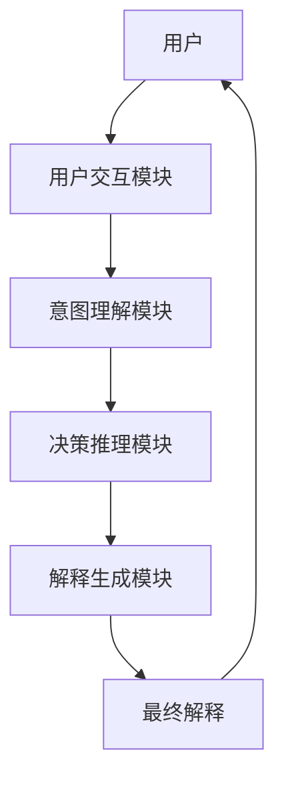

                 


# 智能助手的可解释性设计

> **关键词**：智能助手，可解释性，AI，机器学习，算法解释性，系统架构  
> **摘要**：本文探讨了智能助手的可解释性设计，从核心概念、算法原理到系统架构，详细分析了如何实现智能助手的透明性和可理解性。通过具体案例和项目实战，展示了可解释性设计在智能助手中的应用及其重要性。

---

## 第1章：智能助手与可解释性概述

### 1.1 智能助手的定义与应用场景

智能助手是一种基于人工智能技术的工具，旨在通过自然语言处理、机器学习和推理算法，帮助用户完成各种任务。其核心功能包括信息检索、任务执行、决策支持和用户交互。智能助手的应用场景广泛，例如：

- **个人助手**：帮助用户管理日程、安排会议、处理邮件等。
- **客服助手**：提供客户支持、解答问题、处理订单等。
- **企业助手**：辅助企业内部流程管理、数据分析等。

### 1.2 可解释性AI的背景与重要性

随着智能助手的广泛应用，用户对AI系统的信任度和透明度提出了更高的要求。可解释性AI（Explainable AI，XAI）成为研究和应用的重要方向。可解释性AI的定义如下：

> **可解释性AI**：通过生成易于理解和验证的解释，使用户能够理解AI系统决策过程的特性。

可解释性的重要性体现在以下几个方面：

- **用户信任**：用户只有在理解AI决策过程的情况下，才会信任并依赖智能助手。
- **问题排查**：可解释性有助于开发者快速定位和解决系统中的问题。
- **合规性要求**：在金融、医疗等领域，可解释性是合规性的重要组成部分。

### 1.3 本章小结

本章介绍了智能助手的定义和应用场景，并强调了可解释性AI的重要性。理解这些内容是后续可解释性设计的基础。

---

## 第2章：可解释性AI的核心概念

### 2.1 可解释性AI的定义与分类

可解释性AI的分类如下：

| 类型 | 定义 | 适用场景 |
|------|------|----------|
| **模型可解释性** | 解释模型的输出逻辑 | 适用于线性回归、决策树等简单模型 |
| **过程可解释性** | 解释整个决策过程 | 适用于复杂的端到端系统 |
| **用户可解释性** | 解释用户可见的输出 | 适用于用户直接交互的智能助手 |

### 2.2 智能助手可解释性设计的关键要素

智能助手的可解释性设计需要考虑以下三个关键要素：

1. **透明性**：确保用户能够了解AI系统的决策过程。
2. **可理解性**：解释内容应以用户能够理解的语言呈现。
3. **可追溯性**：记录和追溯AI系统的决策过程。

### 2.3 可解释性设计的数学模型与公式

可解释性AI的数学模型通常用于评估解释的质量。例如，解释性评分公式可以表示为：

$$解释性评分 = \frac{解释度}{复杂度}$$

其中，解释度表示解释的清晰程度，复杂度表示解释的复杂性。

---

## 第3章：基于模型的解释性方法

### 3.1 LIME解释性方法

LIME（Local Interpretable Model-agnostic Explanations）是一种通过局部拟合模型来解释AI决策的算法。其基本步骤如下：

1. **选择一个解释模型**：通常选择线性回归或决策树。
2. **生成训练数据**：对原始数据进行扰动，生成新的数据点。
3. **训练解释模型**：在扰动数据上训练解释模型。
4. **解释结果**：生成解释结果并可视化。

LIME的优点是适用于多种模型，且解释性结果易于理解。以下是LIME的Python代码示例：

```python
from lime.lime_text import LimeTextExplainer
explainer = LimeTextExplainer()
explanation = explainer.explain_instance(text, model.predict, num_features=5)
print(explanation)
```

---

## 第4章：智能助手系统的架构设计

### 4.1 智能助手系统的组成模块

智能助手系统的组成模块包括：

- **用户交互模块**：负责与用户的交互。
- **意图理解模块**：识别用户的意图。
- **决策推理模块**：基于意图生成决策。
- **解释生成模块**：生成可理解的解释。

### 4.2 可解释性设计的系统架构

智能助手系统的架构图如下：



### 4.3 系统接口设计

系统接口设计包括：

- **输入接口**：接收用户的输入。
- **输出接口**：输出解释内容。
- **内部接口**：模块之间的数据交互接口。

---

## 第5章：智能助手项目实战

### 5.1 环境搭建与工具安装

- **开发环境**：建议使用Python 3.8及以上版本。
- **工具安装**：需要安装`scikit-learn`、`xgboost`、`lime`等库。

### 5.2 核心代码实现

以下是一个简单的解释性代码示例：

```python
import xgboost as xgb
from lime.lime_text import LimeTextExplainer

# 数据准备
X_train, y_train = load_data()

# 模型训练
model = xgb.XGBClassifier().fit(X_train, y_train)

# 解释性分析
explainer = LimeTextExplainer()
explanation = explainer.explain_instance(X_test[0], model.predict, num_features=5)
print(explanation)
```

### 5.3 案例分析与详细解读

以智能助手处理用户查询“今天天气如何？”为例，解释生成过程如下：

1. **意图理解**：识别用户意图是查询天气。
2. **数据检索**：从天气数据库中获取相关信息。
3. **生成解释**：解释天气数据的来源和准确性。

---

## 第6章：最佳实践与总结

### 6.1 可解释性设计的最佳实践

- **设计阶段**：确保系统架构支持可解释性设计。
- **开发阶段**：选择合适的解释性算法。
- **测试阶段**：验证解释的准确性和可理解性。

### 6.2 项目总结与未来展望

本项目展示了如何在智能助手中实现可解释性设计。未来的研究方向包括优化解释性算法和提升系统的透明性。

### 6.3 注意事项与拓展阅读

- **注意事项**：确保解释内容的准确性和及时性。
- **拓展阅读**：推荐阅读相关论文和书籍，深入理解可解释性AI的最新进展。

---

**作者**：AI天才研究院 & 禅与计算机程序设计艺术

