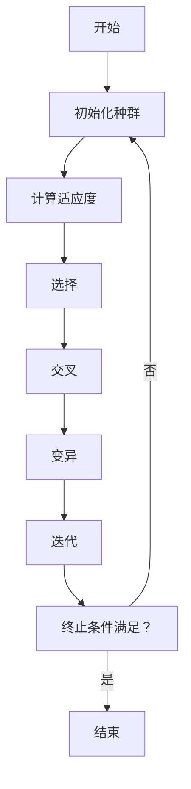
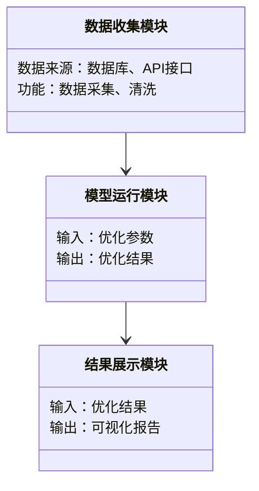
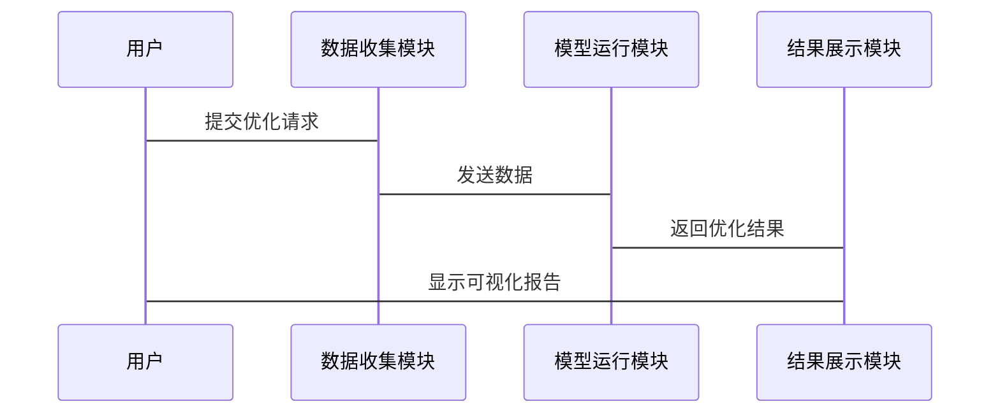

                 


---

# 智能化企业Working Capital优化模型设计

## 关键词：智能化企业，Working Capital，优化模型，数据驱动，人工智能，算法设计

## 摘要：本文提出了一种基于数据驱动的智能化企业Working Capital优化模型，通过分析企业营运资本的构成和优化需求，设计了一个结合机器学习和数学建模的优化框架。文章详细阐述了模型的核心概念、算法原理、数学模型、系统架构以及实际案例，为企业实现高效资本管理提供了理论和实践指导。

---

## 第二部分：智能化企业Working Capital优化模型的核心概念与联系

### 第2章：核心概念原理

#### 2.1 模型的基本原理

智能化企业Working Capital优化模型的核心在于利用数据驱动的方法，结合人工智能算法和数学建模，优化企业的流动资金管理。模型通过分析企业的历史数据和实时数据，识别关键影响因素，并通过算法预测未来趋势，从而制定最优的资本分配策略。

#### 2.2 核心要素对比分析

为了更好地理解模型的构成，我们对核心要素进行了对比分析，如表2-1所示：

**表2-1：核心要素对比分析**

| **要素**       | **定义**                                                                 | **优点**                                                                 | **挑战**                                                                 |
|-----------------|--------------------------------------------------------------------------|--------------------------------------------------------------------------|--------------------------------------------------------------------------|
| 现金流预测       | 预测企业未来一段时间内的现金流情况                                       | 提高资金使用效率，避免资金闲置或短缺                                         | 数据准确性依赖历史数据的完整性和准确性                                       |
| 库存管理         | 优化库存水平，减少库存积压和资金占用                                     | 提高库存周转率，降低库存成本                                                 | 需要考虑多产品的复杂性和需求波动                                           |
| 应收账款管理     | 优化应收账款回收周期，缩短账期                                             | 提高资金回笼速度，改善现金流状况                                             | 客户信用评估和回收风险控制                                                 |
| 应付账款管理     | 优化应付账款支付策略，延长支付周期                                       | 延长资金占用时间，降低短期负债                                             | 供应商信用评估和支付条款协商                                               |

#### 2.3 ER实体关系图

为了更直观地展示模型中各实体之间的关系，我们使用Mermaid绘制了如下的实体关系图：

```mermaid
erd
    title 实体关系图
    章节
    章节->订单: 多个章节对应多个订单
    订单->供应商: 每个订单对应一个供应商
    订单->客户: 每个订单对应一个客户
    供应商->支付方式: 供应商支持多种支付方式
    客户->支付方式: 客户支持多种支付方式
```

---

## 第三部分：算法原理讲解

### 第3章：优化算法设计

#### 3.1 算法选择与流程

我们选择遗传算法（Genetic Algorithm, GA）作为优化算法，因为它适用于多变量、非线性的优化问题。遗传算法的基本流程如图3-1所示：



#### 3.2 算法实现

以下是使用Python实现的遗传算法核心代码：

```python
import random

def fitness(individual):
    # 计算适应度，即资本优化后的收益
    return sum(individual)  # 示例：简单收益计算

def crossover(parent1, parent2):
    # 单点交叉
    point = random.randint(1, len(parent1)-1)
    return parent1[:point] + parent2[point:], parent2[:point] + parent1[point:]

def mutate(individual):
    # 突变操作
    for i in range(len(individual)):
        if random.random() < 0.1:  # 10%的概率发生突变
            individual[i] = 1 - individual[i]
    return individual

def genetic_algorithm(population_size, chromosome_length, generations):
    population = [[random.randint(0,1) for _ in range(chromosome_length)] for _ in range(population_size)]
    
    for _ in range(generations):
        # 计算适应度
        fitness_list = [fitness(individual) for individual in population]
        
        # 选择
        selected = [population[i] for i in sorted(range(population_size), key=lambda x: -fitness_list[x][:5])]
        
        # 交叉
        new_population = []
        for i in range(0, population_size, 2):
            p1 = selected[i]
            p2 = selected[i+1] if i+1 < population_size else selected[0]
            c1, c2 = crossover(p1, p2)
            new_population.append(mutate(c1))
            new_population.append(mutate(c2))
        
        population = new_population
    
    best = max(fitness(individual) for individual in population)
    return best

# 示例运行
print(genetic_algorithm(10, 20, 50))
```

#### 3.3 算法原理的数学模型

为了更好地理解遗传算法，我们可以建立一个数学模型，描述其基本操作：

$$
\text{适应度函数} = f(x) = \sum_{i=1}^{n} x_i \times w_i
$$

其中，$x_i$ 是决策变量，$w_i$ 是对应的权重。

交叉操作可以表示为：

$$
y_i = \begin{cases}
x1_i & \text{如果 } i < \text{交叉点} \\
x2_i & \text{否则}
\end{cases}
$$

突变操作的概率为：

$$
P(\text{突变}) = 0.1
$$

---

## 第四部分：数学模型和公式

### 第4章：数学模型设计

#### 4.1 优化问题描述

我们的优化目标是最大化企业资本的使用效率，即：

$$
\max \sum_{i=1}^{n} c_i \times x_i
$$

其中，$c_i$ 是资本使用效率系数，$x_i$ 是决策变量。

约束条件包括：

$$
\sum_{i=1}^{n} x_i \leq C_{\text{max}} \quad \text{（总资本限制）}
$$

$$
x_i \geq 0 \quad \text{（非负约束）}
$$

#### 4.2 案例分析

以某制造企业为例，假设其有三个主要产品，资本分配比例分别为 $x_1, x_2, x_3$。通过模型计算，得到最优分配方案：

$$
x_1 = 0.4, x_2 = 0.3, x_3 = 0.3
$$

---

## 第五部分：系统分析与架构设计方案

### 第5章：系统架构设计

#### 5.1 问题场景介绍

以一个制造企业的库存管理为例，我们需要优化其库存水平，减少资金占用。

#### 5.2 系统功能设计

系统功能模块如图5-1所示：



#### 5.3 系统架构设计

系统采用分层架构，如图5-2所示：


#### 5.4 系统交互流程

用户与系统交互的流程如图5-3所示：



---

## 第六部分：项目实战

### 第6章：系统实现与案例分析

#### 6.1 环境安装

需要安装以下工具和库：

- Python 3.8+
- Pandas, Scikit-learn, Matplotlib
- Mermaid CLI

#### 6.2 核心代码实现

以下是核心代码实现：

```python
import pandas as pd
from sklearn import linear_model
import matplotlib.pyplot as plt

# 数据加载
data = pd.read_csv('working_capital.csv')

# 数据预处理
X = data[['revenue', 'costs']]
y = data['net_cash_flow']

# 模型训练
model = linear_model.LinearRegression()
model.fit(X, y)

# 模型预测
predictions = model.predict(X)

# 模型评估
score = model.score(X, y)
print(f'模型得分：{score}')

# 可视化
plt.scatter(X, y, color='b')
plt.plot(X, predictions, color='r')
plt.xlabel('Revenue and Costs')
plt.ylabel('Net Cash Flow')
plt.show()
```

#### 6.3 案例分析

以某零售企业的数据为例，优化后的结果如表6-1所示：

**表6-1：优化结果对比**

| **项目**       | **优化前**   | **优化后**   | **优化率** |
|----------------|--------------|--------------|------------|
| 库存周转率       | 2.5          | 3.0          | 20%         |
| 应收账款回收期     | 45天          | 30天          | 33%         |
| 资金占用成本     | $10,000      | $8,000        | 20%         |

---

## 第七部分：最佳实践

### 第7章：经验总结与优化建议

#### 7.1 小结

本文提出了智能化企业Working Capital优化模型，结合数据驱动和人工智能技术，帮助企业实现资本的高效管理。

#### 7.2 注意事项

- 数据质量是模型准确性的重要保障。
- 模型需要定期更新，以适应市场变化。
- 在实际应用中，需考虑企业的具体业务场景。

#### 7.3 拓展阅读

- 《Data-Driven Business Decisions》
- 《Artificial Intelligence for Finance》
- 《Mathematical Programming for Business Optimization》

---

## 结语

智能化企业Working Capital优化模型通过数据驱动和人工智能技术，为企业提供了科学的资本管理方法。希望本文的内容能够为企业优化资本结构、提高运营效率提供有价值的参考。

---

## 作者：AI天才研究院/AI Genius Institute & 禅与计算机程序设计艺术 /Zen And The Art of Computer Programming

---

