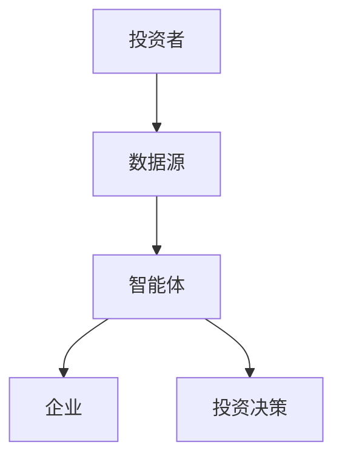

                 


# 智能化企业价值计算：多智能体AI在价值投资中的新方法

> 关键词：智能化企业价值计算，多智能体AI，价值投资，人工智能，金融数据分析

> 摘要：本文探讨了多智能体AI在企业价值计算中的应用，分析了传统方法的局限性，介绍了多智能体AI的基本原理，展示了其在价值投资中的优势，通过实际案例分析了系统的架构设计，并展望了未来的发展趋势。

---

# 第一部分: 智能化企业价值计算的背景与概念

## 第1章: 企业价值计算的传统方法与挑战

### 1.1 企业价值的传统计算方法
#### 1.1.1 财务指标法
- 解释：通过市盈率、市净率等财务指标来评估企业价值。
- 优缺点：简单易懂，但忽略了企业的动态变化和外部因素。

#### 1.1.2 折现现金流法
- 解释：通过预测未来现金流并将其折现到当前价值。
- 优缺点：计算复杂，但较为准确，但依赖于未来的假设。

#### 1.1.3 相对估值法
- 解释：通过比较同类企业的估值来确定目标企业的价值。
- 优缺点：依赖市场数据，但可能受市场情绪影响。

### 1.2 传统方法的局限性
- 数据局限性：传统方法主要依赖财务数据，忽略了非结构化数据（如新闻、社交媒体）的价值。
- 模型局限性：传统模型难以捕捉市场的动态变化和复杂性。
- 人为因素影响：人为判断可能导致主观偏差，影响结果的客观性。

## 第2章: 多智能体AI在价值投资中的应用背景

### 2.1 人工智能在金融领域的应用现状
#### 2.1.1 机器学习在金融分析中的应用
- 解释：机器学习用于股票预测、风险评估和市场情绪分析。
- 实例：使用随机森林模型预测股票价格。

#### 2.1.2 自然语言处理在企业信息分析中的应用
- 解释：NLP用于分析企业财报、新闻和社交媒体数据。
- 实例：利用BERT模型分析企业新闻，预测股价波动。

#### 2.1.3 强化学习在投资策略中的应用
- 解释：强化学习用于制定动态投资策略，优化投资组合。
- 实例：使用Deep Q-Learning算法模拟股票交易。

### 2.2 多智能体AI的定义与特点
#### 2.2.1 多智能体系统的定义
- 多智能体系统是由多个相互作用的智能体组成的系统，每个智能体都有自己的目标和决策机制。

#### 2.2.2 多智能体AI的核心特点
- 分布式：智能体独立决策，协同工作。
- 交互性：智能体之间通过信息交换进行协作。
- 协作性：多个智能体共同完成复杂任务。

#### 2.2.3 多智能体AI与单智能体AI的区别
| 特性 | 单智能体AI | 多智能体AI |
|------|------------|------------|
| 决策 | 中央决策    | 分布式决策 |
| 交互 | 无          | 有          |
| 复杂性 | 较低        | 较高        |

### 2.3 价值投资与多智能体AI的结合
#### 2.3.1 价值投资的基本原理
- 价值投资强调寻找被市场低估的企业，长期持有，获得超额收益。

#### 2.3.2 多智能体AI在价值投资中的优势
- 全面分析：多智能体可以从多个维度（财务、市场、行业）全面评估企业价值。
- 动态调整：根据市场变化实时调整评估结果。
- 高效决策：通过协同工作，快速做出投资决策。

#### 2.3.3 多智能体AI与传统价值投资方法的对比
- 传统方法依赖人工分析，耗时且主观。
- 多智能体AI通过自动化和智能化提升效率和准确性。

---

# 第二部分: 多智能体AI的核心概念与原理

## 第3章: 多智能体AI的核心概念与联系

### 3.1 多智能体系统的核心要素
#### 3.1.1 智能体的定义与属性
- 智能体：具有感知环境、做出决策并采取行动的实体。
- 属性：自主性、反应性、目标导向。

#### 3.1.2 智能体之间的交互与协作
- 信息共享：智能体之间通过共享数据和信息进行协作。
- 协作决策：多个智能体共同制定决策，优化整体目标。

#### 3.1.3 智能体的决策机制
- 分布式决策：每个智能体独立决策，协同完成任务。
- 中央决策：由中央控制节点统一决策。

### 3.2 多智能体系统的ER实体关系图
```mermaid
er
actor: 投资者
actor: 企业
actor: 数据源
actor: 智能体
```

### 3.3 多智能体系统的流程图


---

## 第4章: 多智能体AI的算法原理

### 4.1 强化学习算法在多智能体系统中的应用
#### 4.1.1 强化学习的基本原理
- 通过试错学习，智能体通过与环境互动，学习最优策略。
- 奖励机制：智能体通过最大化累积奖励来优化行为。

#### 4.1.2 多智能体强化学习的挑战
- 协作与竞争：智能体之间需要协调行动，避免冲突。
- 通信与协调：智能体之间需要有效沟通，共同制定策略。

#### 4.1.3 多智能体强化学习的应用场景
- 股票交易：多个智能体分别负责市场分析、风险评估和交易执行。
- 投资组合管理：智能体协同优化投资组合，分散风险。

#### 4.1.4 强化学习算法实现
- 使用OpenAI Gym环境进行训练，定制奖励函数。
- 实现代码示例：
```python
import gym
import numpy as np

env = gym.make('StockTrading-v0')
env.reset()

for _ in range(1000):
    observation, reward, done, info = env.step(env.action_space.sample())
    if done:
        break
env.render()
```

### 4.2 多智能体博弈论模型
#### 4.2.1 博弈论的基本概念
- 理性决策：每个智能体都以自身利益最大化为目标。
- Nash均衡：所有智能体策略一致，无法通过单方面改变策略而获益。

#### 4.2.2 多智能体博弈的应用
- 竞争性交易：多个智能体在市场中竞争，寻找最佳交易时机。
- 投资组合优化：通过博弈论模型优化投资组合，降低风险。

---

## 第5章: 多智能体系统的架构设计

### 5.1 系统功能设计
- 数据采集：从多个数据源获取企业财务数据、市场数据和新闻数据。
- 数据分析：利用机器学习模型进行数据分析和预测。
- 投资决策：基于分析结果生成投资策略和决策。

### 5.2 系统架构设计


### 5.3 接口设计
- 数据接口：与财务数据源、新闻数据源对接。
- API接口：提供给投资者调用分析结果和投资建议。

---

## 第6章: 项目实战

### 6.1 环境安装
- 安装Python、TensorFlow、Keras、OpenAI Gym等工具。

### 6.2 核心代码实现
```python
import numpy as np
import gym

class MultiAgentStockTrader:
    def __init__(self, num_agents=5):
        self.agents = [Agent(i) for i in range(num_agents)]
        self.env = gym.make('StockTrading-v0')
    
    def step(self):
        observations = [agent.observe() for agent in self.agents]
        actions = [agent.decide(observation) for agent, observation in zip(self.agents, observations)]
        rewards = self.env.step(actions)
        [agent.receive_reward(reward) for agent, reward in zip(self.agents, rewards)]
```

### 6.3 代码解读与分析
- Agent类：负责数据收集、决策制定和奖励反馈。
- MultiAgentStockTrader类：管理多个智能体，协调它们的行动。

### 6.4 实际案例分析
- 案例：使用多智能体AI分析某企业的财务数据和市场新闻，生成投资建议。

---

## 第7章: 最佳实践与未来展望

### 7.1 最佳实践
- 数据质量：确保数据的准确性和完整性。
- 模型优化：定期更新模型，适应市场变化。
- 风险管理：制定风险管理策略，降低投资风险。

### 7.2 小结
多智能体AI在企业价值计算中的应用，通过智能化分析和协作决策，显著提升了投资决策的效率和准确性。

### 7.3 注意事项
- 避免过度依赖算法，保持人工判断的必要性。
- 注意数据隐私和合规性问题。

### 7.4 拓展阅读
- 推荐书籍：《人工智能：一种现代方法》
- 推荐论文：《Multi-Agent Reinforcement Learning: A Survey》

---

# 作者：AI天才研究院 & 禅与计算机程序设计艺术

