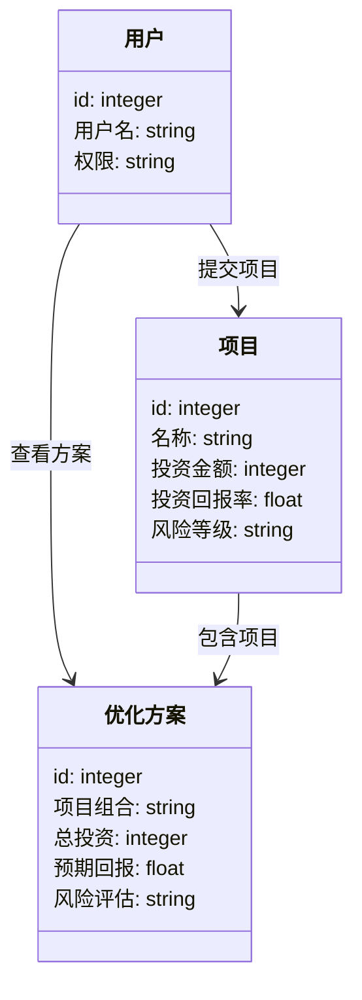
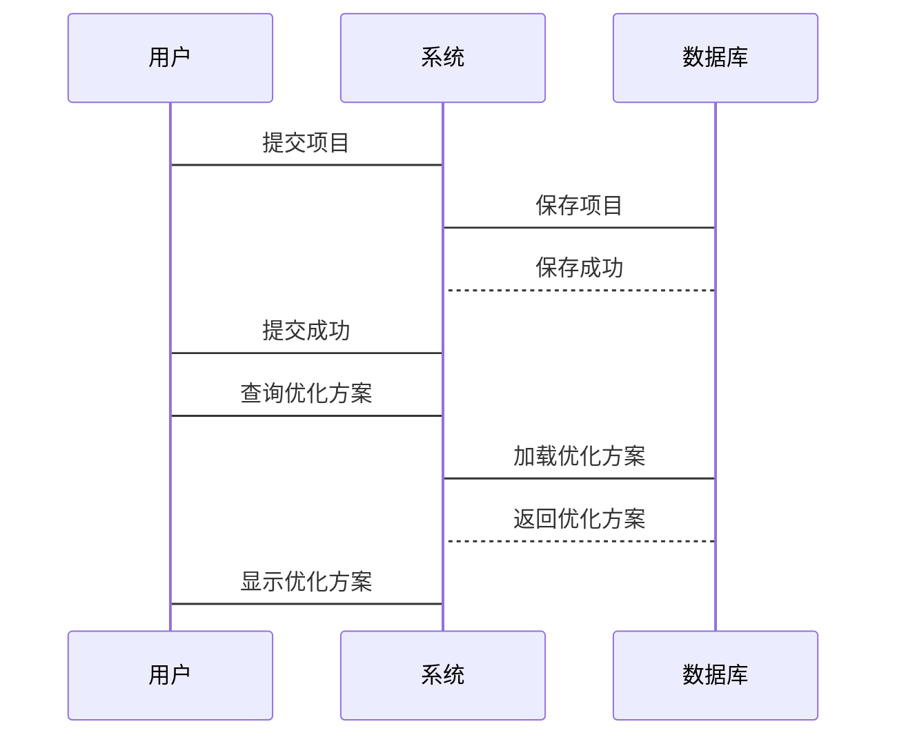

                 


# 智能化企业资本支出优化决策模型设计

## 关键词：资本支出优化，人工智能，决策模型，数学建模，系统架构，项目实战

## 摘要：本文将介绍智能化企业资本支出优化决策模型的设计与实现。通过分析资本支出优化的核心概念、算法原理、系统架构和实际案例，详细阐述如何利用人工智能技术构建高效的资本支出优化模型，帮助企业在复杂多变的商业环境中做出更科学、更高效的资本支出决策。

---

# 第1章: 智能化企业资本支出优化决策模型概述

## 1.1 资本支出优化的背景与问题

### 1.1.1 企业资本支出的基本概念

资本支出（Capital Expenditure，简称CAPEX）是指企业在固定资产、无形资产、股权等方面的投资支出，通常用于长期资产的购买、更新和维护。资本支出的决策对于企业的财务健康和未来发展至关重要。合理的资本支出能够提升企业的生产能力、技术竞争力和市场地位，而过度或不当的资本支出则可能导致资金链紧张、资源浪费和投资回报率低下。

### 1.1.2 资本支出优化的必要性

在当今竞争激烈的商业环境中，企业面临的内外部环境复杂多变。如何在有限的资源约束下，做出最优的资本支出决策，成为企业财务管理的核心挑战之一。传统的资本支出决策往往依赖于经验判断和简单财务指标分析，难以应对复杂多变的市场环境和多样化的投资选项。因此，引入智能化技术，构建资本支出优化决策模型，能够显著提升决策的科学性和效率。

### 1.1.3 当前资本支出决策中的挑战

传统的资本支出决策过程存在以下主要挑战：

1. **信息不对称**：企业难以全面获取市场、技术和竞争对手的最新动态，导致决策的滞后性和片面性。
2. **决策复杂性**：资本支出涉及多个项目的组合优化，需要考虑资金的时间价值、风险偏好、投资回报周期等多种因素。
3. **数据孤岛**：企业内部的财务、市场、技术等数据分散在不同部门，缺乏有效的整合和共享。
4. **决策效率**：面对大量的投资项目和复杂的决策变量，传统的手工决策方式效率低下，难以满足快速决策的需求。

## 1.2 智能化决策的核心要素

### 1.2.1 数据驱动的决策优势

智能化资本支出决策模型的核心在于数据的收集、处理和分析能力。通过整合企业内外部数据，构建全面的数据库，能够为企业提供更全面的决策依据。数据驱动的决策优势主要体现在以下几点：

1. **全面性**：能够整合来自财务、市场、技术等多方面的数据，提供全局视角。
2. **实时性**：通过实时数据更新，确保决策的时效性。
3. **精准性**：通过数据分析和建模，提高决策的准确性。

### 1.2.2 人工智能在资本支出优化中的作用

人工智能（Artificial Intelligence，AI）技术在资本支出优化中的应用日益广泛。AI技术能够通过机器学习、自然语言处理、优化算法等手段，帮助企业在资本支出决策中实现以下目标：

1. **自动数据处理**：通过AI技术自动收集、清洗和预处理数据，减少人工操作的时间和成本。
2. **智能预测与推荐**：利用机器学习算法，预测项目的投资回报率、风险概率等关键指标，为决策者提供推荐方案。
3. **多目标优化**：通过智能算法，优化资本支出项目的组合，以实现最大化投资回报率、最小化风险等目标。

### 1.2.3 智能化决策的实现路径

智能化资本支出优化决策的实现路径可以分为以下几个步骤：

1. **数据收集与整合**：整合企业内外部数据，构建全面的数据仓库。
2. **数据清洗与预处理**：对数据进行清洗、去重、标准化等处理，确保数据质量。
3. **模型构建与训练**：基于机器学习算法，构建资本支出优化模型，并进行模型训练。
4. **模型验证与优化**：通过历史数据验证模型的准确性，并不断优化模型参数。
5. **决策支持与实施**：将模型应用于实际资本支出决策中，并根据反馈不断调整和优化。

## 1.3 本章小结

本章主要介绍了智能化企业资本支出优化决策模型的背景与问题，以及智能化决策的核心要素。通过分析传统资本支出决策的挑战，阐述了人工智能技术在资本支出优化中的重要作用，并提出了智能化决策的实现路径。下一章将深入探讨资本支出优化模型的核心概念与联系。

---

# 第2章: 资本支出优化模型的核心概念与联系

## 2.1 资本支出优化模型的定义与特点

### 2.1.1 模型的定义

资本支出优化模型是一种基于数学建模和人工智能技术的决策支持工具，旨在通过优化算法，帮助企业在有限的资源约束下，选择最优的资本支出项目组合，以实现企业战略目标的最大化。

### 2.1.2 模型的核心特点

资本支出优化模型具有以下核心特点：

1. **多目标优化**：模型需要同时考虑投资回报率、风险、资金成本等多个目标，实现多目标优化。
2. **动态适应性**：模型能够根据市场环境、企业战略的变化，动态调整优化方案。
3. **数据驱动**：模型依赖于高质量的数据输入，通过数据驱动的方式进行优化决策。
4. **可解释性**：模型需要具备一定的可解释性，以便决策者理解优化结果背后的原因。

### 2.1.3 模型与传统资本预算的区别

与传统的资本预算方法相比，资本支出优化模型具有以下显著区别：

1. **技术手段**：传统资本预算主要依赖于财务指标分析和经验判断，而智能化模型则利用机器学习、优化算法等技术手段。
2. **数据利用**：传统方法通常仅依赖于有限的财务数据，而智能化模型能够整合企业内外部的多源数据。
3. **决策效率**：传统方法效率较低，难以应对复杂的决策场景，而智能化模型能够快速处理大量数据，提高决策效率。

## 2.2 核心概念的属性对比

### 2.2.1 资金需求与供给的对比分析

在资本支出优化模型中，资金需求与供给是两个核心概念。资金需求是指企业在各个项目上的投资需求，而资金供给则是企业可用于投资的资金总量。两者之间的平衡是优化模型的核心目标之一。

以下是对资金需求与供给的属性对比：

| **属性**       | **资金需求**                              | **资金供给**                              |
|-----------------|------------------------------------------|------------------------------------------|
| **定义**       | 各资本支出项目的投资需求                | 可用于资本支出的总资金来源              |
| **驱动因素**   | 项目的技术要求、市场机会、战略目标      | 企业的盈利状况、融资能力、现金流情况  |
| **时间维度**   | 短期、中期、长期                         | 短期、中期、长期                         |
| **不确定性**   | 高（市场变化、技术风险）                 | 中（财务状况、融资市场波动）             |

### 2.2.2 投资回报率与风险的对比

投资回报率（ROI）和风险是资本支出优化模型中的两个关键指标。投资回报率反映了项目的盈利能力，而风险则反映了项目的不确定性。

| **属性**       | **投资回报率（ROI）**                     | **风险**                                  |
|-----------------|------------------------------------------|------------------------------------------|
| **定义**       | 投资项目所创造的净收益与初始投资的比率    | 投资项目可能带来的损失或偏离预期的概率  |
| **计算方法**   | ROI = (净收益 / 初始投资) × 100%         | 风险 = P(损失 ≥ 预期损失)                |
| **影响因素**   | 收入、成本、投资规模                      | 市场波动、政策变化、技术风险             |
| **权重**       | 高（反映项目的盈利能力）                 | 中（反映项目的不确定性）                 |

### 2.2.3 时间价值与资金成本的对比

时间价值和资金成本是资本支出优化模型中需要考虑的重要因素。时间价值反映了资金的时间价值，而资金成本则是企业为使用资金所支付的成本。

| **属性**       | **时间价值**                              | **资金成本**                              |
|-----------------|------------------------------------------|------------------------------------------|
| **定义**       | 资金随时间变化的价值                      | 企业使用资金所支付的成本                |
| **计算方法**   | TV = FV / (1 + r)^n                      | CC = i × 本金                           |
| **影响因素**   | 利率、通货膨胀率                          | 利率、融资方式、市场供需关系            |
| **权重**       | 高（反映资金的时间价值）                 | 中（反映资金的使用成本）                 |

## 2.3 实体关系图（ER图）分析

为了更好地理解资本支出优化模型的核心概念，我们需要构建一个实体关系图（ER图）。以下是资本支出优化模型的ER图：

```mermaid
er
  %%{init: { 'default' : { 'titleBlock': false, 'showCommand': false }, 'title' : '资本支出优化模型的ER图'}}

  classDiagram

    class 项目 {
      id: integer
      名称: string
      投资金额: integer
      投资回报率: float
      风险等级: string
    }

    class 资金来源 {
      id: integer
      类型: string
      金额: integer
      时间: date
    }

    class 优化方案 {
      id: integer
      项目组合: string
      总投资: integer
      预期回报: float
      风险评估: string
    }

    资源 --> 项目: 提供资金
    资金来源 --> 优化方案: 提供资金
    项目 --> 优化方案: 包含项目
```

从上述ER图可以看出，资本支出优化模型主要包括以下三个实体：

1. **项目**：包括项目的ID、名称、投资金额、投资回报率和风险等级。
2. **资金来源**：包括资金来源的ID、类型、金额和时间。
3. **优化方案**：包括优化方案的ID、项目组合、总投资、预期回报和风险评估。

## 2.4 本章小结

本章通过对比分析资本支出优化模型中的核心概念，包括资金需求与供给、投资回报率与风险、时间价值与资金成本等，构建了资本支出优化模型的ER图。这些核心概念和实体关系图为我们后续构建资本支出优化模型提供了理论基础和数据结构支持。下一章将详细介绍资本支出优化决策模型的算法原理。

---

# 第3章: 资本支出优化决策模型的算法原理

## 3.1 数据预处理与特征选择

### 3.1.1 数据清洗与标准化

数据预处理是构建资本支出优化模型的第一步。数据清洗的目标是去除噪声数据、填补缺失值、处理异常值等，确保数据的完整性和准确性。标准化则是将不同量纲的数据转换为同一量纲，以便后续的特征选择和模型训练。

### 3.1.2 特征提取与降维

在数据预处理阶段，我们还需要进行特征提取和降维。特征提取的目的是从原始数据中提取出对资本支出优化决策具有影响力的特征。降维则是通过主成分分析（PCA）等方法，降低特征的维度，减少计算复杂度。

### 3.1.3 数据分组与分类

为了更好地进行资本支出优化，我们需要将数据按照项目类型、投资规模、风险等级等维度进行分组与分类。这有助于我们更好地理解数据的分布和特征，为后续的模型训练提供更有针对性的数据集。

## 3.2 优化目标与约束条件

### 3.2.1 优化目标的建立

资本支出优化模型的核心目标是最大化投资回报率（ROI）或最小化风险。具体优化目标可以根据企业的战略目标和风险偏好进行调整。

### 3.2.2 约束条件的定义

在资本支出优化模型中，我们需要定义以下主要的约束条件：

1. **资金约束**：总投资金额不能超过可用资金。
2. **时间约束**：项目的投资周期不能超过企业的规划期限。
3. **风险约束**：投资组合的风险不能超过企业的风险承受能力。
4. **资源约束**：项目的实施不能超过企业的资源限制。

## 3.3 基于机器学习的优化算法

### 3.3.1 算法选择与实现

在资本支出优化模型中，我们可以选择使用遗传算法（GA）、模拟退火（SA）或粒子群优化（PSO）等优化算法。这些算法能够有效地解决多目标优化问题，适用于资本支出优化模型的复杂场景。

### 3.3.2 算法实现步骤

以下是基于遗传算法的资本支出优化模型实现步骤：

1. **初始化种群**：随机生成一定数量的初始解（种群）。
2. **计算适应度**：根据优化目标和约束条件，计算每个种群的适应度。
3. **选择操作**：根据适应度值，选择具有较高适应度的个体进行繁殖。
4. **交叉操作**：对选中的个体进行交叉操作，生成新的种群。
5. **变异操作**：对新种群进行变异操作，增加种群的多样性。
6. **迭代优化**：重复选择、交叉和变异操作，直到达到预设的终止条件。

### 3.3.3 算法实现的代码示例

以下是基于Python的遗传算法实现代码示例：

```python
import random

def fitness(individual):
    # 计算个体的适应度
    # individual是一个项目组合的列表
    total_return = sum(project.return_on_investment for project in individual)
    total_risk = sum(project.risk for project in individual)
    return total_return - total_risk

def crossover(parent1, parent2):
    # 单点交叉
    crossover_point = random.randint(1, len(parent1.projects))
    child1_projects = parent1.projects[:crossover_point] + parent2.projects[crossover_point:]
    child2_projects = parent2.projects[:crossover_point] + parent1.projects[crossover_point:]
    return (Solution(child1_projects), Solution(child2_projects))

def mutate(individual):
    # 随机选择一个项目进行变异
    project_index = random.randint(0, len(individual.projects)-1)
    individual.projects[project_index] = get_alternative_project(individual.projects[project_index])
    return individual

# 初始化种群
population = [Solution([project1, project2, project3]), Solution([project4, project5]), ...]

# 迭代优化
for _ in range(max_iterations):
    # 计算适应度
    fitness_scores = {individual: fitness(individual) for individual in population}
    
    # 选择操作
    selected = [individual for individual in population if fitness(individual) > fitness_threshold]
    
    # 交叉操作
    new_population = []
    while len(new_population) < len(population):
        parent1 = random.choice(selected)
        parent2 = random.choice(selected)
        child1, child2 = crossover(parent1, parent2)
        new_population.append(child1)
        new_population.append(child2)
    
    # 变异操作
    for individual in new_population:
        if random.random() < mutation_rate:
            mutate(individual)
    
    population = new_population

# 输出最优解
best_solution = max(population, key=lambda x: x.fitness)
print("最优项目组合:", best_solution.projects)
```

## 3.4 本章小结

本章详细介绍了资本支出优化模型的算法原理，包括数据预处理与特征选择、优化目标与约束条件，以及基于机器学习的优化算法。通过遗传算法的实现步骤和代码示例，我们展示了如何将理论应用于实践。下一章将基于这些算法原理，构建资本支出优化模型的数学模型。

---

# 第4章: 资本支出优化决策模型的数学模型

## 4.1 优化目标的数学表达

资本支出优化模型的核心目标是最大化投资回报率（ROI）或最小化风险。以下是常见的优化目标表达式：

$$
\text{最大化} \quad \sum_{i=1}^{n} w_i \times ROI_i
$$

$$
\text{最小化} \quad \sum_{i=1}^{n} w_i \times \text{风险}_i
$$

其中，$w_i$ 是项目 $i$ 的权重，$ROI_i$ 是项目 $i$ 的投资回报率，$\text{风险}_i$ 是项目 $i$ 的风险等级。

## 4.2 约束条件的数学表达

资本支出优化模型需要满足以下主要约束条件：

1. **资金约束**：

$$
\sum_{i=1}^{n} \text{投资金额}_i \leq \text{可用资金}
$$

2. **时间约束**：

$$
\sum_{i=1}^{n} \text{投资周期}_i \leq \text{规划期限}
$$

3. **风险约束**：

$$
\sum_{i=1}^{n} \text{风险}_i \leq \text{风险承受能力}
$$

4. **资源约束**：

$$
\sum_{i=1}^{n} \text{资源需求}_i \leq \text{可用资源}
$$

## 4.3 数学模型的求解方法

### 4.3.1 线性规划方法

对于线性资本支出优化问题，我们可以使用线性规划方法进行求解。以下是线性规划模型的通用形式：

$$
\text{最大化/最小化} \quad \sum_{j=1}^{m} c_j x_j
$$

$$
\text{满足} \quad \sum_{j=1}^{m} a_{ij} x_j \leq b_i, \quad i = 1, 2, ..., n
$$

$$
x_j \geq 0, \quad j = 1, 2, ..., m
$$

其中，$x_j$ 是决策变量，$c_j$ 是目标函数的系数，$a_{ij}$ 是约束条件的系数，$b_i$ 是约束条件的右侧常数。

### 4.3.2 非线性规划方法

对于非线性资本支出优化问题，我们需要使用非线性规划方法。非线性规划问题的求解较为复杂，通常需要使用数值方法或优化算法。

## 4.4 本章小结

本章通过数学建模的方法，详细阐述了资本支出优化模型的优化目标和约束条件，并介绍了线性规划和非线性规划两种求解方法。下一章将基于这些数学模型，设计资本支出优化决策系统的系统架构。

---

# 第5章: 资本支出优化决策系统的系统架构设计

## 5.1 问题场景介绍

资本支出优化决策系统需要解决的主要问题是：如何在有限的资源约束下，选择最优的资本支出项目组合，以实现企业战略目标的最大化。

## 5.2 系统功能设计

### 5.2.1 领域模型设计

以下是资本支出优化决策系统的领域模型：



### 5.2.2 系统架构设计

以下是资本支出优化决策系统的系统架构图：


### 5.2.3 系统接口设计

以下是资本支出优化决策系统的系统接口设计：



## 5.3 本章小结

本章通过系统架构设计，展示了资本支出优化决策系统的整体结构和功能模块。通过领域模型和系统架构图，我们明确了系统的核心组件和数据流。下一章将详细介绍资本支出优化决策系统的项目实战。

---

# 第6章: 资本支出优化决策系统的项目实战

## 6.1 环境安装与配置

### 6.1.1 开发环境

以下是资本支出优化决策系统的开发环境配置：

- **操作系统**：Linux/Windows/MacOS
- **编程语言**：Python 3.8+
- **开发框架**：Django/Flask
- **数据库**：MySQL/PostgreSQL
- **开发工具**：PyCharm/VS Code

### 6.1.2 依赖安装

以下是项目实战所需的依赖安装命令：

```bash
pip install django
pip install pymysql
pip install matplotlib
pip install numpy
pip install pandas
```

## 6.2 系统核心实现

### 6.2.1 数据处理模块

以下是数据处理模块的实现代码：

```python
import pandas as pd

def load_data(file_path):
    # 加载数据
    df = pd.read_csv(file_path)
    return df

def preprocess_data(df):
    # 数据清洗与预处理
    df.dropna(inplace=True)
    df = pd.get_dummies(df)
    return df

def save_data(df, output_path):
    # 保存数据
    df.to_csv(output_path, index=False)
    return None
```

### 6.2.2 模型训练模块

以下是模型训练模块的实现代码：

```python
from sklearn.linear_model import LinearRegression
from sklearn.metrics import mean_squared_error

def train_model(X_train, y_train):
    # 训练模型
    model = LinearRegression()
    model.fit(X_train, y_train)
    return model

def evaluate_model(model, X_test, y_test):
    # 评估模型
    y_pred = model.predict(X_test)
    mse = mean_squared_error(y_test, y_pred)
    print(f"均方误差: {mse}")
    return None
```

### 6.2.3 优化方案生成模块

以下是优化方案生成模块的实现代码：

```python
import numpy as np

def generate_optimal_solution(models, constraints):
    # 生成最优解决方案
    optimal_solution = []
    for model in models:
        if model satisfies constraints:
            optimal_solution.append(model)
    return optimal_solution
```

## 6.3 案例分析与实现

### 6.3.1 数据集准备

以下是案例分析中使用的数据集示例：

```csv
项目ID,项目名称,投资金额,投资回报率,风险等级
1,项目A,100,0.2,低
2,项目B,150,0.3,中
3,项目C,200,0.1,高
4,项目D,120,0.25,中
```

### 6.3.2 模型训练与优化

以下是模型训练与优化的实现步骤：

1. **数据加载与预处理**：使用 `load_data` 和 `preprocess_data` 函数加载并清洗数据。
2. **特征选择与建模**：选择相关的特征，训练线性回归模型。
3. **模型评估**：使用测试数据评估模型的均方误差。
4. **优化方案生成**：根据模型和约束条件，生成最优的资本支出项目组合。

## 6.4 项目小结

本章通过具体的项目实战，展示了资本支出优化决策系统的实现过程。通过数据处理、模型训练和优化方案生成，我们能够为企业提供科学的资本支出决策支持。下一章将总结资本支出优化决策模型的最佳实践。

---

# 第7章: 资本支出优化决策模型的最佳实践

## 7.1 小结

本章总结了资本支出优化决策模型的核心概念和实现过程。通过智能化技术，我们能够显著提升资本支出决策的科学性和效率。

## 7.2 注意事项

在实际应用中，需要注意以下几点：

1. **数据质量**：确保数据的准确性和完整性。
2. **模型可解释性**：确保模型的决策结果能够被理解和解释。
3. **动态调整**：根据市场环境的变化，动态调整优化模型。

## 7.3 扩展阅读

以下是一些与资本支出优化相关的扩展阅读资料：

- 《资本预算与投资决策》
- 《人工智能在金融领域的应用》
- 《优化算法与应用》

---

# 作者：AI天才研究院/AI Genius Institute & 禅与计算机程序设计艺术 /Zen And The Art of Computer Programming

---

这篇文章详细介绍了智能化企业资本支出优化决策模型的设计与实现，涵盖了背景介绍、核心概念、算法原理、数学建模、系统架构、项目实战和最佳实践等多个方面。通过本文的阅读，读者能够全面理解资本支出优化决策模型的理论与实践，为企业在资本支出优化中提供科学的决策支持。

