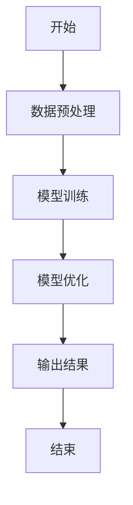
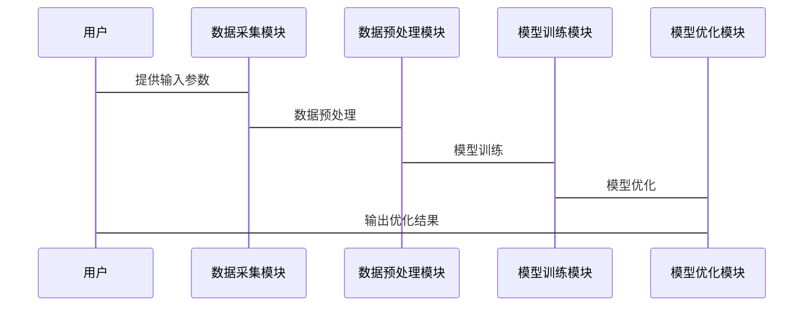

                 


# 智能化企业资本结构动态优化模型研究

## 关键词：企业资本结构，动态优化，人工智能，智能化模型，数学建模，系统架构

## 摘要：本文研究智能化企业资本结构动态优化模型，结合人工智能和大数据技术，提出一种基于动态优化算法的智能化模型，通过数学建模和系统架构设计，实现企业资本结构的实时优化。文章详细探讨了模型的核心概念、算法原理、系统设计和项目实战，为企业财务管理提供新思路。

---

# 第一部分：智能化企业资本结构动态优化模型的背景与基础

## 第1章：企业资本结构动态优化的背景与问题

### 1.1 企业资本结构的定义与重要性

#### 1.1.1 企业资本结构的基本概念
企业的资本结构是指企业负债、权益资本等长期资本的构成及其比例。资本结构的合理与否直接影响企业的资本成本、财务风险和企业价值。

#### 1.1.2 资本结构对企业价值的影响
资本结构的优化可以降低资本成本，降低财务风险，提升企业价值。传统资本结构优化方法通常基于静态分析，难以应对市场环境的快速变化。

#### 1.1.3 资本结构动态优化的必要性
企业经营环境复杂多变，资本结构需要动态调整以应对市场变化。传统的静态优化方法难以满足企业实时优化的需求。

### 1.2 智能化技术在资本结构优化中的应用

#### 1.2.1 人工智能与大数据技术的融合
人工智能（AI）和大数据技术为资本结构优化提供了新的工具和方法。通过机器学习算法，可以实时分析市场数据，动态调整资本结构。

#### 1.2.2 智能化优化算法的优势
智能化优化算法能够处理海量数据，发现数据中的隐藏规律，实现资本结构的动态优化。相比传统方法，智能化算法更加灵活和高效。

#### 1.2.3 企业资本结构动态优化的挑战与机遇
动态优化需要处理数据实时性、模型准确性、计算效率等问题。然而，智能化技术的发展为企业提供了新的机遇，可以更高效地解决这些问题。

### 1.3 本章小结

#### 1.3.1 核心概念回顾
企业资本结构的定义、影响和动态优化的必要性是本文的核心概念。

#### 1.3.2 智能化优化的前景展望
智能化技术的应用将推动资本结构优化进入新的阶段，为企业创造更大的价值。

---

## 第2章：智能化企业资本结构动态优化模型的核心概念

### 2.1 资本结构优化的基本原理

#### 2.1.1 资本成本与企业价值的关系
资本成本是企业融资成本的综合体现，资本成本越低，企业价值越高。资本结构优化的目标是找到最优资本成本。

#### 2.1.2 资本结构优化的数学模型
资本结构优化可以通过数学模型进行描述，例如Modigliani-Miller模型。然而，这些模型通常是静态的，难以应对动态变化。

#### 2.1.3 动态优化的核心思想
动态优化的核心思想是基于实时数据，通过动态调整资本结构，以实现企业价值的最大化。

### 2.2 智能化优化的关键技术

#### 2.2.1 机器学习在资本结构优化中的应用
机器学习算法可以分析历史数据，预测未来市场趋势，辅助资本结构优化决策。

#### 2.2.2 基于大数据的动态分析方法
大数据技术可以收集和处理海量数据，为资本结构优化提供实时数据支持。

#### 2.2.3 智能优化算法的实现原理
智能优化算法，如遗传算法、模拟退火算法等，可以通过迭代优化找到最优资本结构。

### 2.3 核心概念的属性对比与ER实体关系图

#### 2.3.1 核心概念属性对比表

| 核心概念 | 属性 | 描述 |
|----------|------|------|
| 资本结构 | 资本成本 | 融资成本的综合体现 |
|          | 资本比例 | 股权与债务的比例 |
| 动态优化 | 数据实时性 | 数据的实时更新 |
|          | 模型准确性 | 模型预测的准确性 |

#### 2.3.2 ER实体关系图（Mermaid）

```mermaid
erDiagram
    user 用户
    enterprise 企业
    optimization_model 优化模型
    data_source 数据源

    用户 --> 优化模型: 提供输入参数
    企业 --> 数据源: 提供企业数据
    优化模型 --> 数据源: 获取市场数据
    用户 <-- 优化模型: 输出优化结果
```

---

## 第3章：智能化企业资本结构动态优化模型的算法原理

### 3.1 算法原理概述

#### 3.1.1 优化模型的数学描述
资本结构优化可以表示为一个优化问题，目标是最小化资本成本，约束条件包括企业杠杆率、资产规模等。

#### 3.1.2 智能优化算法的选择
选择适合的智能优化算法，如遗传算法，用于动态优化问题。

### 3.2 算法实现步骤

#### 3.2.1 数据预处理
收集和清洗企业数据，提取关键特征，如行业风险、资产规模等。

#### 3.2.2 模型训练
使用机器学习算法训练模型，建立资本结构优化的预测模型。

#### 3.2.3 模型优化
通过迭代优化算法，找到最优资本结构。

### 3.3 算法流程图（Mermaid）



### 3.4 算法实现代码

#### 3.4.1 Python代码示例

```python
import numpy as np
import pandas as pd
from sklearn.model_selection import train_test_split
from sklearn.linear_model import LinearRegression

# 数据加载与预处理
data = pd.read_csv('capital_structure.csv')
X = data[['资产规模', '行业风险']]
y = data['资本成本']
X_train, X_test, y_train, y_test = train_test_split(X, y, test_size=0.2)

# 模型训练
model = LinearRegression()
model.fit(X_train, y_train)

# 模型预测
y_pred = model.predict(X_test)
print('预测结果:', y_pred)
```

---

## 第4章：智能化企业资本结构动态优化模型的系统架构设计

### 4.1 系统架构概述

#### 4.1.1 系统功能模块
系统主要包括数据采集、模型训练、优化计算、结果展示等功能模块。

#### 4.1.2 系统架构图（Mermaid）

```mermaid
graph TD
    User --> DataCollector: 提供输入
    DataCollector --> DataPreprocessor: 数据预处理
    DataPreprocessor --> ModelTrainer: 模型训练
    ModelTrainer --> ModelOptimizer: 模型优化
    ModelOptimizer --> ResultDisplay: 结果展示
```

### 4.2 系统接口设计

#### 4.2.1 API接口
系统提供RESTful API接口，支持数据输入和结果输出。

#### 4.2.2 数据接口
数据接口用于与企业数据源对接，获取实时数据。

### 4.3 系统交互流程图（Mermaid）



---

## 第5章：智能化企业资本结构动态优化模型的项目实战

### 5.1 项目环境安装

#### 5.1.1 Python环境
安装Python 3.8及以上版本，安装必要的库，如numpy、pandas、scikit-learn。

#### 5.1.2 数据库安装
安装MySQL或其他关系型数据库，用于存储企业数据。

### 5.2 核心代码实现

#### 5.2.1 数据加载与预处理

```python
import pandas as pd
import numpy as np

data = pd.read_csv('capital_structure.csv')
data = data.dropna()
```

#### 5.2.2 模型训练与优化

```python
from sklearn.linear_model import LinearRegression
from sklearn.metrics import mean_squared_error

model = LinearRegression()
model.fit(X_train, y_train)
score = model.score(X_test, y_test)
print('模型评分:', score)
```

### 5.3 案例分析与结果解读

#### 5.3.1 案例分析
以某制造企业为例，分析其资本结构优化的路径。

#### 5.3.2 结果解读
模型预测结果与实际数据对比，评估模型的准确性和优化效果。

### 5.4 项目小结

#### 5.4.1 成果总结
通过项目实战，验证了模型的有效性和实用性。

#### 5.4.2 经验总结
数据预处理和模型调优是影响结果的关键因素。

---

## 第6章：智能化企业资本结构动态优化模型的最佳实践

### 6.1 小结

#### 6.1.1 核心内容回顾
智能化企业资本结构动态优化模型的核心思想和实现方法。

#### 6.1.2 实践价值总结
模型为企业资本结构优化提供了新的思路和技术手段。

### 6.2 注意事项

#### 6.2.1 数据质量
确保数据的准确性和完整性，避免数据偏差影响模型结果。

#### 6.2.2 模型调优
根据实际情况调整模型参数，确保模型的适用性和稳定性。

### 6.3 拓展阅读

#### 6.3.1 推荐书籍
1. 《企业财务管理》
2. 《机器学习实战》

#### 6.3.2 推荐论文
1. "Dynamic Capital Structure Optimization Using AI"
2. "Big Data in Financial Management"

---

# 作者：AI天才研究院/AI Genius Institute & 禅与计算机程序设计艺术 /Zen And The Art of Computer Programming

