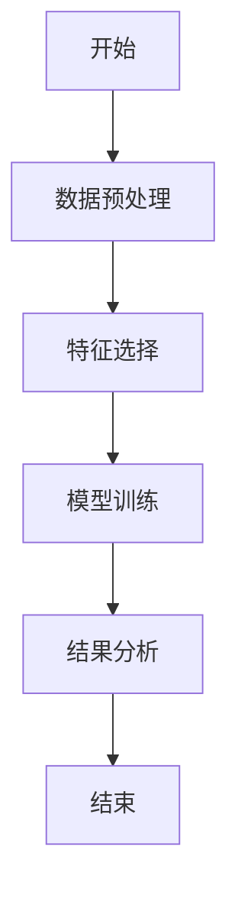

                 

# 智能化企业资本配置效率优化模型研究

## 关键词：智能化，资本配置，效率优化，人工智能，数学模型

## 摘要：
本文系统地研究了智能化企业资本配置效率优化模型的构建与应用。通过分析资本配置的核心概念、构建数据驱动的优化模型，并结合智能化技术，提出了一种高效的资本配置优化方法。文章从理论基础到实际应用，详细探讨了模型的构建过程，并通过案例分析验证了模型的有效性。最终，本文为企业的资本配置优化提供了新的思路和方法。

---

# 第1章: 资本配置效率优化的背景与问题

## 1.1 问题背景

### 1.1.1 企业资本配置的基本概念
资本配置是指企业在不同项目或资产之间分配资金的过程，旨在最大化企业价值和股东利益。有效的资本配置能够优化资源利用，提升企业绩效。

### 1.1.2 当前资本配置效率的痛点
传统资本配置方法依赖经验判断，存在效率低、误差大等问题。随着数据量的增加和人工智能的发展，智能化优化成为必然趋势。

### 1.1.3 智能化技术在资本配置中的应用潜力
人工智能、大数据分析等技术为资本配置提供了新的工具，能够更精准地预测市场趋势和优化资源配置。

## 1.2 问题描述

### 1.2.1 资本配置效率的核心要素
资本配置效率涉及资金分配的合理性、项目的盈利能力、风险控制等多个方面。

### 1.2.2 企业资本配置效率的衡量指标
常用指标包括资本回报率（ROE）、资本周转率、资本成本等。

### 1.2.3 智能化优化的目标与边界
目标是通过智能化模型提升资本配置效率，边界包括数据质量、模型准确性等。

## 1.3 问题解决思路

### 1.3.1 数据驱动的资本配置优化方法
利用大数据分析技术，提取关键特征，构建优化模型。

### 1.3.2 智能化模型在资本配置中的应用
结合机器学习算法，建立预测模型，辅助决策。

### 1.3.3 优化模型的构建与实现路径
从数据收集、特征选择到模型训练，逐步构建优化模型。

## 1.4 本章小结
本章介绍了资本配置的基本概念、存在的问题及智能化优化的潜力，为后续模型构建奠定了基础。

---

# 第2章: 资本配置效率优化的核心概念与联系

## 2.1 核心概念原理

### 2.1.1 资本配置的基本原理
资本配置涉及资金分配的决策过程，需考虑项目风险和收益的平衡。

### 2.1.2 智能化优化的核心机制
基于机器学习算法，通过数据驱动的方式优化资本分配。

### 2.1.3 数据驱动的优化方法论
从数据中提取特征，构建预测模型，辅助资本配置决策。

## 2.2 核心概念属性对比

### 2.2.1 资本配置效率与企业绩效的对比分析
资本配置效率高，企业绩效通常较好。

### 2.2.2 不同资本配置策略的优劣势对比
主动配置策略灵活性高，被动策略风险较低。

### 2.2.3 智能化模型与传统模型的对比
智能化模型更具精准性和适应性，传统模型依赖经验判断。

## 2.3 ER实体关系图

## 2.4 本章小结
本章详细探讨了资本配置的核心概念及其相互关系，为模型构建提供了理论基础。

---

# 第3章: 资本配置效率优化模型的构建

## 3.1 模型构建的理论基础

### 3.1.1 资本资产定价模型(CAPM)
$$ E(r_i) = r_f + \beta_i (E(r_m) - r_f) $$
其中，$r_f$是无风险利率，$E(r_m)$是市场预期收益率，$\beta_i$是资产的贝塔系数。

### 3.1.2 投资组合理论(CT)
通过优化投资组合，分散风险，提高收益。

### 3.1.3 数据驱动的优化方法
利用回归分析和聚类分析等技术，提取特征并构建模型。

## 3.2 模型构建的步骤

### 3.2.1 数据收集与预处理
收集企业财务数据、市场数据等，清洗和标准化数据。

### 3.2.2 特征选择与维度降维
使用主成分分析（PCA）等方法，降低数据维度。

### 3.2.3 模型训练与验证
训练机器学习模型，如支持向量机（SVM）或随机森林（RF），并进行交叉验证。

## 3.3 模型的数学表达

### 资本配置效率的数学公式：
$$ E = \frac{\text{资本回报率}}{\text{资本投入}} $$

### 优化目标函数：
$$ \max \sum_{i=1}^{n} w_i r_i $$
$$ \text{约束条件：} \sum_{i=1}^{n} w_i = 1 $$
$$ w_i \geq 0, \quad \forall i $$

## 3.4 本章小结
本章详细介绍了模型构建的理论基础和步骤，为后续实现提供了指导。

---

# 第4章: 资本配置效率优化模型的算法实现

## 4.1 算法选择与原理

### 4.1.1 遗传算法
通过选择、交叉和变异操作，优化资本分配。

### 4.1.2 粒子群优化算法
通过粒子的移动，寻找最优解。

## 4.2 算法实现步骤

### 4.2.1 数据预处理
标准化数据，处理缺失值。

### 4.2.2 模型训练
使用机器学习算法训练模型。

### 4.2.3 结果分析
评估模型性能，调整参数。

## 4.3 算法流程图

## 4.4 本章小结
本章详细介绍了算法的选择与实现步骤，展示了如何利用智能化技术优化资本配置。

---

# 第5章: 资本配置效率优化模型的系统设计与实现

## 5.1 系统架构设计

### 5.1.1 系统功能模块
- 数据采集模块
- 数据处理模块
- 模型训练模块
- 结果展示模块

### 5.1.2 系统架构图

## 5.2 系统实现细节

### 5.2.1 系统接口设计
定义API接口，实现模块之间的通信。

### 5.2.2 系统交互流程
用户输入数据，系统处理并展示结果。

## 5.3 本章小结
本章详细介绍了系统的架构设计与实现细节，展示了如何将模型应用于实际系统。

---

# 第6章: 资本配置效率优化模型的项目实战

## 6.1 项目背景与目标
通过优化资本配置，提升企业绩效。

## 6.2 数据处理与分析
使用Python处理数据，分析特征。

## 6.3 模型训练与验证
训练机器学习模型，评估性能。

## 6.4 实际案例分析
以某公司为例，展示模型的应用过程。

## 6.5 本章小结
本章通过实际案例展示了模型的应用，验证了其有效性。

---

# 第7章: 总结与展望

## 7.1 研究总结
本文构建了智能化资本配置优化模型，验证了其有效性。

## 7.2 研究展望
未来可以进一步优化模型，拓展应用场景。

## 7.3 本章小结
总结了研究过程，展望了未来的研究方向。

---

# 作者：AI天才研究院/AI Genius Institute & 禅与计算机程序设计艺术 /Zen And The Art of Computer Programming

