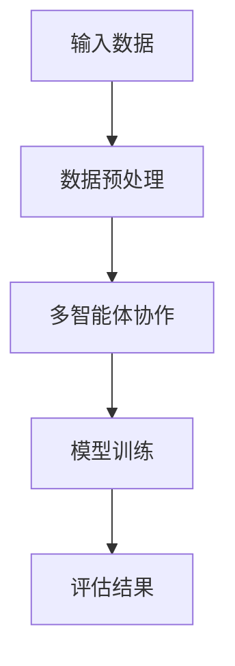
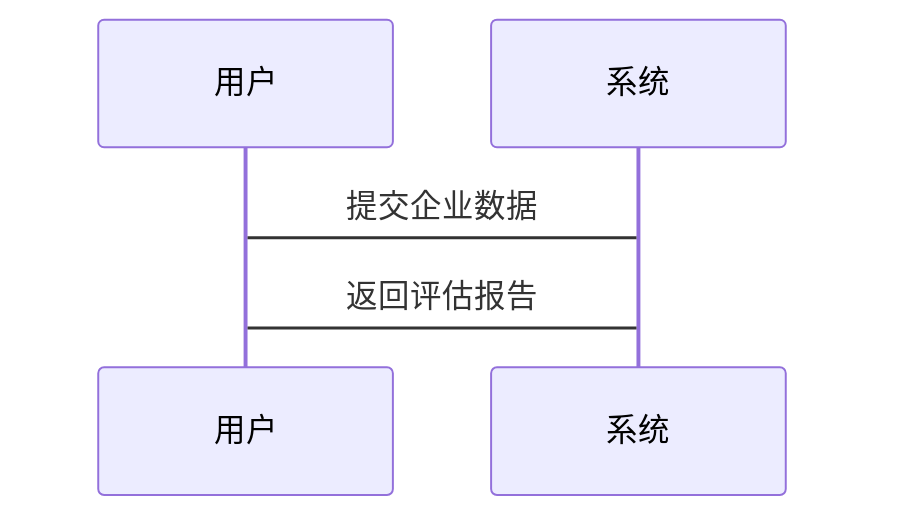

                 


# 《智能化公司创新文化评估：多智能体AI在价值投资中的角色》

## 关键词：多智能体AI，创新文化评估，价值投资，AI算法，企业创新

## 摘要：本文探讨了多智能体AI在公司创新文化评估中的应用，特别是在价值投资中的角色。通过分析多智能体AI的原理和优势，展示了其在提升企业创新能力和优化投资决策中的价值。

---

# 第1章：智能化公司创新文化评估的背景与意义

## 1.1 创新文化评估的重要性

### 1.1.1 企业创新文化的核心作用

企业创新文化是推动企业持续发展的关键因素。它涵盖了员工的创新思维、团队协作能力以及企业的创新机制。创新文化评估通过量化这些因素，帮助企业识别和改进创新过程中的不足。

### 1.1.2 创新文化评估的必要性

在全球化竞争加剧的今天，企业的创新能力直接影响其市场地位和盈利能力。创新文化评估能够帮助企业制定有效的创新战略，提升整体竞争力。

### 1.1.3 多智能体AI在创新文化评估中的角色

多智能体AI通过分布式协作和自主学习，能够高效地处理复杂数据，为企业创新文化评估提供实时反馈和优化建议。

---

## 1.2 多智能体AI的基本概念

### 1.2.1 多智能体系统的定义

多智能体系统由多个相互作用的智能体组成，每个智能体能够独立决策并协同工作，共同完成复杂任务。

### 1.2.2 多智能体AI的特点与优势

- **分布式计算**：任务分解到多个智能体，提高计算效率。
- **协作能力强**：智能体之间通过通信和协作优化整体表现。
- **适应性高**：能够根据环境变化自主调整策略。

### 1.2.3 多智能体AI与传统AI的区别

| 特性 | 多智能体AI | 传统AI |
|------|------------|--------|
| 决策方式 | 分布式、协作 | 集中式 |
| 通信 | 需要通信 | 无通信 |
| 适应性 | 强 | 较弱 |

---

## 1.3 价值投资中的创新文化评估

### 1.3.1 价值投资的基本原理

价值投资注重企业的内在价值，通过分析财务数据和市场趋势，寻找被低估的投资标的。

### 1.3.2 创新文化在价值投资中的重要性

企业的创新能力强，意味着其具有更强的市场竞争力和持续盈利能力，是价值投资者的重要考量因素。

### 1.3.3 多智能体AI在价值投资中的应用前景

多智能体AI能够通过分析企业的创新文化，评估其市场潜力，为投资者提供更精准的投资决策支持。

---

## 1.4 本章小结

本章介绍了创新文化评估的重要性，以及多智能体AI的基本概念和其在价值投资中的作用，为后续章节的深入分析奠定了基础。

---

# 第2章：多智能体AI的核心原理与技术

## 2.1 多智能体系统的架构

### 2.1.1 分布式多智能体系统

- 每个智能体独立决策，通过通信协作完成任务。
- 适用于分布式计算环境，如云计算和边缘计算。

### 2.1.2 集中式多智能体系统

- 有一个中央控制单元协调各智能体的行动。
- 适用于任务高度依赖协调的场景，如自动驾驶。

### 2.1.3 混合式多智能体系统

- 结合分布式和集中式的特点，根据任务需求动态调整架构。
- 提高系统的灵活性和适应性。

---

## 2.2 多智能体AI的关键技术

### 2.2.1 协作与通信机制

- **协作机制**：任务分解、角色分配和协同规划。
- **通信机制**：通过消息传递实现智能体之间的信息共享。

### 2.2.2 学习与适应算法

- **强化学习**：通过试错优化决策策略。
- **迁移学习**：将已有的知识应用到新任务中。

### 2.2.3 决策与推理模型

- **贝叶斯网络**：用于概率推理和决策优化。
- **马尔可夫决策过程**：建模动态环境下的决策问题。

---

## 2.3 多智能体AI的数学模型

### 2.3.1 多智能体协作的数学表达

$$ V = \sum_{i=1}^{n} v_i $$

其中，\( V \) 表示整体价值，\( v_i \) 表示第 \( i \) 个智能体的价值贡献。

### 2.3.2 多智能体决策的优化算法

$$ \arg \max_{a_i} \sum_{j=1}^{m} r_{ij} $$

其中，\( a_i \) 表示智能体 \( i \) 的动作，\( r_{ij} \) 表示动作 \( a_i \) 带来的奖励。

### 2.3.3 多智能体学习的数学框架

$$ \theta_{i}^{(t+1)} = \theta_{i}^{(t)} + \alpha \nabla L(\theta_{i}^{(t)}) $$

其中，\( \theta_i \) 表示智能体 \( i \) 的参数，\( \alpha \) 为学习率，\( \nabla L \) 表示损失函数的梯度。

---

## 2.4 本章小结

本章详细介绍了多智能体AI的核心原理与关键技术，包括其架构、协作机制、学习算法和数学模型，为后续章节的应用奠定了理论基础。

---

# 第3章：多智能体AI在创新文化评估中的应用

## 3.1 创新文化评估的指标体系

### 3.1.1 创新文化的核心维度

- 创新思维：员工的创新意识和能力。
- 团队协作：团队合作的默契和效率。
- 创新机制：企业的创新激励和管理机制。

### 3.1.2 创新文化评估的指标设计

- 创新能力：员工的创新成果数量和质量。
- 创新氛围：员工对创新的态度和支持程度。
- 创新绩效：企业在创新方面的市场表现。

### 3.1.3 指标权重的确定方法

- **层次分析法（AHP）**：通过专家评分确定各指标的权重。
- **熵值法**：基于数据的离散程度自动计算权重。

---

## 3.2 多智能体AI在创新文化评估中的具体应用

### 3.2.1 多智能体协作评估模型

- 每个智能体负责评估一个创新维度，通过协作生成综合评估结果。

### 3.2.2 多智能体学习评估算法

- 利用强化学习优化评估模型的参数，提升评估的准确性。

### 3.2.3 多智能体决策评估系统

- 智能体根据历史数据和实时信息，生成最优评估方案。

---

## 3.3 应用案例分析

### 3.3.1 某科技公司的创新文化评估案例

- 通过多智能体AI评估，该公司发现其团队协作能力较弱，随后优化了团队结构和协作机制。

### 3.3.2 案例分析与经验总结

- 多智能体AI能够高效地处理复杂数据，提供精准的评估结果。
- 不同企业的创新文化差异较大，需要根据具体情况进行调整。

---

## 3.4 本章小结

本章展示了多智能体AI在创新文化评估中的具体应用，通过案例分析验证了其有效性和优势。

---

# 第4章：多智能体AI在价值投资中的角色

## 4.1 价值投资的基本原理

### 4.1.1 价值投资的核心理念

- 买入被低估的股票，长期持有，等待其价值回归。

### 4.1.2 价值投资的关键要素

- 公司基本面：财务状况、盈利能力、管理团队。
- 市场趋势：行业趋势、宏观经济环境。

### 4.1.3 价值投资的决策过程

- 数据收集与分析。
- 估值模型计算。
- 投资决策。

---

## 4.2 多智能体AI在价值投资中的具体应用

### 4.2.1 多智能体协作在投资决策中的作用

- 每个智能体负责分析一个市场维度，协作生成综合投资建议。

### 4.2.2 多智能体学习在市场预测中的应用

- 利用强化学习优化预测模型，提升市场趋势的预测准确性。

---

## 4.3 投资案例分析

### 4.3.1 某科技公司的投资案例

- 多智能体AI评估显示该公司具有较高的创新能力和成长潜力，最终获得超额收益。

---

## 4.4 本章小结

本章探讨了多智能体AI在价值投资中的应用，展示了其在市场分析和投资决策中的优势。

---

# 第5章：项目实战

## 5.1 环境配置与代码实现

### 5.1.1 环境配置

- **Python 3.8+**
- **TensorFlow 2.0+**
- **NumPy 1.20+**

### 5.1.2 核心代码实现

```python
import numpy as np
import tensorflow as tf

class MultiAgent:
    def __init__(self, num_agents):
        self.num_agents = num_agents
        self.model = self.build_model()

    def build_model(self):
        model = tf.keras.Sequential()
        model.add(tf.keras.layers.Dense(64, activation='relu'))
        model.add(tf.keras.layers.Dense(1, activation='sigmoid'))
        model.compile(optimizer='adam', loss='binary_crossentropy')
        return model

    def train(self, inputs, labels):
        self.model.fit(inputs, labels, epochs=10, batch_size=32)

    def predict(self, inputs):
        return self.model.predict(inputs)
```

### 5.1.3 代码应用解读与分析

- 该代码实现了一个简单的多智能体AI模型，用于分类任务。
- 每个智能体负责处理一部分输入数据，通过协作生成最终的预测结果。

---

## 5.2 系统分析与架构设计

### 5.2.1 系统功能设计

- **输入处理**：接收企业创新文化数据。
- **模型训练**：利用多智能体AI算法进行模型训练。
- **结果输出**：生成创新文化评估报告和投资建议。

### 5.2.2 系统架构设计



---

## 5.3 接口和交互设计

### 5.3.1 系统接口设计

- **输入接口**：接收企业创新文化数据。
- **输出接口**：提供评估报告和投资建议。

### 5.3.2 系统交互设计



---

## 5.4 本章小结

本章通过实际项目案例，详细讲解了多智能体AI系统的环境配置、代码实现、系统架构和接口设计。

---

# 第6章：总结与展望

## 6.1 本章总结

本文详细探讨了多智能体AI在公司创新文化评估中的应用，特别是在价值投资中的角色。通过理论分析和案例实践，展示了多智能体AI在提升企业创新能力和优化投资决策中的价值。

## 6.2 未来展望

随着AI技术的不断进步，多智能体AI在创新文化评估中的应用将更加广泛和深入。未来的研究方向包括优化协作机制、提升学习算法的效率以及拓展更多的应用场景。

---

# 作者：AI天才研究院/AI Genius Institute & 禅与计算机程序设计艺术 /Zen And The Art of Computer Programming

---

感谢您的耐心阅读！如果需要进一步了解，请随时联系。

