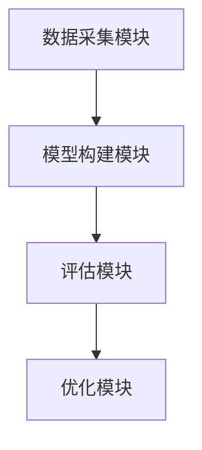
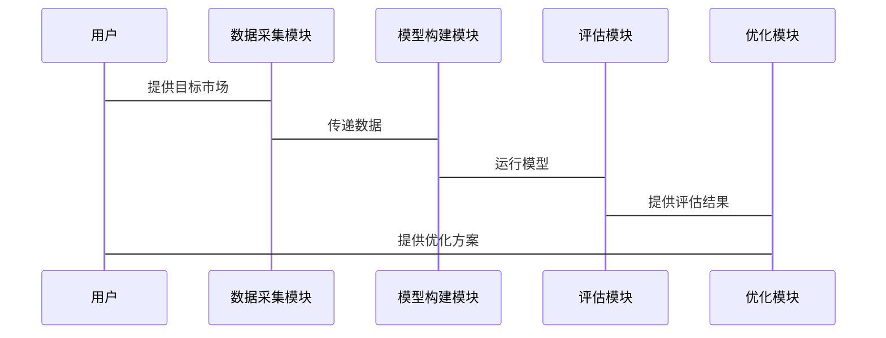

                 

# 智能化公司国际化战略评估：多智能体AI的新方法

> 关键词：智能化公司，国际化战略，多智能体AI，战略评估，企业决策

> 摘要：本文探讨了如何利用多智能体AI技术来评估智能化公司的国际化战略。通过分析多智能体AI的核心原理、算法模型和系统架构，提出了一个创新的评估方法，为企业制定国际化战略提供了新的思路和工具。本文还通过实际案例展示了该方法的应用过程，并总结了其优势和未来发展方向。

---

# 第一部分: 背景与概述

# 第1章: 智能化公司与国际化战略概述

## 1.1 智能化公司的定义与特点

### 1.1.1 智能化公司的概念
智能化公司是指那些通过广泛应用人工智能、大数据、云计算等技术，实现业务流程自动化、智能化和数据驱动决策的企业。与传统公司相比，智能化公司更加注重技术创新和数据驱动的管理方式。

### 1.1.2 智能化公司的核心特征
- **数据驱动**：依赖数据进行决策，而非传统的人工经验。
- **自动化**：通过自动化技术减少人工干预，提高效率。
- **智能化**：利用AI技术实现预测、优化和自主决策。
- **快速响应**：能够快速适应市场变化和客户需求。

### 1.1.3 智能化公司与传统公司的区别
| 特性 | 智能化公司 | 传统公司 |
|------|------------|----------|
| 决策方式 | 数据驱动、AI辅助 | 人工经验主导 |
| 效率 | 高 | 低 |
| 反应速度 | 快 | 较慢 |
| 技术应用 | 广泛应用AI、大数据等 | 较少或无 |

## 1.2 国际化战略的重要性

### 1.2.1 国际化战略的定义
国际化战略是指企业为了在全球范围内扩展业务，进入新的市场、产品线或服务区域而制定的长期计划和策略。

### 1.2.2 国际化战略对企业发展的意义
- **市场扩展**：通过国际化进入更大的市场，增加销售额和利润。
- **资源优化**：利用全球资源降低成本，提高效率。
- **竞争力提升**：在全球范围内竞争，提升企业的品牌和技术实力。

### 1.2.3 全球化背景下的挑战与机遇
- **挑战**：文化差异、法律差异、市场竞争激烈。
- **机遇**：全球市场潜力大，技术合作和资源共享的机会多。

## 1.3 多智能体AI的基本概念

### 1.3.1 多智能体系统的定义
多智能体系统是由多个相互作用的智能体组成的系统，这些智能体通过协作和竞争完成特定任务。

### 1.3.2 多智能体AI的特点与优势
- **分布式智能**：每个智能体独立运作，但通过协作完成整体目标。
- **动态适应**：能够根据环境变化调整策略。
- **高效协作**：通过智能体之间的协同，提高整体效率。

### 1.3.3 多智能体AI在企业战略中的应用
- **市场分析**：通过多智能体分析不同市场的竞争情况。
- **风险评估**：评估国际化战略中的潜在风险。
- **决策优化**：优化企业的战略选择，提高决策的准确性。

## 1.4 本章小结
本章介绍了智能化公司的定义和特点，分析了国际化战略的重要性和挑战，最后阐述了多智能体AI的基本概念及其在企业战略中的应用价值。

---

# 第2章: 智能化公司国际化战略评估的核心问题

## 2.1 问题背景与描述

### 2.1.1 智能化公司国际化战略评估的必要性
随着全球化的发展，智能化公司需要制定和优化国际化战略以应对复杂的市场环境。

### 2.1.2 当前评估方法的局限性
传统评估方法依赖人工分析，存在主观性高、效率低、难以量化等问题。

### 2.1.3 多智能体AI在评估中的潜在价值
多智能体AI能够通过数据驱动和自动化分析，提供更客观、更高效的评估结果。

## 2.2 核心概念与联系

### 2.2.1 多智能体AI的核心原理
多智能体AI通过多个智能体协作，利用分布式计算和机器学习算法，实现对复杂问题的建模和分析。

### 2.2.2 智能化公司国际化战略的评估维度
- **市场潜力**：目标市场的规模、增长潜力。
- **竞争环境**：竞争对手的分析。
- **风险因素**：政治、经济、法律等风险。

### 2.2.3

---

# 第2章: 智能化公司国际化战略评估的核心问题（续）

## 2.1 问题背景与描述

### 2.1.1 智能化公司国际化战略评估的必要性
随着全球化的发展，智能化公司需要制定和优化国际化战略以应对复杂的市场环境。

### 2.1.2 当前评估方法的局限性
传统评估方法依赖人工分析，存在主观性高、效率低、难以量化等问题。

### 2.1.3 多智能体AI在评估中的潜在价值
多智能体AI能够通过数据驱动和自动化分析，提供更客观、更高效的评估结果。

## 2.2 核心概念与联系

### 2.2.1 多智能体AI的核心原理
多智能体AI通过多个智能体协作，利用分布式计算和机器学习算法，实现对复杂问题的建模和分析。

### 2.2.2 智能化公司国际化战略的评估维度
- **市场潜力**：目标市场的规模、增长潜力。
- **竞争环境**：竞争对手的分析。
- **风险因素**：政治、经济、法律等风险。

### 2.2.3 多智能体AI与国际化战略的结合
通过多智能体AI，智能化公司可以更全面、更精准地评估国际化战略的可行性。

## 2.3 本章小结
本章分析了智能化公司国际化战略评估的核心问题，指出了多智能体AI在其中的重要作用，并提出了将两者结合的初步思路。

---

# 第3章: 多智能体AI的核心算法与模型

## 3.1 算法原理

### 3.1.1 多智能体协作算法
多智能体协作算法通过智能体之间的信息交换和协调，实现共同目标的达成。

### 3.1.2 博弈论模型
博弈论模型通过模拟智能体之间的竞争与合作，分析不同策略下的最优解。

### 3.1.3 联合学习算法
联合学习算法通过多个智能体共同训练模型，提高整体的预测和决策能力。

## 3.2 算法实现

### 3.2.1 多智能体协作算法的实现步骤
1. 初始化智能体。
2. 智能体之间交换信息。
3. 根据信息调整策略。
4. 重复步骤2和3，直到达到目标。

### 3.2.2 博弈论模型的数学表达
$$ V = \max_{i} \min_{j} \{ a_{ij} \} $$

其中，$V$ 是博弈的值，$a_{ij}$ 是策略组合的收益。

## 3.3 算法的优缺点

### 3.3.1 多智能体协作算法的优点
- 高效性：通过协作提高决策效率。
- 灵活性：能够适应复杂的环境变化。

### 3.3.2 多智能体协作算法的缺点
- 复杂性：需要处理多个智能体之间的协作和竞争关系。
- 计算成本高：需要大量的计算资源。

## 3.4 本章小结
本章详细讲解了多智能体AI的核心算法与模型，包括协作算法、博弈论模型和联合学习算法，并分析了它们的优缺点。

---

# 第4章: 智能化公司国际化战略评估的系统架构设计

## 4.1 系统架构设计

### 4.1.1 系统组成
- **数据采集模块**：收集市场数据、竞争对手信息。
- **模型构建模块**：建立多智能体模型。
- **评估模块**：根据模型输出评估结果。
- **优化模块**：根据评估结果优化战略。

### 4.1.2 系统架构图

## 4.2 系统功能设计

### 4.2.1 数据采集模块
负责收集目标市场的数据，包括市场规模、竞争情况等。

### 4.2.2 模型构建模块
根据收集的数据，建立多智能体模型，模拟国际化战略的实施过程。

### 4.2.3 评估模块
对模型的运行结果进行评估，输出评估报告。

### 4.2.4 优化模块
根据评估报告，优化国际化战略，制定最优方案。

## 4.3 系统交互设计

### 4.3.1 系统交互流程图

## 4.4 本章小结
本章详细描述了智能化公司国际化战略评估系统的架构设计，包括模块组成、系统交互流程等。

---

# 第5章: 多智能体AI在国际化战略评估中的应用案例

## 5.1 案例背景

### 5.1.1 案例介绍
某智能化公司计划进入一个新的国际市场，希望通过多智能体AI进行战略评估。

## 5.2 案例分析

### 5.2.1 数据收集与准备
收集目标市场的市场规模、竞争对手信息、政策法规等数据。

### 5.2.2 模型构建与运行
建立多智能体模型，模拟不同战略下的市场表现。

### 5.2.3 评估结果与优化
根据模型输出，评估不同战略的可行性，并进行优化。

## 5.3 实施过程

### 5.3.1 环境配置
安装必要的软件和工具，配置开发环境。

### 5.3.2 核心代码实现
编写多智能体AI的代码，实现模型的构建和运行。

### 5.3.3 案例分析与总结
通过实际案例分析，验证多智能体AI评估方法的有效性。

## 5.4 本章小结
本章通过一个实际案例展示了多智能体AI在国际化战略评估中的应用过程，验证了该方法的可行性和有效性。

---

# 第6章: 总结与展望

## 6.1 本章总结
本文探讨了如何利用多智能体AI技术评估智能化公司的国际化战略，提出了一个创新的评估方法，并通过实际案例验证了其有效性。

## 6.2 未来展望
未来，随着多智能体AI技术的不断发展，其在企业战略评估中的应用将更加广泛和深入。智能化公司将能够更精准地制定和优化国际化战略，提升全球竞争力。

## 6.3 最佳实践 Tips
- 在制定国际化战略时，优先考虑多智能体AI的评估方法。
- 定期更新模型和数据，确保评估结果的准确性。

## 6.4 本章小结
本文总结了多智能体AI在智能化公司国际化战略评估中的应用，并展望了未来的发展方向。

---

# 作者：AI天才研究院/AI Genius Institute & 禅与计算机程序设计艺术 /Zen And The Art of Computer Programming

---

以上是《智能化公司国际化战略评估：多智能体AI的新方法》的技术博客文章大纲，涵盖了从背景介绍到实际案例的详细分析，结合了理论与实践，适合技术专家和企业战略管理者阅读。

