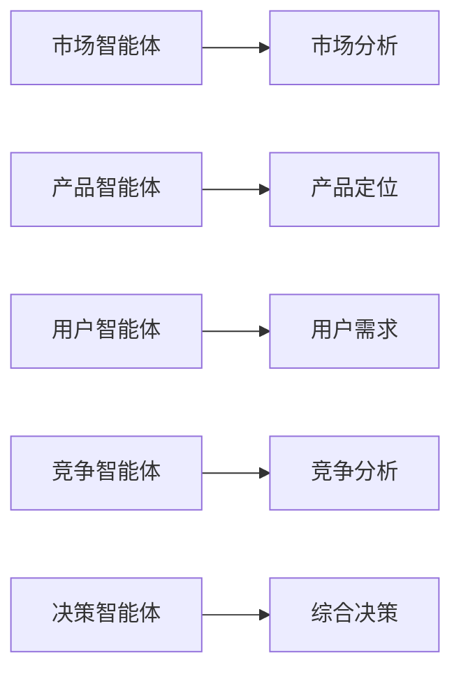
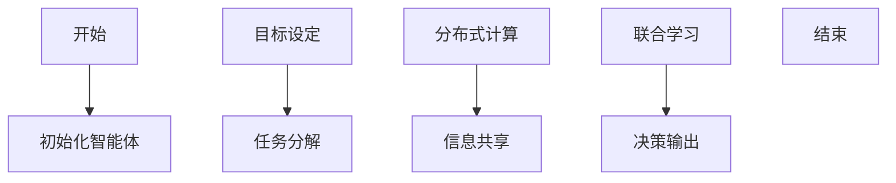
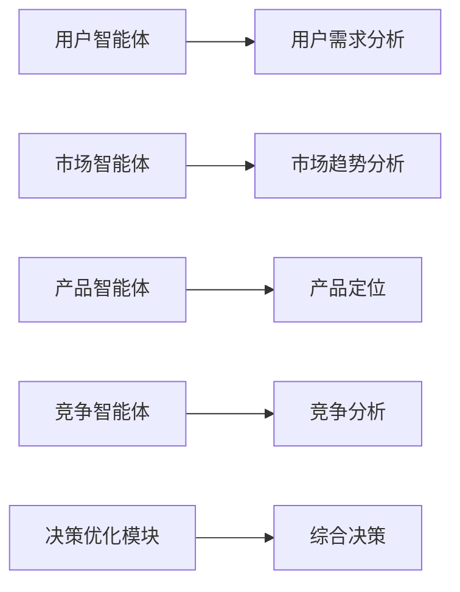
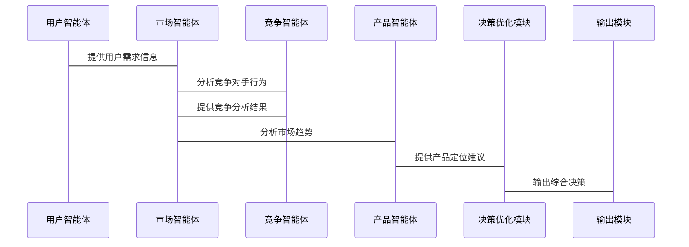

                 


# 智能化公司扩张战略评估：多智能体AI的新视角

> 关键词：多智能体AI，公司扩张，战略评估，智能化，分布式计算

> 摘要：随着人工智能技术的快速发展，多智能体AI（Multi-Agent AI）逐渐成为公司扩张战略的重要工具。本文从多智能体AI的核心原理出发，结合实际案例，详细探讨其在公司扩张战略评估中的应用。通过分析多智能体AI的优势、算法原理、系统架构设计，以及实际项目的实现，本文旨在为智能化公司扩张提供新的视角和方法论。

---

## 第一部分: 智能化公司扩张战略评估的背景与概念

### 第1章: 多智能体AI与公司扩张战略概述

#### 1.1 问题背景

在当前全球化和信息化的商业环境中，公司扩张面临诸多挑战。传统的扩张方式依赖于人工决策和经验判断，存在效率低、风险高等问题。随着人工智能技术的快速发展，多智能体AI（Multi-Agent AI）作为一种新兴的技术手段，为公司扩张提供了新的可能性。

多智能体AI通过分布式计算和协作机制，能够在复杂环境中实现自主决策和优化。这种技术不仅能够提高决策的效率和准确性，还能在多变的市场环境中快速适应变化。因此，将多智能体AI应用于公司扩张战略评估，不仅能够提升战略的科学性，还能为企业创造更大的竞争优势。

#### 1.2 问题描述

公司扩张战略的核心问题在于如何在复杂的市场环境中做出最优决策。传统方法依赖于经验丰富的管理人员和复杂的市场分析模型，但这种方法往往耗时长、成本高，并且容易受到人为因素的干扰。相比之下，多智能体AI能够通过数据驱动的方式，实时分析市场动态、竞争对手行为和客户需求，从而提供更加精准的决策支持。

#### 1.3 问题解决

多智能体AI的核心优势在于其分布式计算和协作能力。通过将公司扩张的各个要素（如市场、产品、用户、竞争等）建模为智能体，这些智能体能够自主感知环境、分析信息并做出决策。这种协作机制不仅能够提高决策的效率，还能够实现全局最优。

#### 1.4 边界与外延

在公司扩张战略中，多智能体AI的应用并非无边界。其适用范围主要集中在市场分析、竞争对手研究和客户需求预测等领域。对于一些需要高度集中决策的领域（如企业并购、重大投资决策等），多智能体AI可能无法完全替代人类的判断。此外，多智能体AI的应用还依赖于数据的准确性和完整性，因此需要结合具体场景进行调整。

#### 1.5 核心要素与概念结构

在公司扩张战略评估中，多智能体AI的核心要素包括以下几个方面：

1. **市场智能体**：负责分析市场动态、竞争对手行为和行业趋势。
2. **产品智能体**：专注于产品设计、功能优化和市场定位。
3. **用户智能体**：关注用户需求、行为习惯和反馈。
4. **竞争智能体**：研究竞争对手的策略和市场反应。
5. **决策智能体**：整合各智能体的信息，制定最优决策。

这些智能体之间通过协作机制实现信息共享和决策优化。通过构建多智能体协作网络，企业能够在复杂环境中快速做出反应，提升扩张战略的效率和效果。

---

## 第二部分: 多智能体AI的核心概念与原理

### 第2章: 多智能体AI的原理与属性

#### 2.1 多智能体AI的原理

多智能体AI的核心原理在于其分布式计算和协作机制。通过将问题分解为多个智能体的任务，每个智能体能够独立感知环境、分析信息并做出决策。这些智能体通过通信和协作，共同完成复杂的任务。

例如，在公司扩张战略评估中，市场智能体和产品智能体需要协同工作，分别提供市场分析和产品定位的信息，最终通过决策智能体整合这些信息，制定出最优的扩张策略。

#### 2.2 多智能体AI的属性对比

多智能体AI与传统AI技术相比，具有以下显著优势：

| 对比维度 | 传统AI | 多智能体AI |
|----------|--------|------------|
| 计算方式 | 集中式 | 分布式      |
| 决策主体 | 单一主体 | 多个主体    |
| 协作机制 | 无或有限 | 强化协作    |
| 适应性   | 较低    | 较高        |

#### 2.3 多智能体AI的实体关系图

通过Mermaid图，我们可以清晰地展示多智能体AI在公司扩张战略评估中的实体关系：



---

## 第三部分: 多智能体AI的算法原理

### 第3章: 多智能体AI的算法与数学模型

#### 3.1 多智能体协作算法

多智能体协作算法的核心在于分布式计算和联合学习。通过将任务分解为多个子任务，每个智能体负责解决自己的子任务，并通过通信共享信息，最终实现全局最优。

例如，在市场分析中，市场智能体和竞争智能体需要分别分析市场趋势和竞争对手的行为。通过联合学习，市场智能体可以整合竞争智能体的信息，制定更加精准的市场策略。

#### 3.2 多智能体决策算法

多智能体决策算法基于博弈论和马尔可夫决策过程，通过贝叶斯网络进行推理和预测。例如，在产品定位中，产品智能体需要根据市场需求和竞争环境，通过贝叶斯网络预测不同产品策略的市场表现。

#### 3.3 算法流程图

通过Mermaid图，我们可以清晰地展示多智能体AI的算法流程：



---

## 第四部分: 智能化公司扩张战略的系统分析与架构设计

### 第4章: 智能化公司扩张战略的系统分析

#### 4.1 问题场景介绍

在公司扩张战略评估中，市场智能体需要分析市场趋势和竞争对手行为，产品智能体需要定位产品策略，用户智能体需要满足客户需求。这些智能体需要协同工作，共同制定出最优的扩张策略。

#### 4.2 系统功能设计

系统功能设计包括以下几个方面：

1. **市场分析模块**：负责分析市场趋势、竞争对手行为和行业动态。
2. **产品定位模块**：根据市场需求和竞争环境，制定产品策略。
3. **用户需求模块**：通过用户反馈和行为分析，优化产品设计和市场策略。
4. **竞争分析模块**：研究竞争对手的策略和市场反应，制定应对措施。
5. **决策优化模块**：整合各模块的信息，制定最优的扩张策略。

#### 4.3 系统架构设计

通过Mermaid图，我们可以展示系统的架构设计：



#### 4.4 系统接口设计

系统接口设计包括以下几个方面：

1. **智能体间通信接口**：用于智能体之间的信息共享和协作。
2. **数据输入接口**：用于输入市场、产品和用户等数据。
3. **决策输出接口**：用于输出综合决策结果。

#### 4.5 系统交互图

通过Mermaid序列图，我们可以展示系统的交互过程：



---

## 第五部分: 项目实战

### 第5章: 多智能体AI在公司扩张中的应用

#### 5.1 项目环境安装

在实际项目中，我们需要安装以下环境：

1. **Python 3.8+**：用于代码实现。
2. **TensorFlow或PyTorch**：用于深度学习模型的训练。
3. **Mermaid**：用于绘制流程图和交互图。
4. **Jupyter Notebook**：用于数据可视化和算法调试。

#### 5.2 系统核心实现

以下是系统核心实现的代码示例：

```python
import tensorflow as tf
from tensorflow.keras import layers

# 初始化智能体
class Agent:
    def __init__(self):
        self.model = self.build_model()
    
    def build_model(self):
        model = tf.keras.Sequential()
        model.add(layers.Dense(64, activation='relu', input_dim=64))
        model.add(layers.Dense(1, activation='sigmoid'))
        return model

# 分布式计算
agents = [Agent() for _ in range(5)]

# 信息共享
def share_info(agents):
    for agent in agents:
        # 通过通信机制共享信息
        pass

# 联合学习
def joint_learning(agents):
    for agent in agents:
        # 通过联合学习优化模型
        pass

# 决策输出
def make_decision(agents):
    # 整合各智能体的信息，制定决策
    pass
```

#### 5.3 代码实现与解读

以上代码示例展示了多智能体AI的基本实现框架。通过初始化多个智能体，每个智能体负责不同的任务。信息共享和联合学习是实现协作的关键步骤，而决策输出则是最终的目标。

#### 5.4 实际案例分析

通过一个实际案例，我们可以更清晰地理解多智能体AI在公司扩张中的应用。例如，在市场分析中，市场智能体和竞争智能体需要协同工作，分别分析市场趋势和竞争对手的行为，最终通过决策优化模块制定出最优的市场策略。

---

## 第六部分: 最佳实践与小结

### 第6章: 最佳实践与注意事项

#### 6.1 最佳实践

在实际应用中，我们需要注意以下几点：

1. **数据质量**：多智能体AI的应用依赖于高质量的数据，因此数据的准确性和完整性至关重要。
2. **协作机制**：需要设计高效的协作机制，确保智能体之间的信息共享和决策优化。
3. **模型优化**：通过不断的训练和优化，提升模型的准确性和效率。

#### 6.2 小结

通过本文的分析和实践，我们可以看到，多智能体AI在公司扩张战略评估中具有重要的应用价值。通过分布式计算和协作机制，多智能体AI能够提高决策的效率和准确性，为企业创造更大的竞争优势。

#### 6.3 注意事项

在实际应用中，需要注意以下几点：

1. **数据隐私**：确保数据的安全性和隐私性。
2. **模型可解释性**：提升模型的可解释性，便于管理和优化。
3. **技术可行性**：根据具体场景选择合适的技术方案，确保技术的可行性和实用性。

#### 6.4 拓展阅读

对于感兴趣的研究者和实践者，可以进一步阅读以下内容：

1. **多智能体协作算法**：深入研究分布式计算和联合学习的原理。
2. **博弈论与决策优化**：结合博弈论和决策优化，提升多智能体AI的决策能力。
3. **系统架构设计**：优化系统架构，提升系统的性能和可扩展性。

---

## 作者信息

作者：AI天才研究院/AI Genius Institute & 禅与计算机程序设计艺术 /Zen And The Art of Computer Programming

---

通过本文的详细分析和实际案例，我们可以看到，多智能体AI在公司扩张战略评估中的应用前景广阔。未来，随着技术的不断发展，多智能体AI将在更多领域展现出其强大的潜力。

