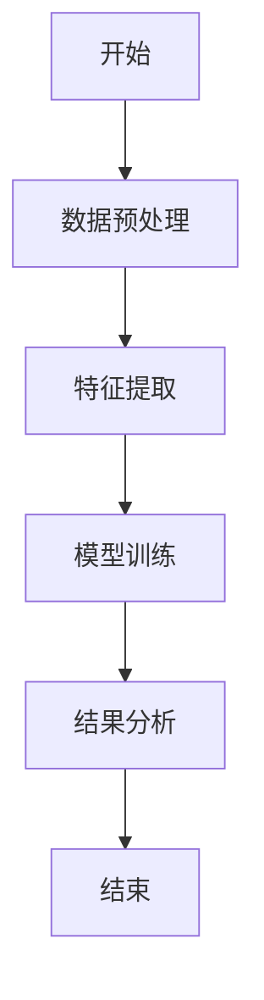
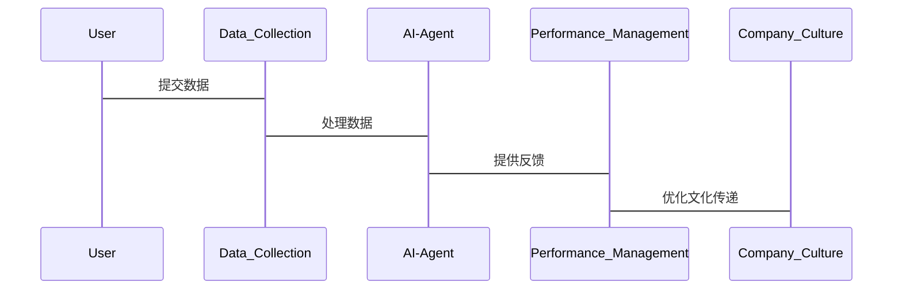

                 


# 智能化公司文化与绩效关联分析：多智能体AI的新视角

---

## 关键词：
智能化公司文化, 绩效管理, 多智能体AI, 关联分析, 绩效优化

---

## 摘要：
随着人工智能技术的快速发展，智能化公司文化与绩效管理的关联性逐渐成为企业管理领域的研究热点。本文从多智能体AI的视角，系统分析了智能化公司文化与绩效管理之间的深层关联，并提出了基于AI的绩效优化方案。通过理论分析、算法实现和案例研究，本文为企业的绩效管理提供了新的思路和实践指导。

---

# 第1章: 智能化公司文化与绩效管理概述

## 1.1 智能化公司文化的定义与特征
### 1.1.1 传统公司文化与智能化公司文化的区别
- 传统公司文化：依赖人工管理，强调规则和流程，文化传递主要依赖制度和培训。
- 智能化公司文化：引入AI技术，强调数据驱动和自动化，文化传递更加个性化和动态化。

### 1.1.2 智能化公司文化的特征与优势
- 数据驱动：通过AI技术分析员工行为数据，优化文化传递。
- 个性化：根据员工特点定制文化内容，提升员工体验。
- 动态调整：实时反馈员工行为，动态优化文化策略。

### 1.1.3 智能化公司文化的核心要素
- 价值观体系：企业的核心价值观通过AI技术进行传播和强化。
- 行为规范：通过AI监控和反馈，强化员工行为规范。
- 互动模式：通过AI驱动的互动平台，提升员工之间的协作效率。

## 1.2 绩效管理的基本概念
### 1.2.1 绩效管理的定义与作用
- 定义：绩效管理是指通过设定目标、监控过程、评估结果，优化员工表现的过程。
- 作用：提升员工效率，优化组织结构，增强企业竞争力。

### 1.2.2 绩效管理的常见模式
- 传统模式：基于KPI的绩效评估。
- 现代模式：基于OKR的目标管理，结合360度反馈。

### 1.2.3 绩效管理与公司文化的关系
- 绩效管理是公司文化的执行工具，公司文化是绩效管理的文化基础。
- 绩效管理的公平性和透明度直接影响员工对公司文化的认同感。

## 1.3 多智能体AI的基本概念
### 1.3.1 多智能体AI的定义与特点
- 定义：多智能体AI是指由多个相互作用的智能体组成的系统，每个智能体都能独立决策并协作完成任务。
- 特点：分布式、协作性、自主性、反应性。

### 1.3.2 多智能体AI的应用场景
- 企业内部协作：优化员工协作效率，提升组织运作效率。
- 绩效评估：通过多智能体协同，实现动态绩效评估。
- 文化传播：利用多智能体AI进行文化传播和员工行为引导。

### 1.3.3 多智能体AI与公司文化的关系
- 多智能体AI为公司文化提供了技术支撑，使其更加智能化和动态化。
- 公司文化为多智能体AI提供了行为准则和目标，使其更具人文关怀。

## 1.4 智能化公司文化与绩效管理的关联性
### 1.4.1 关联性的基本概念
- 绩效管理是公司文化的重要组成部分，公司文化是绩效管理的文化基础。
- 多智能体AI通过数据驱动的方式，强化公司文化与绩效管理的关联性。

### 1.4.2 关联性的研究现状
- 研究现状：现有研究多集中在绩效管理的技术优化，忽视了公司文化与绩效管理的深度融合。
- 研究价值：通过多智能体AI，可以实现公司文化与绩效管理的动态优化。

### 1.4.3 研究的意义与价值
- 提升绩效管理的智能化水平，优化公司文化传递方式。
- 为企业提供一种新型的绩效优化方案，提升企业竞争力。

## 1.5 本章小结
本章主要介绍了智能化公司文化、绩效管理和多智能体AI的基本概念，并分析了它们之间的关联性。通过本章内容，读者可以初步理解智能化公司文化与绩效管理的关系，以及多智能体AI在其中的作用。

---

# 第2章: 智能化公司文化与绩效管理的核心概念与联系

## 2.1 核心概念的原理分析
### 2.1.1 智能化公司文化的原理
- 数据驱动：通过AI技术分析员工行为数据，优化文化传递。
- 个性化：根据员工特点定制文化内容，提升员工体验。
- 动态调整：实时反馈员工行为，动态优化文化策略。

### 2.1.2 绩效管理的原理
- 目标设定：通过OKR或KPI设定绩效目标。
- 行为监控：通过多智能体AI监控员工行为。
- 结果评估：基于数据进行绩效评估和反馈。

### 2.1.3 多智能体AI的原理
- 分布式决策：每个智能体独立决策并协作完成任务。
- 协作性：智能体之间通过通信模块进行协作。
- 反应性：智能体能够实时感知环境变化并做出反应。

## 2.2 核心概念的属性特征对比
| **概念**       | **属性**               | **特征**                                                                 |
|----------------|-----------------------|--------------------------------------------------------------------------|
| 智能化公司文化 | 数据驱动               | 通过AI技术分析员工行为数据，优化文化传递。                           |
|                | 个性化                 | 根据员工特点定制文化内容，提升员工体验。                               |
|                | 动态调整               | 实时反馈员工行为，动态优化文化策略。                                   |
| 绩效管理       | 目标导向               | 通过设定目标，优化员工表现。                                         |
|                | 行为监控               | 监控员工行为，确保目标达成。                                           |
|                | 结果评估               | 通过数据评估绩效，提供反馈。                                           |
| 多智能体AI     | 分布式决策             | 每个智能体独立决策并协作完成任务。                                     |
|                | 协作性                 | 智能体之间通过通信模块进行协作。                                       |
|                | 反应性                 | 实时感知环境变化并做出反应。                                           |

### 2.2.1 智能化公司文化的属性特征
- 数据驱动：通过AI技术分析员工行为数据，优化文化传递。
- 个性化：根据员工特点定制文化内容，提升员工体验。
- 动态调整：实时反馈员工行为，动态优化文化策略。

### 2.2.2 绩效管理的属性特征
- 目标导向：通过设定目标，优化员工表现。
- 行为监控：监控员工行为，确保目标达成。
- 结果评估：通过数据评估绩效，提供反馈。

### 2.2.3 多智能体AI的属性特征
- 分布式决策：每个智能体独立决策并协作完成任务。
- 协作性：智能体之间通过通信模块进行协作。
- 反应性：实时感知环境变化并做出反应。

## 2.3 实体关系图（ER图）架构
```mermaid
erd
    title 智能化公司文化与绩效管理关联性 ER 图
    Company 程序
    Company --> Employee: 雇佣
    Employee --> Performance: 绩效
    Company --> Culture: 传递
    Culture --> Performance: 影响
    Performance --> AI-Agent: 监控
    AI-Agent --> Company: 反馈
```

---

# 第3章: 智能化公司文化与绩效管理的关联分析算法

## 3.1 关联分析算法的原理
### 3.1.1 协同过滤算法
- 基于员工行为数据，通过协同过滤算法，找出绩效表现与文化行为的相关性。

### 3.1.2 聚类分析算法
- 将员工分为不同类别，分析不同类别员工的绩效表现和文化行为差异。

### 3.1.3 关联规则挖掘算法
- 发现绩效表现与文化行为之间的关联规则，优化绩效管理策略。

## 3.2 算法流程图


## 3.3 算法实现代码
```python
def collaborative_filtering(data, user_id):
    # 数据预处理
    preprocessed_data = data.dropna()
    # 特征提取
    user_features = preprocessed_data[preprocessed_data['user_id'] == user_id]
    # 模型训练
    from sklearn.metrics.pairwise import cosine_similarity
    similarity_matrix = cosine_similarity(user_features, preprocessed_data)
    # 结果分析
    top_matches = similarity_matrix.argsort()[-5:][::-1]
    return similarity_matrix[top_matches]
```

## 3.4 数学模型与公式
### 3.4.1 协同过滤的相似度计算公式
$$ sim(u, v) = \frac{\sum_{i} (r_{u,i} - \bar{r}_u)(r_{v,i} - \bar{r}_v)}{\sqrt{\sum_{i} (r_{u,i} - \bar{r}_u)^2} \sqrt{\sum_{i} (r_{v,i} - \bar{r}_v)^2}} $$

---

# 第4章: 智能化公司文化与绩效管理的系统分析与架构设计

## 4.1 系统分析与设计
### 4.1.1 问题场景介绍
- 企业希望通过多智能体AI优化绩效管理，提升公司文化传递效率。

### 4.1.2 系统功能设计
- **数据采集模块**：收集员工行为数据。
- **文化传递模块**：通过AI技术传递公司文化。
- **绩效评估模块**：基于数据进行绩效评估。
- **反馈优化模块**：根据评估结果优化文化传递策略。

### 4.1.3 系统架构设计
```mermaid
graph TD
    User --> Data_Collection: 提交数据
    Data_Collection --> AI-Agent: 处理数据
    AI-Agent --> Performance_Management: 提供反馈
    Performance_Management --> Company_Culture: 优化文化传递
```

## 4.2 系统架构图
```mermaid
graph TD
    User --> Data_Collection: 提交数据
    Data_Collection --> AI-Agent: 处理数据
    AI-Agent --> Performance_Management: 提供反馈
    Performance_Management --> Company_Culture: 优化文化传递
```

## 4.3 接口交互图


---

# 第5章: 智能化公司文化与绩效管理的项目实战

## 5.1 环境安装与配置
- **Python 3.8+**
- **Pandas, Scikit-learn, Mermaid**

## 5.2 系统核心实现
### 5.2.1 数据预处理代码
```python
import pandas as pd
data = pd.read_csv('performance_data.csv')
preprocessed_data = data.dropna()
```

### 5.2.2 模型训练代码
```python
from sklearn.metrics.pairwise import cosine_similarity
similarity_matrix = cosine_similarity(preprocessed_data)
```

### 5.2.3 案例分析
- **案例背景**：某公司希望通过多智能体AI优化绩效管理。
- **实施步骤**：
  1. 数据采集：收集员工行为数据。
  2. 数据预处理：清洗数据。
  3. 模型训练：训练协同过滤模型。
  4. 结果分析：优化绩效管理策略。

## 5.3 项目小结
通过本章内容，读者可以了解如何将智能化公司文化与绩效管理的关联分析算法应用于实际项目中，提升企业的绩效管理水平。

---

# 第6章: 智能化公司文化与绩效管理的最佳实践与小结

## 6.1 最佳实践 tips
- 数据是关键：确保数据的准确性和完整性。
- 选择合适的算法：根据实际需求选择合适的关联分析算法。
- 实时反馈：通过多智能体AI实现实时反馈，动态优化绩效管理。

## 6.2 小结
本章总结了智能化公司文化与绩效管理的关联分析的最佳实践，强调了数据的重要性、算法的选择和实时反馈的必要性。

---

# 作者：AI天才研究院/AI Genius Institute & 禅与计算机程序设计艺术 /Zen And The Art of Computer Programming

--- 

注：由于篇幅限制，以上内容为文章的框架和部分章节的详细内容。完整文章需要按照上述框架，逐章进行详细写作，确保每部分内容丰富、逻辑清晰、语言专业且易于理解。

