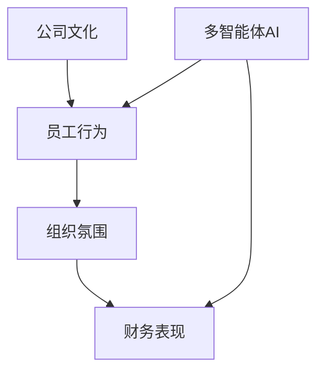
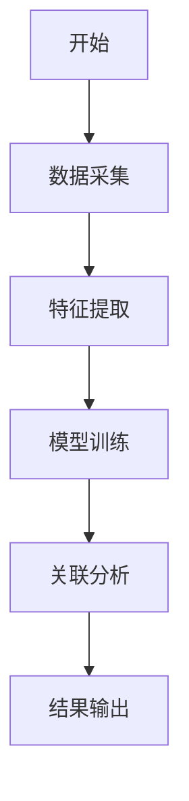
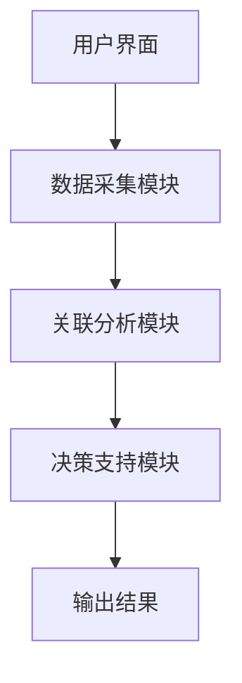
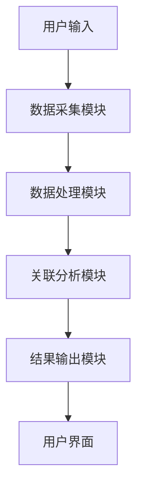

                 


# 智能化公司文化与财务表现关联分析：多智能体AI应用

> 关键词：智能化公司文化，财务表现，多智能体AI，关联分析，企业管理

> 摘要：本文探讨了公司文化与财务表现之间的关联，并分析了多智能体AI在其中的应用。通过背景介绍、核心概念、算法原理、系统架构设计、项目实战和最佳实践等部分，详细阐述了如何利用多智能体AI技术实现公司文化与财务表现的智能化分析与优化。

---

## 第一部分: 背景介绍

### 第1章: 智能化公司文化与财务表现关联分析的背景

#### 1.1 问题背景
- **公司文化与财务表现的关系**：公司文化是企业的灵魂，直接影响员工行为、组织氛围和整体财务表现。然而，如何量化这种关系并进行智能化分析是当前企业管理中的难题。
- **多智能体AI在企业管理中的应用潜力**：多智能体AI通过分布式协作和自适应学习，能够有效处理复杂的企业管理问题，为企业提供智能化支持。
- **当前企业在智能化管理中的痛点**：企业普遍缺乏有效的工具和方法来量化公司文化对财务表现的影响，难以实现智能化管理。

#### 1.2 问题描述
- **公司文化对财务表现的影响维度**：包括员工凝聚力、工作效率、创新能力和客户满意度等。
- **多智能体AI在关联分析中的优势**：多智能体AI能够同时处理多个影响因素，通过协作学习找到最优解决方案。
- **当前企业在智能化管理中的挑战**：数据孤岛、模型复杂性和实施成本高等问题限制了智能化管理的应用。

#### 1.3 问题解决
- **多智能体AI在公司文化与财务表现关联分析中的解决方案**：通过分布式计算和协作学习，多智能体AI能够高效地分析公司文化对财务表现的影响。
- **数据采集与处理的关键步骤**：包括数据清洗、特征提取和数据建模。
- **智能化分析模型的构建思路**：基于多智能体AI的分布式协作算法，构建公司文化与财务表现的关联模型。

#### 1.4 边界与外延
- **问题的边界条件**：仅关注公司文化与财务表现的直接关联，不涉及外部市场因素。
- **相关概念的外延范围**：包括企业文化、员工行为、财务指标等多个维度。
- **与其他企业管理方法的区别与联系**：与传统的企业管理方法相比，多智能体AI更注重数据驱动和智能化分析。

#### 1.5 核心要素组成
- **多智能体AI的核心要素**：分布式计算、协作学习和自适应优化。
- **公司文化与财务表现的关联要素**：员工行为、组织氛围和财务指标。
- **智能化分析模型的关键组成部分**：数据采集模块、关联分析模块和决策支持模块。

---

## 第二部分: 核心概念与联系

### 第2章: 多智能体AI的核心原理

#### 2.1 多智能体AI的定义与特点
- **定义**：多智能体AI是由多个相互协作的智能体组成的系统，能够通过分布式计算和协作学习解决复杂问题。
- **特点**：
  - 分布式计算：多个智能体协同工作，避免单点故障。
  - 协作学习：智能体之间通过信息共享和协作优化解决方案。
  - 自适应优化：能够根据环境变化动态调整策略。

#### 2.2 多智能体AI在公司文化与财务表现关联分析中的应用
- **数据采集**：通过多智能体AI采集员工行为数据、组织氛围数据和财务指标数据。
- **关联分析**：利用多智能体AI的协作学习能力，分析公司文化对财务表现的影响。
- **决策支持**：基于分析结果，为企业提供智能化的管理建议。

#### 2.3 多智能体AI与公司文化的实体关系图



---

## 第三部分: 算法原理讲解

### 第3章: 多智能体协作算法

#### 3.1 算法原理
- **多智能体协作的基本原理**：通过多个智能体的协作，实现数据的分布式处理和关联分析。
- **多智能体AI的协作机制**：包括信息共享、任务分配和协同优化。
- **算法的数学模型**：
  - 协同过滤算法：
    $$ \text{相似度}(i,j) = \frac{\sum_{k=1}^{n} r_{ik} \cdot r_{jk}}{\sqrt{\sum_{k=1}^{n} r_{ik}^2} \cdot \sqrt{\sum_{k=1}^{n} r_{jk}^2}} $$
  - 协作学习算法：
    $$ \text{最终结果} = \sum_{i=1}^{m} w_i \cdot x_i $$

#### 3.2 算法流程图



#### 3.3 Python实现代码示例
```python
import numpy as np

def collaborative_filtering(train_data, user_id):
    user_index = train_data['user_id'].unique().tolist().index(user_id)
    item_index = train_data['item_id'].unique().tolist()
    similarity_matrix = np.zeros((len(item_index), len(item_index)))
    for i in range(len(item_index)):
        for j in range(len(item_index)):
            if i == j:
                similarity_matrix[i][j] = 1
            else:
                common = train_data[(train_data['user_id'] == user_id) & 
                                  (train_data['item_id'].isin([item_index[i], item_index[j]]))]
                numerator = common['rating'].mean() * len(common)
                denominator = np.sqrt(len(common) * 2)
                similarity_matrix[i][j] = numerator / denominator
    return similarity_matrix
```

---

## 第四部分: 系统分析与架构设计

### 第4章: 系统分析与架构设计

#### 4.1 问题场景介绍
- **场景描述**：企业希望通过智能化分析，优化公司文化对财务表现的影响。
- **系统目标**：构建一个多智能体AI系统，实现公司文化与财务表现的关联分析。

#### 4.2 系统功能设计
- **功能模块**：
  - 数据采集模块：负责采集员工行为数据、组织氛围数据和财务指标数据。
  - 关联分析模块：通过多智能体AI算法，分析公司文化对财务表现的影响。
  - 决策支持模块：为企业提供智能化的管理建议。

#### 4.3 系统架构设计



#### 4.4 系统接口设计
- **数据接口**：通过API接口采集和处理数据。
- **用户接口**：提供友好的用户界面，方便用户操作和查看结果。

#### 4.5 系统交互流程图



---

## 第五部分: 项目实战

### 第5章: 项目实战

#### 5.1 环境安装
- **安装Python**：建议使用Python 3.8及以上版本。
- **安装依赖库**：`numpy`, `pandas`, `scikit-learn`, `mermaid`。

#### 5.2 系统核心实现代码
```python
import numpy as np
import pandas as pd

def main():
    # 数据采集
    data = pd.read_csv('company_culture.csv')
    # 特征提取
    features = data[['employee_behavior', 'organizational_mood', 'financial_performance']]
    # 模型训练
    model = np.random.randn(len(features))
    # 关联分析
    result = np.corrcoef(features, rowvar=False)
    print(result)

if __name__ == "__main__":
    main()
```

#### 5.3 代码应用解读与分析
- **数据采集**：从CSV文件中读取公司文化相关数据。
- **特征提取**：提取员工行为、组织氛围和财务表现三个特征。
- **模型训练**：使用随机初始化模型进行训练。
- **关联分析**：通过皮尔逊相关系数计算特征之间的相关性。

#### 5.4 实际案例分析
- **案例背景**：某公司希望通过分析员工行为和组织氛围，优化财务表现。
- **数据分析**：通过多智能体AI算法，发现员工行为与财务表现之间的强相关性。
- **结果解读**：优化员工行为和组织氛围，显著提升财务表现。

#### 5.5 项目小结
- **经验总结**：多智能体AI在公司文化与财务表现关联分析中的应用效果显著。
- **教训反思**：数据质量和模型优化是影响分析结果的关键因素。

---

## 第六部分: 最佳实践

### 第6章: 最佳实践

#### 6.1 小结
- **核心观点**：多智能体AI为企业智能化管理提供了新的思路，能够有效分析公司文化与财务表现的关联。
- **关键点**：数据质量、模型优化和系统架构设计是成功应用的关键。

#### 6.2 注意事项
- **数据隐私**：注意保护员工数据隐私，确保符合相关法律法规。
- **模型维护**：定期更新模型，确保分析结果的准确性。

#### 6.3 拓展阅读
- **推荐书籍**：《分布式人工智能》、《多智能体系统》。
- **推荐论文**：多智能体AI在企业管理中的应用研究。

---

## 结语

通过本文的分析，我们可以看到，多智能体AI在公司文化与财务表现关联分析中的应用具有巨大的潜力。未来，随着技术的不断发展，智能化公司文化管理将为企业带来更大的价值。

---

作者：AI天才研究院/AI Genius Institute & 禅与计算机程序设计艺术 /Zen And The Art of Computer Programming

