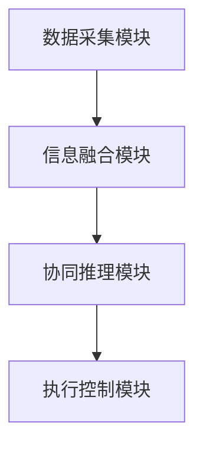

                 


# 智能化公司治理效率分析：多智能体AI的创新应用

> 关键词：智能化公司治理，多智能体AI，治理效率，系统架构，算法原理，创新应用

> 摘要：随着全球化和数字化的深入发展，公司治理面临着前所未有的挑战。多智能体人工智能技术的应用为提升公司治理效率提供了新的可能性。本文将从多智能体AI的基本概念、核心原理、系统架构、应用场景以及实际案例等方面，深入分析多智能体AI在智能化公司治理中的创新应用，探讨如何通过技术创新来提升公司治理效率。

---

## 第一部分：智能化公司治理效率分析的背景与概念

### 第1章：智能化公司治理效率分析的背景

#### 1.1 智能化公司治理的背景
##### 1.1.1 全球化与数字化时代的公司治理挑战
在当前全球化和数字化的背景下，公司治理面临着前所未有的挑战。企业需要在复杂多变的环境中高效决策、优化资源配置、降低风险，并与利益相关者进行有效沟通。传统的公司治理模式往往依赖于人工操作和经验判断，效率较低且容易受到主观因素的影响。

##### 1.1.2 多智能体AI技术的应用趋势
随着人工智能技术的快速发展，多智能体AI（Multi-Agent AI）作为一种新兴的技术，逐渐被应用于公司治理领域。多智能体AI通过多个智能体的协同工作，能够更好地处理复杂问题，提高决策的准确性和效率。

##### 1.1.3 多智能体AI在公司治理中的核心作用
多智能体AI在公司治理中的核心作用体现在以下几个方面：
1. 提供实时数据支持，辅助决策者快速做出决策。
2. 优化资源配置，提高企业运营效率。
3. 实时监控企业风险，提前预警潜在问题。
4. 通过智能协同，实现跨部门高效协作。

#### 1.2 多智能体AI的基本概念
##### 1.2.1 多智能体系统的定义与特点
多智能体系统（Multi-Agent System, MAS）是由多个智能体组成的分布式系统。这些智能体能够通过通信和协作完成复杂的任务。与传统的单一智能体系统相比，多智能体系统具有以下特点：
1. 分布式计算：智能体之间通过分布式计算实现任务协作。
2. 协作性：智能体之间通过通信和协作完成共同目标。
3. 自适应性：智能体能够根据环境变化动态调整行为。

##### 1.2.2 多智能体AI与传统AI的区别
多智能体AI与传统AI的区别主要体现在以下几个方面：
1. **单一智能体 vs. 多智能体**：传统AI通常基于单一智能体进行决策，而多智能体AI通过多个智能体的协作来实现目标。
2. **协作性**：多智能体AI强调智能体之间的协作，而传统AI则更注重单点决策。
3. **动态性**：多智能体AI能够更好地适应动态变化的环境，而传统AI在处理动态问题时往往显得不够灵活。

##### 1.2.3 多智能体AI在公司治理中的潜在价值
多智能体AI在公司治理中的潜在价值主要体现在以下几个方面：
1. **高效决策**：通过多智能体的协作，能够快速生成多种决策方案，并进行优化选择。
2. **风险预警**：通过实时数据监控，能够提前发现潜在风险，并采取预防措施。
3. **资源优化**：通过智能体的协作，能够优化资源配置，提高企业运营效率。
4. **跨部门协作**：多智能体AI能够实现跨部门的高效协作，打破信息孤岛。

---

## 第二部分：多智能体AI的核心原理与技术架构

### 第2章：多智能体AI的核心原理

#### 2.1 多智能体系统的组成与功能
##### 2.1.1 智能体的基本结构
多智能体系统由多个智能体组成，每个智能体都有自己的知识库、推理引擎和行动模块。智能体之间的通信通过特定的协议实现，例如通过消息传递或共享数据库。

##### 2.1.2 智能体之间的交互机制
多智能体系统中的智能体之间通过以下几种方式实现交互：
1. **消息传递**：智能体之间通过发送消息进行通信。
2. **共享数据库**：智能体通过共享数据库实现数据的实时同步。
3. **协同推理**：智能体之间通过协同推理完成复杂任务。

##### 2.1.3 多智能体系统的协作模式
多智能体系统的协作模式主要包括以下几种：
1. **分布式协作**：智能体之间通过分布式计算实现协作。
2. **集中式协作**：通过一个中心节点协调多个智能体的协作。
3. **混合式协作**：结合分布式和集中式协作的特点，形成混合协作模式。

#### 2.2 多智能体AI的算法原理
##### 2.2.1 分布式计算与协同算法
多智能体AI的核心算法包括分布式计算和协同算法。分布式计算通过将任务分解成多个子任务，分别由不同的智能体完成，然后将结果汇总。协同算法则是指智能体之间通过通信和协作完成共同目标。

##### 2.2.2 多智能体AI的通信协议
多智能体系统中，智能体之间的通信需要遵循特定的协议。常见的通信协议包括：
1. **基于消息的通信**：智能体之间通过发送消息进行通信。
2. **基于共享数据库的通信**：智能体通过共享数据库实现数据的实时同步。
3. **基于中间件的通信**：通过中间件实现智能体之间的通信。

##### 2.2.3 联合推理与决策算法
多智能体AI的决策过程通常包括以下几个步骤：
1. **信息收集**：智能体通过多种渠道收集相关信息。
2. **信息融合**：将收集到的信息进行融合，形成一致的知识表示。
3. **协同推理**：多个智能体共同推理，生成多种决策方案。
4. **决策优化**：对生成的决策方案进行优化，选择最优方案。
5. **行动执行**：根据最终决策，智能体执行相应的行动。

#### 2.3 多智能体AI的技术架构
##### 2.3.1 分层架构设计
多智能体AI的技术架构通常采用分层设计，包括：
1. **感知层**：负责数据的采集和初步处理。
2. **推理层**：负责信息的融合和协同推理。
3. **决策层**：负责生成决策方案并优化选择。
4. **执行层**：负责执行最终的决策。

##### 2.3.2 模块化设计原则
多智能体AI的模块化设计原则包括：
1. **功能模块化**：将系统划分为多个功能模块，每个模块负责特定的任务。
2. **接口标准化**：模块之间通过标准化接口进行通信和协作。
3. **可扩展性**：系统设计应具有良好的可扩展性，方便后续功能的扩展。

##### 2.3.3 可扩展性与可维护性
多智能体AI系统的设计应注重可扩展性和可维护性，以便在需要时能够方便地进行功能扩展和维护。

---

## 第三部分：多智能体AI在公司治理中的应用

### 第3章：多智能体AI在公司治理中的应用场景

#### 3.1 智能化决策支持
##### 3.1.1 智能决策支持的核心功能
智能化决策支持系统通过多智能体AI技术，能够实时分析大量的数据，生成多种决策方案，并通过优化算法选择最优方案。

##### 3.1.2 多智能体AI在决策支持中的优势
多智能体AI在决策支持中的优势包括：
1. **高效性**：通过多智能体协作，能够快速生成决策方案。
2. **准确性**：通过协同推理，能够提高决策的准确性。
3. **适应性**：能够根据环境变化动态调整决策策略。

#### 3.2 智能化风险评估
##### 3.2.1 风险评估的核心流程
智能化风险评估系统通过多智能体AI技术，能够实时监控企业的风险因素，并通过协同推理生成风险评估报告。

##### 3.2.2 多智能体AI在风险评估中的应用
多智能体AI在风险评估中的应用包括：
1. **实时监控**：通过多智能体协作，实时监控企业的风险因素。
2. **风险预警**：通过协同推理，提前发现潜在风险并发出预警。
3. **风险应对**：根据风险评估结果，制定相应的应对策略。

#### 3.3 智能化资源配置优化
##### 3.3.1 资源配置优化的核心目标
智能化资源配置优化系统通过多智能体AI技术，能够优化企业的资源配置，提高企业运营效率。

##### 3.3.2 多智能体AI在资源配置优化中的应用
多智能体AI在资源配置优化中的应用包括：
1. **资源分配**：通过多智能体协作，优化资源分配方案。
2. **资源监控**：实时监控资源使用情况，动态调整资源配置。
3. **资源预测**：通过历史数据分析，预测未来的资源需求。

---

## 第四部分：多智能体AI的系统架构与实现

### 第4章：多智能体AI的系统架构设计

#### 4.1 系统功能设计
##### 4.1.1 系统功能模块划分
多智能体AI系统的功能模块划分包括：
1. **数据采集模块**：负责数据的采集和初步处理。
2. **信息融合模块**：负责信息的融合和知识表示。
3. **协同推理模块**：负责多智能体的协同推理和决策优化。
4. **执行控制模块**：负责决策的执行和过程控制。

##### 4.1.2 系统功能流程图


#### 4.2 系统架构设计
##### 4.2.1 分层架构设计
多智能体AI系统的架构设计采用分层架构，包括：
1. **感知层**：负责数据的采集和初步处理。
2. **推理层**：负责信息的融合和协同推理。
3. **决策层**：负责决策方案的生成和优化。
4. **执行层**：负责决策的执行和过程控制。

##### 4.2.2 模块化架构设计
多智能体AI系统的模块化架构设计包括：
1. **智能体模块**：每个智能体负责特定的任务。
2. **通信模块**：负责智能体之间的通信和协作。
3. **控制模块**：负责系统的整体控制和协调。

#### 4.3 系统接口设计
##### 4.3.1 智能体之间的通信接口
多智能体AI系统中，智能体之间的通信接口设计包括：
1. **消息传递接口**：通过消息传递实现智能体之间的通信。
2. **共享数据库接口**：通过共享数据库实现数据的实时同步。
3. **中间件接口**：通过中间件实现智能体之间的通信。

##### 4.3.2 系统与外部系统的接口
多智能体AI系统与外部系统的接口设计包括：
1. **数据接口**：与外部数据源进行数据交换。
2. **用户接口**：与用户进行交互，提供决策支持。
3. **系统接口**：与其他系统进行数据交换和协作。

---

## 第五部分：多智能体AI的项目实战与案例分析

### 第5章：多智能体AI的项目实战

#### 5.1 项目背景与目标
##### 5.1.1 项目背景
某跨国公司希望通过引入多智能体AI技术，优化公司治理效率，提高决策的准确性和效率。

##### 5.1.2 项目目标
1. 实现公司治理的智能化决策支持。
2. 提高公司风险评估的准确性和及时性。
3. 优化公司资源配置，提高运营效率。

#### 5.2 系统实现
##### 5.2.1 环境安装与配置
1. **操作系统**：选择适合的开发环境，例如Linux、Windows等。
2. **开发工具**：安装必要的开发工具，例如Python、Java等。
3. **依赖库安装**：安装多智能体AI开发所需的依赖库，例如TensorFlow、Keras等。

##### 5.2.2 核心代码实现
以下是多智能体AI系统的核心代码实现：
```python
class Agent:
    def __init__(self, id):
        self.id = id
        self.knowledge = {}
    
    def receive_message(self, message):
        # 处理接收到的消息
        pass
    
    def send_message(self, message):
        # 发送消息
        pass

class MultiAgentSystem:
    def __init__(self, agents):
        self.agents = agents
    
    def start_communication(self):
        # 开始智能体之间的通信
        pass
```

##### 5.2.3 系统功能实现
1. **数据采集模块**：实现数据的采集和初步处理。
2. **信息融合模块**：实现信息的融合和知识表示。
3. **协同推理模块**：实现多智能体的协同推理和决策优化。
4. **执行控制模块**：实现决策的执行和过程控制。

#### 5.3 实际案例分析
##### 5.3.1 案例背景
某跨国公司希望通过引入多智能体AI技术，优化公司治理效率，提高决策的准确性和效率。

##### 5.3.2 系统实现
通过多智能体AI技术，实现了公司治理的智能化决策支持、风险评估和资源配置优化。

##### 5.3.3 应用效果
通过多智能体AI技术的应用，公司治理效率显著提高，决策的准确性和效率也得到了显著提升。

---

## 第六部分：总结与展望

### 第6章：总结与展望

#### 6.1 最佳实践
##### 6.1.1 系统设计
1. **模块化设计**：多智能体AI系统的模块化设计能够提高系统的可扩展性和可维护性。
2. **通信协议设计**：合理设计智能体之间的通信协议，能够提高系统的协作效率。
3. **算法优化**：不断优化多智能体AI算法，提高系统的决策效率和准确性。

##### 6.1.2 项目管理
1. **需求分析**：在项目实施前，进行充分的需求分析，明确项目目标和范围。
2. **团队协作**：加强团队协作，确保各模块的协同开发和测试。
3. **风险控制**：在项目实施过程中，注重风险控制，确保项目顺利进行。

#### 6.2 小结
多智能体AI技术的应用为智能化公司治理效率的提升提供了新的可能性。通过多智能体AI技术的应用，公司治理效率得到了显著提高，决策的准确性和效率也得到了显著提升。

#### 6.3 注意事项
1. **数据隐私**：在多智能体AI系统的应用中，需要注意数据隐私问题，确保数据的安全性和隐私性。
2. **系统稳定性**：在多智能体AI系统的设计中，需要注意系统的稳定性和可靠性，避免系统崩溃或数据丢失。
3. **算法优化**：在多智能体AI系统的应用中，需要不断优化算法，提高系统的决策效率和准确性。

#### 6.4 拓展阅读
1. **多智能体系统**：推荐阅读《Multi-Agent Systems: Complexity, Decentralization, and Adaptation》。
2. **人工智能技术**：推荐阅读《Artificial Intelligence: A Modern Approach》。

---

## 作者：AI天才研究院/AI Genius Institute & 禅与计算机程序设计艺术/Zen And The Art of Computer Programming

