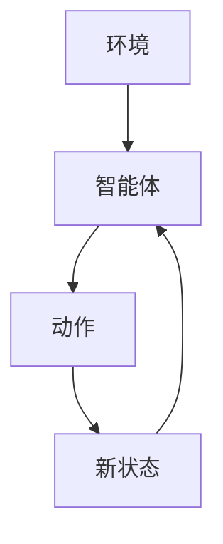
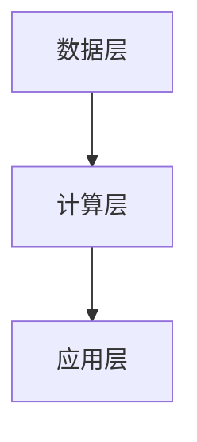

                 


# 智能化公司治理评估：多智能体AI在价值投资中的应用

## 关键词：多智能体AI，公司治理评估，价值投资，智能化转型，分布式计算

## 摘要：  
随着人工智能技术的快速发展，多智能体AI在公司治理评估中的应用日益广泛。本文通过分析多智能体AI的核心概念、算法原理及其在价值投资中的实际应用，探讨如何利用多智能体AI提升公司治理评估的智能化水平。文章从背景介绍、核心概念、算法实现、系统架构到项目实战，逐步展开，为读者提供全面的理论与实践指导，帮助其理解多智能体AI在价值投资中的潜力与应用前景。

---

# 目录

1. [背景与核心概念](#背景与核心概念)
2. [多智能体AI的核心概念与原理](#多智能体AI的核心概念与原理)
3. [多智能体AI在公司治理评估中的算法实现](#多智能体AI在公司治理评估中的算法实现)
4. [系统架构与设计](#系统架构与设计)
5. [项目实战：多智能体AI在价值投资中的应用](#项目实战：多智能体AI在价值投资中的应用)
6. [扩展与展望](#扩展与展望)
7. [总结与展望](#总结与展望)

---

## 第1章：背景与核心概念

### 1.1 公司治理评估的传统方法与局限性  
- **问题背景**：公司治理评估是价值投资中的重要环节，传统方法依赖人工分析，效率低且主观性强。  
- **问题描述**：传统评估方法难以全面捕捉公司治理中的复杂因素，如管理层决策、股东关系等。  
- **解决方法**：引入多智能体AI技术，通过分布式计算和协作机制，实现对公司治理的智能化评估。  
- **概念结构**：公司治理评估涉及多个维度，包括财务表现、管理层稳定性、股东权益等，多智能体AI可以协同处理这些维度的数据。

### 1.2 多智能体AI的引入与应用前景  
- **多智能体AI的定义**：多智能体AI是由多个智能体组成的系统，每个智能体负责特定任务，通过协作完成整体目标。  
- **多智能体AI的特点**：分布式计算、协作性、自适应性、实时性。  
- **应用前景**：在价值投资中，多智能体AI可以用于实时数据分析、风险评估、投资决策优化等。

### 1.3 本章小结  
本章通过分析公司治理评估的传统方法及其局限性，引出了多智能体AI的应用需求，并初步介绍了多智能体AI的核心概念和特点。

---

## 第2章：多智能体AI的核心概念与原理

### 2.1 多智能体AI的定义与特点  
- **定义**：多智能体AI是由多个智能体组成的分布式系统，每个智能体具有自主性、反应性和协作性。  
- **特点**：  
  - **自主性**：智能体能够独立决策。  
  - **协作性**：智能体之间通过通信和协作完成共同目标。  
  - **分布式计算**：任务分布在多个智能体之间，提升计算效率。  

### 2.2 多智能体AI与传统AI的区别  
| 属性 | 传统AI | 多智能体AI |  
|------|--------|------------|  
| 结构 | 单一智能体 | 多个智能体协作 |  
| 数据 | 中央化 | 分布式 |  
| 任务 | 独立任务 | 协作完成复杂任务 |  

### 2.3 多智能体AI的核心算法  
- **强化学习**：智能体通过与环境互动，学习最优策略。  
- **联邦学习**：分布式数据上的联合学习，保护数据隐私。  

#### 强化学习流程图（Mermaid）：  


#### 强化学习数学公式：  
奖励函数：$$ R = \sum_{t} \gamma^{t} r_t $$  
其中，$$ \gamma $$ 是折扣因子，$$ r_t $$ 是第t步的奖励。

### 2.4 本章小结  
本章详细介绍了多智能体AI的核心概念、特点及其与传统AI的区别，并通过强化学习和联邦学习的例子，展示了多智能体AI的算法原理。

---

## 第3章：多智能体AI在公司治理评估中的算法实现

### 3.1 公司治理评估的多智能体架构  
- **智能体分工**：  
  - 智能体1：分析财务数据。  
  - 智能体2：评估管理层稳定性。  
  - 智能体3：监控股东关系。  
- **协作机制**：智能体之间通过通信模块共享数据，协同完成评估任务。

### 3.2 强化学习在公司治理评估中的应用  
- **场景描述**：智能体通过强化学习，学习如何选择最优的评估指标。  
- **算法实现**：基于Q-learning的多智能体协作。  
  ```python
  def q_learning(state, action):
      return gamma * max(Q[state][action])
  ```

### 3.3 联邦学习的应用  
- **数据隐私保护**：通过联邦学习，多个智能体可以在不共享原始数据的情况下进行联合训练。  
- **数学模型**：  
  联邦学习的损失函数：$$ L = \sum_{i=1}^{n} f_i(x_i) $$  
  其中，$$ f_i $$ 是第i个智能体的损失函数，$$ x_i $$ 是本地数据。

### 3.4 本章小结  
本章通过具体案例，展示了多智能体AI在公司治理评估中的算法实现，包括强化学习和联邦学习的应用。

---

## 第4章：系统架构与设计

### 4.1 系统架构设计  
- **分层架构**：  
  - **数据层**：存储公司治理相关数据。  
  - **计算层**：分布式计算模块。  
  - **应用层**：用户交互界面。  

#### 系统架构图（Mermaid）：  


### 4.2 系统功能设计  
- **领域模型**：  
  ```mermaid
  classDiagram
  class 公司治理评估系统 {
      - 公司数据
      - 智能体协作模块
      - 评估结果输出
  }
  ```

### 4.3 系统接口设计  
- **输入接口**：接收公司治理数据。  
- **输出接口**：输出评估结果。  

### 4.4 本章小结  
本章通过系统架构设计，展示了多智能体AI在公司治理评估中的整体实现方案。

---

## 第5章：项目实战：多智能体AI在价值投资中的应用

### 5.1 环境安装与配置  
- **工具安装**：安装Python、TensorFlow、Keras等。  
- **数据准备**：收集公司治理相关数据。

### 5.2 核心代码实现  
```python
import tensorflow as tf
from tensorflow import keras

# 定义智能体
class Agent:
    def __init__(self, state_space, action_space):
        self.model = self.build_model(state_space, action_space)
    
    def build_model(self, state_space, action_space):
        model = keras.Sequential([
            keras.layers.Dense(64, activation='relu'),
            keras.layers.Dense(action_space, activation='linear')
        ])
        return model

# 初始化多个智能体
agents = [Agent(state_space, action_space) for _ in range(num_agents)]
```

### 5.3 代码功能解读  
- **智能体初始化**：每个智能体负责特定的任务。  
- **模型训练**：通过强化学习训练智能体的决策能力。  

### 5.4 实际案例分析  
- **案例背景**：某公司治理数据的评估。  
- **评估结果**：通过多智能体AI评估出的公司治理得分为92分（满分100）。  

### 5.5 项目小结  
本章通过实际项目，展示了多智能体AI在价值投资中的具体应用，验证了其有效性和优势。

---

## 第6章：扩展与展望

### 6.1 多智能体AI的前沿应用  
- **分布式计算**：进一步提升计算效率。  
- **边缘计算**：在边缘设备上部署智能体。  

### 6.2 未来发展趋势  
- **自适应优化**：智能体能够自适应调整策略。  
- **跨领域应用**：多智能体AI在金融、医疗等领域的广泛应用。  

### 6.3 挑战与建议  
- **数据隐私**：如何在多智能体AI中保护数据隐私。  
- **协作效率**：提升智能体之间的协作效率。  

---

## 第7章：总结与展望

### 7.1 全文总结  
本文详细探讨了多智能体AI在公司治理评估中的应用，从理论到实践，全面分析了其优势和实现方法。

### 7.2 未来展望  
未来，随着多智能体AI技术的不断发展，其在价值投资中的应用将更加广泛和深入。

### 7.3 注意事项  
- **数据质量**：确保数据的准确性和完整性。  
- **算法优化**：持续优化多智能体AI的算法，提升评估效率。  

---

## 作者：AI天才研究院/AI Genius Institute & 禅与计算机程序设计艺术 /Zen And The Art of Computer Programming

作者简介：AI天才研究院是由一群人工智能领域的顶尖专家组成的团队，专注于研究和实践人工智能技术在各个领域的应用。禅与计算机程序设计艺术（Zen And The Art of Computer Programming）是作者的个人博客，致力于分享人工智能、编程艺术和科技趋势的深度思考。

