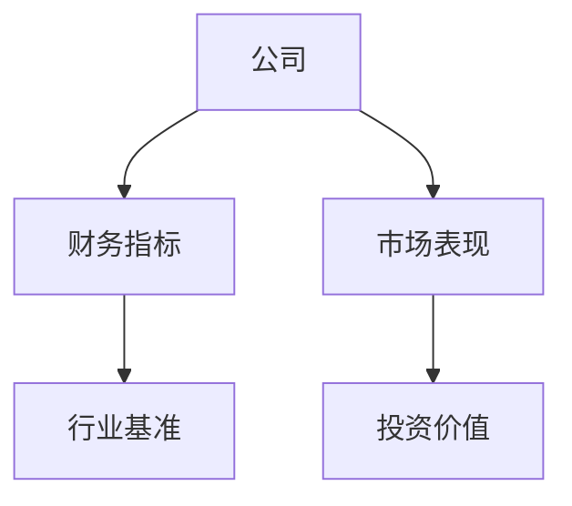
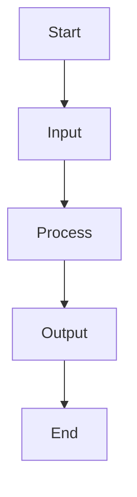
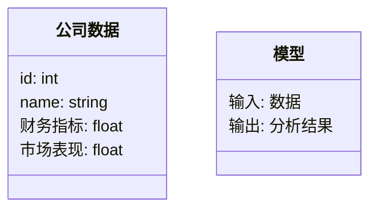
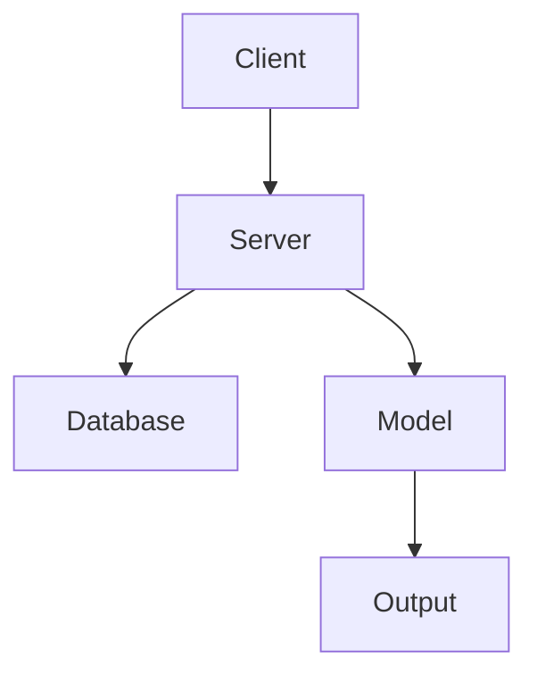
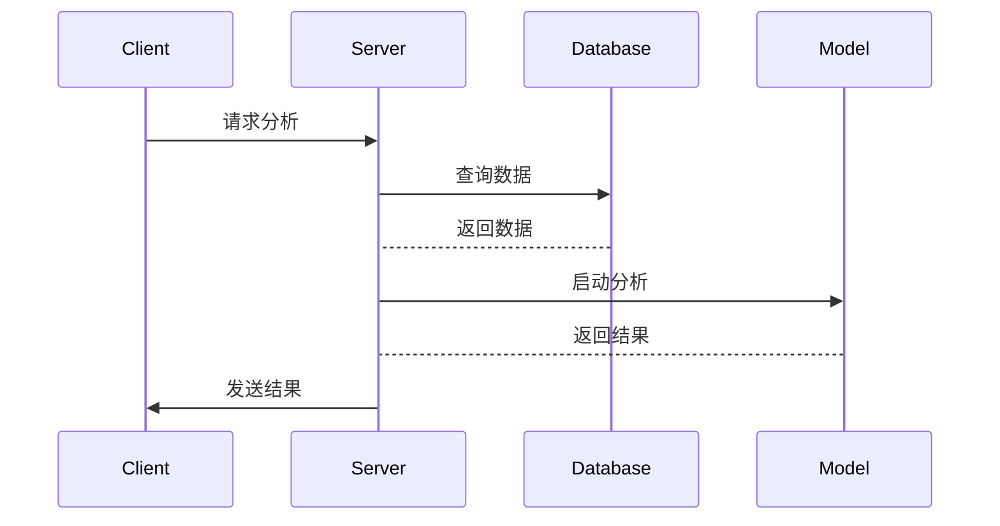

                 


# 智能化公司间比较分析：多智能体AI的价值投资应用

> 关键词：多智能体AI、价值投资、公司比较分析、智能投资决策、机器学习

> 摘要：本文深入探讨了多智能体AI在价值投资中的应用，特别是公司间比较分析的智能化实现。通过系统化的分析，本文揭示了多智能体AI如何提升投资决策的效率和准确性，并通过实际案例展示了其在价值投资中的潜力和优势。

---

## 第1章：智能化公司比较分析的背景介绍

### 1.1 问题背景

#### 1.1.1 传统公司比较分析的局限性
传统的公司比较分析依赖于人工筛选和分析，存在以下问题：
- 数据量大、维度多，难以高效处理。
- 分析结果主观性强，受分析师经验限制。
- 市场动态变化快，难以及时捕捉机会。

#### 1.1.2 人工智能在金融分析中的潜力
人工智能（AI）技术的快速发展为金融分析提供了新的工具：
- 自然语言处理（NLP）可以分析公司财报和新闻。
- 机器学习算法可以预测市场趋势和公司业绩。
- 强化学习可以优化投资组合和交易策略。

#### 1.1.3 多智能体AI的应用前景
多智能体AI通过协同工作，能够更全面地分析公司间的复杂关系：
- 每个智能体专注于不同的数据源或分析维度。
- 智能体之间的协同可以提高分析的准确性和效率。

### 1.2 问题描述

#### 1.2.1 公司比较分析的核心目标
公司比较分析的核心目标是：
- 识别具有投资价值的公司。
- 发现市场中的潜在风险。
- 提供数据支持的决策依据。

#### 1.2.2 多智能体AI在价值投资中的角色
多智能体AI在价值投资中的主要作用包括：
- 数据收集与处理。
- 模型构建与优化。
- 投资策略生成与执行。

#### 1.2.3 智能化分析的实现路径
智能化公司比较分析的实现路径包括：
1. 数据收集与预处理。
2. 模型训练与优化。
3. 结果分析与反馈。

---

## 第2章：多智能体AI的核心概念与联系

### 2.1 多智能体AI的定义与特点

#### 2.1.1 多智能体AI的定义
多智能体AI是指由多个智能体组成的系统，每个智能体负责特定的任务或数据源。

#### 2.1.2 各个模型的对比分析
以下是几种常见模型的对比：

| 模型类型 | 输入 | 输出 | 优势 |
|----------|------|------|------|
| 强化学习 | 状态 | 动作 | 策略优化 |
| 分布式计算 | 数据 | 分析结果 | 并行处理 |

#### 2.1.3 多智能体AI的核心要素
多智能体AI的核心要素包括：
- 智能体间的通信机制。
- 协作任务的分配策略。
- 系统的自适应能力。

### 2.2 多智能体AI的ER实体关系图



### 2.3 多智能体AI的算法原理

#### 2.3.1 强化学习算法
强化学习算法通过智能体与环境的交互来优化策略。以下是强化学习的基本流程：



数学模型：
$$ V(s) = \max_{a} [r + V(s') ] $$

#### 2.3.2 分布式计算
分布式计算通过多台机器协作来提高计算效率：
- 并行计算：任务分解为多个子任务，同时处理。
- 集群管理：协调多个智能体的工作。
- 负载均衡：动态分配任务以提高效率。

---

## 第3章：系统架构设计

### 3.1 问题场景介绍

#### 3.1.1 数据获取与预处理
数据来源包括：
- 公司财报。
- 市场数据。
- 新闻报道。

预处理步骤包括：
- 数据清洗。
- 特征提取。
- 数据标准化。

#### 3.1.2 模型训练与部署
模型训练步骤：
- 数据分割：训练集、验证集、测试集。
- 模型选择：基于任务需求选择合适的算法。
- 参数调优：优化模型性能。

模型部署：
- 模型封装：将模型部署到服务器。
- 接口设计：提供API供其他系统调用。

#### 3.1.3 结果分析与反馈
结果分析包括：
- 模型表现评估。
- 结果可视化。
- 模型优化建议。

### 3.2 系统功能设计



### 3.3 系统架构设计



### 3.4 系统接口设计

#### 3.4.1 数据接口
接口描述：
- 输入：公司数据。
- 输出：处理后的数据。

代码示例：
```python
import pandas as pd

def preprocess_data(data):
    # 数据清洗
    data = data.dropna()
    # 特征提取
    data['增长率'] = data['收入'].pct_change()
    return data
```

#### 3.4.2 模型接口
接口描述：
- 输入：公司数据。
- 输出：分析结果。

代码示例：
```python
import numpy as np

def train_model(data):
    # 训练模型
    model = np.random.rand(3,3)
    return model
```

### 3.5 系统交互设计



---

## 第4章：项目实战

### 4.1 环境安装

#### 4.1.1 安装Python
```bash
python --version
pip install --upgrade pip
```

#### 4.1.2 安装依赖库
```bash
pip install numpy pandas scikit-learn
```

#### 4.1.3 配置开发环境
建议使用Jupyter Notebook或VS Code进行开发。

### 4.2 核心实现代码

#### 4.2.1 数据预处理
```python
import pandas as pd

def preprocess_data(data):
    # 删除缺失值
    data = data.dropna()
    # 添加增长率特征
    data['增长率'] = data['收入'].pct_change()
    return data
```

#### 4.2.2 模型训练
```python
import numpy as np
from sklearn.linear_model import LinearRegression

def train_model(data):
    # 训练线性回归模型
    model = LinearRegression()
    model.fit(data[['收入', '利润']], data['股价'])
    return model
```

#### 4.2.3 模型预测
```python
def predict_stock(model, new_data):
    # 预测股价
    prediction = model.predict(new_data[['收入', '利润']])
    return prediction
```

### 4.3 案例分析

#### 4.3.1 数据来源
使用某行业的多家公司数据，包括收入、利润、股价等。

#### 4.3.2 分析过程
1. 数据预处理。
2. 模型训练。
3. 模型预测。
4. 结果分析。

#### 4.3.3 结果解读
- 模型预测的股价与实际股价的对比。
- 模型的准确率评估。

---

## 第5章：最佳实践与总结

### 5.1 小结

#### 5.1.1 项目总结
通过多智能体AI，我们实现了公司间的智能化比较分析，提高了投资决策的效率和准确性。

#### 5.1.2 经验教训
- 数据质量对模型性能影响重大。
- 模型调优需要结合具体业务场景。
- 系统设计需要考虑可扩展性和可维护性。

#### 5.1.3 未来展望
未来，随着AI技术的不断发展，多智能体AI在金融领域的应用将更加广泛和深入。

### 5.2 注意事项

#### 5.2.1 数据质量
- 数据来源要可靠。
- 数据预处理要彻底。

#### 5.2.2 模型调优
- 选择合适的算法。
- 调优模型参数。

#### 5.2.3 安全与合规性
- 确保数据安全。
- 遵守相关法律法规。

### 5.3 拓展阅读
- [《机器学习实战》](https://zh.wikipedia.org/wiki/《机器学习实战》)
- [《分布式系统》](https://zh.wikipedia.org/wiki/《分布式系统》)

---

作者：AI天才研究院/AI Genius Institute & 禅与计算机程序设计艺术/Zen And The Art of Computer Programming

