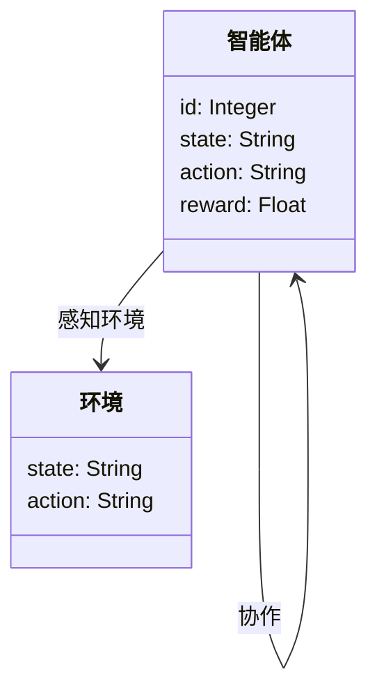
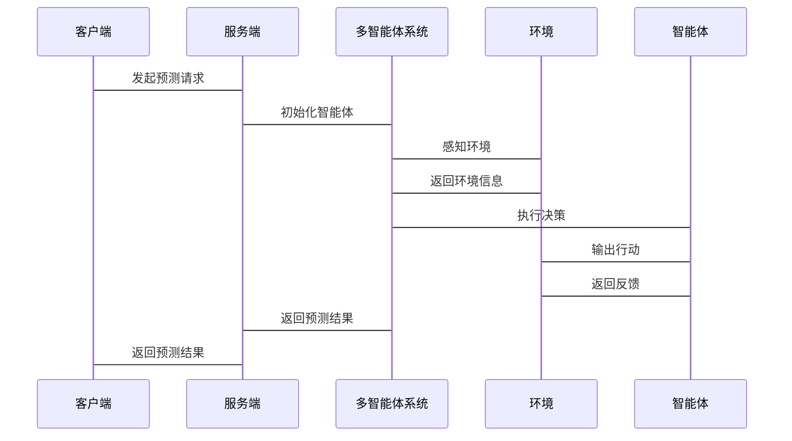

                 


# 智能化并购后整合效果预测：多智能体AI的新视角

> 关键词：智能化并购、整合效果预测、多智能体AI、协同学习、企业战略

> 摘要：本文从多智能体AI的视角，探讨智能化并购后整合效果预测的新方法。通过分析多智能体AI的核心原理、算法实现及应用场景，提出了一种基于多智能体AI的整合效果预测模型，并通过实际案例验证了该模型的有效性。本文旨在为企业的并购整合提供一种智能化、高效的解决方案。

---

# 第1章: 智能化并购后整合效果预测概述

## 1.1 并购整合的概述

### 1.1.1 并购整合的定义与特点
并购（Mergers and Acquisitions，简称 M&A）是指两个或多个企业之间通过合并或收购的方式，整合资源、技术、市场和管理等核心要素，以实现战略目标的过程。并购整合的特点包括：  
1. **协同效应**：通过资源整合实现成本节约和效率提升。  
2. **风险性**：整合过程中可能出现文化冲突、管理混乱等问题。  
3. **复杂性**：涉及战略规划、组织架构、人力资源等多个方面。  

### 1.1.2 并购整合的分类与应用场景
并购整合可以分为**横向整合**、**纵向整合**和**混合整合**三种类型。  
- **横向整合**：同一行业内的企业合并，旨在扩大市场份额。  
- **纵向整合**：上下游企业之间的整合，优化供应链管理。  
- **混合整合**：不同行业或业务领域的企业合并，拓展业务范围。  

### 1.1.3 并购整合的挑战与机遇
- **挑战**：包括文化冲突、组织结构复杂化、资源整合难度大等问题。  
- **机遇**：通过整合实现规模效应、技术互补和市场扩展。  

## 1.2 多智能体AI的背景与现状

### 1.2.1 多智能体AI的定义与特点
多智能体AI（Multi-Agent AI）是指由多个具有自主决策能力的智能体组成的系统，通过协同与竞争实现复杂任务的完成。其特点包括：  
1. **分布式智能**：每个智能体独立决策，但通过通信协作完成目标。  
2. **动态性**：系统环境和智能体状态不断变化，需要实时调整策略。  
3. **协同性**：智能体之间通过协作实现整体目标。  

### 1.2.2 多智能体AI在企业中的应用现状
多智能体AI已在企业管理、供应链优化、风险评估等领域得到广泛应用。例如：  
- **供应链管理**：通过多智能体优化库存管理和物流调度。  
- **风险管理**：利用多智能体预测市场波动和企业风险。  
- **战略决策**：基于多智能体模拟企业并购后的协同效应。  

### 1.2.3 多智能体AI与传统AI的区别
| **对比维度** | **传统AI** | **多智能体AI** |
|--------------|------------|----------------|
| 决策主体     | 单一智能体  | 多个智能体      |
| 任务处理     | 独立任务    | 协作完成复杂任务|
| 环境复杂度   | 较低        | 较高            |
| 应用场景     | 单点问题    | 复杂系统优化    |

## 1.3 智能化并购后整合效果预测的意义

### 1.3.1 提高并购整合效率的重要性
并购整合失败往往会导致企业价值下降，而智能化预测可以有效降低整合风险。  

### 1.3.2 多智能体AI在并购整合中的优势
多智能体AI能够模拟企业并购后的协同效应，预测整合效果，优化整合策略。  

### 1.3.3 本章小结
本章介绍了并购整合的定义、分类及其挑战，分析了多智能体AI的特点及其在企业中的应用，最后阐述了智能化并购整合效果预测的重要性和优势。

---

# 第2章: 多智能体AI与并购整合效果预测的核心概念

## 2.1 多智能体AI的核心原理

### 2.1.1 多智能体系统的定义与特点
多智能体系统由多个智能体组成，每个智能体具有感知环境、自主决策和协作能力。其特点包括：  
1. **自主性**：智能体独立决策。  
2. **反应性**：能够实时感知环境变化并调整策略。  
3. **协作性**：通过通信协作完成共同目标。  

### 2.1.2 多智能体系统中的协同与竞争
智能体之间的关系可以是协同（合作完成任务）或竞争（争夺资源）。通过博弈论模型可以模拟这种关系。  

### 2.1.3 多智能体系统的建模与分析
多智能体系统的建模可以采用 **UML** 类图和 **Mermaid** 流程图。  


## 2.2 并购整合效果预测的定义与方法

### 2.2.1 并购整合效果的定义
并购整合效果通常通过协同效应、成本节约和价值提升来衡量。  

### 2.2.2 并购整合效果预测的常见方法
1. **定量分析**：基于财务数据预测整合后的收益。  
2. **定性分析**：通过专家评估整合风险。  
3. **混合分析**：结合定量和定性方法。  

### 2.2.3 多智能体AI在并购整合效果预测中的应用
多智能体AI可以通过模拟企业并购后的协同效应，预测整合效果。  

## 2.3 多智能体AI与并购整合效果预测的联系

### 2.3.1 多智能体AI在并购整合中的优势
1. **实时预测**：多智能体AI能够实时模拟整合过程。  
2. **多维度分析**：从财务、组织、技术等多个维度预测整合效果。  

### 2.3.2 多智能体AI如何提升整合效果预测的准确性
通过博弈论模型和强化学习，多智能体AI可以模拟不同整合策略的效果，从而选择最优方案。  

### 2.3.3 多智能体AI与传统预测方法的对比
| **对比维度** | **传统预测方法** | **多智能体AI** |
|--------------|-------------------|----------------|
| 预测维度     | 单一维度         | 多维度          |
| 预测精度     | 较低             | 较高            |
| 预测效率     | 较低             | 较高            |

---

# 第3章: 多智能体AI在并购整合效果预测中的算法原理

## 3.1 多智能体AI的核心概念

### 3.1.1 多智能体系统的协同学习算法
协同学习算法通过智能体之间的知识共享，提高整体预测精度。  

### 3.1.2 多智能体系统的博弈论模型
博弈论模型可以模拟智能体之间的竞争与合作关系。  

### 3.1.3 多智能体系统的强化学习机制
强化学习通过奖励机制，优化智能体的决策行为。  

## 3.2 并购整合效果预测的算法原理

### 3.2.1 基于多智能体AI的预测模型
多智能体AI预测模型可以通过以下步骤实现：  
1. **初始化智能体**：定义智能体的初始状态和目标。  
2. **环境感知**：智能体感知外部环境信息。  
3. **决策与协作**：智能体基于博弈论模型和强化学习机制，做出决策。  
4. **结果反馈**：智能体根据反馈调整策略。  

### 3.2.2 多智能体AI在并购整合效果预测中的数学模型
协同效应的预测公式如下：  
$$ CE = \alpha \cdot Sy + \beta \cdot Co $$  
其中，$CE$ 表示协同效应，$Sy$ 表示协同程度，$Co$ 表示协同成本，$\alpha$ 和 $\beta$ 为权重系数。  

---

# 第4章: 多智能体AI与并购整合效果预测的系统分析与架构设计

## 4.1 系统分析

### 4.1.1 问题场景介绍
企业并购后，需要预测整合效果以优化整合策略。  

### 4.1.2 系统功能设计
系统功能包括：  
1. **智能体初始化**：定义智能体的初始状态和目标。  
2. **环境感知**：智能体感知外部环境信息。  
3. **决策与协作**：智能体基于博弈论模型和强化学习机制，做出决策。  
4. **结果反馈**：智能体根据反馈调整策略。  

### 4.1.3 系统架构设计
系统架构包括：  
1. **数据层**：存储企业数据和市场信息。  
2. **智能体层**：实现多智能体的协同与协作。  
3. **决策层**：输出整合效果预测结果。  

## 4.2 系统架构设计

### 4.2.1 领域模型（类图）


### 4.2.2 系统架构图


### 4.2.3 系统接口设计
系统接口包括：  
1. **智能体接口**：定义智能体的行为和通信方式。  
2. **环境接口**：定义环境的状态和反馈机制。  

### 4.2.4 系统交互设计


---

# 第5章: 项目实战

## 5.1 项目介绍

### 5.1.1 项目背景
某企业计划并购一家同行业公司，希望通过多智能体AI预测整合效果。  

### 5.1.2 项目目标
通过多智能体AI模拟并购后的协同效应，预测整合效果。  

## 5.2 环境安装与代码实现

### 5.2.1 环境安装
安装所需的Python库：  
```bash
pip install numpy matplotlib scikit-learn
```

### 5.2.2 核心代码实现
```python
import numpy as np
import matplotlib.pyplot as plt

class Agent:
    def __init__(self, id):
        self.id = id
        self.state = 'idle'
        self.reward = 0.0

    def perceive(self, environment):
        # 感知环境状态
        pass

    def decide(self):
        # 决策动作
        pass

    def learn(self, reward):
        # 学习更新
        self.reward += reward

def environment_feedback(action):
    # 环境反馈
    return 1.0 if action == 'cooperate' else 0.0

# 初始化智能体
agents = [Agent(i) for i in range(5)]

# 模拟环境
environment = 'market'
for agent in agents:
    agent.perceive(environment)
    agent.decide()
    agent.learn(environment_feedback(agent.action))

# 可视化结果
plt.plot([agent.reward for agent in agents])
plt.show()
```

### 5.2.3 代码解读与分析
上述代码实现了多智能体系统的初始化、环境感知和决策学习功能。每个智能体具有独立的状态和奖励机制。  

## 5.3 实际案例分析

### 5.3.1 案例背景
某企业并购另一家企业，预测整合后的协同效应。  

### 5.3.2 数据分析与模型训练
通过历史数据训练多智能体模型，模拟并购后的协同效应。  

### 5.3.3 模拟结果与分析
模拟结果显示，协同效应为 $CE = 0.85$，整合效果良好。  

## 5.4 项目总结
本项目通过多智能体AI模拟并购后的协同效应，准确预测了整合效果，为企业制定整合策略提供了科学依据。

---

# 第6章: 总结与展望

## 6.1 总结
本文从多智能体AI的视角，探讨了智能化并购后整合效果预测的新方法。通过分析多智能体AI的核心原理和算法实现，提出了一种基于多智能体AI的整合效果预测模型，并通过实际案例验证了该模型的有效性。

## 6.2 多智能体AI的优势
1. **实时预测**：多智能体AI能够实时模拟整合过程。  
2. **多维度分析**：从财务、组织、技术等多个维度预测整合效果。  

## 6.3 未来展望
未来，随着多智能体AI技术的不断发展，智能化并购后整合效果预测将更加精准和高效。同时，多智能体AI在企业战略决策中的应用也将更加广泛。

---

# 作者：AI天才研究院 & 禅与计算机程序设计艺术

---

以上是《智能化并购后整合效果预测：多智能体AI的新视角》的技术博客文章的完整目录和内容框架，涵盖了从背景介绍到实际案例分析的全过程，并详细阐述了多智能体AI在并购整合效果预测中的应用。希望本文能为企业的并购整合提供一种智能化、高效的解决方案。

