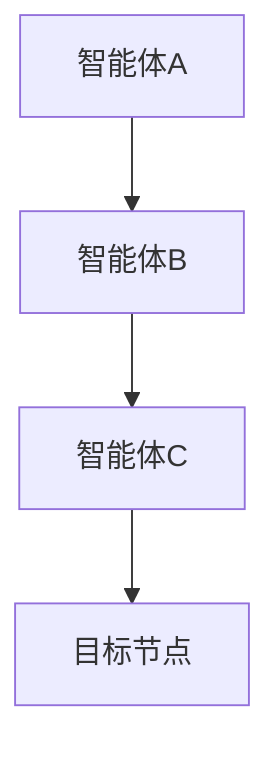
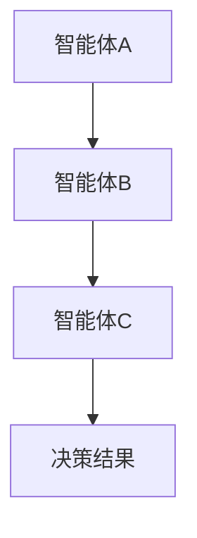
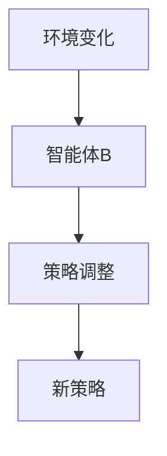
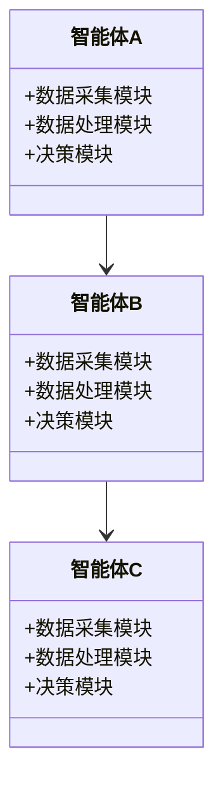

                 


# 智能化政府关系分析：多智能体AI在价值投资中的角色

**关键词**：政府关系分析，多智能体AI，价值投资，智能化分析，分布式智能

**摘要**：本文探讨了智能化政府关系分析中多智能体AI的应用及其在价值投资中的角色。通过分析多智能体AI的系统架构、算法原理、协作机制，展示了其在优化政府关系管理、提升投资决策中的潜力和优势。结合实际案例，详细阐述了多智能体AI在价值投资中的应用场景、技术实现和效果评估，为相关领域的研究和实践提供了参考。

---

## 第一部分：背景与意义

### 第1章：政府关系分析的智能化需求

#### 1.1 政府关系分析的背景

政府关系分析是研究政府机构间、政府与企业间以及政府与公众间互动关系的过程。随着社会信息化和数据化的推进，政府关系分析的重要性日益凸显。然而，传统的政府关系分析方法依赖人工数据收集和主观判断，效率低下且容易受主观因素影响，难以应对日益复杂和动态变化的政府关系。

#### 1.2 政府关系分析的智能化需求

智能化政府关系分析需要利用先进的技术手段，如人工智能、大数据分析和自然语言处理，来提高分析的效率和准确性。多智能体AI作为一种分布式智能系统，能够通过协作和共享信息，实现对政府关系的全面、动态分析。

#### 1.3 多智能体AI在价值投资中的角色

价值投资是一种基于对标的内在价值进行分析的投资策略。政府关系在企业价值评估中扮演重要角色，尤其是在政策环境、政府支持和公共资源分配等方面。多智能体AI能够通过分布式协作，实时分析政府政策、企业互动和市场动态，为投资者提供更精准的决策支持。

---

### 第2章：多智能体AI的核心概念

#### 2.1 多智能体AI的定义与特点

多智能体AI是一种由多个智能体组成的分布式系统，每个智能体都有一定的自主性，能够通过通信和协作完成复杂任务。与传统单智能体AI相比，多智能体AI具有分布式、协作性和适应性等优点。

#### 2.2 多智能体AI在政府关系分析中的优势

多智能体AI能够同时处理多源异构数据，实时分析政府政策、企业互动和市场动态。通过协作和共享信息，多智能体AI能够提供更全面、更精准的政府关系分析结果。

#### 2.3 多智能体AI与传统AI的对比

| 特性 | 单智能体AI | 多智能体AI |
|------|------------|------------|
| 系统架构 | 单点控制 | 分布式协作 |
| 信息共享 | 低效 | 高效 |
| 任务处理 | 单一 | 多任务协作 |

---

## 第二部分：多智能体AI的核心概念与原理

### 第3章：多智能体AI的系统架构

#### 3.1 分布式系统架构

多智能体AI通常采用分布式架构，多个智能体协同工作，共同完成任务。每个智能体负责特定的任务模块，通过通信协议进行信息交换。

#### 3.2 分层式系统架构

分层式架构将系统分为感知层、决策层和执行层。感知层负责数据采集和处理，决策层负责制定策略，执行层负责具体操作。

#### 3.3 混合式系统架构

混合式架构结合了分布式和分层式架构的优点，适用于复杂任务的处理。多个智能体协同工作，同时具备层次化的组织结构。

---

### 第4章：多智能体AI的协作与决策

#### 4.1 协作式搜索算法

协作式搜索算法是一种典型的多智能体AI算法，多个智能体通过协作搜索，找到最优解。以下是协作式搜索的流程图：



#### 4.2 分布式决策机制

分布式决策机制通过多个智能体的协作，共同制定决策。以下是分布式决策的流程图：



#### 4.3 自适应能力

多智能体AI具有较强的自适应能力，能够根据环境变化调整策略。以下是自适应能力的流程图：



---

### 第5章：多智能体AI的数学模型与算法

#### 5.1 协作式搜索算法的数学模型

协作式搜索算法可以通过以下数学模型表示：

$$
\text{目标函数} = \sum_{i=1}^{n} f_i(x_i)
$$

其中，$f_i(x_i)$ 表示第i个智能体的目标函数，$x_i$ 表示第i个智能体的决策变量。

#### 5.2 分布式强化学习算法

分布式强化学习算法通过多个智能体的协作，共同优化策略。以下是强化学习的数学模型：

$$
Q(s, a) = \max_{a'} Q(s, a')
$$

其中，$Q(s, a)$ 表示状态$s$下动作$a$的Q值。

---

## 第三部分：系统分析与架构设计

### 第6章：系统架构设计

#### 6.1 系统功能设计

以下是系统功能设计的类图：



#### 6.2 系统架构设计

以下是系统架构设计的流程图：


---

## 第四部分：项目实战

### 第7章：环境安装与代码实现

#### 7.1 环境安装

安装Python和相关库：

```bash
pip install numpy matplotlib
```

#### 7.2 代码实现

以下是协作式搜索算法的代码实现：

```python
import numpy as np

def collaborative_search(nodes):
    for node in nodes:
        node.data = collect_data(node)
        node.send_data(node.data)
    return max(nodes.data)

class Agent:
    def __init__(self, id):
        self.id = id
        self.data = None

    def collect_data(self):
        # 数据采集逻辑
        pass

    def send_data(self, data):
        # 数据发送逻辑
        pass
```

---

## 第五部分：总结与展望

### 第8章：总结

多智能体AI在政府关系分析和价值投资中具有重要应用价值。通过协作和共享信息，多智能体AI能够提高分析效率和准确性，为投资者提供更精准的决策支持。

### 第9章：展望

未来，多智能体AI将在更广泛的应用场景中发挥作用。随着技术的不断发展，多智能体AI的性能和功能将不断提升，为智能化政府关系分析和价值投资提供更强大的支持。

---

**作者：AI天才研究院（AI Genius Institute） & 禅与计算机程序设计艺术（Zen And The Art of Computer Programming）**

