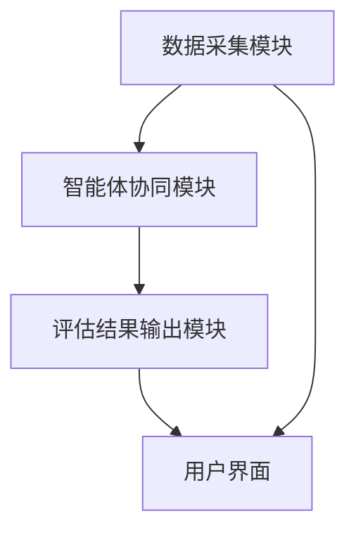
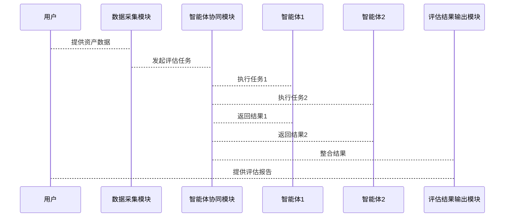

                 


# 智能化无形资产价值评估：多智能体AI的新方法

## 关键词：无形资产评估，多智能体AI，人工智能，智能化评估，价值评估方法

## 摘要：
随着人工智能技术的快速发展，无形资产的价值评估变得越来越重要。传统的无形资产评估方法存在诸多局限性，难以应对复杂多变的市场环境。本文提出了一种基于多智能体AI的新方法，通过多个智能体协同工作，实现对无形资产的智能化、动态化评估。文章详细介绍了多智能体AI的基本原理、评估模型的构建、系统架构设计以及实际应用场景，为读者提供了一种高效、精准的无形资产评估新思路。

---

## 第1章：无形资产与智能化评估的背景

### 1.1 无形资产的基本概念

#### 1.1.1 无形资产的定义与分类
无形资产是指企业或个人拥有的非实物性资产，主要包括专利权、商标权、著作权、商誉、品牌价值等。无形资产的价值往往难以通过传统财务指标直接衡量，其评估需要结合市场环境、行业特点和资产的实际应用场景。

#### 1.1.2 无形资产在经济活动中的重要性
无形资产在现代经济中扮演着重要角色，尤其是在高科技行业和服务业。例如，技术创新带来的专利权和商标权的价值可能远超有形资产的价值。因此，准确评估无形资产的价值对于企业的战略决策、投资评估和资本运作具有重要意义。

#### 1.1.3 传统无形资产评估方法的局限性
传统无形资产评估方法通常依赖于财务指标和历史数据，难以捕捉到市场动态变化和资产的实际贡献价值。例如，基于收益法的评估方法可能无法准确反映创新性资产的未来价值潜力。

### 1.2 智能化评估的背景与需求

#### 1.2.1 数字化与智能化时代的无形资产评估挑战
在数字化和智能化时代，无形资产的价值往往与技术创新、知识积累和市场影响力密切相关。然而，传统评估方法难以应对多维度、动态化的市场环境，导致评估结果的准确性和及时性不足。

#### 1.2.2 多智能体AI在无形资产评估中的应用前景
多智能体AI通过多个智能体协同工作，能够从不同维度获取和分析数据，从而更全面地评估无形资产的价值。例如，可以通过多个智能体分别评估专利的市场影响力、技术领先性和潜在收益，最终结合各智能体的评估结果得出综合价值。

#### 1.2.3 无形资产评估的智能化转型趋势
随着AI技术的不断进步，智能化评估已成为无形资产评估的必然趋势。通过引入多智能体AI技术，可以实现对无形资产的动态化、精细化评估，从而为企业和投资者提供更准确的决策支持。

---

## 第2章：多智能体AI的基本原理

### 2.1 多智能体系统概述

#### 2.1.1 多智能体系统的定义与特点
多智能体系统（Multi-Agent System, MAS）是由多个智能体组成的分布式系统，每个智能体都是一个能够独立感知环境并采取行动的主体。多智能体系统具有分布式性、协作性、智能性和动态性等特点。

#### 2.1.2 多智能体系统的核心要素
- **智能体**：智能体是多智能体系统的基本单元，具有感知、决策和行动能力。
- **通信机制**：智能体之间通过通信机制进行信息交换和协同工作。
- **协作任务**：多个智能体协同完成特定任务，通常需要任务分配和协调机制。

#### 2.1.3 多智能体系统与传统AI的区别
与传统AI相比，多智能体系统具有以下优势：
- **分布式计算**：多个智能体协同工作，能够处理复杂任务。
- **动态适应**：智能体能够根据环境变化动态调整行为。
- **协作能力**：智能体之间可以协同完成任务，提高整体效率。

### 2.2 多智能体系统的协同机制

#### 2.2.1 分布式智能与协作原理
多智能体系统通过分布式智能实现协作，每个智能体负责特定的任务，通过通信机制共享信息并协同完成整体目标。

#### 2.2.2 多智能体之间的通信与协调
智能体之间的通信可以通过消息传递或共享数据库实现。协调机制包括任务分配、冲突解决和协作规划。

#### 2.2.3 多智能体系统的任务分配与决策
任务分配是多智能体系统中的关键问题，通常需要考虑智能体的能力、资源分配和任务优先级。决策过程可以通过分布式算法实现，例如基于拍卖的任务分配算法。

---

## 第3章：多智能体AI在无形资产评估中的应用

### 3.1 多智能体AI在无形资产评估中的优势

#### 3.1.1 提高评估效率与准确性
多智能体系统能够从多个维度获取数据，通过协同计算提高评估的准确性和效率。

#### 3.1.2 多维度数据的整合与分析
多智能体系统能够整合文本数据、市场数据、技术数据等多维度信息，通过协同分析得出更全面的评估结果。

#### 3.1.3 动态评估能力的增强
多智能体系统能够实时感知市场变化，动态调整评估模型，确保评估结果的及时性和准确性。

### 3.2 多智能体AI在无形资产评估中的具体应用

#### 3.2.1 知识产权评估中的多智能体协作
在知识产权评估中，可以使用多个智能体分别评估专利的技术价值、市场价值和法律风险。例如，技术价值评估可以通过自然语言处理技术分析专利的技术创新性和应用前景。

#### 3.2.2 品牌价值评估中的多智能体协同
品牌价值评估需要考虑品牌知名度、市场影响力和消费者偏好等多个因素。多智能体系统可以通过协同计算，综合评估品牌的价值。

#### 3.2.3 其他无形资产的智能化评估方法
其他无形资产，如商誉和版权，也可以通过多智能体AI进行评估。例如，商誉评估可以结合企业财务数据和市场表现，通过多个智能体协同计算得出。

---

## 第4章：多智能体AI评估模型的构建

### 4.1 多智能体评估模型的基本框架

#### 4.1.1 模型的输入与输出
模型输入包括资产数据、市场数据和相关参数；模型输出包括资产价值评估结果和评估报告。

#### 4.1.2 模型的核心算法与流程
评估模型的核心算法包括数据预处理、特征提取、模型训练和结果输出。通过多智能体协同计算，实现对资产价值的综合评估。

#### 4.1.3 模型的优化与改进
模型优化可以通过调整算法参数、引入新的数据源和改进协同机制实现。例如，可以通过强化学习优化智能体的协同策略。

### 4.2 多智能体评估模型的数学模型与公式

#### 4.2.1 智能体的协同计算公式
$$ V_{total} = \sum_{i=1}^{n} V_i $$
其中，$V_{total}$表示资产的总价值，$V_i$表示第i个智能体的评估结果。

#### 4.2.2 多智能体协同优化的数学模型
$$ \max \sum_{i=1}^{n} f_i(x_i) $$
其中，$f_i(x_i)$表示第i个智能体的优化目标，$x_i$表示智能体的决策变量。

---

## 第5章：系统架构设计与实现

### 5.1 系统功能设计

#### 5.1.1 系统功能模块
- **数据采集模块**：负责采集资产数据、市场数据和相关参数。
- **智能体协同模块**：实现多个智能体的通信与协同计算。
- **评估结果输出模块**：生成评估报告和可视化结果。

#### 5.1.2 系统功能流程
1. 数据采集模块获取输入数据。
2. 智能体协同模块分配任务并启动计算。
3. 各智能体分别完成任务并返回结果。
4. 评估结果输出模块整合各智能体的结果并生成最终报告。

### 5.2 系统架构设计

#### 5.2.1 系统架构图（Mermaid）


#### 5.2.2 系统交互流程（Mermaid）


---

## 第6章：项目实战与案例分析

### 6.1 项目实战

#### 6.1.1 环境安装与配置
- 需要安装Python、TensorFlow、Keras、自然语言处理库（如spaCy）等工具。

#### 6.1.2 核心代码实现
```python
class MultiAgentSystem:
    def __init__(self, agents):
        self.agents = agents

    def evaluate(self, task):
        results = []
        for agent in self.agents:
            results.append(agent.execute_task(task))
        return results

class Agent:
    def execute_task(self, task):
        # 具体任务实现
        pass
```

#### 6.1.3 代码应用解读
上述代码定义了一个多智能体系统，每个智能体负责执行特定任务。通过协同计算，实现对资产价值的综合评估。

### 6.2 案例分析

#### 6.2.1 知识产权评估案例
以某公司的专利评估为例，通过多智能体系统分别评估专利的技术价值、市场价值和法律风险，最终得出综合评估结果。

#### 6.2.2 品牌价值评估案例
以某品牌为例，通过多智能体系统评估品牌知名度、市场影响力和消费者偏好，最终得出品牌价值评估结果。

---

## 第7章：总结与展望

### 7.1 总结
本文提出了一种基于多智能体AI的无形资产评估方法，通过多个智能体协同工作，实现对无形资产的智能化、动态化评估。文章详细介绍了多智能体AI的基本原理、评估模型的构建、系统架构设计以及实际应用场景。

### 7.2 展望
未来，随着AI技术的不断发展，多智能体系统在无形资产评估中的应用将更加广泛。可以通过引入更先进的算法和优化机制，进一步提高评估的准确性和效率。

---

## 作者：AI天才研究院/AI Genius Institute & 禅与计算机程序设计艺术 /Zen And The Art of Computer Programming

