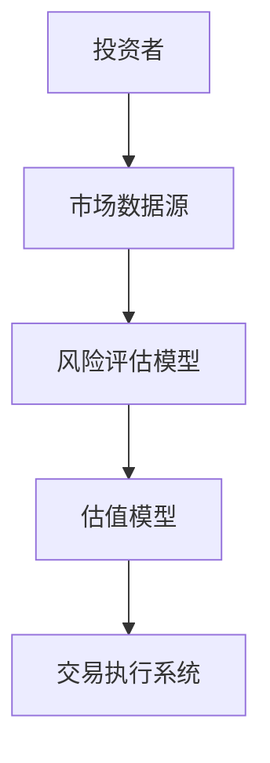
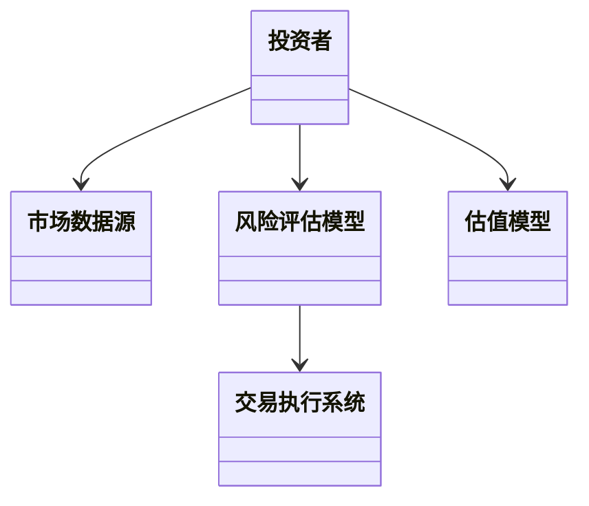
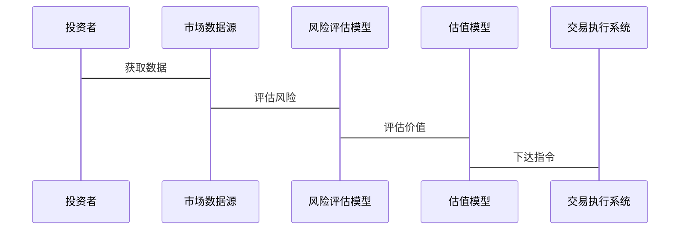

                 


# 智能化特殊情况投资：多智能体AI识别并购机会

> 关键词：智能化投资、多智能体AI、并购机会识别、知识图谱、强化学习、分布式计算

> 摘要：本文探讨了如何利用多智能体AI技术在特殊情况下的投资领域，特别是并购机会识别中的应用。通过结合知识图谱和强化学习，多智能体系统能够有效分析市场动态、企业估值和风险因素，从而帮助投资者做出更明智的决策。文章从多智能体系统的基本原理、算法实现、系统架构到实际案例进行了详细分析，为读者提供了全面的技术视角和实践指导。

---

## 第一章: 智能化投资的背景与挑战

### 1.1 投资领域的智能化转型

#### 1.1.1 传统投资与智能化投资的对比
- **传统投资**：依赖分析师的经验和市场直觉，主观性强，效率低。
- **智能化投资**：利用AI技术进行数据挖掘、模式识别和决策优化，效率高，覆盖面广。

#### 1.1.2 并购投资的核心问题与挑战
- **信息不对称**：并购涉及大量非公开信息，难以全面评估。
- **风险预测**：并购后的整合风险难以量化。
- **市场动态**：并购受宏观经济和行业趋势影响，难以预测。

#### 1.1.3 多智能体AI在投资领域的应用前景
- 多智能体系统能够协调多个AI模块，分别处理不同的信息源，提供更全面的分析。

### 1.2 多智能体系统的基本概念

#### 1.2.1 多智能体系统的定义与特点
- **定义**：由多个相互作用的智能体组成的系统，每个智能体负责特定任务。
- **特点**：分布式、协作性、自主性、动态性。

#### 1.2.2 多智能体系统与单智能体AI的区别
| 特性       | 单智能体AI                     | 多智能体AI                     |
|------------|-------------------------------|-------------------------------|
| 结构       | 单一中心节点                   | 分布式多节点                   |
| 任务分配   | 单一任务                      | 多任务协作                     |
| 信息处理   | 中心化                        | 去中心化                      |

#### 1.2.3 多智能体系统在金融领域的应用案例
- **案例**：多智能体系统用于实时监控市场动态，分别分析宏观经济、行业趋势和企业基本面。

### 1.3 本章小结
- 智能化投资的核心是利用AI技术提升决策效率和准确性。
- 多智能体系统通过协作实现复杂任务的分解与整合。

---

## 第二章: 多智能体系统的原理与架构

### 2.1 多智能体系统的组成与交互

#### 2.1.1 实体关系图（ER图）：多智能体系统的核心要素
```mermaid
erDiagram
    actor 投资者
    actor 企业
    actor 市场数据源
    actor 风险评估模型
    actor 估值模型
    actor 交易执行系统
    投资者 --> 市场数据源 : 获取数据
    投资者 --> 风险评估模型 : 评估风险
    投资者 --> 估值模型 : 评估企业价值
    风险评估模型 --> 交易执行系统 : 下达指令
```

#### 2.1.2 多智能体系统的协作机制
- **同步协作**：各智能体同时处理任务，共享信息。
- **异步协作**：智能体按顺序处理任务，减少资源竞争。

#### 2.1.3 多智能体系统与知识图谱的关系
- **知识图谱**：构建企业、行业、市场的知识网络。
- **多智能体系统**：利用知识图谱进行信息推理和关联分析。

### 2.2 多智能体系统的通信与协调

#### 2.2.1 多智能体系统中的通信协议
- **点对点通信**：直接交换信息。
- **广播通信**：向所有节点发送信息。

#### 2.2.2 分布式计算在多智能体系统中的应用
- **分布式计算**：任务分解到多个节点，提高计算效率。
- **负载均衡**：动态分配任务，避免节点过载。

#### 2.2.3 协调机制的实现方式
- **共识算法**：如Raft算法，用于达成一致决策。
- **激励机制**：通过奖励机制鼓励智能体协作。

### 2.3 多智能体系统的算法基础

#### 2.3.1 分布式计算算法概述
- **分布式计算**：任务分解到多个节点，协同完成。
- **一致性算法**：如两阶段提交，确保数据一致性。

#### 2.3.2 多智能体协作算法的实现


#### 2.3.3 基于强化学习的多智能体协作
- **强化学习**：智能体通过试错学习最优策略。
- **多智能体强化学习**：多个智能体协同学习，优化整体收益。

---

## 第三章: 多智能体AI在并购投资中的应用

### 3.1 并购机会识别的核心要素

#### 3.1.1 并购机会识别的关键指标
| 指标名称       | 指标描述                       |
|----------------|----------------------------|
| 企业估值       | 目标企业的市场价值评估         |
| 风险评估       | 并购后的整合风险               |
| 市场趋势       | 行业发展趋势和宏观经济环境     |

#### 3.1.2 多智能体系统在并购机会识别中的作用
- **信息整合**：多智能体系统整合企业、行业、市场数据。
- **风险预测**：利用强化学习预测整合风险。

#### 3.1.3 并购机会识别的边界与外延
- **边界**：仅分析目标企业内部因素。
- **外延**：扩展到宏观经济和行业趋势。

### 3.2 多智能体系统在并购机会识别中的应用

#### 3.2.1 多智能体系统在企业估值中的应用
- **估值模型**：使用强化学习优化企业估值。
- **案例分析**：某科技公司估值模型的实现。

#### 3.2.2 多智能体系统在风险评估中的应用
- **风险预测**：基于知识图谱的风险评估。
- **案例分析**：某制造企业并购后的整合风险预测。

#### 3.2.3 多智能体系统在市场趋势预测中的应用
- **趋势预测**：利用分布式计算预测行业趋势。
- **案例分析**：某行业的市场趋势预测。

### 3.3 基于知识图谱的并购机会识别

#### 3.3.1 知识图谱的构建与应用
- **知识图谱构建**：利用自然语言处理技术构建企业知识图谱。
- **知识图谱应用**：用于关联分析和推理。

#### 3.3.2 多智能体系统与知识图谱的结合
- **知识图谱查询**：智能体通过知识图谱获取相关信息。
- **推理与关联分析**：利用知识图谱进行推理，发现潜在机会。

#### 3.3.3 基于知识图谱的并购机会识别案例
- **案例分析**：某科技公司并购机会识别的案例。

---

## 第四章: 系统分析与架构设计方案

### 4.1 系统功能设计

#### 4.1.1 领域模型


#### 4.1.2 系统架构设计


#### 4.1.3 接口设计
- **API接口**：提供RESTful API，供投资者调用。
- **数据接口**：与市场数据源对接。

#### 4.1.4 交互流程


---

## 第五章: 项目实战

### 5.1 环境安装
- **工具安装**：安装Python、TensorFlow、Kubernetes等工具。
- **数据获取**：从公开数据源获取市场数据。

### 5.2 核心代码实现

#### 5.2.1 风险评估模型
```python
def risk_assessment():
    return risk_value
```

#### 5.2.2 估值模型
```python
def valuation():
    return valuation_value
```

#### 5.2.3 交易执行系统
```python
def trading():
    return execution_status
```

### 5.3 代码解读与分析
- **代码结构**：模块化设计，各模块独立运行。
- **数据流**：数据在各模块间按需传递。

### 5.4 案例分析
- **案例背景**：某公司并购案例。
- **分析结果**：识别潜在并购机会。

---

## 第六章: 最佳实践与小结

### 6.1 最佳实践 tips
- **数据质量**：确保数据准确性和完整性。
- **模型优化**：定期更新模型参数，提升预测精度。
- **团队协作**：多智能体系统需要团队协作。

### 6.2 小结
- 多智能体AI在并购机会识别中的应用前景广阔。
- 通过技术手段提升投资效率和准确性。

---

## 作者：AI天才研究院/AI Genius Institute & 禅与计算机程序设计艺术 /Zen And The Art of Computer Programming

