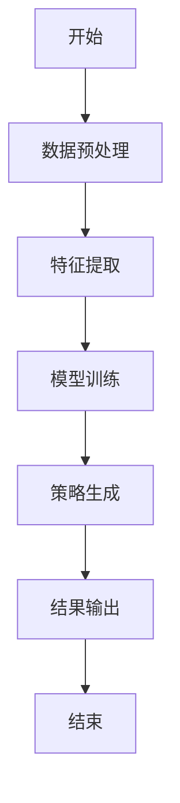
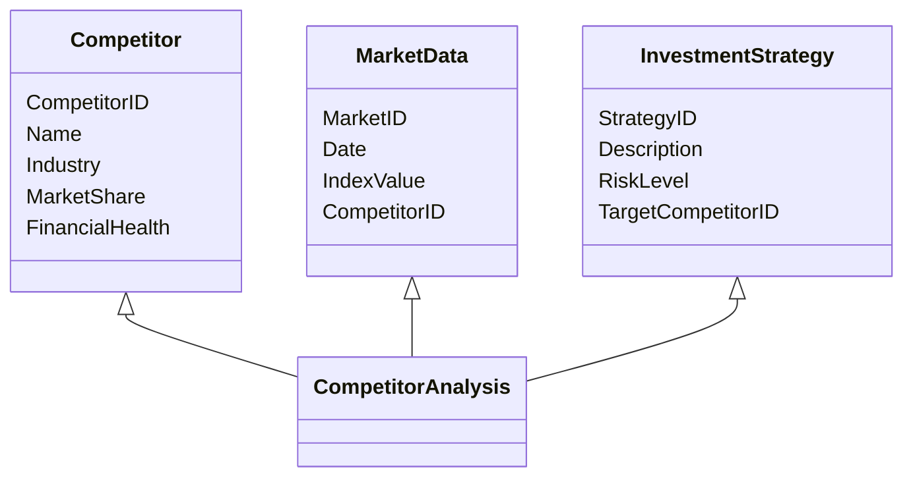
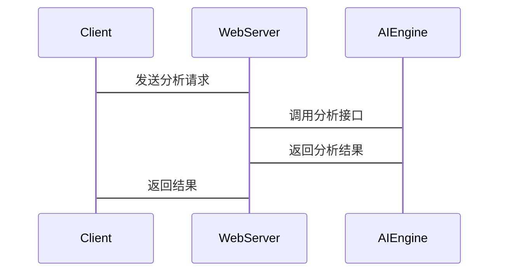

                 


```markdown
# 智能化竞争对手分析：多智能体AI在价值投资中的角色

## 关键词：多智能体AI、价值投资、竞争对手分析、智能化、人工智能

## 摘要：  
本文探讨多智能体AI在价值投资中的应用，特别是在竞争对手分析中的角色。通过背景介绍、核心概念解析、算法原理分析、系统架构设计以及项目实战，深入阐述多智能体AI如何提升投资决策的智能化水平。文章结合理论与实践，提供详细的数学模型、系统设计和代码示例，为读者理解并应用多智能体AI技术提供全面指导。

## 第一部分：背景与概述

### 第1章：智能化竞争对手分析的背景与意义

#### 1.1 问题背景

##### 1.1.1 传统竞争对手分析的局限性
传统的竞争对手分析依赖人工收集和分析数据，存在效率低、覆盖面窄、主观性强等问题。随着市场竞争的加剧，这种方法难以及时捕捉市场变化，影响投资决策的准确性。

##### 1.1.2 价值投资中的竞争分析需求
价值投资者需要对竞争对手的财务状况、市场策略、产品特点等进行深入分析，以评估其竞争优势和潜在风险。然而，传统方法难以处理海量数据，且缺乏动态分析能力。

##### 1.1.3 多智能体AI的优势与潜力
多智能体AI通过分布式协作和自适应学习，能够高效处理复杂数据，实时分析市场动态，为价值投资提供更精准的支持。其优势在于能够模拟市场环境，预测竞争对手行为，优化投资策略。

#### 1.2 问题描述

##### 1.2.1 价值投资中的信息处理挑战
价值投资需要处理大量非结构化数据，如新闻、社交媒体、行业报告等，传统方法难以有效整合和分析这些数据。

##### 1.2.2 竞争对手分析的核心问题
竞争对手的市场策略、产品迭代、财务健康状况等信息分散且复杂，难以实时跟踪和评估。

##### 1.2.3 AI在竞争分析中的应用边界
多智能体AI在处理复杂市场环境和多维度数据方面具有优势，但其预测结果的准确性依赖于数据质量和模型设计。

#### 1.3 问题解决

##### 1.3.1 多智能体AI的解决方案
通过分布式计算和协作学习，多智能体AI能够实时分析市场动态，预测竞争对手行为，优化投资决策。

##### 1.3.2 价值投资中的AI辅助决策
AI可以帮助投资者识别市场趋势，评估竞争对手的财务状况和市场策略，提供数据支持的决策建议。

##### 1.3.3 竞争对手分析的智能化路径
通过多智能体协作，构建动态的竞争分析模型，实时更新市场数据，优化投资策略。

#### 1.4 核心概念与外延

##### 1.4.1 多智能体AI的定义与特征
多智能体AI是由多个协作智能体组成的系统，每个智能体负责特定任务，通过通信协作完成复杂任务。

##### 1.4.2 价值投资中的关键要素
包括市场数据、竞争对手信息、财务指标、行业趋势等，这些要素构成了价值投资分析的基础。

##### 1.4.3 系统架构
多智能体AI系统架构包括数据采集、分析、决策模块，各模块协作完成智能化竞争对手分析。

### 第2章：多智能体AI的核心概念与联系

#### 2.1 多智能体AI的原理

##### 2.1.1 多智能体系统的定义
多智能体系统由多个智能体组成，通过协作完成特定任务。每个智能体具有自主性、反应性和协作性。

##### 2.1.2 多智能体AI的工作原理
多智能体AI通过分布式计算和协作学习，处理复杂问题。智能体之间通过通信共享信息，协同决策。

##### 2.1.3 多智能体与单智能体AI的对比
多智能体AI在处理复杂任务时更具优势，但实现难度较大，需要解决通信、协作等挑战。

#### 2.2 核心概念对比

##### 2.2.1 AI在价值投资中的应用对比
| 方面 | 传统方法 | 多智能体AI |
|------|----------|------------|
| 数据处理 | 依赖结构化数据 | 支持非结构化数据 |
| 分析效率 | 低效 | 高效实时 |
| 决策支持 | 主观性强 | 客观精准 |

##### 2.2.2 ER实体关系图
```mermaid
er
  table CompetitorAnalysis {
    CompetitorID (PK)
    Name
    Industry
    MarketShare
    FinancialHealth
    ProductOfferings
  }
  table MarketData {
    MarketID (PK)
    Date
    IndexValue
    CompetitorID (FK)
  }
  table InvestmentStrategy {
    StrategyID (PK)
    Description
    RiskLevel
    TargetCompetitorID (FK)
  }
  CompetitorAnalysis --> MarketData: 竞争对手的市场数据
  CompetitorAnalysis --> InvestmentStrategy: 竞争对手分析的投资策略
```

## 第二部分：算法原理与数学模型

### 第3章：多智能体AI的算法原理

#### 3.1 算法流程



#### 3.2 数学模型

##### 3.2.1 强化学习模型
目标函数：$$ J = \sum_{t} r_t $$
策略更新：$$ \theta_{t+1} = \theta_t + \alpha \nabla J $$

##### 3.2.2 博弈论模型
纳什均衡：$$ \forall i, u_i(a_i, a_{-i}) \geq u_i(b_i, a_{-i}) $$

#### 3.3 实例分析

##### 3.3.1 强化学习在投资决策中的应用
假设一个智能体在股票市场中，通过学习历史数据，优化买卖策略，实现最大收益。

##### 3.3.2 博弈论在竞争分析中的应用
通过模拟竞争对手的策略，预测其市场行为，优化自身投资策略。

## 第三部分：系统分析与架构设计

### 第4章：系统分析与架构设计

#### 4.1 领域模型设计



#### 4.2 系统架构设计


#### 4.3 接口设计与交互

##### 4.3.1 接口设计


## 第四部分：项目实战

### 第5章：项目实战

#### 5.1 环境安装

##### 5.1.1 安装Python
```bash
python --version
pip install --upgrade pip
```

##### 5.1.2 安装依赖库
```bash
pip install numpy pandas scikit-learn tensorflow
```

#### 5.2 核心代码实现

##### 5.2.1 数据预处理
```python
import pandas as pd
data = pd.read_csv('market_data.csv')
```

##### 5.2.2 模型训练
```python
from tensorflow.keras import layers
model = tf.keras.Sequential([
    layers.Dense(64, activation='relu'),
    layers.Dense(10, activation='softmax')
])
model.compile(optimizer='adam', loss='sparse_categorical_crossentropy', metrics=['accuracy'])
model.fit(data, labels, epochs=10, batch_size=32)
```

##### 5.2.3 策略执行
```python
def execute_strategy(data, model):
    predictions = model.predict(data)
    return predictions
```

#### 5.3 实际案例分析

##### 5.3.1 案例分析
假设我们分析竞争对手A的市场数据，预测其市场份额变化，优化投资策略。

##### 5.3.2 结果解读
通过模型预测，竞争对手A的市场份额可能在下季度增长5%，因此建议投资者调整仓位。

## 第五部分：最佳实践与总结

### 第6章：最佳实践与总结

#### 6.1 实践经验

##### 6.1.1 数据质量的重要性
确保数据的准确性和完整性，避免模型偏差。

##### 6.1.2 模型调优
定期更新模型，根据市场变化调整参数。

#### 6.2 小结

多智能体AI在价值投资中的应用前景广阔，通过智能化竞争对手分析，投资者可以更精准地做出决策。本文详细阐述了其原理、系统设计和实际应用，为读者提供了全面的指导。

#### 6.3 注意事项

- 数据隐私保护
- 模型的可解释性
- 市场变化的快速响应

#### 6.4 拓展阅读

推荐相关书籍和论文，深入学习多智能体AI和价值投资的结合应用。

## 作者：AI天才研究院 & 禅与计算机程序设计艺术
```

