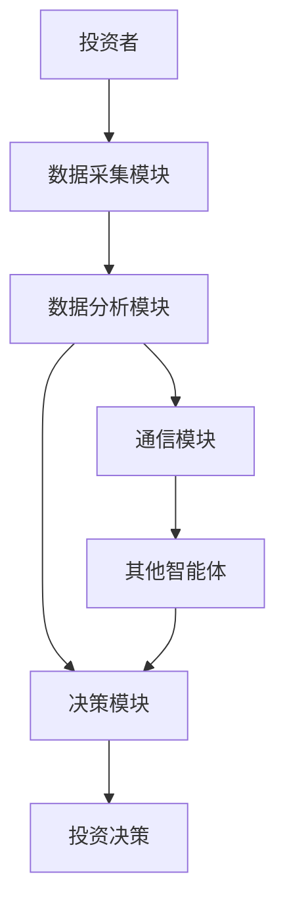

                 


# 智能化行业转型机会识别：多智能体AI在价值投资中的新方法

## 关键词
- 多智能体AI
- 价值投资
- 行业转型
- 智能化
- 人工智能

## 摘要
在当前数字化与智能化快速发展的背景下，价值投资领域正面临新的机遇与挑战。传统投资方法逐渐暴露出效率低下、决策滞后等问题，而多智能体人工智能（Multi-Agent AI）技术的崛起为价值投资提供了全新的解决方案。本文深入探讨了多智能体AI在价值投资中的应用，分析了其在市场分析、风险控制和投资决策中的优势，结合实际案例展示了如何通过多智能体AI识别行业转型机会。文章从背景、核心概念、算法原理、系统架构到项目实战，全面解析了多智能体AI在价值投资中的创新应用，为读者提供了详尽的理论与实践指导。

---

## 第1章: 多智能体AI与价值投资的背景

### 1.1 价值投资的背景与挑战
#### 1.1.1 传统价值投资的核心理念
价值投资是一种以基本面分析为基础的投资策略，强调通过分析公司的财务状况、行业地位和市场前景，寻找被市场低估的投资标的。传统价值投资依赖于分析师的主观判断和经验，存在效率低、覆盖面有限的问题。

#### 1.1.2 数字化与智能化时代的挑战
随着数据量的爆炸式增长和算法的不断进步，传统价值投资方法在处理复杂市场环境和海量数据时显得力不从心。投资者需要更高效、更精准的工具来捕捉市场机会和规避风险。

#### 1.1.3 多智能体AI的出现与优势
多智能体AI通过分布式协作和自主决策，能够在复杂市场环境中快速响应变化，提供实时的市场分析和投资建议。其协作性和适应性使其成为价值投资中的重要工具。

---

## 第2章: 多智能体AI的核心概念与优势

### 2.1 多智能体AI的定义与特点
#### 2.1.1 多智能体AI的定义
多智能体AI是指由多个相互协作或竞争的智能体组成的系统，每个智能体都有自己的目标和决策机制，能够通过信息共享和协同工作实现整体目标。

#### 2.1.2 多智能体AI的核心特点
- **分布式性**：智能体独立决策，通过局部信息进行全局优化。
- **协作性**：智能体之间可以通过通信模块共享信息，协同完成复杂任务。
- **适应性**：能够根据环境变化动态调整策略，具有较强的自适应能力。

### 2.2 多智能体AI与传统AI的区别
| 特性          | 传统AI                         | 多智能体AI                   |
|---------------|---------------------------------|------------------------------|
| 决策方式      | 单点决策                       | 分布式决策                   |
| 信息处理      | 依赖中心化数据源               | 去中心化，信息共享           |
| 应用场景      | 单一任务                       | 多任务协作                   |

---

## 第3章: 多智能体AI在价值投资中的应用

### 3.1 市场分析与趋势预测
#### 3.1.1 多智能体AI在市场数据处理中的优势
多智能体AI能够实时处理和分析海量市场数据，识别潜在的市场趋势和投资机会。通过分布式的计算能力，可以快速响应市场变化，为投资者提供实时的决策支持。

#### 3.1.2 基于多智能体的市场情绪分析
通过自然语言处理（NLP）技术，多智能体AI可以分析新闻、社交媒体等非结构化数据，捕捉市场情绪的变化，帮助投资者做出更明智的投资决策。

### 3.2 风险控制与投资组合优化
#### 3.2.1 多智能体AI在风险评估中的应用
多智能体AI能够实时监控市场风险，并根据市场变化动态调整投资组合，降低整体投资风险。

#### 3.2.2 分散投资策略的优化
通过多智能体协作，投资者可以在不同市场、不同资产类别之间进行分散投资，降低投资风险。

### 3.3 投资决策与机会识别
#### 3.3.1 基于多智能体的实时决策支持
多智能体AI能够快速分析市场数据，为投资者提供实时的决策支持，帮助其抓住短期投资机会。

#### 3.3.2 行业转型机会的识别
通过分析行业趋势和市场动态，多智能体AI能够识别出那些在转型期具备潜力的行业和公司，为投资者提供精准的投资建议。

---

## 第4章: 多智能体AI的数学模型与算法原理

### 4.1 基于强化学习的多智能体协作
#### 4.1.1 强化学习的基本原理
强化学习是一种通过试错机制来优化决策的算法，智能体通过与环境的交互获得奖励，从而学习最优策略。

#### 4.1.2 多智能体强化学习的挑战
多智能体强化学习中，智能体之间的协作与竞争关系使得问题更加复杂，需要解决通信、协调和同步等问题。

#### 4.1.3 基于强化学习的市场模拟
通过构建市场模拟环境，多智能体AI可以在虚拟环境中进行投资决策训练，提高其在实际市场中的适应能力。

### 4.2 基于博弈论的多智能体决策
#### 4.2.1 博弈论的基本概念
博弈论通过分析不同参与者之间的策略互动，帮助智能体做出最优决策。

#### 4.2.2 市场博弈模型的构建
在价值投资中，市场可以被视为一个博弈场，投资者、公司和市场环境都是参与者。通过构建博弈模型，多智能体AI可以预测市场参与者的策略变化，提前做出应对。

---

## 第5章: 多智能体AI的系统架构设计

### 5.1 系统模块划分
#### 5.1.1 数据采集模块
负责收集市场数据，包括股票价格、公司财务数据、新闻等。

#### 5.1.2 数据分析模块
对收集到的数据进行清洗、处理和分析，识别潜在的投资机会。

#### 5.1.3 决策模块
基于分析结果，生成投资策略和决策建议。

#### 5.1.4 通信模块
实现智能体之间的信息共享和协作。

### 5.2 系统架构图


### 5.3 系统交互流程
#### 5.3.1 数据采集与处理
智能体通过数据采集模块获取市场数据，并通过数据分析模块进行处理和分析。

#### 5.3.2 智能体协作
智能体之间通过通信模块共享信息，协作完成复杂的投资任务。

#### 5.3.3 决策生成
基于分析结果和协作信息，决策模块生成投资策略，并输出投资建议。

---

## 第6章: 项目实战与案例分析

### 6.1 项目环境与工具安装
#### 6.1.1 开发环境搭建
建议使用Python和相关深度学习框架（如TensorFlow、PyTorch）进行开发。

#### 6.1.2 工具安装
安装必要的库，如numpy、pandas、matplotlib等。

### 6.2 核心算法实现
#### 6.2.1 强化学习代码示例
```python
import numpy as np
import gym

class MultiAgentAI:
    def __init__(self, action_space):
        self.action_space = action_space
        self.learning_rate = 0.01
        self.gamma = 0.99

    def act(self, state):
        # 这里简化为随机选择动作
        return np.random.choice(range(self.action_space))

    def remember(self, state, action, reward, next_state):
        # 记忆存储，此处简化处理
        pass

    def replay(self):
        # 回放记忆并训练模型
        pass

# 创建环境和智能体
env = gym.make('Multi-stock-v0')
agent = MultiAgentAI(env.action_space)

for episode in range(100):
    state = env.reset()
    while not done:
        action = agent.act(state)
        next_state, reward, done, _ = env.step(action)
        agent.remember(state, action, reward, next_state)
        agent.replay()
```

#### 6.2.2 算法优化与测试
通过对算法的优化和测试，验证多智能体AI在价值投资中的有效性。

### 6.3 实际案例分析
#### 6.3.1 案例背景
选择一个具体的行业或公司，分析多智能体AI在该领域的应用。

#### 6.3.2 实验结果
展示实验结果，验证多智能体AI在价值投资中的优势。

---

## 第7章: 总结与未来展望

### 7.1 本文总结
多智能体AI在价值投资中的应用为投资者提供了更高效、更精准的投资工具，能够帮助投资者更好地识别行业转型机会。

### 7.2 未来展望
随着技术的不断进步，多智能体AI在价值投资中的应用将更加广泛和深入，未来可能会在更多领域展现其潜力。

---

## 作者：AI天才研究院

---

通过以上结构，文章系统地介绍了多智能体AI在价值投资中的应用，从理论到实践，为读者提供了全面的指导和深入的分析。

