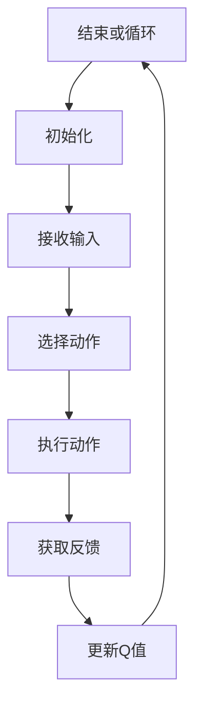
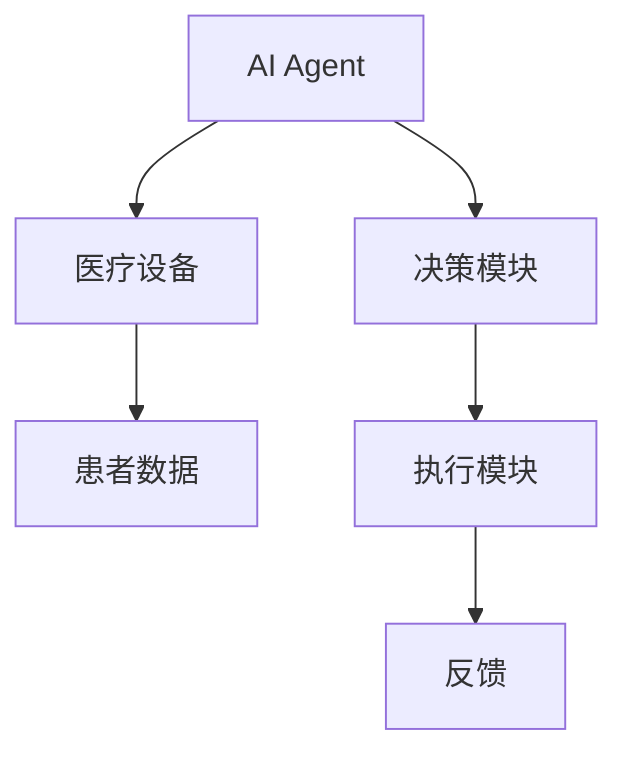
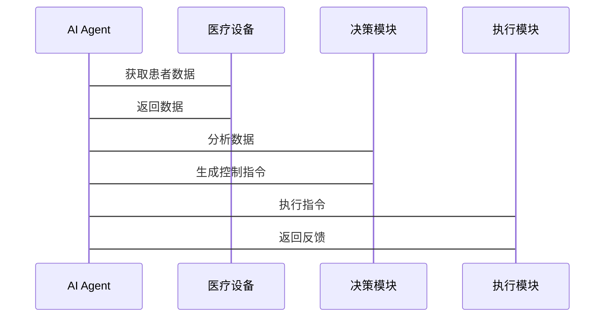

                 


# 智能医疗设备中的AI Agent控制系统

> 关键词：AI Agent、智能医疗设备、控制系统、机器学习、医疗物联网、实时控制

> 摘要：本文深入探讨了AI Agent在智能医疗设备中的应用，分析了其核心原理、算法模型、系统架构及实际应用案例。通过详细的技术分析和实践演示，揭示了AI Agent如何提升医疗设备的智能化水平，为医疗行业带来革新。

---

## 目录

1. [背景介绍](#背景介绍)
   - 1.1 AI Agent的基本概念
   - 1.2 医疗设备的发展现状
   - 1.3 AI Agent在医疗设备中的应用背景
   - 1.4 问题背景与问题描述
   - 1.5 问题解决与边界外延
   - 1.6 核心概念与组成要素

2. [核心概念与联系](#核心概念与联系)
   - 2.1 AI Agent与医疗设备的核心原理
   - 2.2 核心概念对比表
   - 2.3 ER实体关系图

3. [算法原理](#算法原理)
   - 3.1 AI Agent算法的数学模型与流程
   - 3.2 算法流程图
   - 3.3 数学模型与公式
   - 3.4 代码实现与解读

4. [系统分析与架构设计](#系统分析与架构设计)
   - 4.1 问题场景介绍
   - 4.2 系统功能设计
   - 4.3 系统架构设计
   - 4.4 接口设计与交互流程图

5. [项目实战](#项目实战)
   - 5.1 环境安装与配置
   - 5.2 核心代码实现
   - 5.3 代码解读与分析
   - 5.4 实际案例分析

6. [最佳实践与总结](#最佳实践与总结)
   - 6.1 最佳实践 tips
   - 6.2 小结
   - 6.3 注意事项
   - 6.4 拓展阅读

---

## 背景介绍

### 1.1 AI Agent的基本概念

AI Agent（人工智能代理）是一种能够感知环境并采取行动以实现目标的智能体。在医疗设备中，AI Agent可以用于实时监控、数据分析和决策支持，显著提升了设备的智能化水平。

### 1.2 医疗设备的发展现状

医疗设备正在从传统机械式设备向智能化、网络化方向发展。AI Agent的引入使得医疗设备能够更高效地处理数据，提供更精准的诊断和治疗方案。

### 1.3 AI Agent在医疗设备中的应用背景

随着医疗行业对高效、精准的需求增加，AI Agent在医疗设备中的应用变得越来越重要。通过AI Agent，医疗设备能够实时响应患者的状况，优化治疗流程。

### 1.4 问题背景与问题描述

传统医疗设备在数据处理和决策上存在延迟和不准确性。AI Agent的应用旨在解决这些问题，提供实时、精准的控制和反馈。

### 1.5 问题解决与边界外延

AI Agent通过实时数据处理和智能决策，显著提升了医疗设备的效率和准确性。其边界主要限于设备内部的数据处理和控制，外部决策需结合其他系统。

### 1.6 核心概念与组成要素

AI Agent在医疗设备中的核心要素包括感知、决策、执行和反馈。这些要素共同确保了系统的高效运行。

---

## 核心概念与联系

### 2.1 AI Agent与医疗设备的核心原理

AI Agent通过感知医疗设备的数据，利用算法进行分析和决策，并通过执行模块调整设备状态，形成闭环控制。

### 2.2 核心概念对比表

| 比较项          | AI Agent                     | 传统控制系统                |
|-----------------|-------------------------------|----------------------------|
| 数据处理能力   | 强大的机器学习能力          | 有限的规则处理能力          |
| 决策能力       | 基于数据的智能决策          | 基于规则的固定决策          |
| 灵活性         | 高度灵活，适应变化          | 较低，需人工调整             |

### 2.3 ER实体关系图

```mermaid
erd
    实体: AI Agent
    实体: 医疗设备
    实体: 患者
    关系: AI Agent 控制医疗设备
    关系: 医疗设备监控患者
```

---

## 算法原理

### 3.1 AI Agent算法的数学模型与流程

AI Agent的核心算法包括强化学习和监督学习。以Q-learning为例，其数学模型如下：

$$ Q(s,a) = Q(s,a) + \alpha (r + \gamma \max Q(s',a') - Q(s,a)) $$

其中：
- \( Q(s,a) \)：当前状态-动作对的评估值
- \( \alpha \)：学习率
- \( r \)：奖励
- \( \gamma \)：折扣因子
- \( Q(s',a') \)：下一个状态的最大评估值

### 3.2 算法流程图



### 3.3 数学模型与公式

Q-learning算法的目标是最大化累积奖励，公式如下：

$$ Q(s,a) = Q(s,a) + \alpha (r + \gamma \max Q(s',a') - Q(s,a)) $$

### 3.4 代码实现与解读

```python
class AI-Agent:
    def __init__(self, state_space, action_space):
        self.q_table = np.zeros((state_space, action_space))
    
    def choose_action(self, state, epsilon):
        if np.random.random() < epsilon:
            return np.random.randint(0, action_space)
        else:
            return np.argmax(self.q_table[state])
    
    def update_q_table(self, state, action, reward, next_state, gamma, alpha):
        self.q_table[state, action] += alpha * (reward + gamma * np.max(self.q_table[next_state]) - self.q_table[state, action])
```

代码实现了一个简单的Q-learning算法，用于AI Agent的学习和更新。

---

## 系统分析与架构设计

### 4.1 问题场景介绍

医疗设备需要实时监控患者状态，并根据数据调整设备参数。AI Agent负责数据处理、决策和执行。

### 4.2 系统功能设计

- 数据采集与处理
- 状态监控与分析
- 决策与控制
- 反馈与优化

### 4.3 系统架构设计



### 4.4 接口设计与交互流程图



---

## 项目实战

### 5.1 环境安装与配置

安装Python、NumPy、Keras等库，配置开发环境。

### 5.2 核心代码实现

```python
import numpy as np

class AI-Agent:
    def __init__(self, state_space, action_space):
        self.q_table = np.zeros((state_space, action_space))
    
    def choose_action(self, state, epsilon):
        if np.random.random() < epsilon:
            return np.random.randint(0, action_space)
        else:
            return np.argmax(self.q_table[state])
    
    def update_q_table(self, state, action, reward, next_state, gamma, alpha):
        self.q_table[state, action] += alpha * (reward + gamma * np.max(self.q_table[next_state]) - self.q_table[state, action])
```

### 5.3 代码解读与分析

AI-Agent类实现了Q-learning算法，用于根据状态和动作更新Q表，选择最优动作。

### 5.4 实际案例分析

以智能输液泵为例，AI Agent可以根据患者数据调整输液速度，确保治疗安全和高效。

---

## 最佳实践与总结

### 6.1 最佳实践 tips

- 确保数据的实时性和准确性
- 定期更新AI模型以适应新数据
- 保持系统的可解释性和透明度

### 6.2 小结

AI Agent在智能医疗设备中的应用显著提升了设备的智能化水平，为医疗行业带来了革新。

### 6.3 注意事项

- 数据隐私和安全需严格保护
- 系统需具备容错和恢复机制
- 定期维护和更新系统

### 6.4 拓展阅读

- 《强化学习：原理与应用》
- 《医疗物联网技术与实践》

---

## 作者

作者：AI天才研究院/AI Genius Institute & 禅与计算机程序设计艺术 /Zen And The Art of Computer Programming

