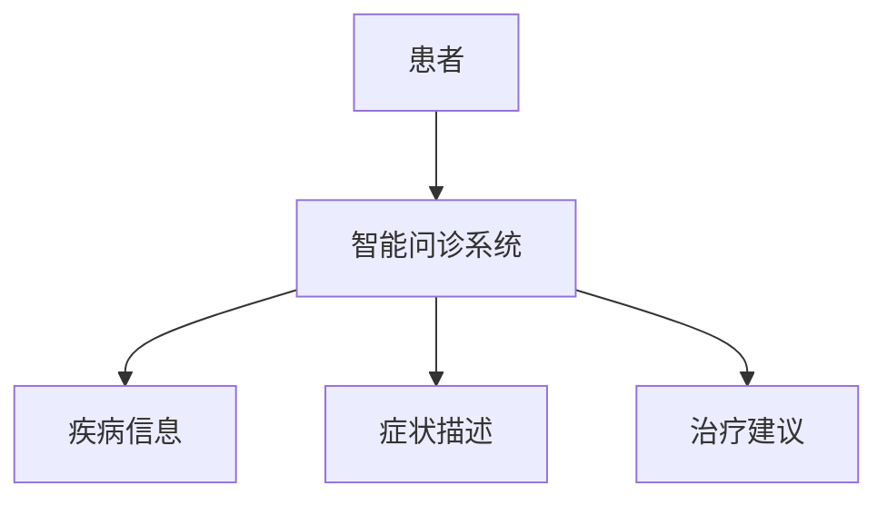
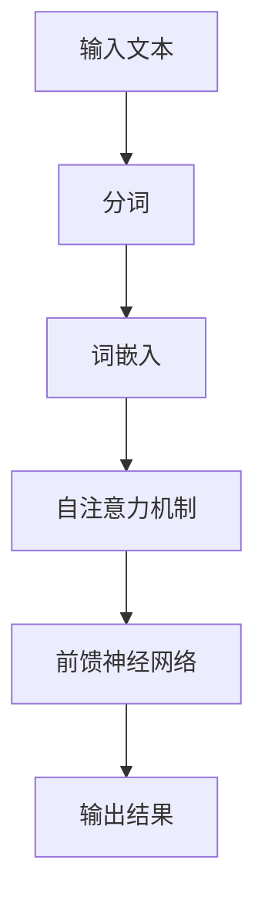
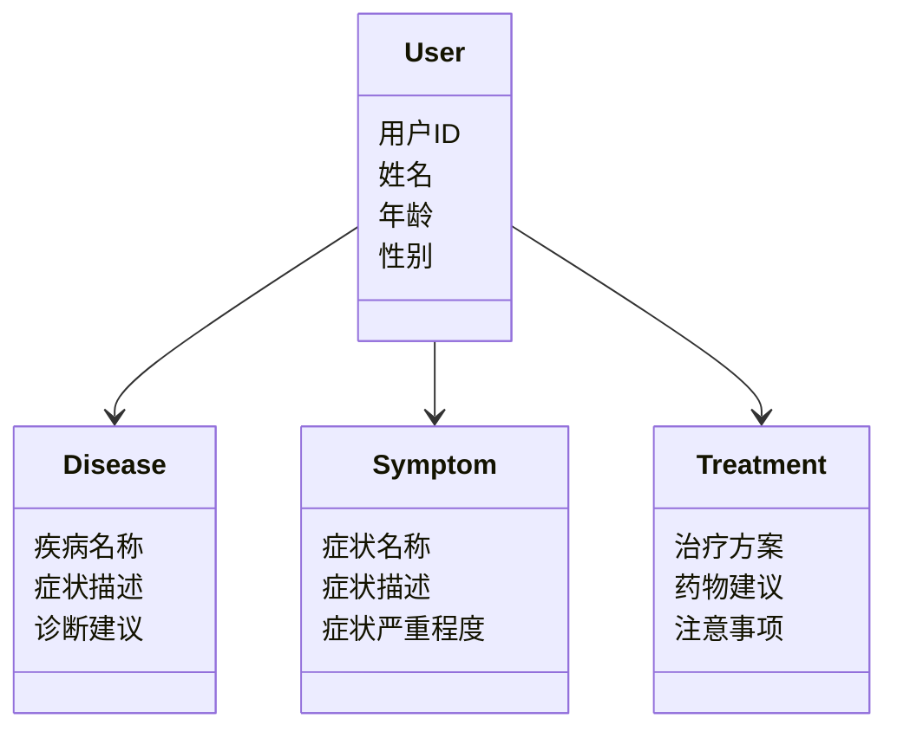
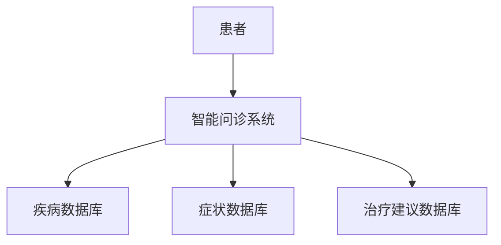
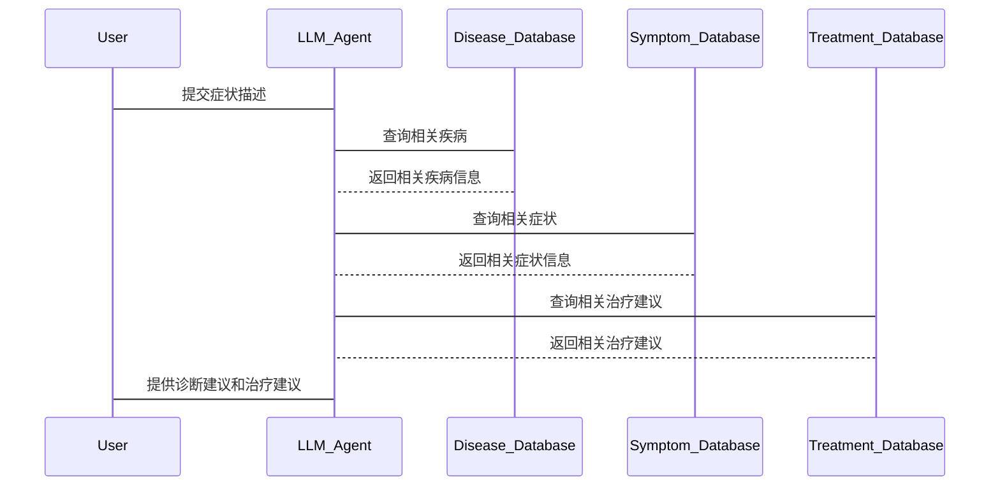

                 


# 智能医疗问诊 AI Agent：LLM 在远程医疗中的应用

> 关键词：智能医疗问诊，AI Agent，大语言模型，远程医疗，自然语言处理

> 摘要：本文深入探讨了AI Agent在智能医疗问诊中的应用，特别是大语言模型（LLM）在远程医疗中的具体作用。文章从背景、核心概念、算法原理、系统架构到项目实战，全面分析了LLM在医疗问诊中的应用，并提供了丰富的图表和代码示例，帮助读者理解其技术实现和实际应用。

---

## 第一部分: 智能医疗问诊 AI Agent 的背景与核心概念

### 第1章: AI Agent 与 LLM 的基本概念

#### 1.1 AI Agent 的定义与特点

##### 1.1.1 AI Agent 的定义
AI Agent（人工智能代理）是指能够感知环境并采取行动以实现目标的智能实体。它可以是一个软件程序、一个机器人或任何能够自主决策和执行任务的智能系统。AI Agent的核心目标是通过感知和行动来优化特定任务的执行效率。

##### 1.1.2 AI Agent 的核心特点
- **自主性**：能够在没有外部干预的情况下自主决策和执行任务。
- **反应性**：能够实时感知环境并做出相应的反应。
- **目标导向**：所有行动都以实现特定目标为导向。
- **学习能力**：通过数据和经验不断优化自身的决策能力。

##### 1.1.3 AI Agent 与传统AI的区别
传统的AI系统通常依赖于固定的规则和预定义的逻辑，而AI Agent则具有更强的自主性和适应性。AI Agent能够根据环境的变化动态调整策略，而传统的AI系统则更多依赖于固定的算法和数据。

#### 1.2 大语言模型（LLM）的概述

##### 1.2.1 LLM 的定义
大语言模型（Large Language Model，LLM）是指基于深度学习技术构建的大型神经网络模型，能够理解和生成人类语言。LLM的核心在于其强大的语言理解和生成能力，能够处理复杂的自然语言任务。

##### 1.2.2 LLM 的核心优势
- **强大的语言理解能力**：能够理解上下文、意图和情感。
- **多任务处理能力**：可以通过微调适应多种不同的任务。
- **可扩展性**：通过增加数据和计算资源，模型性能可以不断提升。

##### 1.2.3 LLM 的应用场景
LLM在多个领域都有广泛的应用，包括自然语言处理、机器翻译、问答系统、文本生成等。在医疗领域，LLM可以用于智能问诊、疾病诊断、治疗建议生成等。

#### 1.3 智能医疗问诊的背景与挑战

##### 1.3.1 远程医疗的发展现状
随着互联网技术的快速发展，远程医疗逐渐成为医疗行业的重要组成部分。远程医疗通过互联网技术，使得患者可以在家中或偏远地区获得专业的医疗服务。

##### 1.3.2 智能医疗问诊的需求与痛点
- **患者需求**：患者希望获得快速、准确的医疗咨询服务。
- **医疗资源分配**：医疗资源在地区间分布不均，尤其是偏远地区。
- **医生工作量**：医生的工作量巨大，难以满足患者需求。

##### 1.3.3 LLM 在医疗问诊中的潜在价值
LLM可以通过自然语言处理技术，帮助医生快速理解患者的症状，生成初步诊断建议，从而提高医疗问诊的效率和准确性。

---

### 第2章: 智能医疗问诊的核心概念与联系

#### 2.1 LLM 在医疗问诊中的核心原理

##### 2.1.1 LLM 的基本原理
LLM基于Transformer架构，通过自注意力机制和前馈神经网络，能够捕捉文本中的长距离依赖关系，从而实现对自然语言的深度理解和生成。

##### 2.1.2 医疗问诊的自然语言处理需求
医疗问诊需要准确理解患者的症状描述，包括症状的严重程度、持续时间、伴随症状等信息。这些信息对于生成准确的诊断建议至关重要。

##### 2.1.3 LLM 在医疗问诊中的具体应用
- **症状分析**：通过自然语言处理技术，分析患者的症状描述。
- **诊断建议**：根据症状分析结果，生成初步诊断建议。
- **治疗建议**：根据诊断结果，提供相应的治疗建议。

#### 2.2 医疗问诊的实体关系分析

##### 2.2.1 实体关系图


##### 2.2.2 实体属性表
| 实体 | 属性 |
|------|------|
| 患者 | 用户ID, 姓名, 年龄, 性别 |
| 疾病 | 疾病名称, 症状描述, 诊断建议 |
| 症状 | 症状名称, 症状描述, 症状严重程度 |
| 治疗建议 | 治疗方案, 药物建议, 注意事项 |

---

## 第三部分: 智能医疗问诊的算法原理

### 第3章: 智能医疗问诊的算法原理

#### 3.1 LLM 的基本算法原理

##### 3.1.1 Transformer 架构


##### 3.1.2 自注意力机制
自注意力机制通过计算输入序列中每个词与其他词的相关性，生成位置权重，从而捕捉序列中的长距离依赖关系。

##### 3.1.3 前馈神经网络
前馈神经网络用于将输入的嵌入表示映射到更高维的特征空间，从而提高模型的表达能力。

#### 3.2 医疗问诊中的具体算法实现

##### 3.2.1 意图识别算法
意图识别是通过分析患者的症状描述，识别其潜在的医疗需求。常用的算法包括基于规则的意图识别和基于机器学习的意图识别。

##### 3.2.2 实体识别算法
实体识别是通过自然语言处理技术，从患者的症状描述中提取具体的症状信息。常用的实体识别算法包括基于规则的方法和基于深度学习的方法。

#### 3.3 医疗问诊的数学模型

##### 3.3.1 注意力机制的数学模型
自注意力机制的计算公式如下：
$$
\text{Attention}(Q, K, V) = \text{softmax}\left(\frac{QK^T}{\sqrt{d_k}}\right)V
$$

其中，\( Q \) 是查询向量，\( K \) 是键向量，\( V \) 是值向量，\( d_k \) 是向量的维度。

##### 3.3.2 意图识别的数学模型
意图识别可以通过分类模型实现，常用的分类模型包括支持向量机（SVM）和随机森林（Random Forest）。分类模型的训练过程如下：
1. 数据预处理：将症状描述转化为数值特征。
2. 模型训练：使用训练数据训练分类模型。
3. 模型预测：使用测试数据进行意图识别。

---

## 第四部分: 智能医疗问诊的系统分析与架构设计

### 第4章: 智能医疗问诊的系统架构

#### 4.1 系统场景介绍
智能医疗问诊系统是一个基于LLM的远程医疗问诊平台，能够为患者提供快速、准确的医疗咨询服务。

#### 4.2 系统功能设计

##### 4.2.1 领域模型设计


##### 4.2.2 系统架构设计


#### 4.3 系统接口设计

##### 4.3.1 API 接口设计
- **输入接口**：患者症状描述。
- **输出接口**：初步诊断建议和治疗建议。

##### 4.3.2 接口交互流程


---

## 第五部分: 智能医疗问诊的项目实战

### 第5章: 项目实战

#### 5.1 环境安装

##### 5.1.1 安装 Python 和相关库
```bash
pip install python
pip install transformers
pip install torch
```

#### 5.2 系统核心实现源代码

##### 5.2.1 数据预处理代码
```python
import torch
from transformers import AutoTokenizer, AutoModelForMaskedLM

# 加载预训练模型
tokenizer = AutoTokenizer.from_pretrained('bert-base-uncased')
model = AutoModelForMaskedLM.from_pretrained('bert-base-uncased')

# 定义数据预处理函数
def preprocess(text):
    inputs = tokenizer.encode_plus(
        text,
        add_special_tokens=True,
        return_token_ids=True,
        return_attention_mask=True
    )
    return inputs
```

##### 5.2.2 模型训练代码
```python
# 定义训练函数
def train_model(model, tokenizer, train_loader, val_loader, num_epochs=3):
    for epoch in range(num_epochs):
        for batch in train_loader:
            inputs = {
                'input_ids': batch['input_ids'].to(device),
                'attention_mask': batch['attention_mask'].to(device),
                'labels': batch['labels'].to(device)
            }
            outputs = model(**inputs)
            loss = outputs.loss
            optimizer.zero_grad()
            loss.backward()
            optimizer.step()
        # 验证阶段
        with torch.no_grad():
            val_loss = 0
            for val_batch in val_loader:
                val_inputs = {
                    'input_ids': val_batch['input_ids'].to(device),
                    'attention_mask': val_batch['attention_mask'].to(device),
                    'labels': val_batch['labels'].to(device)
                }
                val_outputs = model(**val_inputs)
                val_loss += val_outputs.loss.item()
    return model
```

#### 5.3 项目小结
通过实际项目的实现，我们可以看到LLM在医疗问诊中的巨大潜力。通过对患者症状的分析，模型可以快速生成初步诊断建议，从而提高医疗问诊的效率和准确性。

---

## 第六部分: 最佳实践与总结

### 6.1 最佳实践 tips
- **数据质量**：医疗数据的质量直接影响模型的性能，需要确保数据的准确性和完整性。
- **模型调优**：通过微调和优化模型参数，可以进一步提高模型的性能。
- **用户体验**：在设计智能问诊系统时，需要注重用户体验，确保患者能够轻松使用系统。

### 6.2 小结
本文深入探讨了AI Agent在智能医疗问诊中的应用，特别是大语言模型（LLM）在远程医疗中的具体作用。通过系统的分析和实际项目的实现，我们可以看到LLM在医疗问诊中的巨大潜力。

### 6.3 注意事项
- **隐私保护**：在处理医疗数据时，需要严格遵守相关法律法规，确保患者隐私的安全。
- **误诊风险**：智能问诊系统只能提供初步的诊断建议，最终的诊断需要医生的确认。

### 6.4 拓展阅读
- **推荐书籍**：《Deep Learning》、《Natural Language Processing with PyTorch》
- **推荐论文**：《Attention Is All You Need》、《BERT: Pre-training of Deep Bidirectional Transformers for NLP》

---

## 作者：AI天才研究院/AI Genius Institute & 禅与计算机程序设计艺术 /Zen And The Art of Computer Programming

---

以上是《智能医疗问诊 AI Agent：LLM 在远程医疗中的应用》的完整目录和内容框架。希望这篇文章能够为读者提供有价值的见解和知识。

