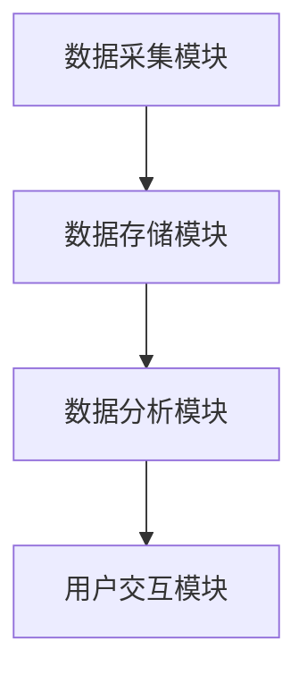
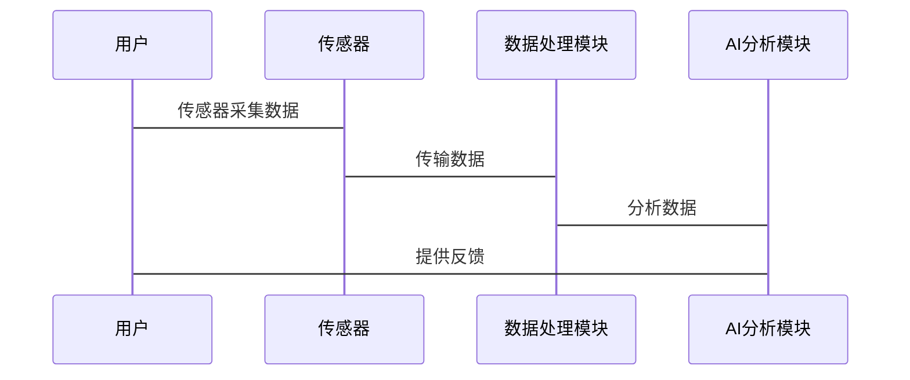

                 


# 智能卫生间：AI Agent的个人卫生习惯分析

## 关键词：AI Agent, 智能卫生间, 个人卫生习惯, 数据分析, 机器学习

## 摘要：  
本文探讨了AI Agent在智能卫生间中的应用，特别是在分析个人卫生习惯方面的潜力。通过详细分析数据采集、机器学习算法、系统设计和实际应用场景，展示了如何利用AI技术改善个人卫生管理。文章从背景介绍、技术基础、算法原理、系统架构到项目实战，逐步深入，结合实际案例和代码实现，为读者提供全面的技术指导。

---

# 第一部分：AI Agent与智能卫生间的基本概念

## 第1章：AI Agent的基本概念

### 1.1 什么是AI Agent？
AI Agent（智能体）是指能够感知环境、自主决策并采取行动以实现特定目标的实体。它可以分为简单反射型、基于模型型、目标驱动型和效用驱动型四种类型。

### 1.2 AI Agent的核心特征
- **自主性**：能够在没有外部干预的情况下运行。
- **反应性**：能够实时感知环境并做出反应。
- **目标导向**：所有行动都以实现特定目标为导向。
- **学习能力**：能够通过数据和经验不断优化自身行为。

### 1.3 AI Agent的应用场景
- **智能家居**：控制家中设备，优化能源使用。
- **医疗健康**：监测患者健康状况，提供个性化建议。
- **公共安全**：实时监控环境，预防潜在危险。

## 第2章：智能卫生间与个人卫生习惯分析的背景

### 2.1 卫生习惯的重要性
良好的卫生习惯是预防疾病、保持健康的重要基础。个人卫生习惯包括洗手频率、如厕习惯、清洁频率等，这些习惯直接影响个人健康和生活质量。

### 2.2 数字化卫生管理的必要性
随着技术的进步，数字化管理逐渐渗透到生活的方方面面。通过AI技术，可以实时监测和分析个人卫生习惯，提供智能化的管理方案。

### 2.3 AI在卫生习惯分析中的作用
AI Agent可以通过传感器、日志和图像数据，分析个人的卫生行为模式，提供个性化的建议和优化方案。

---

# 第二部分：数据采集与处理

## 第3章：数据采集与处理

### 3.1 数据采集方式
#### 3.1.1 传感器数据
- **温度传感器**：监测环境温度。
- **湿度传感器**：监测环境湿度。
- **运动传感器**：监测人员活动情况。

#### 3.1.2 用户行为日志
- **时间戳**：记录行为发生的时间。
- **行为类型**：洗手、如厕等。
- **持续时间**：每次行为的持续时间。

#### 3.1.3 图像与视频数据
- **摄像头**：记录卫生间使用情况。
- **图像识别**：识别人员动作和环境状态。

### 3.2 数据预处理
#### 3.2.1 数据清洗
- **去除噪声数据**：删除无效或错误的数据。
- **填补缺失值**：使用插值法填补缺失数据。

#### 3.2.2 数据标准化
- **归一化处理**：将数据转换到统一的范围内。
- **特征选择**：选择对分析最重要的特征。

#### 3.2.3 数据增强
- **数据扩充**：通过数据生成技术增加数据多样性。

### 3.3 数据存储与管理
#### 3.3.1 数据库设计
- **关系型数据库**：如MySQL，用于存储结构化数据。
- **非关系型数据库**：如MongoDB，用于存储半结构化或非结构化数据。

#### 3.3.2 数据仓库构建
- **数据集市**：为分析提供高效的数据访问。
- **数据湖**：存储大量原始数据，支持多种数据处理方式。

---

# 第三部分：算法原理与实现

## 第4章：机器学习算法在卫生习惯分析中的应用

### 4.1 分类算法
#### 4.1.1 K-近邻算法（K-Nearest Neighbors, KNN）
- **原理**：通过寻找最邻近的样本，预测新的样本类别。
- **实现步骤**：
  1. 收集训练数据。
  2. 标准化数据。
  3. 训练模型。
  4. 预测新数据。

#### 4.1.2 决策树算法（Decision Tree）
- **原理**：通过构建树状结构，进行分类和回归分析。

### 4.2 强化学习
#### 4.2.1 Q-Learning算法
- **原理**：通过状态-动作-奖励机制，优化决策策略。
- **实现步骤**：
  1. 初始化Q表。
  2. 确定状态空间和动作空间。
  3. 更新Q值。
  4. 选择最优动作。

---

# 第四部分：系统设计与实现

## 第5章：系统架构设计

### 5.1 系统功能设计
- **数据采集模块**：负责采集卫生间环境和用户行为数据。
- **数据分析模块**：对数据进行清洗、建模和预测。
- **用户交互模块**：向用户反馈分析结果和建议。

### 5.2 系统架构图


### 5.3 接口设计
- **API接口**：提供数据采集、分析和反馈的接口。
- **数据接口**：与传感器和数据库进行数据交互。

### 5.4 交互流程图


---

# 第五部分：项目实战

## 第6章：AI Agent在智能卫生间中的实战

### 6.1 环境配置
```bash
pip install numpy pandas scikit-learn
```

### 6.2 数据采集与处理
```python
import numpy as np
import pandas as pd

# 读取数据
data = pd.read_csv('habits.csv')

# 数据清洗
data.dropna(inplace=True)
data = data.drop_duplicates()
```

### 6.3 分类模型实现
```python
from sklearn.neighbors import KNeighborsClassifier
from sklearn.model_selection import train_test_split

# 数据分割
X = data.drop('label', axis=1)
y = data['label']

X_train, X_test, y_train, y_test = train_test_split(X, y, test_size=0.2)

# 训练模型
knn = KNeighborsClassifier(n_neighbors=3)
knn.fit(X_train, y_train)

# 预测
y_pred = knn.predict(X_test)
```

### 6.4 案例分析
- **案例1**：某用户的洗手频率分析。
- **案例2**：某用户的如厕习惯优化建议。

---

# 第六部分：总结与展望

## 第7章：总结与展望

### 7.1 总结
本文详细探讨了AI Agent在智能卫生间中的应用，从数据采集到算法实现，再到系统设计和项目实战，展示了AI技术在个人卫生习惯分析中的巨大潜力。

### 7.2 未来展望
- **算法优化**：探索更高效的机器学习算法。
- **应用场景扩展**：将AI技术应用于更多领域。
- **数据隐私保护**：加强数据安全和隐私保护措施。

---

# 作者：AI天才研究院 & 禅与计算机程序设计艺术

