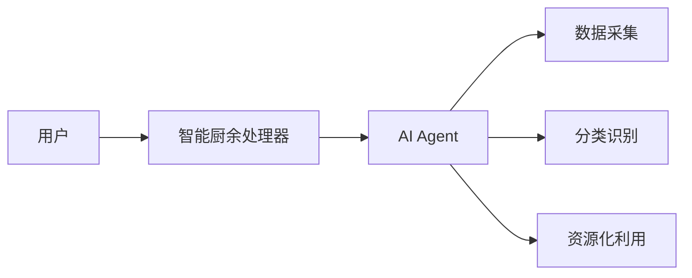
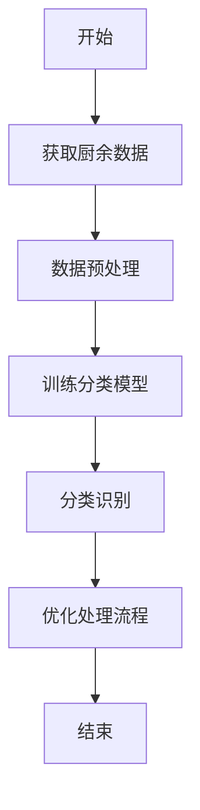
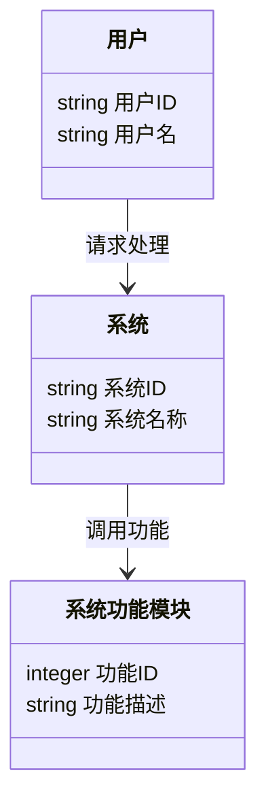
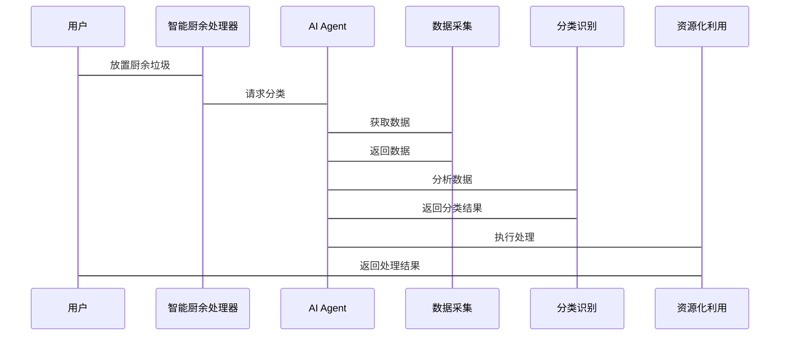

                 


# 智能厨余处理器：AI Agent的厨余再利用建议

> 关键词：AI Agent, 厨余处理, 资源化利用, 智能分类, 环境保护

> 摘要：本文详细探讨了智能厨余处理器在AI Agent技术下的厨余再利用建议，分析了厨余处理的现状与挑战，介绍了AI Agent的核心原理，展示了算法流程图，并提供了系统架构设计和项目实战案例。通过本文，读者将了解如何利用AI技术优化厨余处理流程，实现资源的最大化利用。

---

## 第一部分: 背景与概念

### 第1章: 智能厨余处理器与AI Agent概述

#### 1.1 问题背景与现状
##### 1.1.1 厨余垃圾处理的现状与挑战
厨余垃圾是城市生活垃圾中的重要组成部分，通常包含果皮、蔬菜残余、剩饭剩菜等有机物。随着城市化进程的加快，厨余垃圾的产生量迅速增加，传统的填埋和焚烧处理方式不仅浪费资源，还对环境造成严重污染。如何高效、环保地处理厨余垃圾，已成为全球关注的焦点。

##### 1.1.2 AI技术在厨余处理中的应用潜力
人工智能（AI）技术的发展为厨余垃圾的处理提供了新的可能性。AI Agent（智能体）可以通过图像识别、自然语言处理等技术，实现厨余垃圾的智能分类、资源化利用和高效管理。AI Agent能够实时分析厨余成分，优化处理流程，减少浪费。

##### 1.1.3 智能厨余处理器的定义与目标
智能厨余处理器是一种结合AI技术的设备，能够自动识别、分类和处理厨余垃圾。其目标是通过智能化手段，最大化厨余资源的利用效率，减少环境污染。

#### 1.2 问题描述与解决思路
##### 1.2.1 厨余处理中的主要问题
- 厨余垃圾成分复杂，分类困难。
- 处理过程中的资源浪费严重。
- 处理成本高，效率低下。

##### 1.2.2 AI Agent在厨余处理中的角色
AI Agent作为智能厨余处理器的核心，负责数据采集、分析和决策。它能够通过摄像头、传感器等设备，实时监测厨余垃圾的状态，并根据分析结果调整处理策略。

##### 1.2.3 解决方案的框架与目标
解决方案框架包括数据采集、AI分析、决策执行三个主要环节。目标是实现厨余垃圾的高效分类、资源化利用和智能化管理。

#### 1.3 核心概念与边界
##### 1.3.1 AI Agent的定义与特征
AI Agent是一种具有感知、决策和执行能力的智能体。它能够根据环境信息做出自主决策，并通过执行机构实现目标。

##### 1.3.2 智能厨余处理器的核心功能
- 数据采集：通过摄像头和传感器获取厨余垃圾的信息。
- 分类识别：利用AI技术对厨余垃圾进行分类。
- 资源化利用：将厨余垃圾转化为肥料、生物柴油等资源。

##### 1.3.3 问题的边界与外延
- 边界：仅处理厨余垃圾，不涉及其他类型垃圾。
- 外延：厨余垃圾的分类、处理和资源化利用。

#### 1.4 概念结构与核心要素
##### 1.4.1 概念结构图


##### 1.4.2 核心要素的详细描述
- 用户：操作智能厨余处理器的主体。
- 智能厨余处理器：实现厨余垃圾处理的物理设备。
- AI Agent：处理的核心智能模块。
- 数据采集：获取厨余垃圾的信息。
- 分类识别：分析厨余垃圾的成分。
- 资源化利用：将厨余垃圾转化为资源。

##### 1.4.3 概念之间的关系分析
用户通过智能厨余处理器与AI Agent交互，AI Agent通过数据采集模块获取信息，分类识别模块分析数据，最后通过资源化利用模块实现目标。

#### 1.5 本章小结
本章介绍了智能厨余处理器和AI Agent的基本概念，分析了厨余处理的主要问题，提出了AI Agent在厨余处理中的解决方案框架。

---

## 第二部分: 核心概念与联系

### 第2章: AI Agent与厨余处理的核心原理

#### 2.1 AI Agent的核心原理
##### 2.1.1 AI Agent的基本原理
AI Agent通过感知环境、分析数据、做出决策并执行操作。其核心包括感知层、决策层和执行层。

##### 2.1.2 AI Agent在厨余处理中的具体应用
- 数据采集：AI Agent通过摄像头和传感器采集厨余垃圾的信息。
- 分类识别：利用图像识别技术识别厨余垃圾的种类。
- 决策优化：根据分类结果优化处理流程。

##### 2.1.3 AI Agent与其他技术的对比分析
| 技术 | 优点 | 缺点 |
|------|------|------|
| AI Agent | 高效、智能 | 成本较高 |
| 传统自动化 | 成本低 | 效率低 |

#### 2.2 厨余处理的核心概念
##### 2.2.1 厨余分类的基本原理
厨余分类基于成分、质地和形态等因素。AI Agent通过图像识别技术实现高效分类。

##### 2.2.2 厨余资源化利用的关键技术
资源化利用包括堆肥、生物降解和焚烧发电。AI Agent优化资源化利用的效率。

##### 2.2.3 厨余处理的流程与优化
1. 数据采集：获取厨余信息。
2. 分类识别：分析厨余成分。
3. 资源化利用：转化为资源。
4. 监控与反馈：实时监控处理效果。

#### 2.3 核心概念的对比分析
##### 2.3.1 AI Agent与传统自动化的对比
- AI Agent：智能化、高效。
- 传统自动化：简单、成本低。

##### 2.3.2 厨余处理技术的优劣势分析
| 技术 | 优点 | 缺点 |
|------|------|------|
| 堆肥 | 环保 | 时间长 |
| 生物降解 | 快速 | 成本高 |

##### 2.3.3 技术对比的特征表格
| 技术 | AI Agent | 传统自动化 |
|------|----------|-------------|
| 效率 | 高       | 低         |
| 成本 | 高       | 低         |

#### 2.4 实体关系图
```mermaid
erDiagram
    actor 用户 {
        string 用户ID
        string 用户名
    }
    actor 系统 {
        string 系统ID
        string 系统名称
    }
    system 系统功能模块 {
        integer 功能ID
        string 功能描述
    }
    用户 --> 系统 : 请求处理
    系统 --> 系统功能模块 : 调用功能
```

#### 2.5 本章小结
本章分析了AI Agent的核心原理，探讨了其在厨余处理中的具体应用，并通过对比分析明确了AI Agent的优势和劣势。

---

## 第三部分: 算法原理讲解

### 第3章: AI Agent的算法原理

#### 3.1 算法概述
##### 3.1.1 算法的基本流程
1. 数据采集：获取厨余垃圾的信息。
2. 数据预处理：清洗和标注数据。
3. 模型训练：训练分类模型。
4. 分类识别：识别厨余垃圾的种类。
5. 决策优化：优化处理流程。

##### 3.1.2 算法的核心思想
AI Agent通过深度学习算法实现厨余分类和资源化利用的优化。

##### 3.1.3 算法的优缺点
- 优点：高效、准确。
- 缺点：计算资源消耗大。

#### 3.2 算法流程图


#### 3.3 分类算法的数学模型
##### 3.3.1 分类模型的数学公式
$$ P(y|x) = \frac{P(x|y)P(y)}{P(x)} $$

##### 3.3.2 分类算法的代码实现
```python
import tensorflow as tf
from tensorflow.keras import layers

model = tf.keras.Sequential([
    layers.Conv2D(32, (3,3), activation='relu', input_shape=(224, 224, 3)),
    layers.MaxPooling2D((2,2)),
    layers.Conv2D(64, (3,3), activation='relu'),
    layers.MaxPooling2D((2,2)),
    layers.Flatten(),
    layers.Dense(128, activation='relu'),
    layers.Dense(num_classes, activation='softmax')
])

model.compile(optimizer='adam', loss='sparse_categorical_crossentropy', metrics=['accuracy'])
```

#### 3.4 本章小结
本章详细讲解了AI Agent的算法原理，包括基本流程、核心思想和数学模型，并通过代码示例展示了分类算法的实现。

---

## 第四部分: 系统分析与架构设计

### 第4章: 智能厨余处理器的系统架构

#### 4.1 问题场景介绍
智能厨余处理器主要用于家庭和商业厨房，帮助用户高效处理厨余垃圾。

#### 4.2 系统功能设计
##### 4.2.1 领域模型


##### 4.2.2 系统架构


#### 4.3 系统接口设计
##### 4.3.1 系统接口
- 输入接口：摄像头、传感器。
- 输出接口：分类结果、处理建议。

##### 4.3.2 系统交互


#### 4.4 本章小结
本章详细分析了智能厨余处理器的系统架构，包括功能设计、接口设计和交互流程。

---

## 第五部分: 项目实战

### 第5章: 智能厨余处理器的实现

#### 5.1 环境安装
- 安装Python和TensorFlow框架。
- 安装摄像头和传感器硬件。

#### 5.2 系统核心实现
##### 5.2.1 数据采集代码
```python
import cv2

cap = cv2.VideoCapture(0)
while cap.isOpened():
    ret, frame = cap.read()
    cv2.imshow('Camera', frame)
    if cv2.waitKey(1) & 0xFF == ord('q'):
        break
cap.release()
cv2.destroyAllWindows()
```

##### 5.2.2 分类识别代码
```python
import numpy as np
from tensorflow.keras.models import load_model

model = load_model('model.h5')
image = cv2.imread('input.jpg')
image = image / 255.0
image = np.expand_dims(image, axis=0)
predictions = model.predict(image)
print(predictions)
```

#### 5.3 实际案例分析
##### 5.3.1 案例背景
某餐厅使用智能厨余处理器，每天处理厨余垃圾50公斤。

##### 5.3.2 处理流程
1. 用户将厨余垃圾放入处理器。
2. 摄像头采集数据。
3. AI Agent分析数据并分类。
4. 资源化利用模块执行处理。

##### 5.3.3 数据分析与优化
通过对处理数据的分析，优化分类算法，提高处理效率。

#### 5.4 本章小结
本章通过实际案例展示了智能厨余处理器的实现过程，包括环境安装、核心代码实现和数据优化。

---

## 第六部分: 最佳实践

### 第6章: 实践中的注意事项

#### 6.1 小结
智能厨余处理器结合了AI Agent技术，能够高效处理厨余垃圾，实现资源的最大化利用。

#### 6.2 注意事项
- 数据采集的准确性。
- 算法模型的优化。
- 系统维护与更新。

#### 6.3 拓展阅读
建议读者进一步学习AI在环保领域的应用，探索更多智能处理技术。

---

## 作者：AI天才研究院/AI Genius Institute & 禅与计算机程序设计艺术 /Zen And The Art of Computer Programming

---

本文通过详细分析智能厨余处理器的背景、核心原理、算法实现和系统架构，为读者提供了全面的技术指导。通过实际案例和代码实现，帮助读者理解如何利用AI技术优化厨余处理流程。希望本文能为环保技术的发展提供有价值的参考。

