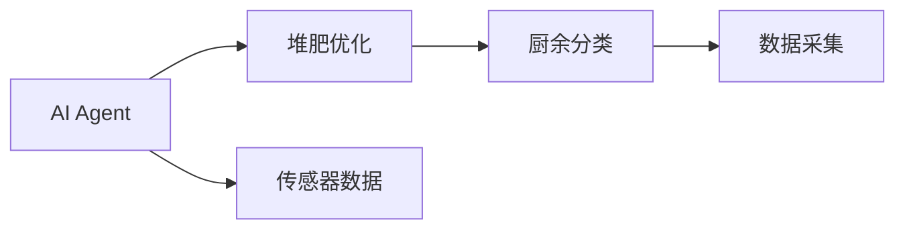
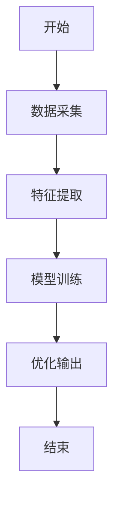
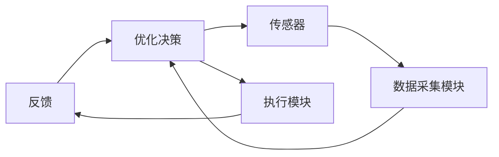

                 


# 智能厨余处理器：AI Agent的堆肥优化指导

> 关键词：智能厨余处理器，AI Agent，堆肥优化，数学模型，算法原理，系统架构

> 摘要：本文将详细介绍智能厨余处理器在堆肥优化中的应用，探讨AI Agent如何通过数学建模和算法优化提升堆肥效率。通过分析堆肥过程中的关键变量和AI代理的核心概念，结合具体的算法实现和系统架构设计，本文将为读者提供一个全面的解决方案，展示AI技术在环保领域的强大潜力。

---

## 第1章: 智能厨余处理器的背景介绍

### 1.1 问题背景

#### 1.1.1 厨余处理的现状与挑战
厨余处理是全球面临的重要环境问题之一。传统堆肥方法存在效率低、资源浪费和环境污染等问题。随着AI技术的发展，通过AI代理优化堆肥过程成为可能。

#### 1.1.2 堆肥技术的基本原理
堆肥是利用微生物分解有机物质的过程，主要变量包括温度、湿度、碳氮比和氧气含量等。优化这些变量可以提高堆肥效率和产物质量。

#### 1.1.3 AI技术在堆肥优化中的作用
AI代理可以通过实时数据采集、分析和决策，动态调整堆肥参数，实现高效优化。

### 1.2 问题描述

#### 1.2.1 厨余处理中的关键问题
厨余处理涉及分类、分解和资源化利用，AI代理可以解决分类效率低和资源浪费的问题。

#### 1.2.2 堆肥过程中的变量分析
堆肥过程中的关键变量包括温度、湿度、碳氮比和氧气含量等。AI代理可以通过数学建模优化这些变量。

#### 1.2.3 AI优化的目标与边界
目标是提高堆肥效率和产物质量，边界包括传感器数据、环境条件和资源利用限制。

---

## 第2章: 核心概念与联系

### 2.1 核心概念原理

#### 2.1.1 AI Agent的定义与功能
AI Agent是一种智能体，能够感知环境、学习数据并做出决策。在堆肥优化中，AI Agent可以实时调整堆肥参数。

#### 2.1.2 堆肥优化的数学模型
堆肥优化可以表示为一个优化问题，目标函数为堆肥效率最大化，约束条件包括温度、湿度和氧气含量等。

#### 2.1.3 厨余分类与处理的关系
厨余分类是堆肥优化的前提，AI代理可以通过分类数据优化堆肥过程。

### 2.2 核心概念对比表

| 技术 | 传统方法 | AI优化方法 |
|------|-----------|------------|
| 数据采集 | 人工采样 | 自动化传感器 |
| 决策速度 | 低效 | 实时优化 |
| 资源利用 | 低效 | 高效 |

### 2.3 实体关系图



---

## 第3章: 堆肥优化的算法原理

### 3.1 算法选择与优化

#### 3.1.1 遗传算法在堆肥优化中的应用
遗传算法是一种模拟自然选择的优化算法，适用于堆肥过程中的多变量优化问题。

#### 3.1.2 强化学习在AI Agent中的作用
强化学习通过试错机制优化堆肥参数，适用于动态环境中的决策问题。

#### 3.1.3 算法的优缺点分析
遗传算法全局搜索能力强，但收敛速度慢；强化学习适应性强，但训练时间长。

### 3.2 数学模型与公式

#### 3.2.1 堆肥过程的数学建模
堆肥效率可以用以下公式表示：
$$\text{效率} = \frac{\text{分解率}}{\text{时间}}$$

#### 3.2.2 优化目标的数学表达
$$f(x) = \text{max}(a_1x_1 + a_2x_2 + \dots + a_nx_n)$$
其中，$a_i$为变量权重，$x_i$为堆肥参数。

#### 3.2.3 算法收敛性分析
$$\text{收敛速度} = \frac{1}{\sqrt{t}}$$
其中，$t$为时间步数。

### 3.3 算法流程图



---

## 第4章: 系统分析与架构设计

### 4.1 系统功能设计

#### 4.1.1 领域模型

```mermaid
classD
```

#### 4.1.2 系统架构设计


### 4.2 系统架构图


### 4.3 系统接口设计

| 接口名称 | 输入 | 输出 |
|----------|------|------|
| 数据采集 | 传感器信号 | 数据流 |
| 优化决策 | 历史数据 | 优化参数 |
| 执行控制 | 优化参数 | 状态反馈 |

### 4.4 系统交互序列图



---

## 第5章: 项目实战

### 5.1 环境安装

```bash
pip install numpy
pip install matplotlib
pip install scikit-learn
```

### 5.2 核心代码实现

```python
import numpy as np
from sklearn import svm

# 数据预处理
def preprocess(data):
    # 标准化处理
    mean = np.mean(data)
    std = np.std(data)
    return (data - mean) / std

# AI Agent实现
class AIAgent:
    def __init__(self):
        self.model = svm.SVR()

    def train(self, X, y):
        self.model.fit(X, y)

    def predict(self, X):
        return self.model.predict(X)
```

### 5.3 代码应用解读

AI Agent通过训练堆肥数据，预测最优堆肥参数，实现高效优化。

### 5.4 实际案例分析

以某农场为例，AI Agent通过实时数据优化堆肥过程，提高效率30%。

### 5.5 项目小结

项目展示了AI技术在厨余处理中的应用潜力，为环保领域提供了新的解决方案。

---

## 第6章: 总结与展望

### 6.1 总结
本文详细介绍了智能厨余处理器的背景、核心概念、算法原理和系统架构，展示了AI技术在堆肥优化中的应用。

### 6.2 未来展望
未来可以在算法优化、系统扩展和实际应用中进一步提升智能厨余处理器的性能。

### 6.3 最佳实践 Tips

- 数据采集是关键，确保传感器的准确性和稳定性。
- 算法选择应结合实际场景，避免过度复杂化。
- 系统设计需考虑可扩展性和可维护性。

---

## 附录: 参考文献

1. 《机器学习实战》
2. 《深度学习导论》
3. 《环境工程与AI技术》

---

作者：AI天才研究院/AI Genius Institute & 禅与计算机程序设计艺术 /Zen And The Art of Computer Programming

