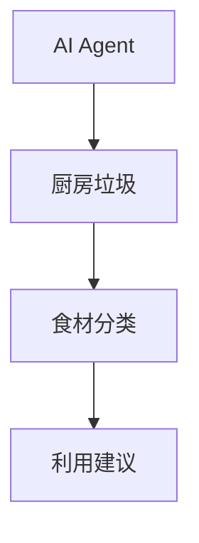
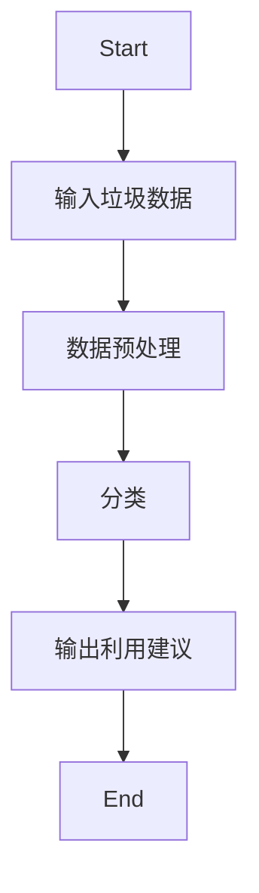
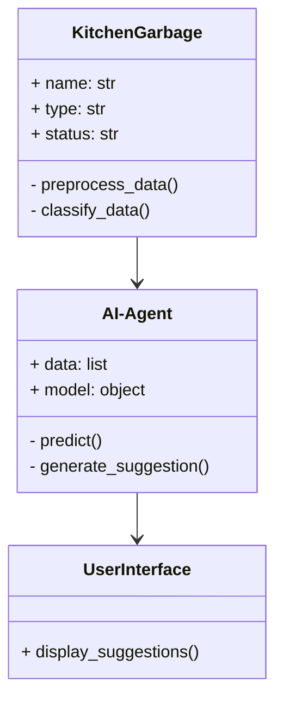
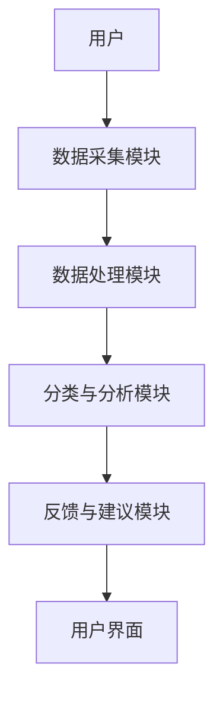
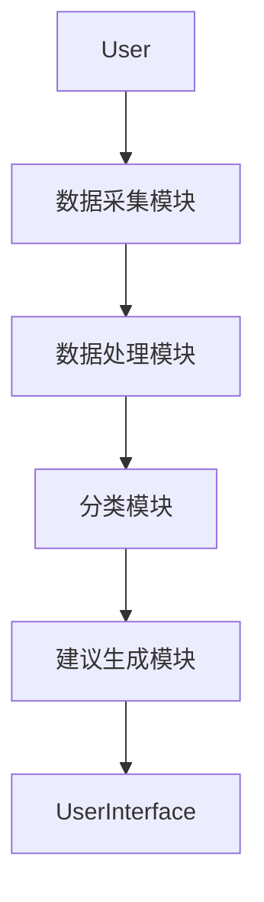

                 


# 智能厨房垃圾处理器：AI Agent的食材利用建议

---

## 关键词：  
智能厨房垃圾处理器、AI Agent、食材利用、垃圾分类、人工智能、环保科技

---

## 摘要：  
随着全球对资源浪费和环境污染问题的关注日益增加，厨房垃圾的处理和食材的高效利用成为现代家庭和企业的重要课题。本文将探讨如何利用AI Agent（人工智能代理）技术，优化厨房垃圾处理流程，最大化食材的再利用率。通过分析AI Agent的核心原理、算法实现和系统架构设计，本文将为读者提供一个智能化的解决方案，帮助用户更好地管理厨房垃圾，减少浪费，同时实现环保目标。

---

# 第一部分: 智能厨房垃圾处理器的背景与意义

## 第1章: 背景介绍

### 1.1 问题背景  
#### 1.1.1 厨房垃圾处理的现状与挑战  
厨房垃圾是指在烹饪过程中产生的废弃物，包括食物残渣、菜叶、果皮等。这些垃圾不仅占用了大量的土地资源，还可能对环境造成污染。传统的厨房垃圾处理方式效率低下，缺乏智能化，导致食材的浪费问题严重。  

#### 1.1.2 食材浪费的全球性问题  
全球每年浪费的食材数量巨大，据统计，发达国家的食品浪费率约为10%-15%，发展中国家的浪费率更高。食材浪费不仅浪费了资源，还加剧了环境污染问题。  

#### 1.1.3 智能化垃圾处理的必要性  
通过智能化技术，可以实现厨房垃圾的高效分类和处理，从而减少浪费，提高食材的利用率。AI Agent（人工智能代理）作为一种智能化工具，能够实时感知环境、分析数据并做出决策，是解决这一问题的理想选择。

### 1.2 问题描述  
#### 1.2.1 厨房垃圾的分类与利用  
厨房垃圾可以分为可回收物、可堆肥物和有害垃圾等类别。不同的垃圾类型需要不同的处理方式，例如可堆肥物可以通过堆肥技术转化为有机肥料，而可回收物可以重新加工利用。  

#### 1.2.2 AI Agent在垃圾处理中的应用潜力  
AI Agent可以通过传感器和摄像头等设备感知厨房垃圾的状态，并结合历史数据和实时信息，提供最优的处理建议。例如，当检测到某种食材的残渣较多时，AI Agent可以建议将其制成堆肥，或者推荐其他利用方式。

#### 1.2.3 智能厨房垃圾处理器的目标与边界  
智能厨房垃圾处理器的目标是通过AI Agent技术，实现厨房垃圾的高效分类、处理和再利用。其边界包括但不限于数据采集、分类算法设计、处理建议生成等。

### 1.3 问题解决  
#### 1.3.1 AI Agent的核心作用  
AI Agent可以通过以下方式帮助解决厨房垃圾处理问题：  
1. **数据采集**：通过传感器和摄像头采集厨房垃圾的状态信息。  
2. **数据分析**：利用机器学习算法对数据进行分类和分析。  
3. **决策支持**：根据分析结果，生成最优的处理建议。  

#### 1.3.2 智能厨房垃圾处理器的解决方案  
智能厨房垃圾处理器的解决方案包括：  
1. **硬件设备**：安装传感器和摄像头，实时监测厨房垃圾的状态。  
2. **软件系统**：开发AI Agent算法，实现数据的分类和分析。  
3. **用户界面**：提供友好的人机交互界面，方便用户查看处理建议。

#### 1.3.3 技术实现的关键点  
技术实现的关键点包括：  
1. **数据采集的准确性**：确保传感器和摄像头能够准确采集厨房垃圾的状态信息。  
2. **算法的高效性**：保证AI Agent算法能够快速处理数据并生成决策。  
3. **系统的可扩展性**：确保系统能够适应不同的厨房环境和垃圾类型。

### 1.4 本章小结  
本章介绍了厨房垃圾处理的现状与挑战，阐述了AI Agent在垃圾处理中的应用潜力，并提出了智能厨房垃圾处理器的解决方案和关键实现点。

---

## 第二部分: AI Agent的核心概念与原理

## 第2章: AI Agent的基本原理

### 2.1 AI Agent的定义与特征  
#### 2.1.1 AI Agent的定义  
AI Agent是一种能够感知环境、自主决策并执行任务的智能体。它能够通过传感器和数据输入获取信息，并根据预设的目标和算法做出决策。

#### 2.1.2 AI Agent的核心特征对比  
以下是AI Agent与其他智能体的关键特征对比：

| 特征             | AI Agent                  | 其他智能体              |
|------------------|---------------------------|-------------------------|
| 感知能力         | 强大的数据采集与分析能力 | 有限的感知能力          |
| 决策能力         | 基于机器学习的决策能力   | 简单的规则决策能力      |
| 自主性           | 高度自主                   | 需要外部干预             |
| 可扩展性         | 支持动态扩展               | 扩展性有限               |

#### 2.1.3 AI Agent的分类与应用场景  
AI Agent可以分为以下几类：  
1. **反应式AI Agent**：基于当前环境信息做出实时反应。  
2. **认知式AI Agent**：具有复杂推理和规划能力。  
3. **协作式AI Agent**：能够与其他智能体协作完成任务。  

应用场景包括垃圾处理、智能家居、自动驾驶等。

### 2.2 AI Agent的感知与决策机制  
#### 2.2.1 感知模块的功能与实现  
感知模块是AI Agent的核心组成部分，负责采集和处理环境信息。  
1. **数据采集**：通过传感器和摄像头采集厨房垃圾的状态信息。  
2. **数据预处理**：对采集到的数据进行清洗和标准化处理。  
3. **特征提取**：提取数据中的关键特征，例如颜色、形状、纹理等。  

#### 2.2.2 决策模块的算法与逻辑  
决策模块基于感知模块提供的信息，利用机器学习算法生成处理建议。  
1. **算法选择**：根据任务需求选择合适的算法，例如支持向量机（SVM）或随机森林（Random Forest）。  
2. **分类与回归**：根据数据特征对垃圾类型进行分类，或者对处理效果进行预测。  
3. **规则引擎**：结合预设规则和机器学习模型生成最终决策。

#### 2.2.3 执行模块的实现方式  
执行模块负责根据决策模块的建议采取具体行动。  
1. **自动化处理**：例如，通过机械臂将特定类型的垃圾放入堆肥箱。  
2. **用户反馈**：通过用户界面向用户展示处理建议，例如推荐将某种垃圾制成堆肥。

### 2.3 AI Agent的实体关系图  
以下是一个简单的实体关系图，展示了AI Agent在厨房垃圾处理中的主要实体关系：  



---

## 第三部分: AI Agent的算法原理与实现

## 第3章: 算法原理讲解

### 3.1 算法选择与流程  
#### 3.1.1 算法选择的依据  
在选择算法时，需要考虑以下因素：  
1. **数据类型**：厨房垃圾的数据通常是图像或传感器数据。  
2. **任务目标**：分类任务需要较高的准确率。  
3. **计算资源**：算法的计算复杂度和运行时间。  

#### 3.1.2 算法流程图  
以下是一个基于规则的分类算法流程图：  



### 3.2 算法实现代码  
以下是一个简单的基于规则的分类算法实现代码：  

```python
def preprocess(data):
    # 数据预处理函数，例如归一化或降维
    return processed_data

def classify(processed_data):
    # 分类算法，例如随机森林
    from sklearn.ensemble import RandomForestClassifier
    model = RandomForestClassifier()
    model.fit(processed_data)
    return model.predict(processed_data)

def main():
    data = collect_data()  # 采集数据
    processed_data = preprocess(data)
    result = classify(processed_data)
    output(result)  # 输出处理建议

if __name__ == "__main__":
    main()
```

---

## 第四部分: 系统分析与架构设计方案

## 第4章: 系统架构设计

### 4.1 问题场景介绍  
假设我们有一个家庭厨房，需要处理每天产生的厨房垃圾。用户希望AI Agent能够自动分类垃圾并提供利用建议。

### 4.2 系统功能设计  
#### 4.2.1 功能模块设计  
1. **数据采集模块**：采集厨房垃圾的状态信息。  
2. **数据处理模块**：对采集到的数据进行预处理和特征提取。  
3. **分类与分析模块**：利用机器学习算法对垃圾进行分类和分析。  
4. **反馈与建议模块**：根据分类结果生成处理建议并反馈给用户。  

#### 4.2.2 领域模型类图  
以下是领域模型类图：  



### 4.3 系统架构设计  
#### 4.3.1 系统架构图  
以下是系统架构图：  



#### 4.3.2 系统接口设计  
1. **数据采集接口**：用于采集厨房垃圾的状态信息。  
2. **分类接口**：用于对垃圾进行分类并生成处理建议。  
3. **反馈接口**：将处理建议反馈给用户界面。  

#### 4.3.3 系统交互流程图  
以下是系统交互流程图：  



---

## 第五部分: 项目实战

## 第5章: 项目实战

### 5.1 环境安装  
1. **Python 3.8及以上版本**  
2. **机器学习库（如Scikit-learn、TensorFlow）**  
3. **Mermaid图表工具**  

### 5.2 核心代码实现  
以下是核心代码实现：  

```python
import numpy as np
from sklearn.ensemble import RandomForestClassifier

def collect_data():
    # 采集数据函数，例如从传感器获取数据
    return np.random.rand(100, 5)  # 示例数据

def preprocess(data):
    # 数据预处理函数，例如归一化
    return (data - np.mean(data)) / np.std(data)

def classify(processed_data):
    # 分类函数，随机森林算法
    model = RandomForestClassifier(n_estimators=100)
    model.fit(processed_data)
    return model.predict(processed_data)

def generate_suggestion(predicted_labels):
    # 生成处理建议
    suggestions = []
    for label in predicted_labels:
        if label == 0:
            suggestions.append("建议将该垃圾制成堆肥。")
        elif label == 1:
            suggestions.append("建议将该垃圾进行回收。")
        else:
            suggestions.append("建议将该垃圾进行焚烧处理。")
    return suggestions

def main():
    data = collect_data()
    processed_data = preprocess(data)
    labels = classify(processed_data)
    suggestions = generate_suggestion(labels)
    print("处理建议：", suggestions)

if __name__ == "__main__":
    main()
```

### 5.3 代码应用解读与分析  
1. **数据采集模块**：`collect_data()`函数从传感器获取厨房垃圾的状态信息。  
2. **数据预处理模块**：`preprocess()`函数对数据进行归一化处理，确保数据适合机器学习算法。  
3. **分类模块**：`classify()`函数使用随机森林算法对数据进行分类，生成预测标签。  
4. **建议生成模块**：`generate_suggestion()`函数根据预测标签生成具体的处理建议，并通过`print()`函数输出结果。

### 5.4 实际案例分析  
假设我们采集了以下数据：  
```python
data = collect_data()  # 示例数据
```

预处理后：  
```python
processed_data = preprocess(data)
```

分类后：  
```python
labels = classify(processed_data)
```

生成建议：  
```python
suggestions = generate_suggestion(labels)
```

输出结果：  
```
处理建议： ['建议将该垃圾制成堆肥。', '建议将该垃圾进行回收。', ...]
```

### 5.5 项目小结  
本章通过实际案例展示了智能厨房垃圾处理器的实现过程，从数据采集到分类再到建议生成，完整地演示了AI Agent在厨房垃圾处理中的应用。

---

## 第六部分: 最佳实践与小结

## 第6章: 最佳实践与小结

### 6.1 最佳实践  
1. **数据质量**：确保数据采集的准确性和完整性。  
2. **算法选择**：根据具体任务需求选择合适的算法。  
3. **系统维护**：定期更新模型和优化算法，确保系统的高效运行。  

### 6.2 小结  
本文详细介绍了智能厨房垃圾处理器的背景、核心概念、算法实现和系统架构设计，并通过实际案例展示了AI Agent在厨房垃圾处理中的应用。通过本文的讲解，读者可以深入了解如何利用AI技术优化厨房垃圾处理流程，减少食材浪费，实现环保目标。

---

## 作者：AI天才研究院/AI Genius Institute & 禅与计算机程序设计艺术 /Zen And The Art of Computer Programming

