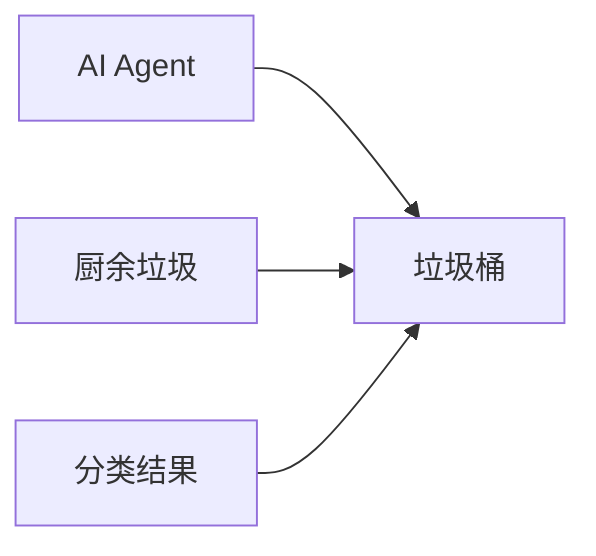
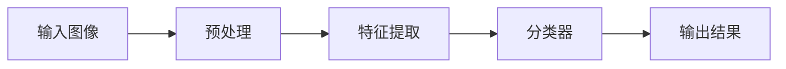
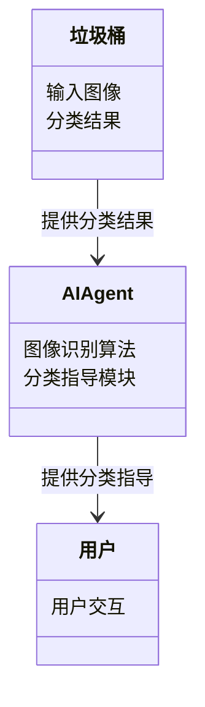
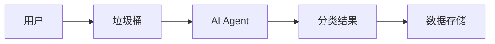
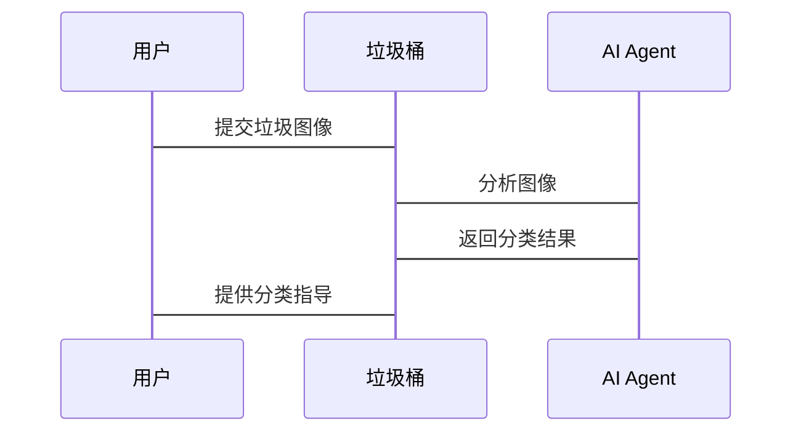

                 


# 智能厨房垃圾桶：AI Agent的厨余分类指导

> 关键词：智能垃圾桶、AI Agent、厨余分类、图像识别、深度学习

> 摘要：本文介绍了一种基于AI Agent的智能厨房垃圾桶系统，通过图像识别技术实现厨余垃圾分类。文章从背景、概念、算法原理到系统设计和项目实战，全面阐述了该系统的核心技术与实现方法，为读者提供了从理论到实践的完整指导。

---

# 第一部分: 背景介绍

# 第1章: 智能厨房垃圾桶的背景与问题分析

## 1.1 问题背景

### 1.1.1 厨余垃圾分类的重要性
厨余垃圾是指厨房中产生的有机废弃物，如果皮、菜叶、剩饭等。正确分类厨余垃圾对环境保护、资源回收和减少环境污染至关重要。通过分类，厨余垃圾可以转化为肥料或生物燃料，减少填埋和焚烧带来的环境问题。

### 1.1.2 当前厨余分类的主要问题
1. **人工分类效率低**：传统厨余分类依赖人工操作，效率低下且容易出错。
2. **分类标准不统一**：不同地区对厨余垃圾的分类标准差异大，增加了分类难度。
3. **用户习惯问题**：部分用户缺乏分类意识，导致分类不准确。

### 1.1.3 智能化分类的必要性
随着人工智能技术的快速发展，利用AI技术实现厨余垃圾分类成为可能。智能垃圾桶可以通过图像识别、语音交互等方式，帮助用户快速准确地完成分类，提升分类效率和准确率。

## 1.2 问题描述

### 1.2.1 厨余分类的基本概念
厨余分类是指将厨余垃圾按照特定标准进行分类的过程，常见的分类标准包括是否可回收、是否可堆肥等。

### 1.2.2 智能垃圾桶的核心功能
智能垃圾桶通过AI技术实现以下功能：
1. **自动识别**：利用图像识别技术识别厨余垃圾的种类。
2. **分类指导**：通过语音或显示提示用户如何分类。
3. **数据记录**：记录分类数据，提供分类统计和优化建议。

### 1.2.3 用户需求与痛点分析
用户在使用厨余垃圾桶时，主要需求包括：
1. **快速分类**：希望垃圾桶能够快速识别垃圾种类，减少分类时间。
2. **智能指导**：需要垃圾桶提供分类指导，帮助用户养成正确分类的习惯。
3. **数据反馈**：希望垃圾桶能够提供分类数据的反馈，帮助用户了解分类效果。

## 1.3 问题解决与边界

### 1.3.1 智能分类的解决方案
通过AI技术实现厨余垃圾的自动识别和分类，减少人工干预，提升分类效率。

### 1.3.2 边界与适用场景
智能垃圾桶适用于家庭、学校、餐厅等场所，特别适合需要高频分类的场景。

### 1.3.3 功能的外延与限制
智能垃圾桶的功能主要集中在分类识别和数据记录上，目前还无法处理非厨余垃圾的分类。

## 1.4 核心概念与组成

### 1.4.1 AI Agent的基本概念
AI Agent是一种能够感知环境并采取行动以实现目标的智能体。在智能垃圾桶中，AI Agent负责处理图像识别、分类判断等任务。

### 1.4.2 厨余分类的核心要素
厨余分类的核心要素包括图像识别算法、分类标准数据库、用户交互界面等。

### 1.4.3 系统组成与功能模块
智能垃圾桶系统主要由以下几个模块组成：
1. **图像采集模块**：用于采集垃圾的图像信息。
2. **图像识别模块**：通过深度学习算法识别垃圾种类。
3. **分类指导模块**：根据识别结果提供分类建议。
4. **数据存储模块**：记录分类数据，供后续分析使用。

---

# 第二部分: 核心概念与联系

# 第2章: AI Agent与厨余分类的关系

## 2.1 核心概念原理

### 2.1.1 AI Agent的基本原理
AI Agent通过感知环境、分析数据、做出决策并采取行动来实现目标。在智能垃圾桶中，AI Agent负责图像识别和分类判断。

### 2.1.2 厨余分类的实现机制
厨余分类的实现依赖于图像识别算法，AI Agent通过分析图像特征，判断垃圾种类并指导分类。

### 2.1.3 两者的结合方式
AI Agent作为系统的“大脑”，通过图像识别算法与用户交互模块协同工作，实现厨余垃圾分类的智能化。

## 2.2 概念对比与分析

### 2.2.1 AI Agent与传统分类算法的对比
| 对比维度       | AI Agent（深度学习）       | 传统分类算法（如SVM）   |
|----------------|--------------------------|--------------------------|
| 学习方式       | 需要大量标注数据，自动学习 | 需要手动特征提取         |
| 分类精度       | 更高，适用于复杂场景       | 较低，适用于简单场景     |
| 适应性         | 更强，可以处理新数据       | 较弱，需要重新训练       |

### 2.2.2 厨余分类与其它垃圾分类方式的对比
| 对比维度       | 厨余分类                | 可回收物分类            | 有害垃圾分类          |
|----------------|-------------------------|--------------------------|------------------------|
| 主要成分       | 有机废弃物              | 纸张、塑料、金属等      | 电池、药品等          |
| 分类难度       | 中等                    | 较低                    | 较高                  |

### 2.2.3 核心概念的特征总结
AI Agent与厨余分类的结合，使得垃圾桶具备了智能化、自动化的特点，能够显著提升分类效率和准确性。

## 2.3 实体关系与架构



---

# 第三部分: 算法原理讲解

# 第3章: 图像识别算法原理

## 3.1 算法流程



## 3.2 核心算法实现

### 3.2.1 YOLO算法实现
YOLO（You Only Look Once）是一种基于深度学习的实时目标检测算法，适用于厨余垃圾分类的图像识别任务。

#### 3.2.1.1 YOLO网络结构
YOLO网络由卷积基、特征提取层和解码层组成。以下是YOLO的实现代码：

```python
import tensorflow as tf
from tensorflow.keras import layers

def yolo_model(input_shape):
    model = tf.keras.Sequential([
        layers.Conv2D(32, (3,3), activation='relu', input_shape=input_shape),
        layers.MaxPooling2D((2,2)),
        layers.Conv2D(64, (3,3), activation='relu'),
        layers.MaxPooling2D((2,2)),
        layers.Flatten(),
        layers.Dense(128, activation='relu'),
        layers.Dense(10, activation='softmax')
    ])
    return model
```

#### 3.2.1.2 YOLO损失函数
YOLO使用均方误差作为损失函数：

$$ \text{loss} = \frac{1}{2}(y_{\text{true}} - y_{\text{pred}})^2 $$

#### 3.2.1.3 YOLO优化器
Adam优化器常用于训练YOLO模型：

$$ \text{优化器} = \text{Adam}(\text{学习率}=0.001) $$

## 3.3 算法原理的数学模型

### 3.3.1 卷积层
卷积层用于提取图像的特征，其数学表达式为：

$$ f(x) = \max(0, x \ast w + b) $$

其中，\( w \) 是卷积核权重，\( b \) 是偏置。

### 3.3.2 池化层
池化层用于降低特征图的维度，常用最大池化：

$$ f(x) = \max(x[0], x[1], x[2], x[3]) $$

---

# 第四部分: 系统分析与架构设计

# 第4章: 系统分析与架构设计

## 4.1 问题场景介绍
智能垃圾桶的应用场景包括家庭、餐厅、学校等场所，主要用于厨余垃圾的分类和管理。

## 4.2 项目介绍
本项目旨在设计一款基于AI技术的智能垃圾桶，实现厨余垃圾分类的智能化和自动化。

## 4.3 系统功能设计

### 4.3.1 领域模型



### 4.3.2 系统架构设计



## 4.4 系统接口设计

### 4.4.1 接口描述
1. **图像输入接口**：接收用户的图像输入。
2. **分类结果接口**：输出分类结果并提供分类指导。

### 4.4.2 接口实现
以下是一个简单的接口实现示例：

```python
class TrashBin:
    def __init__(self):
        self.agent = AIAgent()

    def classify(self, image):
        result = self.agent.predict(image)
        return result
```

## 4.5 系统交互设计



---

# 第五部分: 项目实战

# 第5章: 项目实战

## 5.1 环境安装

### 5.1.1 安装Python和TensorFlow
```bash
pip install python tensorflow
```

### 5.1.2 安装OpenCV
```bash
pip install opencv-python
```

## 5.2 系统核心实现

### 5.2.1 图像识别实现
```python
import cv2
import tensorflow as tf
from tensorflow.keras.models import load_model

def classify_image(image_path, model):
    image = cv2.imread(image_path)
    image = cv2.resize(image, (224, 224))
    image = image / 255.0
    image = tf.expand_dims(image, axis=0)
    prediction = model.predict(image)
    return prediction[0]

model = load_model('trash_classifier.h5')
classify_image('apple.jpg', model)
```

### 5.2.2 分类结果输出
```python
def output_guidance(class_result):
    guidance = {
        0: '可堆肥',
        1: '可回收',
        2: '有害垃圾'
    }
    print(f'分类结果：{guidance[class_result]}')
```

## 5.3 代码应用解读与分析
1. **图像采集**：使用OpenCV读取图像并进行预处理。
2. **模型加载**：加载预训练的深度学习模型。
3. **分类预测**：通过模型预测垃圾种类并输出结果。

## 5.4 实际案例分析
以一个苹果为例，垃圾桶会将其分类为“可堆肥垃圾”。

## 5.5 项目小结
通过本项目，我们实现了基于AI技术的智能垃圾桶，能够快速准确地完成厨余垃圾分类。

---

# 第六部分: 最佳实践

# 第6章: 最佳实践

## 6.1 小结
智能垃圾桶通过AI技术实现了厨余垃圾分类的智能化，显著提升了分类效率和准确性。

## 6.2 注意事项
1. **数据质量**：确保训练数据的多样性和代表性。
2. **模型优化**：定期更新模型以提升分类准确率。
3. **用户教育**：通过交互设计帮助用户养成正确分类的习惯。

## 6.3 拓展阅读
1. **深度学习与图像识别**：推荐学习YOLO、Faster R-CNN等目标检测算法。
2. **AI在环保中的应用**：探索AI在垃圾分类、资源回收等领域的更多应用。

---

# 结语

智能厨房垃圾桶通过AI技术的加持，为厨余垃圾分类带来了新的可能性。本文从背景、算法、系统设计到项目实战，全面介绍了这一技术的核心内容和实现方法。希望本文能够为读者提供有价值的参考，激发更多创新思考。

---

# 作者

**作者：AI天才研究院 & 禅与计算机程序设计艺术**  
本文由AI天才研究院与禅与计算机程序设计艺术联合撰写，致力于探索人工智能与计算机程序设计的前沿技术与应用场景。

