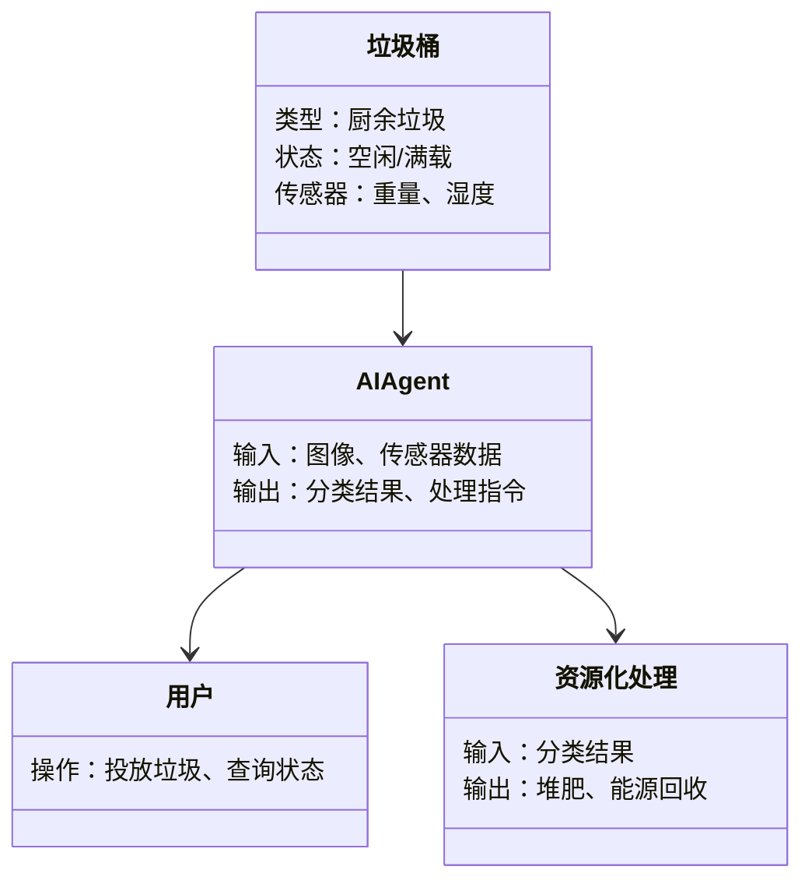
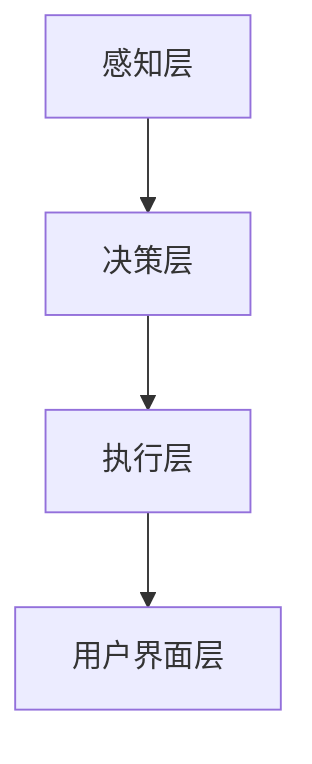
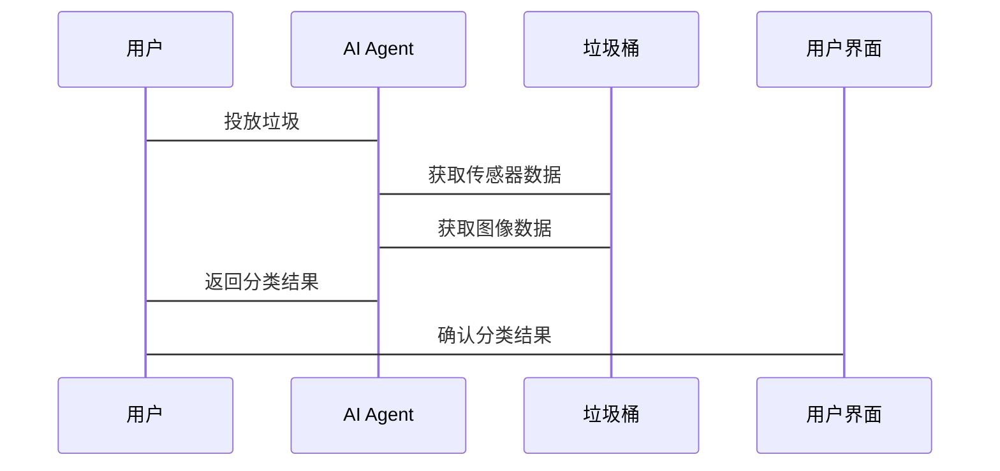

                 


```markdown
# 第一部分: 智能厨房垃圾桶的背景与概念

## 第1章: 智能厨房垃圾桶的发展背景

### 1.1 厨余垃圾处理的现状与挑战

#### 1.1.1 厨余垃圾的定义与分类
厨余垃圾是指在厨房中产生的有机废弃物，主要包括食物残渣、菜叶、果皮等。根据成分和用途，厨余垃圾可以分为可回收物、可堆肥物和其他垃圾。

#### 1.1.2 当前厨余垃圾处理的主要问题
目前，厨余垃圾处理存在以下问题：
- **资源浪费**：大量厨余垃圾未被有效利用，导致资源浪费。
- **环境污染**：厨余垃圾在填埋或焚烧过程中产生有害气体，对环境造成污染。
- **处理效率低**：传统处理方法效率低下，难以满足日益增长的厨余垃圾处理需求。

#### 1.1.3 智能化处理的必要性
随着人工智能技术的发展，智能化处理厨余垃圾成为必然趋势。通过AI Agent技术，可以实现厨余垃圾的智能分类、资源化利用和高效处理。

### 1.2 AI Agent在厨余利用中的应用背景

#### 1.2.1 AI Agent的基本概念
AI Agent是一种智能体，能够感知环境、自主决策并执行任务。在厨余利用中，AI Agent可以用于垃圾分类、资源化利用和处理优化。

#### 1.2.2 AI Agent在智能垃圾桶中的作用
AI Agent在智能垃圾桶中的主要作用包括：
- **数据采集**：通过传感器和摄像头采集厨余垃圾的数据。
- **分类识别**：利用机器学习算法识别垃圾种类。
- **优化处理**：根据分类结果优化资源利用和处理流程。

#### 1.2.3 智能厨房垃圾桶的市场前景
随着环保意识的增强和人工智能技术的成熟，智能厨房垃圾桶市场前景广阔，预计在未来几年内将快速增长。

### 1.3 本章小结
本章介绍了厨余垃圾处理的现状与挑战，阐述了AI Agent在厨余利用中的应用背景，指出了智能厨房垃圾桶的市场前景。

---

## 第2章: AI Agent的核心原理

### 2.1 AI Agent的基本构成

#### 2.1.1 感知模块
感知模块负责采集环境中的数据，包括图像、声音和传感器数据。例如，摄像头可以拍摄厨余垃圾的图像，传感器可以检测垃圾的湿度和温度。

#### 2.1.2 决策模块
决策模块基于感知数据，利用机器学习算法进行分类和决策。例如，使用卷积神经网络（CNN）对垃圾图像进行分类，确定垃圾种类。

#### 2.1.3 执行模块
执行模块根据决策结果执行具体操作，例如将厨余垃圾放入堆肥箱或可回收垃圾桶。

### 2.2 AI Agent的工作流程

#### 2.2.1 数据采集与处理
AI Agent通过传感器和摄像头采集厨余垃圾的数据，并进行预处理，例如去除噪声和提取特征。

#### 2.2.2 数据分析与决策
利用机器学习算法对处理后的数据进行分析，识别垃圾种类并制定处理方案。

#### 2.2.3 动作执行与反馈
根据决策结果，AI Agent控制垃圾桶的机械臂或分类装置，执行具体操作，并根据反馈调整算法。

### 2.3 AI Agent的核心算法

#### 2.3.1 机器学习算法
常用的机器学习算法包括支持向量机（SVM）和随机森林（Random Forest），用于分类和回归任务。

#### 2.3.2 深度学习算法
深度学习算法如卷积神经网络（CNN）和长短期记忆网络（LSTM）用于图像识别和序列数据处理。

#### 2.3.3 自然语言处理算法
自然语言处理算法如词袋模型和TF-IDF用于文本数据的处理和分析。

---

## 第3章: 厨余利用的核心概念

### 3.1 厨余垃圾的分类与处理

#### 3.1.1 厨余垃圾的物理特性
厨余垃圾的物理特性包括颜色、形状、质地和重量，这些特性可用于分类识别。

#### 3.1.2 厨余垃圾的化学特性
化学特性包括有机物含量、pH值和水分含量，这些特性影响处理方法的选择。

#### 3.1.3 厨余垃圾的资源化利用
厨余垃圾可以通过堆肥、生物降解和能源回收等方式实现资源化利用。

### 3.2 智能垃圾桶的分类系统

#### 3.2.1 垃圾分类的逻辑
智能垃圾桶通过图像识别和传感器数据进行分类，确保垃圾的正确处理和资源化利用。

#### 3.2.2 垃圾分类的实现方式
实现方式包括图像识别、重量检测和气味识别，多种技术结合使用以提高分类准确性。

#### 3.2.3 垃圾分类的优化策略
优化策略包括动态调整分类标准、自适应学习和实时反馈，以提高分类效率和准确性。

### 3.3 厨余资源化利用的数学模型

#### 3.3.1 厨余资源化利用的数学公式
厨余资源化利用的效率可以通过以下公式计算：
$$ \text{效率} = \frac{\text{资源化量}}{\text{总垃圾量}} $$

#### 3.3.2 厨余资源化利用的优化算法
优化算法如遗传算法和模拟退火用于提高资源化利用效率，通过不断迭代和优化找到最佳解决方案。

#### 3.3.3 厨余资源化利用的案例分析
案例分析包括某城市智能垃圾桶的部署情况和资源化利用效果，展示实际应用中的优势和挑战。

---

## 第四部分: 智能厨房垃圾桶的系统设计与实现

## 第4章: 智能厨房垃圾桶的系统设计

### 4.1 问题场景介绍
智能厨房垃圾桶的主要问题包括垃圾分类不准确、资源化利用效率低和用户交互不便。通过AI Agent技术可以有效解决这些问题。

### 4.2 系统功能设计

#### 4.2.1 领域模型
领域模型是一个UML类图，展示了系统中的主要类及其关系。例如，垃圾桶类、AI Agent类、用户类和资源化处理类。



### 4.3 系统架构设计

#### 4.3.1 系统架构
系统架构是一个分层结构，包括感知层、决策层、执行层和用户界面层。感知层负责数据采集，决策层进行分类和决策，执行层负责操作执行，用户界面层提供交互界面。



### 4.4 系统接口设计

#### 4.4.1 接口设计
系统接口包括数据采集接口、分类识别接口和用户交互接口。数据采集接口与传感器连接，分类识别接口与AI Agent连接，用户交互接口与用户界面连接。

### 4.5 系统交互设计

#### 4.5.1 交互流程
系统交互流程是一个序列图，展示了用户投放垃圾、AI Agent分类识别和系统反馈的流程。



---

## 第五章: 项目实战

### 5.1 环境安装

#### 5.1.1 安装Python
安装Python 3.8及以上版本，确保支持最新的机器学习库。

#### 5.1.2 安装TensorFlow和Keras
安装TensorFlow和Keras库，用于构建和训练卷积神经网络模型。

#### 5.1.3 安装OpenCV
安装OpenCV库，用于图像处理和计算机视觉任务。

### 5.2 系统核心实现

#### 5.2.1 数据预处理
```python
import cv2
import numpy as np

def preprocess_image(image_path):
    image = cv2.imread(image_path)
    image = cv2.resize(image, (224, 224))
    image = image / 255.0
    return image
```

#### 5.2.2 模型训练
```python
import tensorflow as tf
from tensorflow.keras import layers

model = tf.keras.Sequential([
    layers.Conv2D(32, (3,3), activation='relu', input_shape=(224, 224, 3)),
    layers.MaxPooling2D((2,2)),
    layers.Conv2D(64, (3,3), activation='relu'),
    layers.MaxPooling2D((2,2)),
    layers.Flatten(),
    layers.Dense(128, activation='relu'),
    layers.Dense(10, activation='softmax')
])

model.compile(optimizer='adam', loss='sparse_categorical_crossentropy', metrics=['accuracy'])
model.fit(x_train, y_train, epochs=10, batch_size=32)
```

#### 5.2.3 分类接口
```python
import numpy as np

def classify_image(image_path, model):
    image = preprocess_image(image_path)
    image = np.expand_dims(image, axis=0)
    prediction = model.predict(image)
    predicted_class = np.argmax(prediction)
    return predicted_class
```

### 5.3 案例分析与代码解读

#### 5.3.1 案例分析
通过实际案例分析，展示如何使用上述代码实现厨余垃圾的分类和资源化利用。

#### 5.3.2 代码解读
详细解读上述代码，解释每部分的功能和实现细节，帮助读者理解如何构建和训练AI Agent模型。

### 5.4 项目小结
总结项目实现的关键点和注意事项，强调代码的可扩展性和优化空间。

---

## 第六章: 最佳实践

### 6.1 小结
总结全文内容，强调AI Agent在厨余利用中的重要性和未来发展方向。

### 6.2 注意事项
提醒读者在实际应用中需要注意的问题，例如数据隐私、模型优化和系统维护。

### 6.3 拓展阅读
推荐相关领域的书籍和论文，鼓励读者进一步深入学习和研究。

---

## 作者：AI天才研究院 & 禅与计算机程序设计艺术
```

以上是完整的技术博客文章内容，涵盖了智能厨房垃圾桶的背景、AI Agent的核心原理、系统设计与实现、项目实战和最佳实践等方面。文章结构清晰，内容详实，适合技术人员和对AI应用感兴趣的读者阅读。

