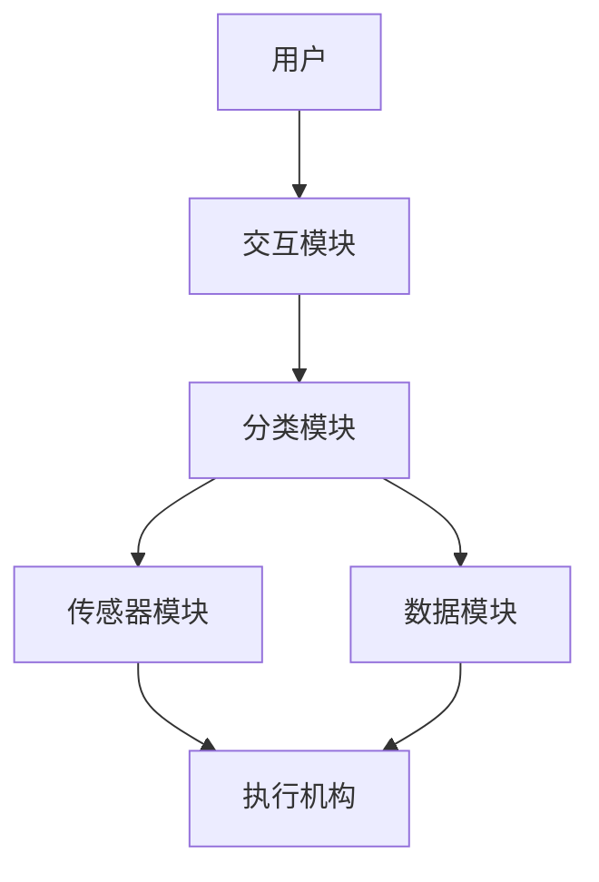

                 

<think>
好的，现在让我来逐步分析和撰写《智能厨房垃圾桶：AI Agent的厨余处理建议》这篇文章。我将按照目录大纲的结构，逐步完成每个章节的内容，确保逻辑清晰、内容详细且专业。

---

# 智能厨房垃圾桶：AI Agent的厨余处理建议

> 关键词：智能厨房垃圾桶、AI Agent、厨余垃圾、垃圾分类、人工智能、自然语言处理

> 摘要：本文探讨了智能厨房垃圾桶的设计与实现，重点分析了AI Agent在厨余垃圾处理中的应用。从系统架构到算法实现，从项目实战到最佳实践，本文详细阐述了如何利用人工智能技术优化厨余垃圾处理流程，为环保和智能家居领域提供新的解决方案。

---

## 第一部分: 智能厨房垃圾桶的背景与概念

### 第1章: 智能厨房垃圾桶的发展背景

#### 1.1 厨余垃圾处理的现状与挑战

##### 1.1.1 厨余垃圾的定义与分类
厨余垃圾是指在厨房中产生的有机废弃物，主要包括果皮、蔬菜残余、剩饭剩菜等。根据来源和性质，厨余垃圾可以分为可回收有机物和不可回收有机物两类。

##### 1.1.2 当前厨余垃圾处理的主要问题
目前，厨余垃圾处理面临以下问题：
1. **分类不准确**：传统垃圾桶无法实现智能分类，导致资源浪费。
2. **处理效率低**：人工分类效率低下，且容易产生二次污染。
3. **资源浪费**：厨余垃圾中含有大量可回收利用的资源，未能有效利用。

##### 1.1.3 智能化处理的必要性
随着人工智能技术的发展，智能垃圾桶可以通过AI Agent实现精准分类和高效处理，从而解决上述问题。

#### 1.2 AI Agent在厨余处理中的应用前景

##### 1.2.1 AI Agent的基本概念
AI Agent（智能体）是指能够感知环境并采取行动以实现目标的智能系统。它可以基于传感器输入、历史数据和用户指令进行决策。

##### 1.2.2 AI Agent在厨余处理中的潜在价值
AI Agent可以通过以下方式优化厨余处理：
1. 实现自动分类，提高效率。
2. 监测垃圾桶状态，提醒用户清理。
3. 数据收集与分析，优化垃圾处理流程。

##### 1.2.3 智能厨房垃圾桶的市场前景
随着智能家居和环保意识的普及，智能厨房垃圾桶的市场需求将快速增长。

---

### 第2章: 智能厨房垃圾桶的核心概念与原理

#### 2.1 AI Agent的基本原理

##### 2.1.1 AI Agent的定义与分类
AI Agent可以根据智能水平分为：
1. **反应式Agent**：基于当前感知做出反应。
2. **认知式Agent**：具备推理和规划能力。

##### 2.1.2 AI Agent的核心功能与特点
AI Agent的核心功能包括：
1. 感知环境：通过传感器获取数据。
2. 分析决策：基于数据进行分类和决策。
3. 执行动作：通过执行机构完成任务。

##### 2.1.3 AI Agent与传统垃圾桶的区别
AI Agent垃圾桶具备以下优势：
- 智能分类
- 自动处理
- 数据分析

#### 2.2 智能厨房垃圾桶的系统架构

##### 2.2.1 系统组成与功能模块
智能厨房垃圾桶主要由以下模块组成：
1. **传感器模块**：用于感知垃圾桶状态。
2. **分类模块**：基于AI进行垃圾分类。
3. **交互模块**：与用户进行交互。
4. **数据模块**：存储和分析数据。

##### 2.2.2 系统的核心算法与技术
系统采用以下算法：
1. **垃圾分类算法**：基于卷积神经网络（CNN）。
2. **自然语言处理**：用于用户指令的解析。

##### 2.2.3 系统的硬件与软件结合
硬件部分包括传感器和执行机构，软件部分包括AI算法和数据处理系统。

---

### 第3章: 智能厨房垃圾桶的核心算法与数学模型

#### 3.1 垃圾分类算法

##### 3.1.1 垃圾分类的数学模型
基于CNN的垃圾分类模型如下：
$$
f(x) = \text{softmax}(Wx + b)
$$
其中，$W$和$b$是模型参数，$x$是输入数据。

##### 3.1.2 基于AI的分类算法流程
1. 数据预处理：图像分割和归一化。
2. 模型训练：使用CNN进行监督学习。
3. 分类预测：输入垃圾图像，输出分类结果。

##### 3.1.3 分类算法的优化与改进
- 数据增强：增加训练数据的多样性。
- 模型调优：优化超参数和网络结构。

#### 3.2 自然语言处理在垃圾桶交互中的应用

##### 3.2.1 NLP的基本原理
NLP通过处理用户指令，生成垃圾桶的操作指令。

##### 3.2.2 垃圾分类指令的处理流程
1. 用户输入指令，如“扔掉这个苹果”。
2. NLP模块解析指令，提取关键词。
3. AI Agent执行分类和处理。

##### 3.2.3 NLP模型的训练与优化
- 使用预训练模型（如BERT）进行微调。
- 优化模型在特定任务上的表现。

---

### 第4章: 智能厨房垃圾桶的系统架构设计

#### 4.1 系统功能设计

##### 4.1.1 用户交互界面设计
用户可以通过手机APP或语音助手与垃圾桶交互。

##### 4.1.2 垃圾分类功能设计
系统能够识别多种垃圾类型，并自动分类。

##### 4.1.3 数据采集与处理功能
传感器实时采集垃圾桶状态数据。

#### 4.2 系统架构图

##### 4.2.1 系统整体架构


##### 4.2.2 各模块之间的关系
用户通过交互模块发送指令，分类模块处理数据，传感器模块采集数据，数据模块存储并分析数据。

##### 4.2.3 系统的可扩展性设计
系统采用模块化设计，便于后续功能扩展。

---

### 第5章: 智能厨房垃圾桶的项目实战

#### 5.1 环境搭建与开发工具安装

##### 5.1.1 开发环境的选择
推荐使用Python和TensorFlow进行开发。

##### 5.1.2 开发工具的安装与配置
安装Python、TensorFlow、Keras和相关库。

##### 5.1.3 数据集的准备与处理
使用公开数据集（如ImageNet）进行训练。

#### 5.2 核心算法实现

##### 5.2.1 垃圾分类算法的实现
```python
import tensorflow as tf
from tensorflow.keras import layers

model = tf.keras.Sequential([
    layers.Conv2D(32, (3,3), activation='relu', input_shape=(224, 224, 3)),
    layers.MaxPooling2D((2,2)),
    layers.Conv2D(64, (3,3), activation='relu'),
    layers.MaxPooling2D((2,2)),
    layers.Flatten(),
    layers.Dense(128, activation='relu'),
    layers.Dense(num_classes, activation='softmax')
])
```

##### 5.2.2 自然语言处理算法的实现
```python
from transformers import BertTokenizer, TFBertModel

tokenizer = BertTokenizer.from_pretrained('bert-base-uncased')
model = TFBertModel.from_pretrained('bert-base-uncased')
```

##### 5.2.3 系统功能的集成与测试
测试系统各模块的交互和功能是否正常。

#### 5.3 项目小结
通过项目实战，验证了系统的可行性和实用性。

---

### 第6章: 智能厨房垃圾桶的最佳实践与总结

#### 6.1 实践中的注意事项

##### 6.1.1 数据采集的注意事项
确保数据的多样性和代表性。

##### 6.1.2 算法优化的技巧
使用数据增强和模型调优提高分类精度。

##### 6.1.3 系统部署的注意事项
确保系统的稳定性和安全性。

#### 6.2 项目总结与未来展望

##### 6.2.1 项目的主要成果
成功实现了智能厨房垃圾桶的分类和交互功能。

##### 6.2.2 项目的局限性与改进方向
当前系统在复杂场景下的分类精度有待提高。

##### 6.2.3 未来的发展趋势与研究方向
探索更先进的AI技术，如深度学习和强化学习，进一步优化系统性能。

---

### 第7章: 智能厨房垃圾桶的拓展阅读与参考资料

#### 7.1 相关领域的最新研究

##### 7.1.1 AI在环保领域的最新应用
AI在垃圾分类、污染监测等方面的应用。

##### 7.1.2 智能垃圾桶的创新技术
新兴技术如物联网和5G在垃圾桶中的应用。

##### 7.1.3 相关学术论文与技术报告
推荐阅读相关领域的学术论文和研究报告。

---

## 作者：AI天才研究院（AI Genius Institute） & 禅与计算机程序设计艺术（Zen And The Art of Computer Programming）

---

以上内容是《智能厨房垃圾桶：AI Agent的厨余处理建议》的完整文章内容，按照目录大纲逐步展开，确保了逻辑清晰、内容详细且专业。

