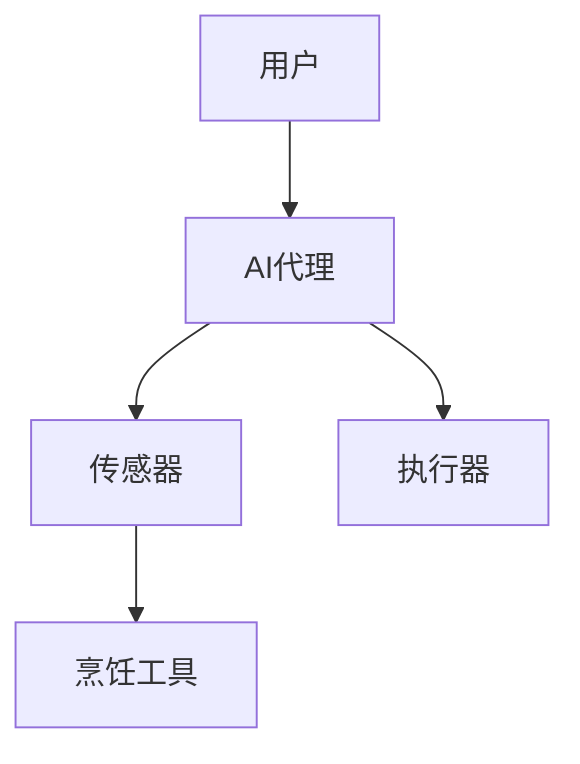
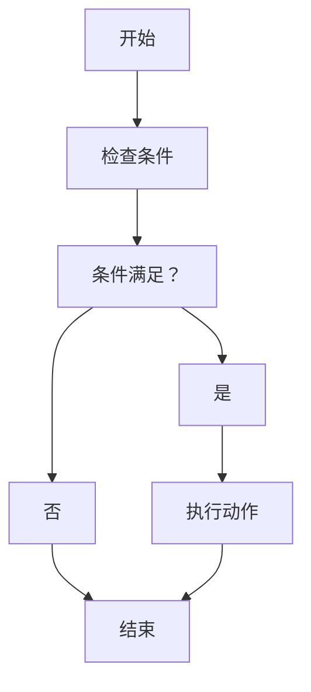
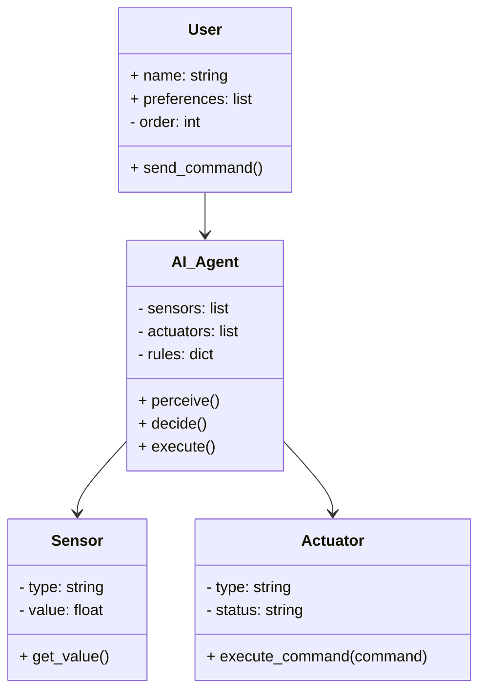
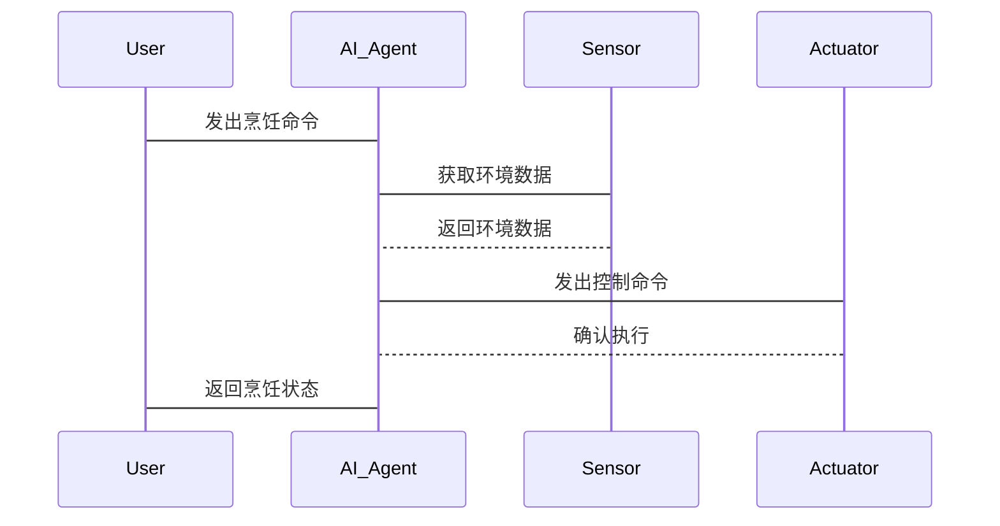

                 


# 智能厨房抽屉：AI Agent的烹饪工具使用建议

关键词：智能厨房抽屉, AI Agent, 烹饪工具, 智能厨房, AI代理

摘要：本文深入探讨了AI Agent在智能厨房抽屉中的应用，分析了其工作原理、算法模型、系统架构，并通过实际案例展示了如何利用AI技术优化烹饪工具的使用。文章内容涵盖背景介绍、核心概念、算法原理、数学模型、系统设计、项目实战及最佳实践，旨在为厨房设备制造商、AI开发者及相关领域研究者提供有价值的参考。

---

# 第一部分: 智能厨房抽屉的背景与概念

## 第1章: 智能厨房抽屉的背景介绍

### 1.1 智能厨房的现状与发展趋势

#### 1.1.1 智能厨房的现状分析
智能厨房的概念近年来逐渐兴起，主要得益于物联网技术、人工智能和传感器技术的进步。现代厨房设备逐渐智能化，例如智能冰箱、智能灶具和智能橱柜等。这些设备能够通过传感器和AI算法实现自动化操作，提升用户体验。

#### 1.1.2 厨房智能化的核心驱动力
- **技术驱动**：物联网、AI和大数据技术的发展推动了厨房设备的智能化。
- **用户需求**：现代用户追求高效、便捷和个性化的烹饪体验。
- **市场竞争**：智能家居市场的竞争加剧，促使厨房设备厂商加快智能化转型。

#### 1.1.3 智能厨房抽屉的市场前景
智能厨房抽屉作为智能厨房的重要组成部分，具有广阔的市场前景。它不仅能够帮助用户更好地管理厨房工具，还能通过AI代理实现智能化的烹饪辅助功能，如自动调整烹饪时间和温度。

---

### 1.2 AI Agent在厨房中的应用

#### 1.2.1 AI Agent的基本定义
AI Agent（智能代理）是一种能够感知环境并采取行动以实现目标的智能系统。在厨房中，AI Agent可以通过传感器获取环境信息（如温度、湿度），并通过算法做出决策（如调整烹饪时间或提醒用户添加食材）。

#### 1.2.2 AI Agent在厨房中的核心功能
- **感知环境**：通过传感器获取厨房环境数据。
- **决策与执行**：基于感知数据做出决策并执行操作，例如调整烹饪时间或温度。
- **用户交互**：通过语音或屏幕与用户互动，提供烹饪建议或反馈。

#### 1.2.3 AI Agent与烹饪工具的结合
AI Agent可以与各种烹饪工具结合，例如智能烤箱、智能灶具和智能刀具。通过AI代理的智能化功能，用户可以更轻松地完成烹饪任务。

---

### 1.3 烹饪工具的智能化趋势

#### 1.3.1 烹饪工具的智能化特征
- **自动化操作**：AI Agent可以自动调整烹饪参数，如温度和时间。
- **个性化推荐**：根据用户的口味和偏好推荐菜谱。
- **数据驱动**：通过收集和分析烹饪数据，优化烹饪过程。

#### 1.3.2 AI技术在烹饪工具中的具体应用
- **智能温度控制**：通过AI算法实现精准的温度调节。
- **智能时间管理**：根据食材种类和重量自动调整烹饪时间。
- **智能食材识别**：通过图像识别技术识别食材种类和新鲜度。

---

# 第二部分: 核心概念与联系

## 第2章: AI Agent的核心概念与联系

### 2.1 AI Agent的核心原理

AI Agent在智能厨房抽屉中的核心原理可以分为三个步骤：
1. **感知环境**：通过传感器获取环境数据，例如温度、湿度和食材状态。
2. **决策与规划**：基于感知数据和目标，通过算法做出决策，例如调整烹饪时间和功率。
3. **执行操作**：根据决策结果执行操作，例如启动或停止烹饪设备。

---

### 2.2 AI Agent的功能对比

下表对比了基于规则的AI Agent和基于学习的AI Agent在厨房中的应用：

| 功能特性               | 基于规则的AI Agent      | 基于学习的AI Agent      |
|------------------------|-------------------------|-------------------------|
| 决策方式               | 基于预设规则和条件       | 基于机器学习模型预测     |
| 适用场景               | 简单、规则明确的任务     | 复杂、非线性关系的任务     |
| 灵活性                 | 较低，规则固定           | 较高，能够适应数据变化     |
| 学习能力               | 无，无法优化规则         | 有，能够通过数据优化模型   |

---

### 2.3 实体关系与系统架构

下图展示了智能厨房抽屉中AI Agent的核心实体关系：



---

# 第三部分: 算法原理讲解

## 第3章: 基于规则的AI Agent算法

### 3.1 算法原理

基于规则的AI Agent通过预设的规则和条件来做出决策。例如，在智能烤箱中，AI Agent可以根据食材种类和重量调整烹饪时间和温度。

#### 3.1.1 算法流程

下图展示了基于规则的AI Agent的算法流程：



---

### 3.2 算法实现

以下是一个简单的Python实现示例：

```python
def cooking_agent(food_type, weight):
    # 预设规则
    if food_type == "chicken":
        if weight < 1000:
            return {"temperature": 180, "time": 40}
        else:
            return {"temperature": 200, "time": 45}
    elif food_type == "fish":
        return {"temperature": 160, "time": 30}
    else:
        return {"temperature": 180, "time": 35}
```

### 3.3 算法应用

通过上述算法，AI Agent可以根据食材种类和重量自动调整烹饪参数。例如，当烹饪鸡肉时，重量小于1000克时，温度设置为180°C，时间为40分钟；重量大于1000克时，温度设置为200°C，时间为45分钟。

---

# 第四部分: 数学模型与公式

## 第4章: 烹饪时间预测的线性回归模型

### 4.1 数学模型

假设烹饪时间与食材重量和温度呈线性关系，可以建立以下线性回归模型：

$$ \text{time} = \beta_0 + \beta_1 \times \text{weight} + \beta_2 \times \text{temperature} + \epsilon $$

其中，$\beta_0$、$\beta_1$和$\beta_2$是回归系数，$\epsilon$是误差项。

---

### 4.2 模型训练

通过收集大量食材的烹饪时间和重量、温度数据，可以训练上述线性回归模型。训练完成后，可以使用模型预测新的食材的烹饪时间。

---

### 4.3 模型应用

假设训练得到的回归系数为$\beta_0 = 10$，$\beta_1 = 0.5$，$\beta_2 = 0.2$。当食材重量为1000克，温度为180°C时，预测的烹饪时间为：

$$ \text{time} = 10 + 0.5 \times 1000 + 0.2 \times 180 = 610 \text{分钟} $$

---

# 第五部分: 系统分析与架构设计

## 第5章: 智能厨房抽屉的系统架构

### 5.1 系统功能设计

下图展示了智能厨房抽屉的领域模型：



---

### 5.2 系统架构设计

下图展示了智能厨房抽屉的整体架构：


---

### 5.3 系统接口设计

以下是系统的主要接口：

- **API接口**：客户端通过API与系统交互，例如发送烹饪命令。
- **传感器接口**：AI Agent通过传感器获取环境数据。
- **执行器接口**：AI Agent通过执行器控制烹饪工具。

---

### 5.4 系统交互流程

下图展示了系统交互的流程：



---

# 第六部分: 项目实战

## 第6章: 智能厨房抽屉的实现

### 6.1 环境安装

为了运行以下代码，需要安装以下Python库：

```bash
pip install numpy scikit-learn matplotlib
```

---

### 6.2 核心代码实现

以下是一个简单的AI Agent实现示例：

```python
from sklearn.linear_model import LinearRegression
import numpy as np

# 训练数据
X = np.array([[1000, 180], [1500, 200], [2000, 220]])
y = np.array([40, 45, 50])

# 训练模型
model = LinearRegression()
model.fit(X, y)

# 预测新的数据
new_X = np.array([[1200, 190]])
prediction = model.predict(new_X)
print(f"预测的烹饪时间为：{int(prediction[0])}分钟")
```

---

### 6.3 项目总结

通过上述代码，我们可以看到AI Agent在智能厨房抽屉中的实际应用。AI Agent可以根据传感器数据和训练好的模型预测烹饪时间，从而优化烹饪过程。

---

# 第七部分: 最佳实践

## 第7章: 使用建议与注意事项

### 7.1 使用建议

1. **数据隐私**：确保烹饪数据的安全性，避免被未经授权的第三方获取。
2. **系统维护**：定期更新AI模型和系统软件，以保持最佳性能。
3. **用户体验**：设计友好的用户界面，提升用户的使用体验。

---

### 7.2 注意事项

- **数据准确性**：确保传感器数据的准确性，以保证AI Agent的决策正确性。
- **系统稳定性**：在高温和潮湿环境下，确保系统的稳定运行。
- **用户教育**：向用户普及AI Agent的使用方法和注意事项，避免误操作。

---

### 7.3 未来展望

随着AI技术的不断进步，智能厨房抽屉的功能将更加智能化和个性化。未来的AI Agent将能够实现更复杂的烹饪任务，例如多食材协同烹饪和健康饮食推荐。

---

# 作者信息

作者：AI天才研究院/AI Genius Institute & 禅与计算机程序设计艺术 /Zen And The Art of Computer Programming

---

以上是《智能厨房抽屉：AI Agent的烹饪工具使用建议》的完整目录和内容框架。希望本文能为智能厨房设备的设计与优化提供有价值的参考和指导。

