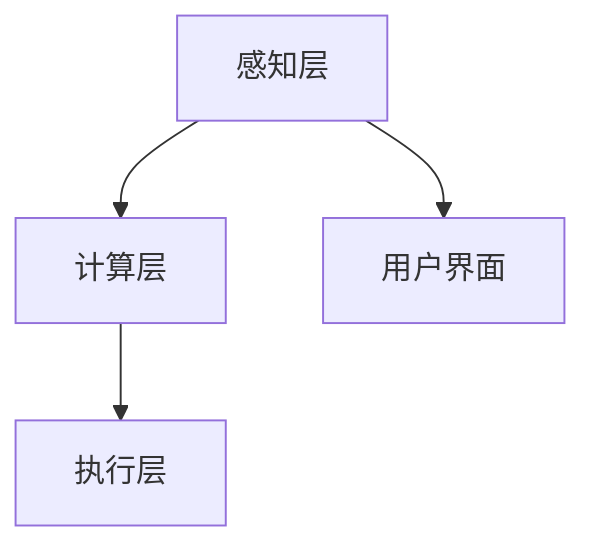
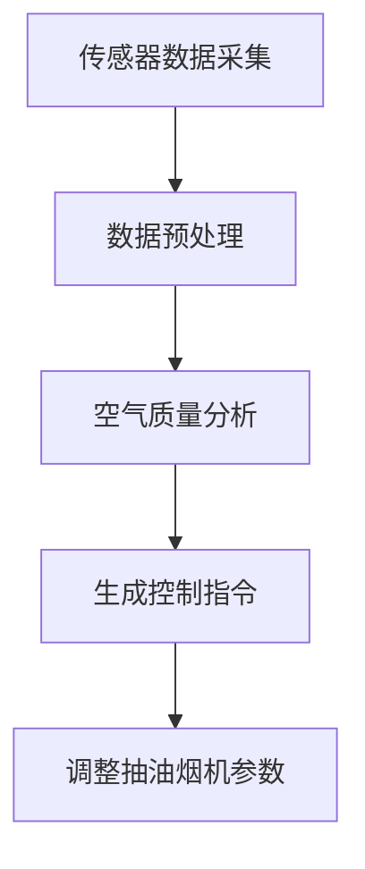

                 


# 智能厨房抽油烟机：AI Agent的空气质量控制

> 关键词：智能厨房、抽油烟机、AI Agent、空气质量控制、传感器技术、机器学习、算法优化

> 摘要：本文深入探讨了智能厨房抽油烟机中AI Agent如何实现空气质量控制的技术细节。通过分析空气质量的核心要素、AI Agent的工作原理、系统架构设计以及具体算法实现，展示了如何利用AI技术提升厨房空气质量管理的效率和智能化水平。文章还通过实际项目案例，详细讲解了系统的实现过程，并展望了未来的发展方向。

---

## 第二章：空气质量控制的核心概念

### 2.1 空气质量的核心要素

#### 2.1.1 PM2.5、CO₂、VOC等指标的定义

空气质量的核心指标包括PM2.5、CO₂和VOC（挥发性有机化合物）。这些指标在厨房环境中尤为重要，因为烹饪过程会产生大量的颗粒物和有害气体。

- **PM2.5**：指直径小于或等于2.5微米的颗粒物，这些颗粒物容易进入肺部，影响呼吸系统健康。
- **CO₂**：二氧化碳浓度过高会导致缺氧，影响人体舒适度和健康。
- **VOC**：挥发性有机化合物，包括甲醛、苯等有害气体，主要来自烹饪过程中的油烟和燃料燃烧。

#### 2.1.2 厨房环境中的特殊性

厨房环境的独特性使得空气质量控制更具挑战性：

- **高油烟浓度**：烹饪过程中产生的油烟含有大量颗粒物和VOC。
- **高温和湿度**：烹饪过程会产生高温和高湿度，影响传感器的准确性和设备的稳定性。
- **人员密集**：厨房通常在烹饪高峰期人员较多，空气质量变化快，需要实时监测和调整。

#### 2.1.3 空气质量与人体健康的关系

空气质量直接影响人体健康，尤其是在厨房环境中：

- **呼吸系统影响**：PM2.5和油烟颗粒物会刺激呼吸道，导致咳嗽、哮喘等问题。
- **神经系统影响**：CO₂浓度过高会导致头晕、注意力不集中。
- **慢性病风险**：长期暴露在高浓度VOC环境中可能增加患癌症的风险。

### 2.2 AI Agent在空气质量控制中的作用

#### 2.2.1 数据采集与处理

AI Agent通过多种传感器实时采集厨房环境数据，包括：

- **颗粒物传感器**：监测PM2.5浓度。
- **CO₂传感器**：监测二氧化碳浓度。
- **VOC传感器**：监测挥发性有机化合物浓度。
- **温湿度传感器**：监测环境温湿度。

#### 2.2.2 状态识别与分析

AI Agent对采集到的数据进行分析，识别空气质量状态：

- **数据融合**：通过加权平均算法融合多传感器数据，提高准确性。
- **异常检测**：利用机器学习算法识别异常空气质量变化。
- **状态分类**：将空气质量分为“良好”、“一般”、“较差”、“危险”四个等级。

#### 2.2.3 自动调节与优化

AI Agent根据空气质量状态，自动调节抽油烟机的运行参数：

- **风速调节**：根据PM2.5浓度调整风速，确保油烟被有效排出。
- **净化模式切换**：当检测到高浓度VOC时，启动空气净化模式。
- **智能定时**：根据CO₂浓度自动开启或关闭抽油烟机。

---

## 第三章：AI Agent的空气质量控制原理

### 3.1 空气质量监测的传感器技术

#### 3.1.1 常用传感器类型与原理

- **PM2.5传感器**：基于光散射原理，通过激光或LED光源照射颗粒物，测量散射光强度来判断PM2.5浓度。
- **CO₂传感器**：利用非扩散红外技术（NDIR）测量CO₂浓度。
- **VOC传感器**：通过气相色谱法或电化学方法检测VOC浓度。

#### 3.1.2 多传感器数据融合技术

为了提高空气质量监测的准确性，通常需要将多个传感器的数据进行融合。常见的融合方法包括加权平均和马尔可夫链模型。

**加权平均融合算法**：
$$
\text{融合后的值} = \sum_{i=1}^{n} w_i \cdot x_i
$$
其中，\( w_i \) 是第 \( i \) 个传感器的权重，\( x_i \) 是对应的测量值。

**马尔可夫链模型**：
通过状态转移概率矩阵，预测空气质量的变化趋势，提高异常检测的准确性。

#### 3.1.3 传感器网络的部署与优化

传感器网络的部署需要考虑以下几点：

- **布局优化**：确保传感器覆盖整个厨房区域，避免盲区。
- **数据同步**：保证多传感器数据的时间同步，减少延迟。
- **自校准功能**：传感器应具备自校准能力，确保长期使用的准确性。

### 3.2 AI Agent的决策机制

#### 3.2.1 数据分析与特征提取

AI Agent对传感器数据进行分析，提取关键特征，如PM2.5浓度变化率、CO₂浓度峰值等。

#### 3.2.2 基于机器学习的预测模型

常用的机器学习算法包括支持向量机（SVM）和随机森林（Random Forest）。这些算法可以用来预测空气质量的变化趋势。

**随机森林算法**：
随机森林通过构建多个决策树，投票决定最终预测结果，具有较高的准确性和鲁棒性。

#### 3.2.3 自适应调节算法

自适应调节算法根据空气质量的变化动态调整抽油烟机的运行参数。例如：

- **PID控制算法**：
$$
u(t) = K_p e(t) + K_i \int_{0}^{t} e(t') dt' + K_d \frac{d e(t)}{dt}
$$
其中，\( e(t) \) 是误差，\( K_p \)、\( K_i \)、\( K_d \) 是比例、积分和微分系数。

---

## 第四章：系统架构与功能设计

### 4.1 系统整体架构

智能厨房抽油烟机的系统架构可以分为三层：

1. **感知层**：负责采集环境数据，包括PM2.5、CO₂、VOC等传感器。
2. **计算层**：对采集的数据进行处理和分析，生成空气质量控制指令。
3. **执行层**：根据指令调整抽油烟机的运行参数，如风速、净化模式等。

**系统架构图**：


### 4.2 功能模块详细设计

#### 4.2.1 数据采集模块

数据采集模块负责收集各种传感器的数据，并进行初步处理。

**代码示例**：
```python
import numpy as np

class SensorCollector:
    def __init__(self):
        self.pm25 = 0
        self.co2 = 0
        self.voc = 0

    def update(self):
        # 模拟传感器数据更新
        self.pm25 = np.random.normal(30, 5)
        self.co2 = np.random.normal(1000, 50)
        self.voc = np.random.normal(50, 10)
```

#### 4.2.2 数据处理与分析模块

数据处理模块对采集的数据进行融合和分析，生成空气质量状态。

**代码示例**：
```python
class AirQualityAnalyzer:
    def __init__(self):
        self.pm25_weight = 0.4
        self.co2_weight = 0.3
        self.voc_weight = 0.3

    def compute_air_quality(self, pm25, co2, voc):
        weighted_sum = (pm25 * self.pm25_weight +
                        co2 * self.co2_weight +
                        voc * self.voc_weight)
        return weighted_sum
```

#### 4.2.3 自动控制模块

自动控制模块根据空气质量状态调整抽油烟机的运行参数。

**代码示例**：
```python
class ControlModule:
    def __init__(self):
        self.current_speed = 0
        self.current_mode = 'normal'

    def adjust_speed(self, pm25):
        if pm25 > 50:
            self.current_speed = 3
        elif pm25 > 30:
            self.current_speed = 2
        else:
            self.current_speed = 1

    def switch_mode(self, voc):
        if voc > 60:
            self.current_mode = 'purify'
        else:
            self.current_mode = 'normal'
```

#### 4.2.4 用户交互模块

用户交互模块提供友好的操作界面，显示空气质量状态和控制选项。

**界面设计**：
```mermaid
ui Flowchart
    button1 --> "开始运行"
    button2 --> "停止运行"
    button3 --> "切换模式"
    status --> display("空气质量：良好/一般/较差/危险")
```

---

## 第五章：算法实现与优化

### 5.1 空气质量监测算法

#### 5.1.1 基于加权平均的传感器融合算法

**加权平均算法**：
$$
\text{融合后的值} = \sum_{i=1}^{n} w_i \cdot x_i
$$
其中，\( w_i \) 是第 \( i \) 个传感器的权重，\( x_i \) 是对应的测量值。

**代码实现**：
```python
def weighted_average(sensors, weights):
    return sum(s * w for s, w in zip(sensors, weights)) / sum(weights)
```

#### 5.1.2 基于马尔可夫链的空气质量状态预测

**马尔可夫链模型**：
通过状态转移概率矩阵，预测空气质量状态的变化趋势。

**代码实现**：
```python
import numpy as np

class MarkovChain:
    def __init__(self, states):
        self.states = states
        self.trans_prob = np.zeros((len(states), len(states)))

    def set_transition_probability(self, from_state, to_state, prob):
        self.trans_prob[from_state][to_state] = prob

    def predict_next_state(self, current_state):
        return np.random.choice(self.states, p=self.trans_prob[current_state])
```

#### 5.1.3 算法优化与性能提升

为了提高算法的效率和准确性，可以采取以下优化措施：

- **数据预处理**：去除噪声数据，提高传感器数据的准确性。
- **模型调优**：通过交叉验证调整机器学习模型的参数，提高预测精度。
- **并行计算**：利用多核处理器或GPU加速计算过程。

---

## 第六章：项目实战

### 6.1 环境搭建与代码实现

#### 6.1.1 环境搭建

需要安装以下库：
- `numpy`
- `scikit-learn`
- `mermaid`

#### 6.1.2 核心代码实现

**空气质量分析模块**：
```python
import numpy as np
from sklearn.ensemble import RandomForestRegressor

class AirQualityAnalyzer:
    def __init__(self):
        self.model = RandomForestRegressor(n_estimators=100)

    def train_model(self, X, y):
        self.model.fit(X, y)

    def predict(self, X):
        return self.model.predict(X)
```

**传感器模拟数据生成**：
```python
import numpy as np

def generate_sensor_data(n_samples=1000):
    pm25 = np.random.normal(30, 5, n_samples)
    co2 = np.random.normal(1000, 50, n_samples)
    voc = np.random.normal(50, 10, n_samples)
    return pm25, co2, voc
```

### 6.2 系统实现与优化

#### 6.2.1 系统实现

**主程序流程**：


#### 6.2.2 系统优化

- **传感器校准**：定期校准传感器，确保测量准确性。
- **模型更新**：根据新的数据更新机器学习模型，提高预测精度。
- **系统容错设计**：增加冗余传感器和备份系统，确保系统可靠性。

---

## 第七章：总结与展望

### 7.1 总结

本文详细探讨了智能厨房抽油烟机中AI Agent的空气质量控制技术。通过分析空气质量的核心要素、AI Agent的工作原理、系统架构设计以及具体算法实现，展示了如何利用AI技术提升厨房空气质量管理的效率和智能化水平。

### 7.2 展望

未来，随着AI技术的不断发展，智能厨房抽油烟机的空气质量控制将更加智能化和个性化。以下是未来可能的发展方向：

- **多设备协同**：与智能家居设备联动，实现更高效的空气质量管理。
- **边缘计算**：在设备端进行数据处理，减少对云端的依赖，提高响应速度。
- **自适应学习**：通过深度学习算法，实现更精准的空气质量预测和控制。

---

## 作者

作者：AI天才研究院/AI Genius Institute & 禅与计算机程序设计艺术 /Zen And The Art of Computer Programming

