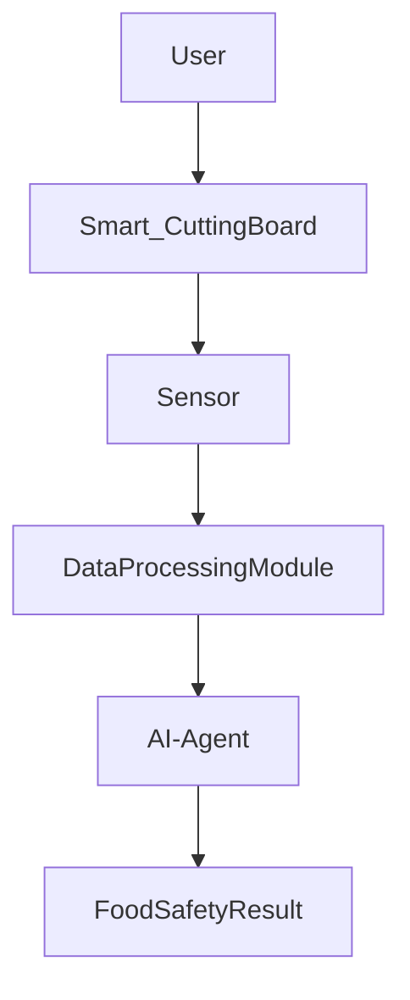
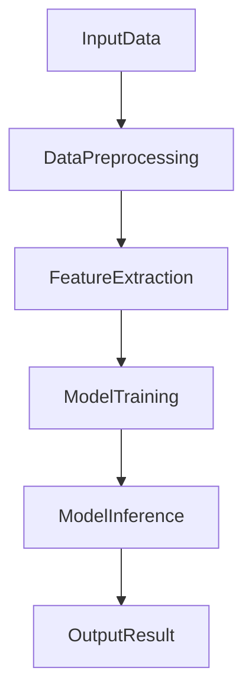
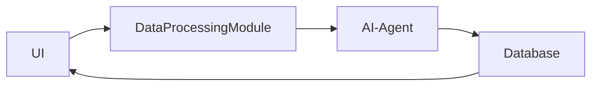

                 


# 智能厨房案板：AI Agent的食品安全监测

> 关键词：智能厨房案板，AI Agent，食品安全，监测，机器学习，计算机视觉

> 摘要：本文探讨了智能厨房案板如何利用AI Agent技术实现食品安全监测。通过分析AI Agent的核心原理、算法流程、系统架构以及实际应用案例，展示了AI技术在厨房设备中的创新应用，为未来的食品安全监测提供了新的思路和解决方案。

---

## 第1章 智能厨房案板与食品安全监测概述

### 1.1 智能厨房案板的定义与特点
智能厨房案板是一种集成AI技术的厨房用具，具备数据采集、分析和反馈功能。其特点包括多模态数据处理、实时监测和用户友好的交互界面。

### 1.2 食品安全监测的背景与挑战
食品安全问题日益严重，传统监测方法存在效率低、成本高的问题。AI技术的应用为解决这些问题提供了新思路。

### 1.3 AI Agent在食品安全监测中的作用
AI Agent通过实时数据分析，能够快速识别食材异常情况，确保食品安全。其优势在于高效性、准确性和实时性。

---

## 第2章 AI Agent的核心概念与原理

### 2.1 AI Agent的定义与分类
AI Agent是具备自主决策和执行能力的智能体，分为简单反射型、基于模型的反应型、目标驱动型和实用驱动型。

### 2.2 实体关系图


### 2.3 算法流程图


---

## 第3章 AI Agent的算法原理

### 3.1 数据预处理
数据预处理包括清洗、归一化和特征提取。例如，使用图像处理技术提取食材的颜色特征。

### 3.2 特征提取
使用深度学习模型提取食材的纹理特征，如使用卷积神经网络（CNN）提取图像特征。

### 3.3 模型训练
训练一个分类模型，如支持向量机（SVM）或随机森林，用于分类食材的安全状态。

### 3.4 模型推理
将预处理后的数据输入训练好的模型，输出食材的安全状态。

---

## 第4章 数学模型与公式

### 4.1 机器学习模型
常用的模型包括线性回归和逻辑回归。例如，逻辑回归的损失函数：
$$ L(y, y') = -\sum_{i=1}^{n} [y_i \ln y'_i + (1 - y_i)\ln (1 - y'_i)] $$

### 4.2 深度学习模型
使用卷积神经网络（CNN）进行图像分类。例如，ResNet的残差连接：
$$ F(x) = G(F(x)) + x $$

---

## 第5章 系统分析与架构设计

### 5.1 系统架构


### 5.2 系统接口设计
系统接口包括传感器数据接口、用户交互接口和数据库接口。

---

## 第6章 项目实战

### 6.1 环境安装
需要安装Python、TensorFlow和OpenCV等库。

### 6.2 核心代码实现
```python
import tensorflow as tf
from tensorflow.keras import layers

model = tf.keras.Sequential([
    layers.Conv2D(32, (3,3), activation='relu', input_shape=(100,100,3)),
    layers.MaxPooling2D((2,2)),
    layers.Conv2D(64, (3,3), activation='relu'),
    layers.MaxPooling2D((2,2)),
    layers.Flatten(),
    layers.Dense(128, activation='relu'),
    layers.Dense(1, activation='sigmoid')
])
```

### 6.3 案例分析
通过实际案例展示AI Agent如何识别食材变质情况，输出安全监测结果。

---

## 第7章 总结与展望

### 7.1 总结
AI Agent在智能厨房案板中的应用显著提升了食品安全监测的效率和准确性。

### 7.2 展望
未来，AI Agent技术将进一步优化，推动智能厨房设备的普及。

---

## 作者：AI天才研究院/Zen And The Art of Computer Programming

---

这篇文章详细介绍了智能厨房案板如何利用AI Agent技术实现食品安全监测，涵盖了背景、原理、系统架构和实际应用等多方面内容，为读者提供了全面的技术解析。

