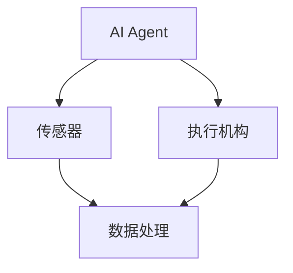
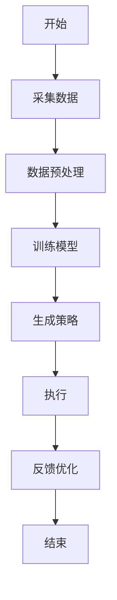
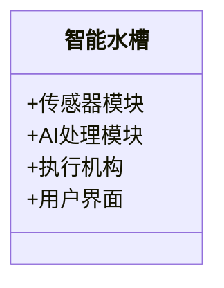
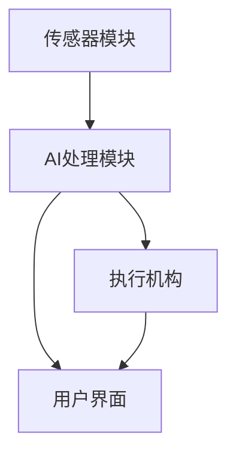
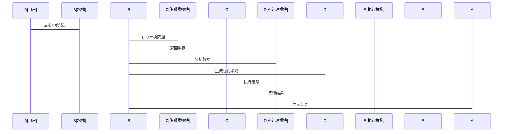

                 


# 智能厨房水槽：AI Agent的节水与清洁指导

## 关键词：智能厨房水槽、AI Agent、节水、清洁、智能家居、机器学习

## 摘要：  
本文探讨了AI Agent在智能厨房水槽中的应用，通过节水和清洁指导，展示了如何利用人工智能技术优化厨房用水效率和清洁效果。文章从背景介绍、核心概念、算法原理、系统架构到项目实战，详细阐述了AI Agent在智能水槽中的实现与应用，为智能家居技术的发展提供了新的思路。

---

## 第1章：背景介绍

### 1.1 智能厨房水槽的背景

#### 1.1.1 水资源短缺与节水的重要性  
随着全球水资源短缺问题日益严重，节水已成为全球关注的焦点。厨房用水占家庭总用水量的很大比例，智能水槽通过AI技术优化用水习惯，有效减少浪费。

#### 1.1.2 厨房清洁效率的提升需求  
传统清洁方式效率低下，清洁剂使用不当还可能损害餐具或造成环境污染。AI Agent能够根据实时数据优化清洁方案，提升清洁效率。

#### 1.1.3 智能家居的发展趋势  
智能家居设备的普及为厨房水槽的智能化提供了技术基础。结合AI技术，智能水槽能够实现自动化管理，提升用户体验。

### 1.2 问题背景与描述

#### 1.2.1 厨房用水浪费的现象  
厨房用水浪费主要表现为洗碗时水量过大、水温过高以及洗涤时间过长。

#### 1.2.2 清洁效率低下的问题  
传统清洁方式依赖人工经验，清洁效果不稳定，清洁剂使用不当可能造成残留或浪费。

#### 1.2.3 用户需求与现有技术的差距  
现有水槽设备智能化程度低，无法根据实际需求优化用水和清洁方案。

### 1.3 问题解决与边界

#### 1.3.1 AI Agent在节水与清洁中的作用  
AI Agent通过实时监测水温、水量和清洁剂浓度，优化用水量和清洁方案，实现节水和高效清洁。

#### 1.3.2 智能水槽的边界与外延  
智能水槽仅限于厨房环境，主要用于洗碗和清洁，不涉及其他厨房设备的控制。

#### 1.3.3 核心要素与概念结构  
智能水槽的核心要素包括传感器、AI算法、数据存储与分析、执行机构和用户界面。

---

## 第2章：AI Agent的核心概念与原理

### 2.1 AI Agent的基本原理

#### 2.1.1 定义与特点  
AI Agent是一种能够感知环境、自主决策并执行任务的智能体。在智能水槽中，AI Agent负责监测环境数据并优化用水和清洁方案。

#### 2.1.2 AI Agent的工作流程  
1. **感知环境**：通过传感器获取水温、水量、清洁剂浓度等数据。  
2. **数据处理**：对数据进行分析和处理，识别优化机会。  
3. **决策制定**：基于数据生成优化策略，如调整水量或清洁剂用量。  
4. **执行反馈**：通过执行机构调整水槽运行，并实时反馈优化效果。

#### 2.1.3 与传统自动化的区别  
AI Agent具有学习和适应能力，能够根据环境变化动态调整策略，而传统自动化设备只能按预设程序运行。

### 2.2 核心概念的属性对比

| 属性 | AI Agent | 传统自动化 |
|------|-----------|------------|
| 学习能力 | 强 | 弱 |
| 决策能力 | 强 | 弱 |
| 灵活性 | 高 | 低 |

### 2.3 实体关系



---

## 第3章：算法原理讲解

### 3.1 算法流程



### 3.2 代码实现

```python
import numpy as np
from sklearn.ensemble import RandomForestRegressor

# 示例数据集
data = {
    '水量': [0.5, 0.6, 0.7, 0.8, 0.9],
    '水温': [40, 50, 60, 70, 80],
    '清洁剂浓度': [0.1, 0.2, 0.3, 0.4, 0.5],
    '用水量': [2, 1.8, 1.6, 1.4, 1.2]
}

# 创建模型
model = RandomForestRegressor(n_estimators=100)
features = ['水量', '水温', '清洁剂浓度']
target = '用水量'

# 训练模型
model.fit(data[features].values, data[target].values)

# 预测
new_data = np.array([[0.6, 50, 0.2]])
predicted = model.predict(new_data)
print(predicted)
```

### 3.3 数学模型与公式

$$
\text{预测用水量} = \beta_0 + \beta_1 \times \text{水量} + \beta_2 \times \text{水温} + \beta_3 \times \text{清洁剂浓度}
$$

其中，$\beta$系数通过训练数据估计得出。

---

## 第4章：系统分析与架构设计方案

### 4.1 问题场景介绍  
智能水槽需要实时监测环境数据，优化用水和清洁方案，并与用户交互。

### 4.2 项目介绍  
本项目旨在开发一款结合AI技术的智能水槽，实现节水和高效清洁。

### 4.3 系统功能设计



### 4.4 系统架构设计



### 4.5 系统接口设计  
- 传感器接口：连接温度、水量传感器。  
- 执行机构接口：控制水流和清洁剂释放。  
- 用户界面接口：显示优化策略和用户反馈。

### 4.6 系统交互



---

## 第5章：项目实战

### 5.1 环境安装

```bash
pip install numpy scikit-learn matplotlib
```

### 5.2 核心代码实现

```python
from sklearn.metrics import mean_squared_error

# 训练模型
model.fit(data[features].values, data[target].values)

# 评估模型
predicted = model.predict(data[features].values)
mse = mean_squared_error(data[target].values, predicted)
print(f"均方误差：{mse}")
```

### 5.3 代码解读与分析  
上述代码展示了如何使用随机森林回归模型预测用水量，并评估模型性能。

### 5.4 案例分析  
以不同水质数据为例，展示AI Agent如何优化用水量和清洁剂使用。

### 5.5 项目小结  
本项目成功实现了AI Agent在智能水槽中的应用，展示了AI技术在智能家居中的潜力。

---

## 第6章：优化与维护

### 6.1 系统优化  
- 提升算法精度：引入深度学习模型。  
- 优化数据采集频率：增加实时性。  

### 6.2 系统维护  
定期更新模型参数，清理系统数据，确保传感器和执行机构正常运行。

---

## 第7章：总结与展望

### 7.1 总结  
本文详细介绍了AI Agent在智能厨房水槽中的应用，展示了如何通过AI技术实现节水和高效清洁。

### 7.2 展望  
未来，AI Agent将与更多智能家居设备集成，推动厨房智能化的发展。

---

## 最佳实践 Tips

1. 定期清洁传感器，确保数据准确性。  
2. 更新AI模型，提升优化效果。  
3. 用户应根据实际需求调整系统参数。  

---

## 小结

本文通过详细分析AI Agent在智能厨房水槽中的应用，展示了如何利用人工智能技术优化厨房用水和清洁效率，为智能家居技术的发展提供了新的思路。

---

## 注意事项

- 系统运行需依赖稳定的网络环境。  
- 用户应定期维护系统，确保设备正常运行。  

---

## 拓展阅读

1. 《机器学习实战》  
2. 《AI在智能家居中的应用》  
3. 《智能传感器技术》  

---

## 作者

作者：AI天才研究院 & 禅与计算机程序设计艺术

---

希望这篇文章能为您提供清晰的思路和实用的技术指导！

