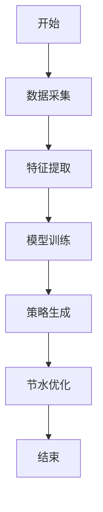
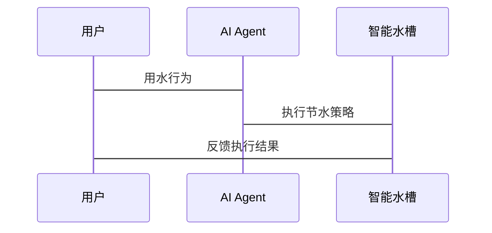

                 


# 智能厨房水槽：AI Agent的节水技巧指导

> 关键词：智能厨房水槽，AI Agent，节水技术，机器学习，强化学习，物联网

> 摘要：本文深入探讨了智能厨房水槽与AI Agent的节水优化技术，从背景介绍、核心概念、算法原理到系统架构设计，再到项目实战和最佳实践，详细解析了如何通过AI技术实现厨房用水的智能化管理和节水优化。

---

# 第一部分: 智能厨房水槽与AI Agent的背景介绍

## 第1章: 智能厨房水槽的发展背景

### 1.1 智能厨房水槽的现状与趋势
#### 1.1.1 厨房水槽的智能化发展
现代厨房水槽不仅是洗涤工具，更是智能家居的重要组成部分。随着物联网技术的普及，智能水槽逐渐成为家庭节水和智能化管理的核心设备。

#### 1.1.2 节水技术的市场需求
全球水资源短缺问题日益严重，厨房用水占据了家庭用水的重要部分。通过智能技术优化用水习惯，成为家庭节水的重要途径。

#### 1.1.3 AI Agent在智能水槽中的应用潜力
AI Agent（智能代理）能够实时感知用水行为，学习用户习惯，优化用水策略，是智能水槽实现节水的关键技术。

### 1.2 节水技术的重要性
#### 1.2.1 全球水资源短缺问题
全球范围内水资源分布不均，部分地区面临严重水荒，节水技术成为解决水资源危机的重要手段。

#### 1.2.2 厨房用水的浪费现状
传统厨房水槽缺乏智能化管理，用户常常无意识浪费水资源，如长时间冲洗餐具等。

#### 1.2.3 节水技术对环保的意义
通过智能节水技术，减少不必要的水浪费，为环保事业贡献力量。

### 1.3 AI Agent的核心概念
#### 1.3.1 AI Agent的基本定义
AI Agent是一种能够感知环境、自主决策、执行任务的智能实体，能够帮助用户优化用水习惯。

#### 1.3.2 AI Agent在智能水槽中的角色
AI Agent负责采集用水数据，分析用户行为，制定节水策略，并通过智能水槽执行优化方案。

#### 1.3.3 AI Agent与传统节水技术的区别
传统节水技术依赖固定模式，而AI Agent能够动态学习和优化，更具灵活性和适应性。

### 1.4 本章小结
本章介绍了智能厨房水槽的发展背景，强调了节水技术的重要性，详细阐述了AI Agent的核心概念及其在智能水槽中的应用潜力。

---

# 第二部分: 智能厨房水槽AI Agent的核心概念与联系

## 第2章: 智能水槽AI Agent的工作原理

### 2.1 智能水槽AI Agent的传感器系统
#### 2.1.1 流量传感器的作用
流量传感器实时监测水流量，帮助AI Agent准确感知用水量。

#### 2.1.2 温度传感器的应用
温度传感器用于检测水温，辅助判断是否需要加热，优化用水效率。

#### 2.1.3 其他辅助传感器的功能
如压力传感器、湿度传感器等，用于辅助检测环境变化，提升节水策略的准确性。

### 2.2 AI Agent的数据处理流程
#### 2.2.1 数据采集与传输
传感器采集数据，通过物联网技术传输到AI Agent进行处理。

#### 2.2.2 数据分析与模式识别
利用机器学习算法分析用水行为，识别浪费模式，为优化提供依据。

#### 2.2.3 数据驱动的节水策略生成
AI Agent根据分析结果，生成个性化节水策略，并通过智能水槽执行。

### 2.3 AI Agent与智能水槽的协同工作
#### 2.3.1 实时数据监控
AI Agent实时监控用水数据，动态调整节水策略。

#### 2.3.2 智能决策机制
基于实时数据和历史行为，AI Agent做出最优决策，优化用水效率。

#### 2.3.3 用户反馈与优化
AI Agent通过用户反馈不断优化模型，提升节水效果。

### 2.4 本章小结
本章详细介绍了智能水槽AI Agent的工作原理，重点分析了传感器系统、数据处理流程以及与智能水槽的协同工作方式。

---

# 第三部分: 智能厨房水槽AI Agent的算法原理

## 第3章: AI Agent的算法实现

### 3.1 基于机器学习的用水行为分析
#### 3.1.1 数据预处理与特征提取
对原始数据进行清洗、归一化处理，并提取关键特征，如用水频率、用水量等。

#### 3.1.2 机器学习模型的训练
使用监督学习算法（如随机森林、支持向量机）训练模型，识别用户的用水模式。

#### 3.1.3 模型评估与优化
通过交叉验证评估模型性能，优化参数以提升预测准确率。

### 3.2 基于强化学习的节水策略优化
#### 3.2.1 强化学习的基本原理
强化学习通过定义状态、动作和奖励机制，训练AI Agent做出最优决策。

#### 3.2.2 状态空间与动作空间的定义
状态包括当前用水量、历史数据等，动作包括调整水流量、关闭水阀等。

#### 3.2.3 奖励机制的设计与实现
设计合理的奖励函数，激励AI Agent采取节水行为，如减少无效冲洗。

### 3.3 算法流程图（Mermaid）


### 3.4 本章小结
本章详细介绍了AI Agent的算法实现，重点分析了基于机器学习和强化学习的节水策略优化方法。

---

# 第四部分: 智能厨房水槽AI Agent的系统架构设计

## 第4章: 系统架构与功能设计

### 4.1 系统架构概述
#### 4.1.1 分层架构设计
系统分为数据采集层、数据处理层和决策执行层，各层协同工作，确保高效运行。

#### 4.1.2 模块化设计原则
系统模块化设计，便于功能扩展和维护。

#### 4.1.3 可扩展性与可维护性
系统架构设计注重模块间的解耦，方便功能扩展和升级。

### 4.2 功能模块
#### 4.2.1 数据采集模块
负责采集水流量、水温等数据，并传输到AI Agent进行处理。

#### 4.2.2 数据分析模块
对数据进行清洗、特征提取和模型训练，识别用户行为模式。

#### 4.2.3 决策执行模块
根据AI Agent的决策，智能水槽执行节水策略，如调节水压、关闭水阀等。

### 4.3 系统交互流程图（Mermaid）


### 4.4 本章小结
本章详细描述了智能厨房水槽AI Agent的系统架构设计，重点分析了各功能模块的作用和系统交互流程。

---

# 第五部分: 项目实战与最佳实践

## 第5章: 项目实战

### 5.1 环境安装
#### 5.1.1 系统需求
安装Python、TensorFlow、Keras等开发环境，配置物联网设备。

#### 5.1.2 数据集准备
收集厨房用水数据，包括水流量、水温、时间戳等信息。

### 5.2 系统核心实现源代码
```python
import numpy as np
from sklearn.model import Random ForestClassifier

# 数据预处理
data = [...]  # 数据集
X = data.drop(columns=['label'])
y = data['label']

# 模型训练
model = Random ForestClassifier()
model.fit(X, y)

# 预测与优化
def optimize_water_usage():
    current_usage = model.predict(X_test)
    optimized_usage = model.predict(X_optimized)
    return optimized_usage
```

### 5.3 实际案例分析
通过实际案例分析，展示AI Agent如何优化用水策略，减少水资源浪费。

### 5.4 项目小结
总结项目实现的关键点，强调AI技术在节水中的重要性。

## 第6章: 最佳实践与注意事项

### 6.1 最佳实践
#### 6.1.1 数据质量管理
确保数据的准确性和完整性，提升模型的预测精度。

#### 6.1.2 模型优化
通过参数调优和模型融合，进一步提升节水效果。

#### 6.1.3 用户教育
通过用户界面和反馈机制，引导用户养成良好的节水习惯。

### 6.2 注意事项
#### 6.2.1 数据隐私
保护用户数据隐私，避免数据泄露。

#### 6.2.2 系统稳定性
确保系统运行稳定，避免因故障导致用水浪费。

#### 6.2.3 用户体验
优化用户界面，提升用户体验，确保用户愿意使用节水功能。

### 6.3 拓展阅读
推荐相关技术书籍和论文，帮助读者深入学习智能节水技术。

---

# 结语

智能厨房水槽结合AI Agent的节水技术，不仅提升了家庭用水管理的智能化水平，也为全球节水事业做出了贡献。通过本文的详细解析，读者可以深入了解智能水槽的技术原理和实际应用，为未来的节水技术发展提供参考。

---

作者：AI天才研究院 & 禅与计算机程序设计艺术

