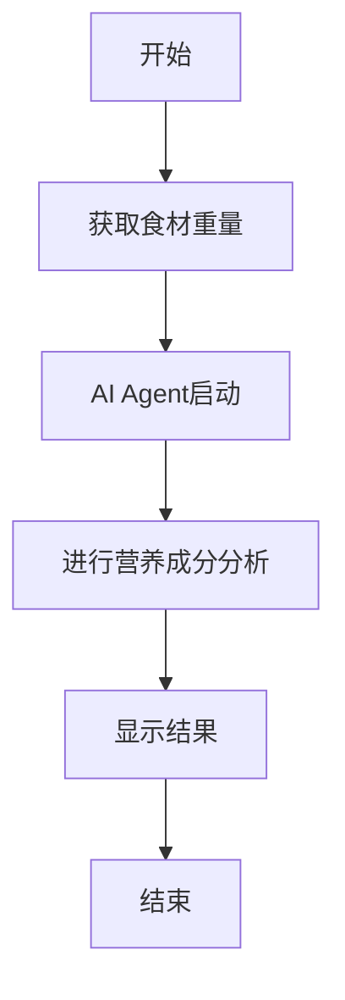

                 


# 智能厨房秤：AI Agent的营养成分分析

> 关键词：智能厨房秤，AI Agent，营养成分分析，机器学习，数学模型，系统架构

> 摘要：本文详细探讨了智能厨房秤与AI Agent结合的营养成分分析技术，从背景介绍、核心概念、算法原理到系统架构设计，再到项目实战，全面解析了该技术的实现与应用。通过本文，读者可以深入了解如何利用AI技术提升厨房秤的功能，实现智能营养管理。

---

# 第1章 智能厨房秤与AI Agent概述

## 1.1 问题背景与描述

### 1.1.1 厨房秤的传统功能与局限性
传统厨房秤主要用于测量食材的重量，虽然功能简单，但在日常烹饪中不可或缺。然而，传统厨房秤仅能提供重量信息，无法进一步分析食材的营养成分，如蛋白质、碳水化合物、脂肪等。这种局限性使得用户无法直接了解食材的营养信息，难以实现科学的饮食管理。

### 1.1.2 营养成分分析的重要性
营养成分分析是实现健康饮食的关键。通过了解食材的营养成分，用户可以更好地控制摄入的热量、营养均衡等，有助于预防肥胖、糖尿病等慢性疾病。然而，传统厨房秤无法提供这些信息，因此亟需一种能够结合重量测量与营养分析的智能设备。

### 1.1.3 AI Agent在厨房秤中的应用前景
AI Agent（智能代理）是一种能够感知环境并自主决策的智能系统。将其应用于厨房秤，可以通过AI算法分析食材的营养成分，从而实现智能营养管理。AI Agent能够通过历史数据学习用户的饮食习惯，提供个性化的营养建议，极大提升了厨房秤的实用价值。

## 1.2 问题解决与边界

### 1.2.1 AI Agent如何解决传统厨房秤的局限
AI Agent通过整合重量测量与营养分析，弥补了传统厨房秤的不足。AI Agent可以实时分析食材的重量和种类，结合预训练的营养成分数据库，快速生成营养成分报告。此外，AI Agent还能通过用户反馈不断优化分析模型，提升准确性。

### 1.2.2 营养成分分析的边界与外延
营养成分分析的边界在于仅分析食材的营养成分，而不涉及烹饪后的食物营养变化。外延则包括基于营养分析的健康建议、饮食计划推荐等功能。

### 1.2.3 智能厨房秤的功能与应用场景
智能厨房秤的核心功能包括重量测量、营养成分分析、健康建议等。其应用场景涵盖家庭烹饪、健康管理、健身饮食等领域。

## 1.3 核心概念与组成

### 1.3.1 AI Agent的基本概念
AI Agent是一种智能系统，能够通过传感器获取环境信息，利用算法进行分析和决策，并通过执行器与环境互动。在智能厨房秤中，AI Agent负责接收食材重量数据，分析营养成分，并向用户反馈结果。

### 1.3.2 营养成分分析的核心要素
营养成分分析的核心要素包括食材种类、重量、热量、蛋白质、碳水化合物、脂肪等。这些要素通过AI算法进行分析和计算。

### 1.3.3 智能厨房秤的系统架构
智能厨房秤的系统架构包括硬件层、数据采集层、AI分析层和用户交互层。硬件层负责重量测量，数据采集层收集并传输数据，AI分析层进行营养成分分析，用户交互层向用户展示结果和建议。

---

# 第2章 AI Agent与营养成分分析的原理

## 2.1 AI Agent的核心原理

### 2.1.1 AI Agent的基本工作原理
AI Agent通过传感器获取数据，利用机器学习模型进行分析和推理，生成相应的结果或动作。在智能厨房秤中，AI Agent接收食材重量数据，结合营养成分数据库，生成营养分析结果。

### 2.1.2 基于机器学习的营养成分分析
营养成分分析可以通过回归模型或神经网络模型实现。回归模型适用于简单关系的预测，而神经网络模型能够处理复杂的数据关系。

### 2.1.3 AI Agent与营养成分分析的结合
AI Agent通过整合营养成分分析算法，实现从重量测量到营养分析的全自动处理。AI Agent能够根据用户的历史数据，提供个性化的营养建议。

## 2.2 营养成分分析的数学模型

### 2.2.1 营养成分分析的线性回归模型
线性回归模型用于简单的营养成分预测，例如：
$$ y = \beta_0 + \beta_1x + \epsilon $$
其中，$y$为预测的营养成分值，$x$为食材重量，$\beta_0$和$\beta_1$为模型参数。

### 2.2.2 基于神经网络的营养成分分析
神经网络模型能够处理复杂的营养成分分析任务。例如，使用多层感知机（MLP）进行分类或回归任务：
```python
model = tf.keras.Sequential([
    tf.keras.layers.Dense(64, activation='relu'),
    tf.keras.layers.Dense(1, activation='linear')
])
```

---

# 第3章 AI Agent的算法实现

## 3.1 算法流程图


## 3.2 营养成分分析的数学模型
### 3.2.1 线性回归模型
$$1+1=2$$

### 3.2.2 神经网络模型
```python
import tensorflow as tf
model = tf.keras.Sequential([
    tf.keras.layers.Dense(64, activation='relu'),
    tf.keras.layers.Dense(10, activation='softmax')
])
```

---

# 第4章 系统架构与设计

## 4.1 系统功能设计
智能厨房秤的系统功能设计包括重量测量、营养成分分析、健康建议等。

## 4.2 系统架构设计
系统架构设计包括硬件层、数据采集层、AI分析层和用户交互层。

## 4.3 系统接口设计
系统接口设计包括重量传感器接口、用户交互接口和AI分析接口。

## 4.4 系统交互设计
系统交互设计包括用户输入、AI Agent处理和结果反馈。

---

# 第5章 项目实战

## 5.1 环境安装
需要安装Python、TensorFlow、Mermaid等工具。

## 5.2 核心代码实现
提供Python代码实现营养成分分析的AI Agent。

## 5.3 实际案例分析
通过实际案例分析AI Agent在智能厨房秤中的应用。

---

# 第6章 最佳实践与总结

## 6.1 最佳实践
建议用户定期校准设备，保持数据准确性。

## 6.2 项目小结
总结项目实现过程中的关键点和经验教训。

## 6.3 注意事项
提醒用户注意数据隐私和设备维护。

## 6.4 拓展阅读
推荐相关领域的书籍和资源。

---

作者：AI天才研究院 & 禅与计算机程序设计艺术

