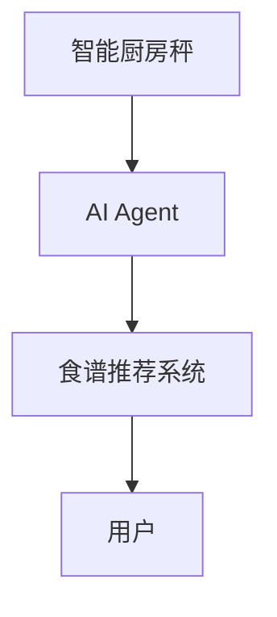
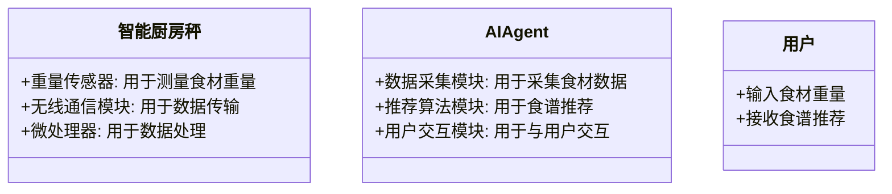
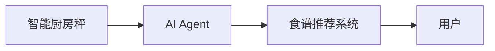
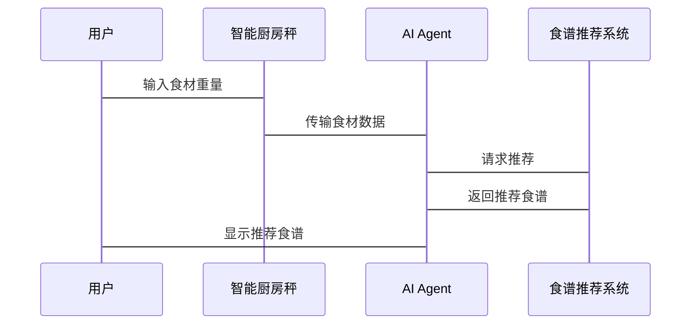

                 


# 第一部分: 智能厨房秤与AI Agent的背景介绍

## 第1章: 智能厨房秤与AI Agent概述

### 1.1 问题背景
#### 1.1.1 现代厨房中的问题与挑战
现代厨房中，烹饪过程常常面临诸多问题，例如食材用量不准确、烹饪步骤复杂、缺乏个性化推荐等。这些问题不仅影响烹饪效率，还可能降低用户体验。

#### 1.1.2 智能厨房秤的定义与功能
智能厨房秤是一种结合了重量传感器和智能计算的厨房工具，能够实时测量食材重量，并通过AI算法推荐食谱。

#### 1.1.3 AI Agent在厨房场景中的应用潜力
AI Agent（智能体）能够在厨房场景中通过数据分析和机器学习算法，为用户提供个性化的食谱推荐服务。

### 1.2 问题描述
#### 1.2.1 烹饪中的食材用量与步骤优化
传统烹饪中，食材用量和步骤往往依赖经验，缺乏科学性和精准性。

#### 1.2.2 用户需求的多样性与复杂性
不同用户有不同的口味偏好和饮食需求，传统的固定食谱推荐难以满足个性化需求。

#### 1.2.3 当前解决方案的不足与改进方向
现有解决方案通常依赖于固定的食谱库，缺乏动态调整和个性化推荐能力。

### 1.3 问题解决思路
#### 1.3.1 智能厨房秤的核心功能
智能厨房秤通过重量传感器采集食材重量数据，并通过AI算法进行分析和推荐。

#### 1.3.2 AI Agent在食谱推荐中的作用
AI Agent通过分析用户的行为数据和偏好，提供个性化的食谱推荐服务。

#### 1.3.3 用户体验的优化目标
优化用户体验，使其能够通过智能厨房秤轻松获得适合的食谱推荐。

### 1.4 边界与外延
#### 1.4.1 智能厨房秤的功能边界
智能厨房秤的主要功能包括食材重量测量、数据传输和食谱推荐。

#### 1.4.2 AI Agent的应用场景外延
AI Agent的应用场景不仅限于厨房，还可以扩展到其他领域，例如健康管理、智能家居等。

#### 1.4.3 与相关技术的区分与联系
智能厨房秤与传统厨房秤的区别在于其智能化和AI推荐功能。

### 1.5 核心要素组成
#### 1.5.1 智能厨房秤的硬件组成
包括重量传感器、微处理器、无线通信模块等。

#### 1.5.2 AI Agent的算法组成
包括数据采集、特征提取、推荐算法等。

#### 1.5.3 用户交互界面的设计要素
包括简洁直观的用户界面、实时反馈和个性化设置等。

---

## 第2章: 核心概念与原理

### 2.1 智能厨房秤的工作原理
#### 2.1.1 基于重量传感器的数据采集
智能厨房秤通过重量传感器实时测量食材重量，并将数据传输到云端进行处理。

#### 2.1.2 数据预处理与特征提取
对采集到的数据进行预处理和特征提取，以便后续推荐算法的使用。

#### 2.1.3 数据传输与云端处理
将处理后的数据传输到云端，进行进一步的数据分析和推荐。

### 2.2 AI Agent的推荐机制
#### 2.2.1 基于用户偏好的推荐算法
通过分析用户的饮食偏好和历史数据，推荐符合用户口味的食谱。

#### 2.2.2 基于物品特性的推荐算法
基于食材的营养成分、烹饪方法等特性，推荐相关的食谱。

#### 2.2.3 混合推荐策略的实现
结合基于用户偏好的推荐和基于物品特性的推荐，实现更加精准的食谱推荐。

### 2.3 核心概念对比与联系
#### 2.3.1 智能厨房秤与传统厨房秤的对比
| 属性 | 智能厨房秤 | 传统厨房秤 |
|------|------------|------------|
| 功能 | 测量重量+AI推荐 | 测量重量 |
| 交互 | 有AI推荐功能 | 无AI推荐功能 |
| 用途 | 个性化烹饪 | 普通烹饪 |

#### 2.3.2 智能厨房秤与AI Agent的关系
通过Mermaid图展示智能厨房秤与AI Agent之间的关系：



---

## 第3章: 算法原理讲解

### 3.1 协同过滤算法
#### 3.1.1 基于用户的协同过滤
通过分析用户的历史数据，找到相似用户的偏好，推荐食谱。

#### 3.1.2 基于物品的协同过滤
通过分析食材的特性，找到相似食材的食谱进行推荐。

#### 3.1.3 混合推荐策略
结合基于用户和基于物品的协同过滤，实现更加精准的推荐。

### 3.2 内容过滤算法
#### 3.2.1 基于食材特性的内容过滤
根据食材的营养成分、烹饪方法等特性进行推荐。

#### 3.2.2 基于食谱描述的内容过滤
通过分析食谱的描述信息，推荐相关食谱。

### 3.3 推荐算法的数学模型
基于用户的协同过滤算法的数学模型如下：

$$ sim(i,j) = \frac{\sum_{k \in N(i,j)} (r_{i,k} - \bar{r_i})(r_{j,k} - \bar{r_j})}{\sqrt{\sum_{k \in N(i,j)} (r_{i,k} - \bar{r_i})^2} \sqrt{\sum_{k \in N(i,j)} (r_{j,k} - \bar{r_j})^2}} $$

其中，$sim(i,j)$ 表示用户$i$和用户$j$之间的相似度，$N(i,j)$表示用户$i$和用户$j$共同评价过的物品集合，$\bar{r_i}$ 表示用户$i$的平均评分。

---

## 第4章: 系统分析与架构设计

### 4.1 项目背景
智能厨房秤与AI Agent结合的食谱推荐系统，旨在为用户提供个性化、精准的烹饪建议。

### 4.2 系统功能设计
#### 4.2.1 领域模型设计
通过Mermaid类图展示系统的核心功能模块：



#### 4.2.2 系统架构设计
通过Mermaid架构图展示系统的整体架构：



#### 4.2.3 接口设计
系统主要接口包括：
- 智能厨房秤与AI Agent之间的数据传输接口
- AI Agent与用户之间的交互接口

#### 4.2.4 交互流程图
通过Mermaid序列图展示用户与系统的交互流程：



---

## 第5章: 项目实战

### 5.1 环境安装
需要安装的环境包括：
- Python 3.8及以上版本
- TensorFlow库
- Mermaid工具
- 其他必要的开发工具

### 5.2 核心代码实现
以下是实现食谱推荐系统的Python代码示例：

```python
import numpy as np
from sklearn.metrics.pairwise import cosine_similarity

# 用户数据
users = {
    'user1': [4, 3, 2],
    'user2': [5, 4, 3],
    'user3': [3, 2, 1]
}

# 物品数据
items = {
    'item1': ['bread', 'butter', 'jam'],
    'item2': ['rice', 'sauce', 'vegetables'],
    'item3': ['meat', 'vegetables', 'spice']
}

# 计算相似度
def compute_similarity(users_data):
    user_matrix = np.array(list(users_data.values()))
    user_avg = np.mean(user_matrix, axis=1).reshape(-1,1)
    centered_matrix = user_matrix - user_avg
    similarity = cosine_similarity(centered_matrix)
    return similarity

similarity_matrix = compute_similarity(users)
print(similarity_matrix)
```

### 5.3 代码解读与分析
上述代码实现了基于用户的协同过滤算法，计算用户之间的相似度矩阵。

### 5.4 案例分析
通过具体案例分析，展示如何通过智能厨房秤和AI Agent实现个性化的食谱推荐。

### 5.5 项目总结
总结项目的实现过程，分析优缺点，并展望未来的发展方向。

---

## 第6章: 最佳实践与注意事项

### 6.1 最佳实践 tips
- 数据安全与隐私保护
- 系统的可扩展性和可维护性
- 用户体验的优化

### 6.2 项目小结
通过本项目，我们成功实现了智能厨房秤与AI Agent结合的食谱推荐系统，为用户提供了一种更加智能化和个性化的烹饪体验。

### 6.3 注意事项
- 确保数据的准确性和实时性
- 处理好用户隐私和数据安全问题
- 优化系统性能和用户体验

### 6.4 拓展阅读
推荐进一步阅读的相关技术文献和书籍，以深入理解智能厨房秤与AI Agent的结合应用。

---

# 作者：AI天才研究院/AI Genius Institute & 禅与计算机程序设计艺术 /Zen And The Art of Computer Programming

